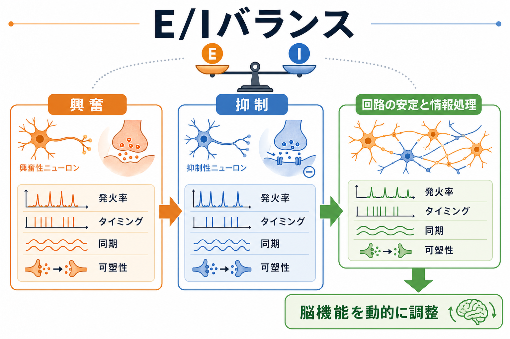
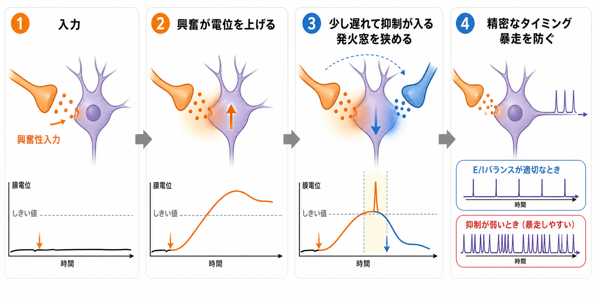
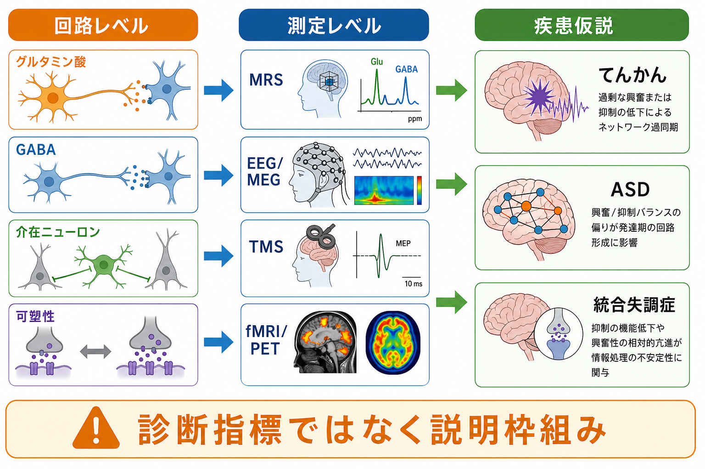

# E/Iバランスとは何か

## 要点

- E/Iバランスとは、[[グルタミン酸は脳で何をしているのか|グルタミン酸]]などによる興奮性入力と、[[GABAは脳で何をしているのか|GABA]]を中心とする抑制性入力が、神経細胞や回路の活動を有用な範囲に保つ関係である。
- 「興奮と抑制が同じ量」という意味ではない。重要なのは、どの細胞、どのシナプス部位、どの時間窓、どの行動状態で釣り合うかである[1]。
- 抑制は単なるブレーキではなく、発火率、スパイクタイミング、同期、[[神経振動とは何か|神経振動]]、[[シナプス可塑性とは何か|シナプス可塑性]]を整える能動的な計算要素である[1][2][3]。
- E/Iバランス異常は、てんかん、ASD、統合失調症などで議論されるが、それだけで個別診断や治療方針を決められる指標ではない[4][5][6]。

## この記事で答える問い

1. E/Iバランスは何を「バランス」しているのか。
2. 抑制はなぜ情報処理に必要なのか。
3. E/Iバランスは精神・神経疾患の説明にどこまで使えるのか。

## まず結論

E/Iバランスは、脳活動を「静かにする仕組み」ではなく、必要な活動を必要なタイミングで出すための動的な調整原理である。興奮だけが強ければ発火は増えるが、ノイズや過同期も増えやすい。抑制だけが強ければ安定して見えるが、反応性や可塑性は低下しうる。正常な[[神経回路とは何か|神経回路]]では、興奮と抑制が場所と時間に応じて組み合わさり、発火窓を狭め、信号対雑音比を高め、リズムを作り、経験に応じて再調整される[1][2][7]。

## 背景

大脳皮質や海馬の多くの主細胞は興奮性で、局所回路や長距離投射を通じて活動を広げる。一方、抑制性介在ニューロンは数としては少数派でも、細胞体、樹状突起、軸索初節など異なる部位を標的にし、発火のタイミングや入力の統合を精密に調節する。したがって、E/Iバランスは「興奮性ニューロンの数」と「抑制性ニューロンの数」の単純な比ではない。[[興奮性ニューロンと抑制性ニューロンは回路内でどう協調するのか|興奮性ニューロンと抑制性ニューロンの協調]]が、情報処理の単位になる。

感覚皮質の研究では、興奮性入力と抑制性入力が同じ刺激特徴に対して共に動き、抑制が短い遅れで入ることで発火応答を切り詰めることが示された[2]。これは、抑制が単に反応を消すのではなく、反応の時間精度を上げることを意味する。

## 基本概念

E/Iバランスには少なくとも三つの水準がある。

| 水準 | 何を見ているか | 例 |
|---|---|---|
| シナプス水準 | 興奮性・抑制性シナプス入力の強さとタイミング | [[EPSPとIPSPはどのように発火を調節するのか|EPSPとIPSP]]、膜電位、しきい値 |
| 局所回路水準 | 主細胞と介在ニューロンの結合様式 | フィードフォワード抑制、フィードバック抑制、側方抑制 |
| ネットワーク水準 | 多数の細胞集団が作る同期と振動 | [[神経同期とは何か|神経同期]]、ガンマ振動、機能的結合 |

この区別が重要なのは、ある水準で「興奮過多」に見えても、別の水準では補償的な抑制が強まっている場合があるからである。E/Iバランスは固定された値ではなく、睡眠覚醒、注意、感覚入力、発達、学習、薬理作用によって変化する[7]。

## 仕組み

### 1. 発火率を範囲内に保つ

興奮性入力が増えるとニューロンは発火しやすくなる。しかし、同時に抑制性介在ニューロンも駆動されると、出力は飽和しにくくなる。このようなゲイン調整により、同じ入力差を保ちながら、回路全体の活動が過剰に広がることを防ぐ。

### 2. スパイクタイミングを鋭くする

興奮性入力が膜電位を上げ、その直後に抑制性入力が入ると、発火できる時間窓が短くなる。聴覚皮質の全細胞記録研究では、興奮と抑制が同じ刺激領域に対して共調整され、抑制が数ミリ秒の遅れで応答を切り詰めることでスパイクタイミングを鋭くすることが示された[2]。

### 3. 神経振動を作る

局所回路で興奮と抑制が周期的にやり取りすると、[[ガンマ振動は認知機能にどう関わるのか|ガンマ振動]]のようなリズムが生じる。海馬の研究では、興奮入力の変動に対して抑制がすばやく比例的に釣り合い、ガンマ振動の周波数をサイクルごとに調節しうることが報告された[3]。

### 4. 発達と学習に応じて再調整される

E/Iバランスは一度決まるものではない。発達期には抑制性回路の成熟が臨界期や感覚皮質の安定化に関わり、成熟後も経験や学習により興奮性・抑制性シナプスの強さが変わる[7]。そのため、E/Iバランスは「恒常性」と「可塑性」のあいだで調整される。

## 図解

上の図のように、E/Iバランスは回路レベル、測定レベル、疾患仮説をつなぐ説明枠組みとして使われる。ただし、MRS、EEG/MEG、TMS、fMRI/PET は、それぞれ代謝物濃度、集団電気活動、皮質興奮性、ネットワーク活動を間接的に測る方法であり、単一シナプスのE/Iバランスをそのまま読んでいるわけではない[8]。

## 臨床・研究との接続

てんかんでは、発作への遷移に興奮と抑制の不均衡が関わるという見方が古くからあり、活動依存的な脱抑制や正のフィードバックが急な発作開始を説明する候補として議論されている[6]。ただし、てんかんの分子機構は多様であり、単純な「興奮が多い、抑制が少ない」だけでは説明しきれない。

ASDでは、Rubenstein と Merzenich が「主要な神経システムで興奮/抑制比が上昇する」という仮説を提案し、その後、遺伝子、シナプス、介在ニューロン、発達期回路形成との関係が研究されてきた[4][5]。近年のレビューは、E/IバランスをASDを含む神経発達症の機序を整理する枠組みとして扱う一方、ASDの異質性が高く、すべての人に同じE/I異常があるとは言えない点を強調している[5]。

統合失調症では、GABA作動性介在ニューロン、NMDA受容体、グルタミン酸伝達、ガンマ帯域活動、認知機能障害との関連が議論されている[8]。しかし、患者群内の異質性、測定法の違い、薬物治療や病期の影響が大きいため、E/Iバランスは診断名と一対一対応するバイオマーカーではない。

## よくある誤解

### 誤解1: E/Iバランスは興奮と抑制が半分ずつという意味である

違う。重要なのは量の同一性ではなく、入力、発火、同期、可塑性が課題に合う範囲に保たれることである。抑制性ニューロンは少数でも、標的部位とタイミングによって大きな制御力を持つ。

### 誤解2: 抑制は脳活動を止めるだけである

抑制は発火を止めるだけでなく、発火のタイミングをそろえ、不要な入力を抑え、神経振動を作り、可塑性の範囲を決める。情報処理を粗くするのではなく、むしろ精密にする場面が多い[1][2]。

### 誤解3: E/Iバランス異常がわかれば疾患を診断できる

現時点ではできない。E/Iバランスは有用な説明枠組みだが、ヒトでの測定は間接的であり、疾患ごとの異質性も大きい。臨床的には、診断、治療、支援は症状、発達歴、生活機能、検査所見を総合して判断されるべきである。

## 関連ノート

- [[GABAは脳で何をしているのか]]
- [[グルタミン酸は脳で何をしているのか]]
- [[EPSPとIPSPはどのように発火を調節するのか]]
- [[興奮性ニューロンと抑制性ニューロンは何が違うのか]]
- [[興奮性ニューロンと抑制性ニューロンは回路内でどう協調するのか]]
- [[抑制性介在ニューロンにはどのような種類があるのか]]
- [[神経振動とは何か]]
- [[神経同期とは何か]]
- [[ガンマ振動は認知機能にどう関わるのか]]

## MOC更新候補

- `content/00_MOC/` 配下の脳・神経科学系MOCに `[[E/Iバランスとは何か]]` を追加する候補。
- 並列ジョブとの競合を避けるため、この作業ではMOC本体は更新しない。

## 理解チェック

1. E/Iバランスが「興奮と抑制の量が同じ」という意味ではない理由を説明できるか。
2. 抑制がスパイクタイミングを鋭くする仕組みを説明できるか。
3. E/Iバランスを疾患研究で使うとき、なぜ診断指標として単純化してはいけないのか。

## 未解決問題

- ヒトのMRS、EEG/MEG、TMS、fMRI/PET 指標を、細胞・シナプス水準のE/Iバランスにどこまで対応づけられるか。
- 発達段階、脳領域、細胞種ごとに異なるE/I異常を、疾患横断的な症状次元とどう結びつけるか。
- 薬理学的介入、神経刺激、行動療法がE/Iバランスを変えるとして、それが症状改善の原因なのか結果なのか。

## 参考文献

[1] Isaacson, J. S., & Scanziani, M. (2011). How inhibition shapes cortical activity. *Neuron*, 72(2), 231-243. https://doi.org/10.1016/j.neuron.2011.09.027

[2] Wehr, M., & Zador, A. M. (2003). Balanced inhibition underlies tuning and sharpens spike timing in auditory cortex. *Nature*, 426, 442-446. https://doi.org/10.1038/nature02116

[3] Atallah, B. V., & Scanziani, M. (2009). Instantaneous modulation of gamma oscillation frequency by balancing excitation with inhibition. *Neuron*, 62(4), 566-577. https://doi.org/10.1016/j.neuron.2009.04.027

[4] Rubenstein, J. L. R., & Merzenich, M. M. (2003). Model of autism: increased ratio of excitation/inhibition in key neural systems. *Genes, Brain and Behavior*, 2(5), 255-267. https://doi.org/10.1034/j.1601-183X.2003.00037.x

[5] Sohal, V. S., & Rubenstein, J. L. R. (2019). Excitation-inhibition balance as a framework for investigating mechanisms in neuropsychiatric disorders. *Molecular Psychiatry*, 24, 1248-1257. https://doi.org/10.1038/s41380-019-0426-0

[6] Staley, K. (2015). Molecular mechanisms of epilepsy. *Nature Neuroscience*, 18, 367-372. https://doi.org/10.1038/nn.3947

[7] Froemke, R. C. (2015). Plasticity of cortical excitatory-inhibitory balance. *Annual Review of Neuroscience*, 38, 195-219. https://doi.org/10.1146/annurev-neuro-071714-034002

[8] Liu, Y., Ouyang, P., Zheng, Y., Mi, L., Zhao, J., Ning, Y., & Guo, W. (2021). A selective review of the excitatory-inhibitory imbalance in schizophrenia: underlying biology, genetics, microcircuits, and symptoms. *Frontiers in Cell and Developmental Biology*, 9, 664535. https://doi.org/10.3389/fcell.2021.664535
