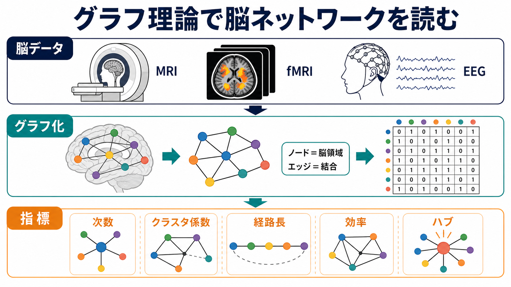
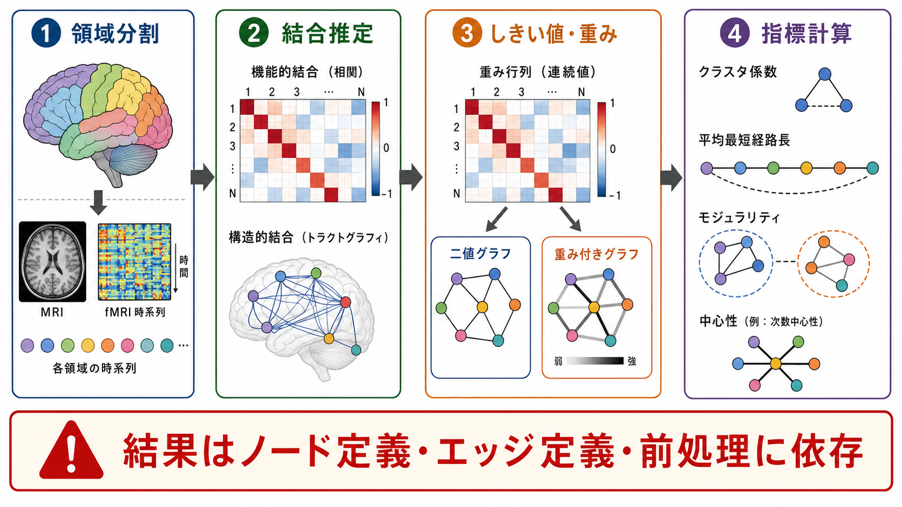
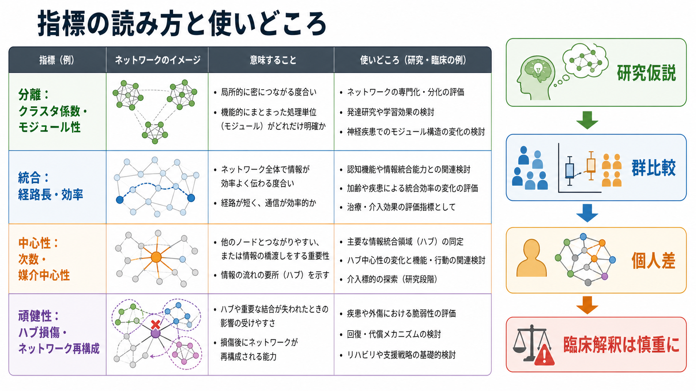

# グラフ理論は脳ネットワーク解析にどう使われるのか

## 要点

- グラフ理論では、脳領域・電極・ボクセル・ニューロン集団などを **ノード**、それらの関係を **エッジ** として表す。
- 脳ネットワーク解析では、次数、クラスタ係数、経路長、効率、中心性、モジュール性などを使って、[[脳内ネットワークとは何か|脳内ネットワーク]]の分離と統合を要約する。
- 指標は「脳の真の配線」を直接読むものではない。ノード分割、エッジ定義、しきい値、重み付け、前処理、比較対象の作り方に強く依存する。
- 研究では、[[構造的結合と機能的結合は何が違うのか|構造的結合と機能的結合]]、[[スモールワールドネットワークとは何か|スモールワールド性]]、[[ハブ領域とは何か|ハブ領域]]、[[リッチクラブ構造とは何か|リッチクラブ構造]]などを同じ枠組みで比較できる。
- 臨床・精神医学への応用は有望だが、単一のグラフ指標だけで個人の診断や治療方針を決める段階にはない。

## この記事で答える問い

1. 脳ネットワーク解析でいうノードとエッジは何を表すのか。
2. 次数、クラスタ係数、経路長、効率、中心性は何を測っているのか。
3. なぜグラフ理論は、脳の「局所処理」と「全体統合」を同時に扱いやすいのか。
4. 研究・臨床で結果を読むとき、どこに注意すべきか。

## まず結論

グラフ理論は、複雑な脳を「点と線」に単純化して、全体の構造を比較可能にする道具である。たとえば、皮質領域をノード、白質線維や活動相関をエッジとして表せば、どの領域が多くの結合を持つか、近くの領域同士がまとまっているか、離れた領域へ少ないステップで情報が届くかを計算できる。

この単純化の利点は、異なるデータを同じ語彙で扱えることにある。構造 MRI・拡散 MRI・fMRI・EEG・MEG などのデータから作ったネットワークを、次数、クラスタ係数、経路長、効率、モジュール性、中心性といった共通の指標で比較できる [2][3]。一方で、この単純化は限界でもある。ノードの切り方やエッジの作り方が変われば、同じ脳データから別のグラフが生まれる。

## 背景

脳は、多数の局所回路が同時に活動し、それらが長距離結合を通じて統合されるシステムである。視覚、運動、記憶、注意、情動、意思決定は、それぞれ孤立した一点で完結するのではなく、分散した領域間の相互作用として現れる。このため、脳を個別領域のリストとして見るだけでは、全体の働きを捉えにくい。

ネットワーク科学は、この問題を扱うための抽象化を与える。Watts と Strogatz は、規則的ネットワークとランダムネットワークの中間に、高いクラスタリングと短い経路長を併せ持つ[[スモールワールドネットワークとは何か|スモールワールドネットワーク]]があることを示した [1]。この発想は、脳が局所的な専門処理と全体的な統合をどのように両立しているかを考える入口になった。

その後、神経画像や神経生理データにグラフ理論を適用する研究が広がり、脳ネットワークにはハブ、モジュール、リッチクラブ、階層性、コスト効率のよい結合配置などが見られることが整理されてきた [2][5][6]。

## 基本概念

### ノード

ノードは、ネットワークの単位である。脳解析では、研究目的とデータの解像度に応じて次のように定義される。

| ノードの例 | 何を表すか | 注意点 |
|---|---|---|
| 脳領域 | アトラスで分割した皮質・皮質下領域 | 分割の粗さで指標が変わる |
| ボクセル | 画像上の小さな空間単位 | ノード数が多く、ノイズや多重比較の影響が大きい |
| EEG/MEG 電極・センサー | 頭皮上または磁場計測の位置 | 体積伝導・ソース推定の影響を受ける |
| ニューロン・細胞集団 | ミクロな神経回路要素 | ヒト全脳解析では通常は直接観測しにくい |

ノードは「自然に決まる」ものではない。たとえば同じ fMRI データでも、100 領域のアトラスで見る場合と 400 領域のアトラスで見る場合では、次数やクラスタ係数の値は変わりうる。したがって、ノード定義は単なる前処理ではなく、研究仮説の一部である。

### エッジ

エッジは、ノード間の関係である。代表的には次の 3 種類がある。

| エッジの種類 | 典型的なデータ | 読み方 |
|---|---|---|
| 構造的結合 | 拡散 MRI、トラクトグラフィ、解剖学的トレーサー | 物理的に結ばれている可能性のある経路 |
| 機能的結合 | fMRI、EEG、MEG の相関・同期 | 活動が統計的に共変動する関係 |
| 有効結合 | 動的因果モデリング、Granger 因果性など | ある領域が別の領域へ及ぼす方向性を含む影響 |

この区別は重要である。機能的結合が高いからといって、必ずしも直接の白質線維があるとは限らない。共通入力、間接経路、状態依存性、課題条件、神経調節の影響で、相関は変化する。因果的な方向性まで問う場合は、[[有効結合とは何か|有効結合]]の枠組みが必要になる。

### 重み付き・二値・方向付き

グラフは、エッジの扱い方によって性質が変わる。

- **二値グラフ**: 結合が「ある / ない」で表される。
- **重み付きグラフ**: 相関係数、線維数、結合強度などの連続値を残す。
- **方向なしグラフ**: A-B と B-A を同じ結合として扱う。
- **方向付きグラフ**: A から B、B から A を区別する。

重みを残すと情報量は増えるが、ノイズや測定バイアスも残りやすい。二値化すると解釈は単純になるが、しきい値の選び方に結果が依存する。このため、複数の密度やしきい値で頑健性を確認することが多い [3]。

## 仕組み

### 1. データを領域ごとの信号や結合に変換する

まず MRI や fMRI などから、各ノードの信号、またはノード間の構造的関係を作る。fMRI であれば領域ごとの BOLD 時系列を抽出し、領域間の相関や偏相関を計算する。拡散 MRI であれば、トラクトグラフィから領域間の推定線維数や結合確率を得る。

### 2. 隣接行列を作る

ノード間の関係は、隣接行列として表される。行と列がノード、各セルがエッジの有無または強さである。隣接行列にすると、脳ネットワークは数学的に扱いやすい対象になる。

### 3. しきい値や重み付けを決める

相関が 0.2 以上ならエッジありとするのか、上位 10% の結合だけを残すのか、負の相関をどう扱うのか、自己結合を除くのか。こうした選択は、最終的なグラフ指標を大きく左右する。Rubinov と Sporns は、脳結合データのネットワーク指標を使う際には、構築手順と比較条件を明確にする必要があると整理している [3]。

### 4. グラフ指標を計算する

作成したグラフに対して、局所的なまとまり、全体的な到達しやすさ、重要ノード、モジュール分割、損傷への脆弱性などを計算する。指標は「脳の機能そのもの」ではなく、観測されたネットワークのトポロジーを要約した値である。

## 代表的な指標

### 次数

次数は、あるノードに接続しているエッジの数である。重み付きグラフでは、結合強度の合計を「強度」として扱うことが多い。次数が高いノードは、多くの領域と直接つながるため、情報の集約や分配に関わる候補として注目される。

ただし、次数が高いことは「その領域が意識や認知の司令塔である」ことを意味しない。ノード分割が粗い領域ほど結合が多く見えることもあり、測定法や空間解像度の影響を受ける。

### クラスタ係数

クラスタ係数は、あるノードの近傍ノード同士が互いにどれだけつながっているかを表す。直感的には、「友人の友人同士も友人である」度合いである。

脳では、局所的な処理単位や機能的まとまりを反映する指標として読まれることが多い。高いクラスタ係数は、近接した領域や同じ機能システム内で情報処理がまとまりやすいことを示す可能性がある [2][3]。

### 経路長

経路長は、あるノードから別のノードへ到達するために必要なエッジ数である。平均最短経路長が短いネットワークでは、全体として少ないステップで情報が届きやすい。

脳ネットワークでは、短い経路長は統合の効率を表す指標として使われる。ただし、すべての結合を増やせば経路長は短くなるが、白質配線や代謝コストは増える。したがって、短い経路長だけを「よい」と読むのではなく、クラスタ係数や配線コストと合わせて解釈する必要がある [2]。

### 効率

効率は、ノード間の距離の逆数を使って、ネットワーク全体の到達しやすさを評価する指標である。距離が短いペアが多いほど、グローバル効率は高くなる。局所効率は、近傍ノードだけでどの程度情報交換できるかを表す。

効率は、損傷や疾患で一部の結合が失われたときに、ネットワークがどの程度機能を保てるかを考える際にも使われる。

### 中心性

中心性は、ノードやエッジがネットワーク内でどれほど重要な位置を占めるかを表す指標群である。

| 指標 | 何を見るか | 脳解析での読み方 |
|---|---|---|
| 次数中心性 | 直接結合の多さ | 多くの領域と直接関係する候補 |
| 媒介中心性 | 最短経路上に現れる頻度 | 情報の橋渡しになりやすい候補 |
| 固有ベクトル中心性 | 重要なノードとつながる度合い | 影響力のあるネットワーク近傍への埋め込み |
| 参加係数 | 複数モジュールへまたがる度合い | モジュール間統合の候補 |

中心性の高い領域は、[[ハブ領域とは何か|ハブ領域]]として注目される。ヒト脳では、連合野や正中部領域などが構造的・機能的ハブとして繰り返し報告されている [5]。

### モジュール性

モジュール性は、ネットワークが内部で密につながり、外部とは比較的疎につながるまとまりに分かれる度合いである。脳では、視覚、運動、注意、デフォルトモード、サリエンスなどの機能的システムが、モジュール構造として現れることがある。

たとえば、[[デフォルトモードネットワークとは何か|デフォルトモードネットワーク]]や[[サリエンスネットワークとは何か|サリエンスネットワーク]]は、個別領域の集合ではなく、相互に結合した機能的ネットワークとして理解される。

## 図解

上の図は、代表的な指標を「分離」「統合」「中心性」「頑健性」という読み方に対応づけている。分離は、局所的なまとまりや専門化を読む視点であり、クラスタ係数やモジュール性と関係する。統合は、離れた領域間で情報がどれだけ効率よく伝わるかを読む視点であり、経路長や効率と関係する。中心性は、どのノードが情報の流れやモジュール間連絡に強く関わるかを見る視点である。

## 臨床・研究との接続

脳疾患研究では、グラフ理論は「局所病変」か「全体障害」かという二分法を越えて、局所の変化がネットワーク全体へどう波及するかを考えるために使われる。Stam は、神経疾患において階層的モジュール構造の崩れやハブ領域の脆弱性が重要な観点になると整理している [7]。

精神医学や神経疾患のコネクトーム研究では、統合失調症、アルツハイマー病、てんかん、外傷性脳損傷、多発性硬化症などでネットワーク指標の変化が報告されている [7][8]。ただし、これらは多くの場合、群比較や機序仮説の検証に用いられる。個人の診断や治療選択を単一指標で断定するものではない。

研究上の強みは、複数の階層を同じ言葉でつなげられる点にある。ミクロな神経回路、メゾスケールの局所回路、マクロな全脳ネットワークを、ノードとエッジという共通の抽象化で比較できる。Bassett と Sporns は、この統合的な視点を network neuroscience として整理している [6]。

## よくある誤解

### 誤解1: グラフ指標は脳の真の配線を直接示す

グラフ指標は、観測データと解析手順から作られたネットワークの要約である。拡散 MRI の構造的結合は白質経路の推定であり、fMRI の機能的結合は BOLD 信号の統計的共変動である。どちらも神経活動やシナプス結合を直接そのまま表すものではない。

### 誤解2: ハブは常に「よい」領域である

ハブは情報統合に有利な位置を占める一方で、損傷や病理の影響が広がりやすい脆弱点にもなりうる。高い中心性は、利点とリスクの両方を示す [5][7]。

### 誤解3: スモールワールド性があれば脳は最適である

スモールワールド性は、高いクラスタリングと短い経路長の組み合わせを表す指標である。しかし、それだけで最適性が証明されるわけではない。発達、代謝、配線コスト、可塑性、疾患、課題状態を含めて解釈する必要がある [1][2]。

### 誤解4: グラフ理論は生物学を捨てた抽象化である

グラフ理論は抽象化であるが、生物学を不要にするものではない。むしろ、どのノードを選ぶか、どの結合をエッジとみなすか、どの指標を研究仮説に対応させるかは、神経解剖学・神経生理学・認知科学の知識に依存する。

## 関連ノート

確認済みの関連ノート:

- [[脳内ネットワークとは何か]]
- [[構造的結合と機能的結合は何が違うのか]]
- [[有効結合とは何か]]
- [[スモールワールドネットワークとは何か]]
- [[ハブ領域とは何か]]
- [[リッチクラブ構造とは何か]]
- [[デフォルトモードネットワークとは何か]]
- [[サリエンスネットワークとは何か]]

今後の作成候補:

- ネットワーク効率とは何か
- モジュール性は脳の分業と統合をどう表すのか
- 媒介中心性とは何か
- 隣接行列とは何か
- 脳コネクトーム解析の前処理はなぜ重要か

MOC 更新候補:

- `content/00_MOC/MOC・脳・神経科学.md` の「神経回路・脳ネットワーク」または「コネクトーム」項目に追加する候補。並列ジョブとの競合を避けるため、このタスクでは MOC 本体は編集しない。

## 理解チェック

1. 脳ネットワーク解析におけるノードとエッジは、研究デザインによってどのように変わるか。
2. クラスタ係数と経路長は、それぞれ「分離」と「統合」のどちらに近い指標か。
3. 機能的結合が高いことを、直接の構造的結合がある証拠とみなせない理由は何か。
4. しきい値や重み付けの選択が、グラフ指標の解釈に影響するのはなぜか。
5. ハブ領域が重要であると同時に脆弱点にもなりうるのはなぜか。

## 未解決問題

- 個人ごとのネットワーク指標を、どの程度まで安定して再現できるか。
- 構造的結合、機能的結合、[[有効結合とは何か|有効結合]]を、臨床的に解釈可能な形で統合するにはどうすればよいか。
- 発達、加齢、学習、疾患で変化するネットワーク指標のうち、原因に近い変化と結果としての代償変化をどう区別するか。
- グラフ指標を、症状、行動、認知課題、生活機能、介入反応とどのように対応づけるか。

## 参考文献

[1] Watts, D. J., & Strogatz, S. H. (1998). Collective dynamics of 'small-world' networks. *Nature, 393*, 440-442. https://doi.org/10.1038/30918

[2] Bullmore, E., & Sporns, O. (2009). Complex brain networks: graph theoretical analysis of structural and functional systems. *Nature Reviews Neuroscience, 10*, 186-198. https://doi.org/10.1038/nrn2575

[3] Rubinov, M., & Sporns, O. (2010). Complex network measures of brain connectivity: uses and interpretations. *NeuroImage, 52*(3), 1059-1069. https://doi.org/10.1016/j.neuroimage.2009.10.003

[4] Sporns, O., Tononi, G., & Kotter, R. (2005). The human connectome: A structural description of the human brain. *PLOS Computational Biology, 1*(4), e42. https://doi.org/10.1371/journal.pcbi.0010042

[5] van den Heuvel, M. P., & Sporns, O. (2013). Network hubs in the human brain. *Trends in Cognitive Sciences, 17*(12), 683-696. https://doi.org/10.1016/j.tics.2013.09.012

[6] Bassett, D. S., & Sporns, O. (2017). Network neuroscience. *Nature Neuroscience, 20*, 353-364. https://doi.org/10.1038/nn.4502

[7] Stam, C. J. (2014). Modern network science of neurological disorders. *Nature Reviews Neuroscience, 15*, 683-695. https://doi.org/10.1038/nrn3801

[8] Fornito, A., Zalesky, A., & Breakspear, M. (2015). The connectomics of brain disorders. *Nature Reviews Neuroscience, 16*, 159-172. https://doi.org/10.1038/nrn3901
