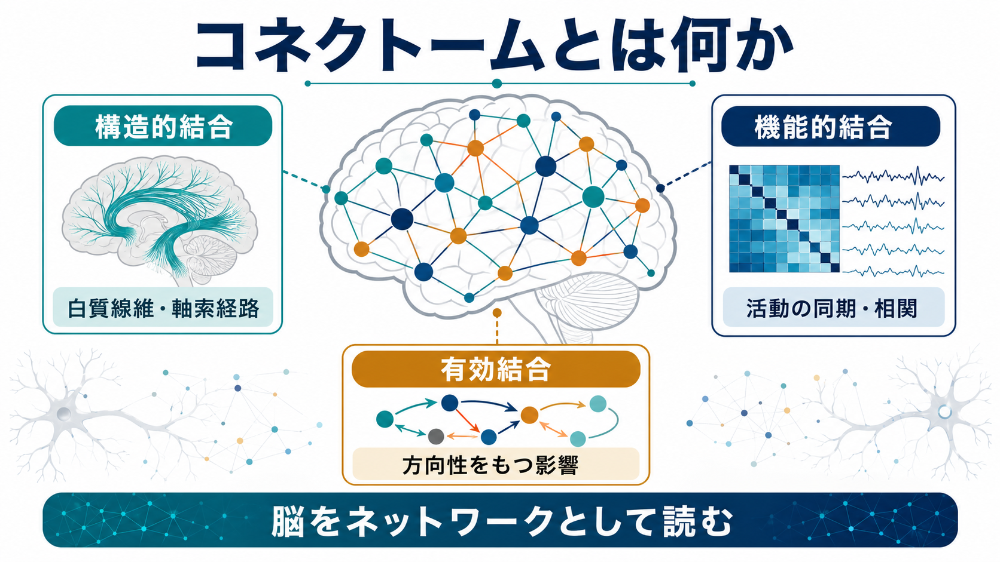
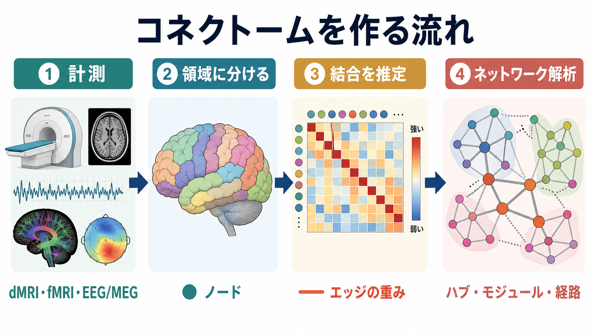
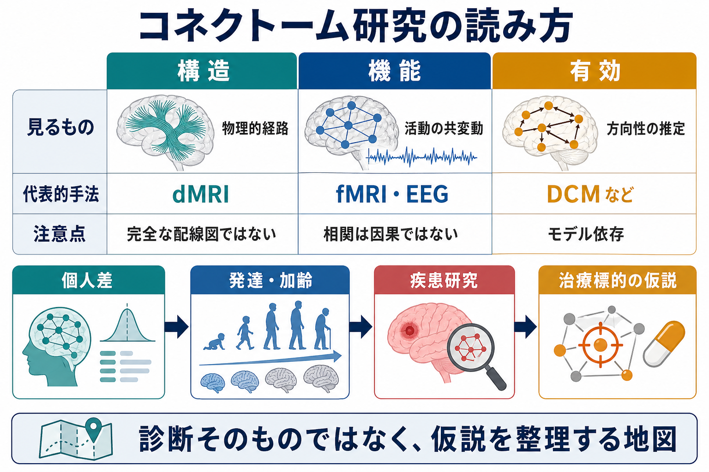

# コネクトームとは何か

## 要点

- **コネクトーム**とは、神経細胞、神経集団、脳領域などの要素がどのように結合しているかを、ネットワークとして記述した地図である。
- 狭い意味では、Sporns らが提案したように、ヒト脳の神経要素と解剖学的結合を網羅的に記述する「構造的」な接続地図を指す[1]。
- 現在の神経科学では、構造的結合だけでなく、fMRI、EEG、MEG などから推定される**機能的コネクトーム**や、モデルに基づく**有効結合**も含めて広く使われる[2][6]。
- コネクトームは「脳の完全な配線図」ではない。どの空間スケールで、どの計測法で、どの前処理と解析モデルを使ったかによって見える地図が変わる。
- 研究・臨床では、個人差、発達・加齢、疾患、治療標的の仮説を整理する強力な枠組みになるが、単独で診断や治療方針を決めるものではない[8]。

## この記事で答える問い

1. コネクトームとは、何を「地図」にしているのか。
2. 構造的結合、機能的結合、有効結合はどう違うのか。
3. MRI や fMRI のデータは、どのようにネットワークへ変換されるのか。
4. コネクトーム研究は、認知・発達・疾患研究にどう接続するのか。
5. コネクトームを読むとき、どのような限界に注意すべきか。

## まず結論

コネクトームは、脳を「部品の集まり」ではなく、相互に結合したシステムとして読むための地図である。地図の単位は研究目的によって変わる。ミクロにはニューロンやシナプス、メソには局所回路、マクロには皮質・皮質下領域や大規模ネットワークがノードになり、結合、相関、方向性をもつ影響がエッジとして表される。

重要なのは、コネクトームが脳そのものの完全コピーではなく、計測とモデルを通じた**表現**だという点である。たとえば拡散 MRI から推定される構造的結合は白質線維の走行を反映するが、単一シナプスの有無や興奮性・抑制性を直接読むものではない。安静時 fMRI の機能的結合は活動の共変動を捉えるが、それだけで直接結合や因果方向を示すわけではない[2][6]。

## 背景

「コネクトーム」という考え方は、ゲノムが遺伝情報の全体像を記述しようとするのに似て、神経系の結合構造を全体として記述しようとする発想から生まれた。Sporns、Tononi、Kötter は 2005 年に、ヒト脳の接続行列を神経科学と神経心理学の基盤資源として位置づけ、これを human connectome と呼ぶことを提案した[1]。

その後、拡散 MRI、安静時 fMRI、課題 fMRI、MEG/EEG、多施設データ共有の発展によって、ヒト脳を大規模ネットワークとして解析する研究が急速に広がった。Human Connectome Project は、健康成人の脳結合と機能、個人差を多モダリティで測定し、行動・遺伝情報と結びつける大規模プロジェクトとして設計された[4]。さらに HCP 型の解析では、高品質な多モダリティ撮像、皮質・皮質下構造に沿った表現、精密な領域分割、データ共有が重視される[5]。

この流れは [[脳内ネットワークとは何か]]、[[神経回路とは何か]]、[[構造的結合と機能的結合は何が違うのか]] と深くつながる。コネクトームは、それらを「局所回路から全脳ネットワークまでをつなぐ記述体系」としてまとめる概念である。

## 基本概念

### ノードとエッジ

コネクトームは、多くの場合グラフとして表される。グラフでは、脳領域や神経要素が**ノード**、そのあいだの結合が**エッジ**である。エッジは、あるかないかだけでなく、強さ、方向性、距離、信頼度、時間変化をもつことがある。全ノード間の結合を表にしたものが接続行列であり、行列の各セルは「領域 A と領域 B の結合の強さ」を表す[1][2]。

この表現によって、脳内のハブ、モジュール、短い経路、リッチクラブ構造、全体効率、局所クラスタリングなどを定量化できる。こうした指標は [[リッチクラブ構造とは何か]] や [[ハブ領域とは何か]] の理解にもつながる。

### 構造的コネクトーム

構造的コネクトームは、解剖学的な結合を対象にする。ヒトでは、主に拡散 MRI とトラクトグラフィにより、白質線維束の走行から領域間の構造的結合を推定する。動物研究や死後脳研究では、トレーサー、電子顕微鏡、組織学的手法によって、より直接的な結合情報が得られる場合もある。

ただし、ヒトの非侵襲的な構造的コネクトームは、線維の方向や水分子拡散から推定された地図であり、シナプス単位の完全な配線図ではない。交差線維、解像度、領域分割、閾値設定によって結果は変わる。

### 機能的コネクトーム

機能的コネクトームは、脳領域間の活動がどの程度一緒に変動するかを記述する。安静時 fMRI では、BOLD 信号の低周波変動の相関を使って、大規模な機能的ネットワークが推定される。1000 Functional Connectomes Project は、多施設の安静時 fMRI データを集め、機能的コネクトームに共通構造と個人差があることを示した[6]。

ここでの結合は、物理的な線維結合そのものではなく、統計的な共変動である。したがって、機能的結合が高いことは「直接つながっている」ことや「片方がもう片方を動かしている」ことを自動的には意味しない。

### 有効結合

有効結合は、ある領域の活動が別の領域の活動にどのような方向性をもつ影響を与えるかを、モデルに基づいて推定する概念である。代表的には DCM などが使われる。これは [[有効結合とは何か]] と直接つながる話題であり、構造的結合や機能的結合よりも強い仮定を置く。

構造的結合が「道路」、機能的結合が「同じ時間帯に交通量が増減する関係」だとすれば、有効結合は「どちらの交通変化がどちらに影響したと考えられるか」をモデル内で問うものである。

## 仕組み

コネクトーム作成の典型的な流れは、次のように整理できる。

1. **計測する**: dMRI、fMRI、EEG/MEG、構造 MRI、行動指標などを取得する。
2. **脳を領域に分ける**: 皮質・皮質下領域を、解剖学的または機能的な基準でパーセル化する。
3. **結合を推定する**: 領域間の線維走行、信号相関、位相同期、モデル上の影響などを計算する。
4. **行列とグラフに変換する**: 接続行列から、ノード、エッジ、重み、方向性をもつネットワークを作る。
5. **ネットワーク指標を読む**: ハブ、モジュール、経路長、効率、リッチクラブ、個人差、群間差を評価する[2][3]。

この手順で注意すべきなのは、コネクトームが単一の正解地図ではないことだ。同じデータでも、領域分割の粒度、ノイズ除去、頭部運動補正、閾値、統計モデル、グラフ指標の選び方によって結論が変わりうる。したがって、コネクトーム研究では「どの地図が正しいか」だけでなく、「どの問いに対して、どの粒度の地図が有用か」を考える必要がある。

## 図解

| 観点 | 構造的コネクトーム | 機能的コネクトーム | 有効結合にもとづく地図 |
|---|---|---|---|
| 何を見るか | 白質線維、軸索経路、解剖学的接続 | 活動時系列の相関・同期 | 方向性をもつ影響 |
| 代表的手法 | dMRI、トラクトグラフィ、トレーサー | fMRI、EEG、MEG | DCM、因果モデル、時系列モデル |
| 強み | 比較的安定した構造的制約を示す | 状態・課題・個人差を反映しやすい | 仮説に基づき影響方向を問える |
| 注意点 | 完全な配線図ではない | 相関は因果ではない | モデル依存性が高い |

## 臨床・研究との接続

コネクトーム研究は、認知機能を単一領域ではなくネットワークの性質として理解する方向へ神経科学を押し広げた。Park と Friston は、構造的ネットワークが機能的ネットワークを制約しつつ、課題や状態に応じて機能的ネットワークが柔軟に再構成されることを強調している[7]。この視点では、記憶、注意、意思決定、感情制御は、特定部位だけでなく、分離と統合のバランスから理解される。

臨床研究では、統合失調症、アルツハイマー病、発達障害、うつ病、神経変性疾患などで、構造的・機能的ネットワークの変化が調べられている。Bullmore と Sporns は、精神・神経疾患を dysconnectivity、すなわち結合異常の観点から捉える研究可能性を整理した[2]。

ただし、臨床的には慎重さが必要である。コネクトーム指標は、集団差や病態仮説を整理するには有用だが、個人の診断や治療指示を単独で決める段階にはない。Nature Neuroscience の論説も、コネクトミクスの成果が疾患理解へ直結するかのような過度な説明を避ける必要を指摘している[8]。教育・研究目的では、コネクトームを「診断そのもの」ではなく、「仮説を整理する地図」として読むのが妥当である。

## よくある誤解

### 誤解1: コネクトームは脳の完全な配線図である

ヒトのマクロなコネクトームは、多くの場合 MRI などから推定された地図である。シナプス単位の完全な結合、神経伝達物質、興奮性・抑制性、可塑性、細胞種の違いをすべて含むわけではない。

### 誤解2: 機能的結合が高いなら、直接つながっている

機能的結合は相関や同期であり、直接結合とは限らない。共通入力、間接経路、課題状態、覚醒度、呼吸・心拍、頭部運動などでも変わる。

### 誤解3: コネクトームがわかれば心や疾患がそのまま説明できる

コネクトームは重要な制約条件だが、認知や症状は、神経活動、発達、身体、環境、学習、薬理、社会的文脈などと相互作用して生じる。結合地図だけで心や疾患を説明しきることはできない。

### 誤解4: グラフ指標は生物学的意味を自動的にもつ

ハブ、モジュール、効率、経路長などは有用な要約指標だが、その意味はノード定義、エッジ定義、閾値、比較対象によって変わる。指標名だけで生物学的機能を断定しないことが重要である。

## 関連ノート

- [[脳内ネットワークとは何か]]
- [[神経回路とは何か]]
- [[構造的結合と機能的結合は何が違うのか]]
- [[有効結合とは何か]]
- [[リッチクラブ構造とは何か]]
- [[ハブ領域とは何か]]
- [[デフォルトモードネットワークとは何か]]
- [[神経同期とは何か]]

MOC 更新候補: `content/00_MOC/` 配下の脳・神経科学、神経回路、脳ネットワーク関連 MOC に、本記事へのリンクを追加する。

## 理解チェック

1. コネクトームでいうノードとエッジは、それぞれ何を表すか。
2. 構造的結合と機能的結合は、なぜ一対一に対応しないのか。
3. 安静時 fMRI の機能的コネクトームを読むとき、「相関は因果ではない」と言う理由は何か。
4. コネクトーム研究を臨床応用へつなげるとき、どのような過大解釈を避けるべきか。

## 未解決問題

- ミクロなシナプス結合とマクロな MRI ベースの結合地図を、どのように橋渡しするか。
- 個人ごとのコネクトーム差が、どの程度まで認知・症状・治療反応を予測するか。
- 構造的制約、動的機能結合、有効結合を統合する標準的なモデルをどう作るか。
- データ品質、前処理、領域分割、統計モデルの違いを超えて、再現性の高い指標をどう定義するか。

## 参考文献

[1] Sporns, O., Tononi, G., & Kötter, R. (2005). The Human Connectome: A Structural Description of the Human Brain. *PLoS Computational Biology*, 1(4), e42. https://doi.org/10.1371/journal.pcbi.0010042

[2] Bullmore, E., & Sporns, O. (2009). Complex brain networks: graph theoretical analysis of structural and functional systems. *Nature Reviews Neuroscience*, 10, 186-198. https://doi.org/10.1038/nrn2575

[3] Behrens, T. E. J., & Sporns, O. (2012). Human connectomics. *Current Opinion in Neurobiology*, 22(1), 144-153. https://doi.org/10.1016/j.conb.2011.08.005

[4] Van Essen, D. C., Ugurbil, K., Auerbach, E., et al. (2012). The Human Connectome Project: A data acquisition perspective. *NeuroImage*, 62(4), 2222-2231. https://doi.org/10.1016/j.neuroimage.2012.02.018

[5] Glasser, M. F., Smith, S. M., Marcus, D. S., et al. (2016). The Human Connectome Project's neuroimaging approach. *Nature Neuroscience*, 19, 1175-1187. https://doi.org/10.1038/nn.4361

[6] Biswal, B. B., Mennes, M., Zuo, X.-N., et al. (2010). Toward discovery science of human brain function. *Proceedings of the National Academy of Sciences*, 107(10), 4734-4739. https://doi.org/10.1073/pnas.0911855107

[7] Park, H.-J., & Friston, K. (2013). Structural and functional brain networks: from connections to cognition. *Science*, 342(6158), 1238411. https://doi.org/10.1126/science.1238411

[8] Nature Neuroscience. (2010). A critical look at connectomics. *Nature Neuroscience*, 13, 1441. https://doi.org/10.1038/nn1210-1441
