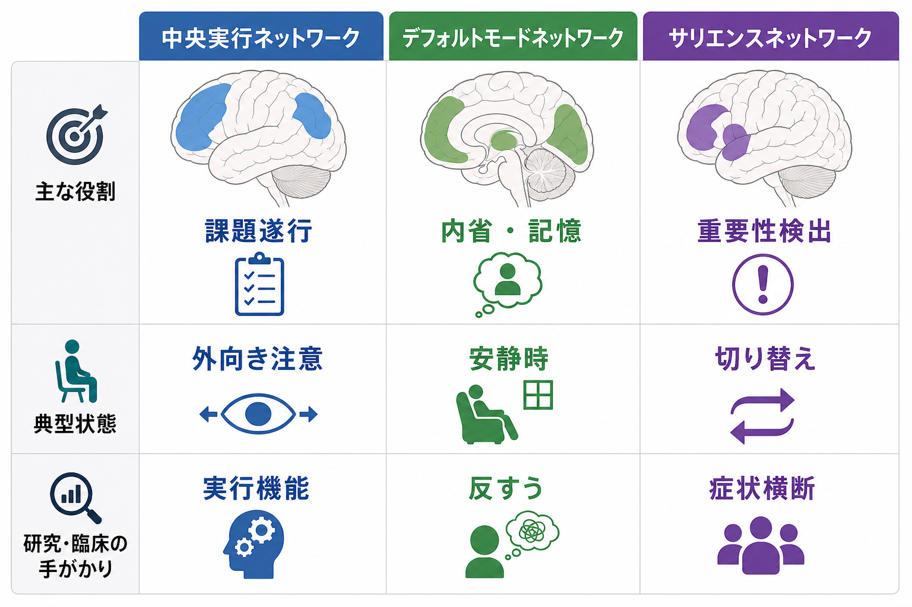
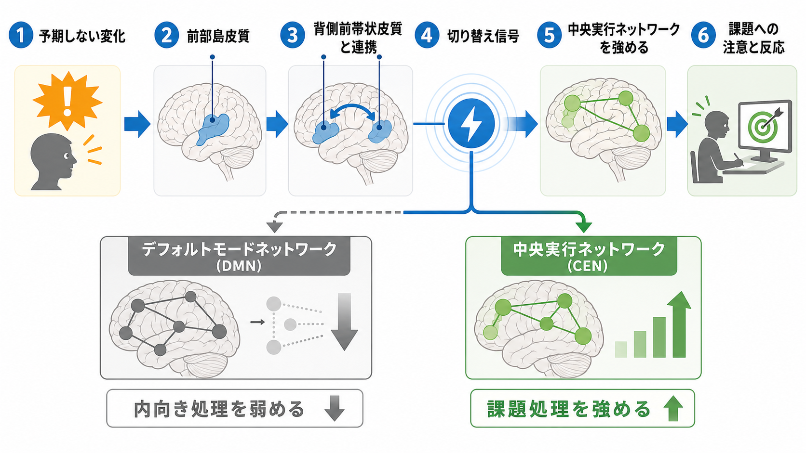
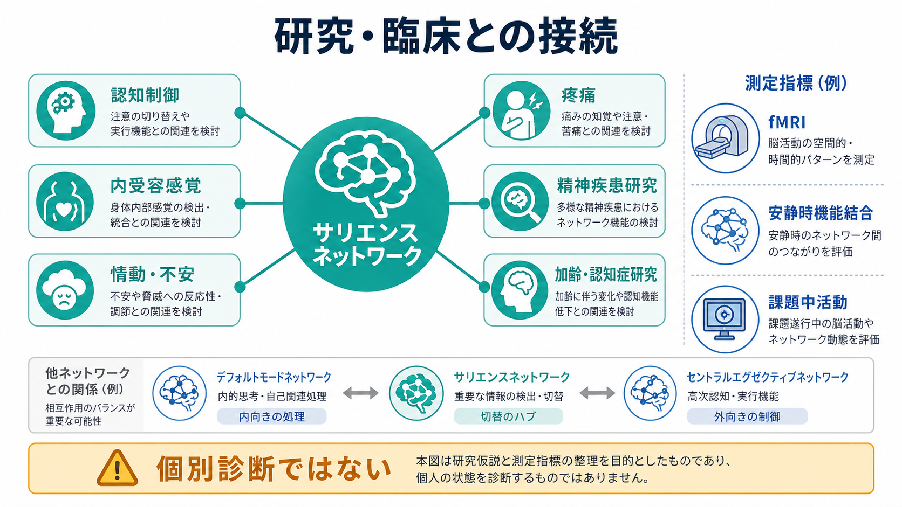

# サリエンスネットワークとは何か

## 要点

- サリエンスネットワークは、前部島皮質と背側前帯状皮質を中核として、重要な外的刺激、身体内部の変化、情動的に意味のある変化を検出する大規模脳ネットワークである[1][5]。
- 重要な役割は「目立つものを見つける」だけではなく、デフォルトモードネットワークと中央実行ネットワークの間で、脳の処理モードを切り替えることにある[2][3]。
- 内受容感覚、痛み、自律神経反応、情動、注意、認知制御が交差するため、研究では精神疾患、認知症、発達、疼痛、加齢などとの関係が検討される[4][5][8]。
- ただし、サリエンスネットワークの活動や機能結合は、単独で個人の診断や治療方針を決める指標ではない。教育・研究上のネットワーク仮説として読む必要がある[4][8]。

## この記事で答える問い

1. サリエンスネットワークは、どの脳領域から成るのか。
2. なぜ「重要性の検出」と「注意・実行制御の切り替え」が同じネットワークで語られるのか。
3. デフォルトモードネットワーク、中央実行ネットワークとの関係は何か。
4. 精神医学・認知神経科学では、どのような注意点つきで使われる概念なのか。

## まず結論

サリエンスネットワークは、脳の「割り込み検出と切り替え」の仕組みとして理解するとわかりやすい。ぼんやり内省しているとき、課題に集中しているとき、痛みや動悸に気づいたとき、脳は同じ処理モードのままではない。ある変化が「今、行動や注意を変える価値がある」と評価されると、前部島皮質と背側前帯状皮質を中心とするネットワークが関与し、内向き処理から外向き課題処理へ、またはその逆へと状態を組み替える[2][3]。

この意味で、サリエンスネットワークは単なる「刺激検出器」ではない。身体状態、情動、予測違反、課題要求を統合し、どの情報を優先するかを調整するネットワークである。[[アセチルコリンは注意や記憶にどう関わるのか|注意]]や[[神経可塑性は発達と学習をどう支えるのか|学習]]を支える他の神経修飾系・回路と同じく、単独で働く部位ではなく、状況に応じて他ネットワークと相互作用する仕組みとして捉えるのがよい。

## 背景

サリエンスネットワークという名前が広く使われるようになった背景には、安静時 fMRI による機能結合研究がある。Seeley らは、課題がない状態でも互いに活動が相関する領域群を解析し、背側前帯状皮質と前頭島皮質を中核とするサリエンス処理ネットワークを、背外側前頭前野・頭頂葉を中心とする実行制御ネットワークから区別した[1]。

その後、Sridharan らは右前頭島皮質が中央実行ネットワークとデフォルトモードネットワークの切り替えに関わる可能性を示し、サリエンスネットワークを「重要な入力を見つけ、処理モードを切り替える」ネットワークとして理解する流れが強まった[2]。Menon と Uddin は、島皮質、とくに前部島皮質を、サリエンス検出、注意、制御を結ぶ中核として整理した[3]。

## 基本概念

### 主要ノード

サリエンスネットワークの中核としてよく挙げられるのは、前部島皮質、前頭島皮質、背側前帯状皮質である[1][5]。研究によって境界や名称は少しずつ異なるが、皮質下では扁桃体、視床、腹側線条体、視床下部、脳幹核などとの関係も議論される[5]。

前部島皮質は、身体内部の状態を表す内受容感覚、情動、痛み、意識的気づき、意思決定などと関係づけられてきた[6][7]。背側前帯状皮質は、葛藤、行動選択、努力、誤差、認知制御と関係する。サリエンスネットワークでは、これらが「何が重要か」と「それにどう反応するか」を結びつける。

### サリエンスとは何か

サリエンスとは、刺激や状態が処理資源を引きつける度合いである。強い音、痛み、予期しない変化、社会的に意味のある表情、心拍や呼吸の変化などは、現在の目標や身体状態によってサリエンスをもつ。重要なのは、サリエンスが刺激の物理的強さだけで決まらない点である。同じ音でも、眠る直前、危険を探しているとき、実験課題中では意味が変わる。

### 三大ネットワークの中での位置づけ

多くの議論では、サリエンスネットワーク、デフォルトモードネットワーク、中央実行ネットワークを組み合わせて考える。デフォルトモードネットワークは内省、自己関連処理、記憶検索などと関係し、中央実行ネットワークは課題遂行、ワーキングメモリ、目標指向的制御と関係する。サリエンスネットワークは、どちらのモードを優先すべきかを切り替えるハブとして位置づけられる[2][4]。

## 仕組み

サリエンスネットワークの働きは、次の流れで整理できる。

1. 外界または身体内部で、予期しない変化や意味のある変化が起こる。
2. 前部島皮質が、感覚、内受容感覚、情動的価値、課題文脈を統合する。
3. 背側前帯状皮質などと連携し、行動選択や制御要求を評価する。
4. 必要に応じて、デフォルトモードネットワークの内向き処理を弱め、中央実行ネットワークの課題処理を強める[2][3]。
5. 注意、意思決定、身体反応、行動反応が更新される。

この切り替えは、スイッチのオン・オフほど単純ではない。実際の脳活動は連続的で、複数ネットワークが同時に部分的に働く。したがって、「サリエンスネットワークが働くと DMN が完全に止まる」と考えるのではなく、活動の重みづけや機能結合のパターンが変わると理解する方が適切である。

内受容感覚との関係も重要である。心拍、呼吸、胃腸感覚、痛み、疲労、体温、炎症に関連する信号は、行動の優先順位を変える。前部島皮質は、こうした身体状態の表象と主観的気づきに関わる領域として研究されてきた[6][7]。そのためサリエンスネットワークは、外界の刺激だけでなく「身体が今、何を要求しているか」を処理するネットワークでもある[5]。

## 図解

図1は、三大ネットワークの役割を対比している。中央実行ネットワークは課題遂行、デフォルトモードネットワークは内省・記憶、サリエンスネットワークは重要性検出と切り替えに関わる。ただし、図は概念整理であり、各ネットワークが一対一で機能を専有するという意味ではない。

図2は、サリエンスネットワークが予期しない変化を検出し、前部島皮質と背側前帯状皮質を介して中央実行ネットワークを強める流れを示している。研究上は、課題 fMRI、安静時機能結合、動的機能結合、脳損傷研究などを組み合わせて、このような切り替え仮説を検討する。

図3は、研究・臨床との接続をまとめたものである。サリエンスネットワークは、認知制御、内受容感覚、情動・不安、疼痛、精神疾患研究、加齢・認知症研究の接点にある。ただし、ネットワーク指標は集団差や仮説検証に使われることが多く、個人の診断を単独で決めるものではない。

## 臨床・研究との接続

精神医学・神経学では、サリエンスネットワークは「症状を単一部位に還元する」ためではなく、複数の症状領域を大規模ネットワークの異常として考える枠組みとして使われる。Menon の三重ネットワークモデルは、サリエンスネットワーク、デフォルトモードネットワーク、中央実行ネットワークのアクセス、関与、離脱の障害が、統合失調症、うつ、不安、自閉スペクトラム症、認知症などで共通する可能性を論じた[4]。

近年のレビューでも、認知的・情動的な調整困難を、サリエンスネットワークと他ネットワークの相互作用から見る観点が整理されている[8]。たとえば、不安では脅威関連刺激の過大なサリエンス、うつでは自己関連処理からの離脱困難、疼痛では身体信号の持続的な優先化といった仮説が考えられる。ただし、これらは疾患名とネットワーク変化を一対一で対応させるものではない。

神経変性疾患では、前頭側頭型認知症などで前部島皮質・前帯状皮質を含む領域の変性が、社会的感情、動機づけ、身体状態への反応の変化と関係づけられることがある[5]。ここでも、研究で示される関連は、個別診断を代替するものではなく、症状の背景にある神経回路仮説を立てるための材料である。

## よくある誤解

### 誤解1: サリエンスネットワークは「注意ネットワーク」と同じである

注意と深く関わるが、同じではない。サリエンスネットワークは、どの情報が注意や実行制御を必要とするかを検出し、他ネットワークの状態を切り替える点に特徴がある。持続的注意や空間注意を担うネットワークとは、重なる部分もあれば異なる部分もある。

### 誤解2: サリエンスは刺激の強さだけで決まる

大きな音や強い痛みはサリエントになりやすいが、文脈、予測、目標、身体状態によってサリエンスは変わる。小さな通知音でも、重要な連絡を待っているときには強く注意を引く。

### 誤解3: サリエンスネットワークの異常があれば特定の疾患がわかる

これは危険な単純化である。機能結合や脳活動の違いは研究上重要だが、個人レベルの診断には感度・特異度、再現性、測定条件、併存症、薬物、発達段階など多くの要因が関わる。この記事の内容は教育・研究目的であり、診断や治療方針を示すものではない。

### 誤解4: サリエンスネットワークは常に「悪い過覚醒」を生む

サリエンスネットワークは、危険や痛みだけでなく、学習に必要な手がかり、社会的に重要な情報、身体の恒常性要求への反応にも関わる。問題は活動の有無ではなく、文脈に合った調整ができるかどうかである。

## 関連ノート

- [[アセチルコリンは注意や記憶にどう関わるのか]]
- [[神経可塑性は発達と学習をどう支えるのか]]
- [[シナプス可塑性とは何か]]
- [[長期増強LTPとは何か]]
- [[MOC｜脳・神経科学]]

### 関連ノート候補

- デフォルトモードネットワークとは何か
- 中央実行ネットワークとは何か
- 島皮質とは何か
- 内受容感覚とは何か
- 三重ネットワークモデルとは何か

### MOC更新候補

- 並列実行時の競合を避けるため、本ジョブでは MOC ファイルを直接更新しない。
- 統合ジョブで `content/00_MOC/MOC｜脳・神経科学.md` の「大規模脳ネットワーク」または「神経回路・脳ネットワーク」関連項目へ本記事を追加するとよい。

## 理解チェック

1. サリエンスネットワークの中核ノードを2つ挙げられるか。
2. サリエンスネットワークが、デフォルトモードネットワークと中央実行ネットワークの切り替えに関わるとはどういう意味か。
3. 内受容感覚が、サリエンスネットワークの理解で重要になる理由を説明できるか。
4. サリエンスネットワーク研究を、個別診断や治療指示として読んではいけない理由を説明できるか。

## 参考文献

[1] Seeley, W. W., Menon, V., Schatzberg, A. F., Keller, J., Glover, G. H., Kenna, H., Reiss, A. L., & Greicius, M. D. (2007). Dissociable intrinsic connectivity networks for salience processing and executive control. *Journal of Neuroscience*, 27(9), 2349-2356. https://doi.org/10.1523/JNEUROSCI.5587-06.2007

[2] Sridharan, D., Levitin, D. J., & Menon, V. (2008). A critical role for the right fronto-insular cortex in switching between central-executive and default-mode networks. *Proceedings of the National Academy of Sciences*, 105(34), 12569-12574. https://doi.org/10.1073/pnas.0800005105

[3] Menon, V., & Uddin, L. Q. (2010). Saliency, switching, attention and control: a network model of insula function. *Brain Structure and Function*, 214(5-6), 655-667. https://doi.org/10.1007/s00429-010-0262-0

[4] Menon, V. (2011). Large-scale brain networks and psychopathology: a unifying triple network model. *Trends in Cognitive Sciences*, 15(10), 483-506. https://doi.org/10.1016/j.tics.2011.08.003

[5] Seeley, W. W. (2019). The salience network: a neural system for perceiving and responding to homeostatic demands. *Journal of Neuroscience*, 39(50), 9878-9882. https://doi.org/10.1523/JNEUROSCI.1138-17.2019

[6] Craig, A. D. (2009). How do you feel - now? The anterior insula and human awareness. *Nature Reviews Neuroscience*, 10, 59-70. https://doi.org/10.1038/nrn2555

[7] Critchley, H. D., Wiens, S., Rotshtein, P., Ohman, A., & Dolan, R. J. (2004). Neural systems supporting interoceptive awareness. *Nature Neuroscience*, 7, 189-195. https://doi.org/10.1038/nn1176

[8] Schimmelpfennig, J., Topczewski, J., Zajkowski, W., & Jankowiak-Siuda, K. (2023). The role of the salience network in cognitive and affective deficits. *Frontiers in Human Neuroscience*, 17, 1133367. https://doi.org/10.3389/fnhum.2023.1133367

## 未解決問題

- サリエンスネットワークの「切り替え」機能は、どの時間スケールでどのように測定するのが最も妥当か。
- 前部島皮質、背側前帯状皮質、皮質下ノードの役割分担は、課題・年齢・病態によってどの程度変わるのか。
- 集団レベルの機能結合差を、個人レベルの理解や支援にどこまで橋渡しできるのか。
