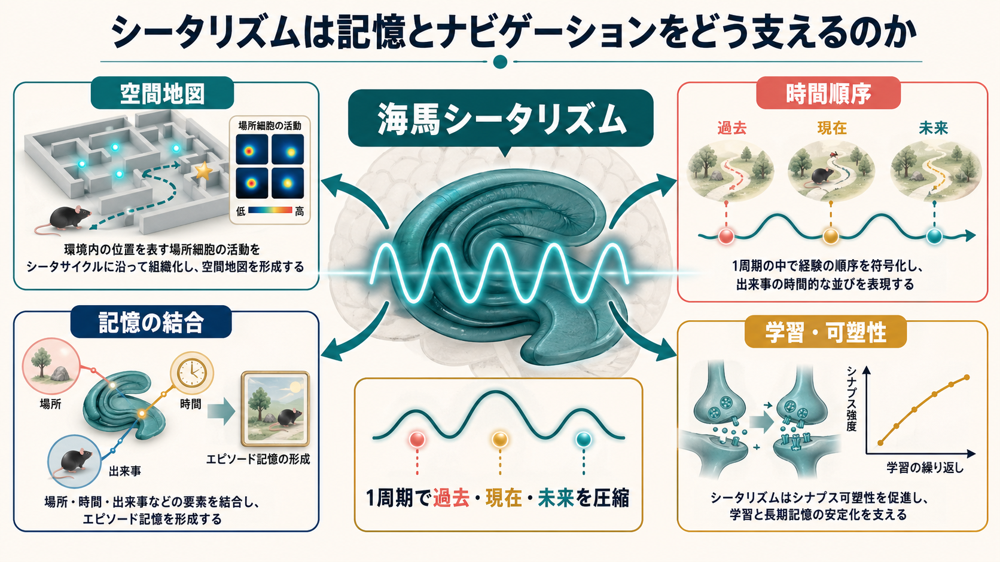
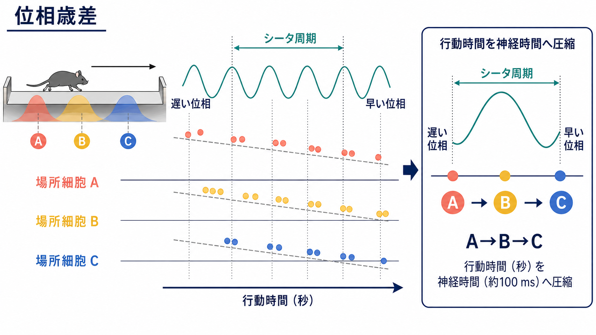
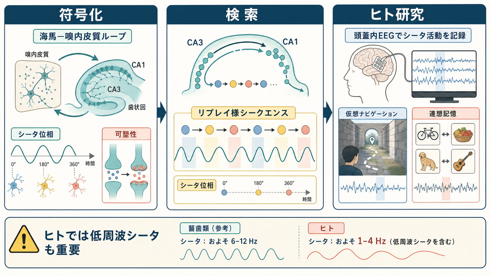

# シータリズムは記憶とナビゲーションをどう支えるのか

## 要点

- 海馬シータリズムは、げっ歯類では探索・走行・空間ナビゲーション中に目立つ約6-12 Hzのリズムとして観察され、ヒトではより低い周波数帯のシータ活動も記憶やナビゲーションに関わる。
- シータは「場所を表す発火率」だけでなく、「いつ発火するか」という位相情報を使って、経験の順序を短い神経時間に圧縮する。
- 位相歳差とシータ系列により、過去・現在・未来に相当する位置や出来事が1つのシータ周期内に並び、経路計画やエピソード記憶の足場になる。
- シータ位相は、海馬内外の入力、[[シナプス可塑性とは何か|シナプス可塑性]]、符号化と検索のバランスを調整する候補機構として研究されている。
- シータ活動は重要な手がかりだが、記憶やナビゲーションを単独で説明する万能メカニズムではない。

## この記事で答える問い

この記事では、次の問いに答える。

1. シータリズムとは何か。
2. なぜ空間ナビゲーションと記憶が同じ海馬シータ機構で語られるのか。
3. 位相歳差とシータ系列は、経験の順序をどう表現するのか。
4. 学習・可塑性・ヒト研究では、どこまで言えるのか。

## まず結論

海馬シータリズムは、記憶内容そのものというより、記憶内容を並べる「時間のものさし」に近い。場所細胞や嗅内皮質入力は、現在位置、過去に通った位置、これから向かう位置を発火率と発火位相の組み合わせで表す。これにより、行動レベルでは数秒にまたがる経験が、1つまたは数個のシータ周期という約100 msスケールに圧縮される。この圧縮された順序表現が、空間地図、時間順序、連想記憶、学習による更新をつなぐ候補機構である[1][2][3][4]。

## 背景

海馬は、空間ナビゲーションとエピソード記憶の両方に深く関わる。古典的には、海馬損傷による重い記憶障害と、動物が特定の場所にいるときに発火する場所細胞の発見が、別々の研究系譜を作ってきた。近年の見方では、この2つは完全に別の機能ではなく、「空間内の位置を並べる仕組み」が「出来事や考えを順序づける仕組み」に拡張されたものとして理解できる[1]。

ここで重要になるのがシータリズムである。シータは、海馬と嗅内皮質の回路活動に現れる規則的な振動で、げっ歯類では移動、探索、注意を向けた行動のときに強くなる。シータ周期は、場所細胞、グリッド細胞、介在ニューロン、嗅内皮質からの入力、内側中隔からの調整を同期させ、分散した神経活動を同じ時間枠に載せる[2]。

## 基本概念

### シータリズム

シータリズムとは、脳活動に現れる周期的な低周波振動の一種である。海馬研究では、げっ歯類の走行時に観察される約6-12 Hzの大きなリズムが代表例である。ただし、ヒトの海馬シータはげっ歯類より遅い周波数帯で観察されることが多く、1-4 Hz程度の低周波シータも空間記憶やナビゲーション課題で重要な信号として扱われる[8]。

### 場所細胞と位相

場所細胞は、動物が特定の場所を通ると発火しやすくなる海馬ニューロンである。場所細胞を発火率だけで見ると、「どこにいるか」を表しているように見える。しかし実際には、シータ波のどの位相で発火するかも情報を持つ。動物が場所フィールドに入った直後はシータ周期の遅い位相で発火し、フィールドを進むにつれて早い位相へずれていく。この現象を位相歳差という[3]。

### シータ系列

複数の場所細胞を同時に記録すると、シータ周期の中に、動物がたどった経路やこれから向かう経路の順序が圧縮されて現れる。これをシータ系列と呼ぶ。たとえば実際の行動では A、B、C という場所を数秒かけて通るとしても、神経活動では1周期内に A→B→C の順で発火が並ぶことがある[4]。

## 仕組み

### 1. シータは「現在位置」だけでなく「順序」を運ぶ

空間ナビゲーションでは、現在位置を知るだけでは不十分である。どこから来たのか、次にどこへ向かうのか、行動の目的に照らしてどの経路を選ぶのかが必要になる。シータ位相に沿って場所細胞の発火がずれると、現在位置を中心に、直前と直後の位置が短い時間窓に折りたたまれる。これにより、海馬回路は単なる地図ではなく、時間方向を持った地図として働く[1][4]。

### 2. シータ周期は経験を神経可塑性に適した幅へ圧縮する

学習では、どの入力がどの出力の直前に起きたかが重要になる。[[Hebb則とは何か|Hebb則]]や[[長期増強LTPとは何か|長期増強LTP]]の考え方では、近い時間に活動した細胞同士の結合が強まりやすい。位相歳差とシータ系列は、行動上は離れている出来事を、シナプス可塑性が働きやすい短い時間幅に配置する。これにより、経路の順序や出来事の連鎖を結合しやすくなる[2][4][7]。

### 3. シータ位相は符号化と検索を切り替える候補になる

記憶には、新しい情報を取り込む符号化と、過去の情報を呼び出す検索がある。海馬の計算モデルでは、シータ周期の異なる位相で、嗅内皮質からの新規入力、CA3からの再帰的検索、CA1での比較・統合が変化すると考えられてきた。これは、同じ海馬回路が「新しい経験を保存する状態」と「既存の記憶を呼び出す状態」を周期的に切り替えるという仮説である[5][6]。

### 4. シータとガンマの入れ子構造が複数項目の順序を支える

シータ周期の中には、より速いガンマ活動が入れ子状に現れることがある。シータ・ガンマ符号化仮説では、1つのシータ周期内の異なるガンマ小周期に複数の項目が配置され、順序つきの表現が作られる。これは、作業記憶や系列記憶の説明として提案されており、海馬では空間情報の順序化と相性がよい[7]。

## 図解

この記事では、シータを3つのレベルで見ると理解しやすい。

| レベル | 何を説明するか | 代表的な見方 |
|---|---|---|
| 振動レベル | 海馬・嗅内皮質回路が同じ周期で活動する | シータ波、位相同期、内側中隔からの調整 |
| 細胞レベル | 場所細胞がシータ位相に沿って発火時刻をずらす | 位相歳差、場所フィールド、発火位相 |
| 集団レベル | 複数細胞の順序発火が経路や出来事を圧縮する | シータ系列、系列検索、エピソード記憶 |

## 臨床・研究との接続

シータリズム研究は、現時点では臨床診断や治療指示に直結するというより、記憶障害、ナビゲーション障害、注意や学習の脳内メカニズムを理解するための基礎研究として重要である。ヒトの頭蓋内EEG研究や仮想ナビゲーション課題では、海馬の低周波シータ活動が空間記憶や連想記憶の成績と関係することが報告されている[8]。

ただし、ヒトとげっ歯類では周波数帯、課題、計測方法が異なる。げっ歯類の明瞭な6-12 Hzシータを、そのままヒトのすべての記憶課題に当てはめるのは避けるべきである。ヒト研究では、頭皮EEG、MEG、頭蓋内EEG、fMRI、行動課題を組み合わせ、どの周波数帯・どの部位・どの課題条件でシータが意味を持つのかを慎重に分ける必要がある[8]。

関連する神経化学としては、[[アセチルコリンは注意や記憶にどう関わるのか|アセチルコリン]]が海馬の符号化状態や探索行動に関わる。シータは単独で働くのではなく、覚醒、注意、報酬、運動、神経調節物質、[[シナプスとは何か|シナプス]]の可塑性と一体になって記憶を支える。

## よくある誤解

### 誤解1: シータ波が強ければ記憶が必ずよくなる

シータ活動は記憶成績と関係することがあるが、強ければ常によいとは限らない。課題、脳部位、位相、他の周波数との結合、個体の状態によって意味が変わる。過剰な同期や不適切なタイミングは、むしろ柔軟な処理を妨げる可能性もある。

### 誤解2: シータは空間ナビゲーション専用である

シータは空間ナビゲーションで非常に明瞭に観察されるが、空間だけに限定されない。出来事の順序、連想、計画、記憶検索など、経験を順序づける処理にも関わる。空間地図は、より一般的な「関係性の地図」の一例として考えられる[1][6]。

### 誤解3: げっ歯類のシータ周波数をそのままヒトに当てはめられる

ヒト海馬では、げっ歯類より遅い低周波シータが重要になることがある。したがって、周波数名だけで同じ現象と断定せず、課題、計測部位、発生源、行動との対応を見る必要がある[8]。

## 関連ノート

- [[シナプス可塑性とは何か]]
- [[長期増強LTPとは何か]]
- [[Hebb則とは何か]]
- [[アセチルコリンは注意や記憶にどう関わるのか]]
- [[シナプスとは何か]]
- 今後の作成候補: 場所細胞、グリッド細胞、嗅内皮質、海馬、リップル、位相歳差、シータ・ガンマ結合

## 理解チェック

1. 場所細胞の発火率と発火位相は、それぞれ何を表すと考えられるか。
2. 位相歳差が「行動時間を神経時間へ圧縮する」と言えるのはなぜか。
3. シータ周期の異なる位相が、符号化と検索の切り替えに関わるという仮説には、どのような利点があるか。
4. ヒトのシータ研究を読むとき、げっ歯類研究と比較して注意すべき点は何か。

## 参考文献

[1] Buzsáki, G., & Moser, E. I. (2013). Memory, navigation and theta rhythm in the hippocampal-entorhinal system. *Nature Neuroscience, 16*(2), 130-138. https://doi.org/10.1038/nn.3304

[2] Colgin, L. L. (2013). Mechanisms and functions of theta rhythms. *Annual Review of Neuroscience, 36*, 295-312. https://doi.org/10.1146/annurev-neuro-062012-170330

[3] O'Keefe, J., & Recce, M. L. (1993). Phase relationship between hippocampal place units and the EEG theta rhythm. *Hippocampus, 3*(3), 317-330. https://doi.org/10.1002/hipo.450030307

[4] Skaggs, W. E., McNaughton, B. L., Wilson, M. A., & Barnes, C. A. (1996). Theta phase precession in hippocampal neuronal populations and the compression of temporal sequences. *Hippocampus, 6*(2), 149-172. https://doi.org/10.1002/(SICI)1098-1063(1996)6:2%3C149::AID-HIPO6%3E3.0.CO;2-K

[5] Hasselmo, M. E. (2005). What is the function of hippocampal theta rhythm? Linking behavioral data to phasic properties of field potential and unit recording data. *Hippocampus, 15*(7), 936-949. https://doi.org/10.1002/hipo.20116

[6] Hasselmo, M. E., & Stern, C. E. (2014). Theta rhythm and the encoding and retrieval of space and time. *NeuroImage, 85*, 656-666. https://doi.org/10.1016/j.neuroimage.2013.06.022

[7] Lisman, J. E., & Jensen, O. (2013). The theta-gamma neural code. *Neuron, 77*(6), 1002-1016. https://doi.org/10.1016/j.neuron.2013.03.007

[8] Jacobs, J. (2014). Hippocampal theta oscillations are slower in humans than in rodents: Implications for models of spatial navigation and memory. *Philosophical Transactions of the Royal Society B: Biological Sciences, 369*(1635), 20130304. https://doi.org/10.1098/rstb.2013.0304

## 未解決問題

- シータ系列が、実際の意思決定で「未来の候補経路」をどの程度まで表しているのか。
- ヒトの低周波シータとげっ歯類の6-12 Hzシータが、どの計算原理を共有し、どこで異なるのか。
- シータ位相への介入が、記憶成績や学習速度を因果的に変える条件は何か。
- シータ、リップル、ガンマ、神経調節物質の相互作用を、単一の記憶理論としてどう統合するか。

## MOC更新候補

- `content/00_MOC/MOC｜脳・神経科学.md`
- `content/00_MOC/MOC｜基礎神経科学.md`

