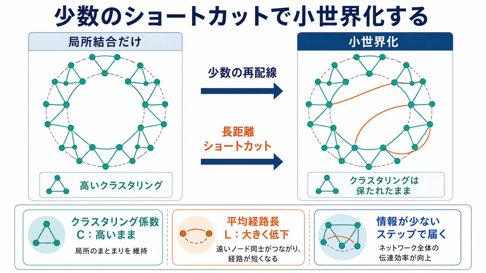
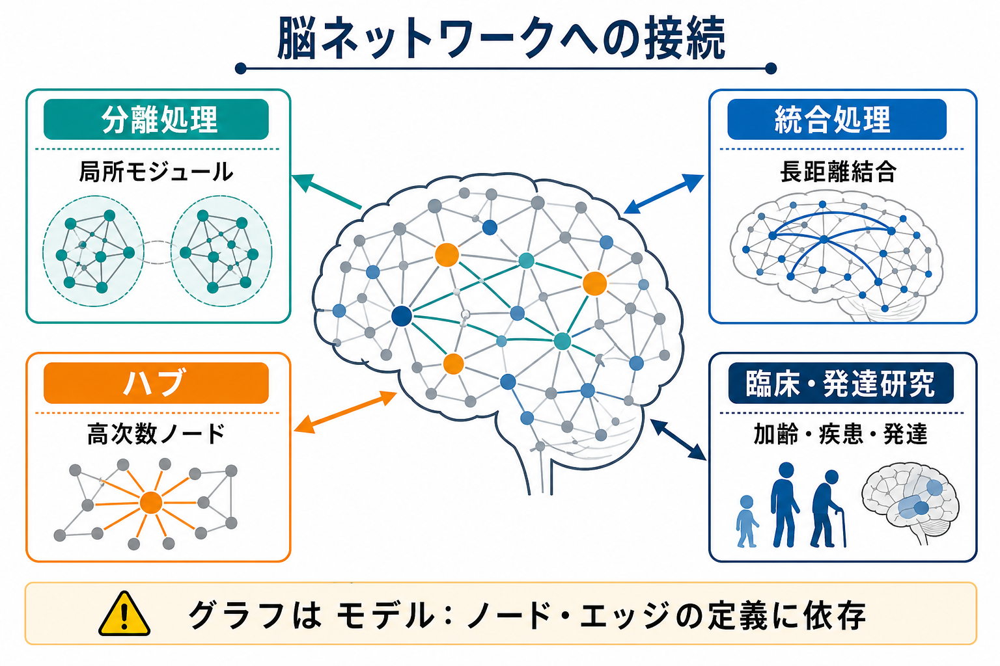

# スモールワールドネットワークとは何か

## 要点

- スモールワールドネットワークとは、近くのノード同士がまとまりやすいのに、ネットワーク全体では少ないステップで遠くへ到達できる構造である。
- グラフ理論では、局所的まとまりをクラスタリング係数、全体的な近さを平均経路長や効率で測る。
- 脳ネットワークでは、局所回路やモジュールによる分離処理と、長距離結合やハブによる統合処理を両立する候補構造として理解される。
- ただし、スモールワールド性は「脳が最適である」ことの証明でも、個人の診断指標でもない。ノード、エッジ、閾値、測定法に強く依存するモデル指標である。

## この記事で答える問い

- スモールワールドネットワークは、規則的ネットワークやランダムネットワークと何が違うのか。
- なぜ少数の長距離ショートカットが、全体の情報伝達効率を大きく変えるのか。
- 脳ネットワーク研究では、この概念をどのように読むべきか。

## まず結論

スモールワールドネットワークは、「局所的にはまとまっているが、全体としては遠回りしにくい」ネットワークである。規則的ネットワークは局所的まとまりが強い一方で遠くへ届くのに多くのステップを要し、ランダムネットワークは遠くへ届きやすい一方で局所的まとまりを失いやすい。Watts と Strogatz は、この中間に、少数の長距離ショートカットだけで平均経路長が大きく短くなり、クラスタリングは高く保たれる領域があることを示した [1]。

脳に置き換えると、この性質は、近い領域や機能的に近い領域で専門的処理を行いながら、離れた領域間で情報を統合するための構造的・機能的条件として読める [3], [4]。[[ニューロンとは何か]]、[[シナプスとは何か]]、[[シナプス可塑性とは何か]]のようなミクロな接続の話を、脳全体のネットワークとして見るための橋渡しになる概念である。

## 背景

ネットワークを考えるとき、極端なモデルは二つある。第一は、近くのノード同士だけが規則的につながるネットワークである。これは局所的な三角形やまとまりを作りやすいが、遠くのノードへ到達するには多くの中継が必要になる。第二は、接続がランダムに張られたネットワークである。これは平均経路長を短くしやすいが、局所的なまとまりは弱くなる。

現実の社会ネットワーク、生物ネットワーク、脳ネットワークは、このどちらか一方だけでは説明しにくい。人間関係に「友人の友人」が多い一方で、数人の知人を介して遠い集団に届くことがあるように、局所性と遠距離性はしばしば共存する。スモールワールドモデルは、この共存を最小限のグラフ理論で捉えるために導入された [1]。

脳では、この問題はより切実である。すべての領域を密につなげば情報は届きやすくなるが、配線コスト、伝導遅延、代謝コストが増える。逆に局所結合だけにすればコストは下がるが、広域統合が難しくなる。したがって、脳ネットワーク研究では、効率とコストの釣り合いが中心的な問いになる [4], [6]。

## 基本概念

グラフでは、要素をノード、関係をエッジとして表す。脳ネットワークの場合、ノードは脳領域、ボクセル、電極、神経細胞集団などであり、エッジは白質線維、活動の相関、位相同期、因果的相互作用の推定などで定義される [5]。

クラスタリング係数 $C$ は、あるノードの近傍同士がどれだけ互いにつながっているかを表す。直感的には、「友人同士も友人である」度合いである。脳では、局所モジュールや近接領域内のまとまりを反映する指標として読まれることが多い。

平均経路長 $L$ は、任意の二つのノードを結ぶ最短経路の平均である。$L$ が短いほど、ネットワーク全体で情報が少ない中継で届きやすい。Latora と Marchiori は、到達しやすさを「効率」として定式化し、スモールワールド構造を効率的な情報交換の観点から捉え直した [2]。

典型的には、ランダムネットワークと比べてクラスタリングが高く、平均経路長はランダムネットワークに近いとき、スモールワールド性があると判断する。代表的な係数は次のように書ける。

$$
\sigma = \frac{C / C_{\mathrm{rand}}}{L / L_{\mathrm{rand}}}
$$

ここで $\sigma > 1$ は、ランダムネットワークより相対的にクラスタリングが高く、経路長が過度に長くないことを示す。ただし、この値は比較対象となるランダムネットワークの作り方、密度、重み付き・方向付きエッジの扱いに左右される [5], [7]。

## 仕組み

スモールワールド化の核心は、局所結合の大部分を保ったまま、少数の長距離ショートカットを加える点にある。局所結合は三角形やモジュールを保つため、クラスタリングは高く残る。一方、長距離ショートカットは、遠いモジュール間を一気に結ぶため、平均経路長を大きく短縮する [1]。

脳ネットワークでいうと、近接した皮質領域や機能的に近い領域の密な結合は、専門的な局所処理を支える。一方、前頭頭頂ネットワーク、視床皮質結合、連合野間の長距離結合、ハブ領域のような構造は、離れた処理系を統合する経路になりうる [4], [7]。この見方は、[[神経回路の可塑性はどこで起きるのか]]や[[神経可塑性は発達と学習をどう支えるのか]]で扱うような可塑的変化を、局所回路だけでなく全体ネットワークの再構成として読む入口にもなる。

重要なのは、ショートカットが多ければ多いほどよい、という話ではないことである。長距離結合は配線長、代謝、発達上の制約を受ける。脳ネットワークは、通信効率を上げながら物理的コストを抑えるという制約のもとで組織化されていると考えられる [4], [6]。

## 図解

上の図では、スモールワールド性を「脳が小さな世界そのものになっている」という比喩ではなく、分離処理と統合処理を同時に読むためのグラフ指標として示している。局所モジュールは近い処理をまとめ、長距離結合やハブは離れたモジュール間の情報伝達を助ける。

## 臨床・研究との接続

脳ネットワーク研究では、MRI、拡散 MRI、fMRI、EEG、MEG などから構造的結合や機能的結合を推定し、クラスタリング、経路長、効率、モジュール性、ハブ性などを比較する [5]。Achard と Bullmore は、ヒト機能ネットワークが経済的なコストのもとで高い効率を示すことを報告し、脳ネットワークを「安価だが効率的」な組織として読む視点を強めた [6]。

臨床研究では、認知症、てんかん、統合失調症、多発性硬化症などでネットワーク指標の変化が研究されている。Stam は、神経疾患を単一部位の障害だけでなく、ネットワーク全体の変化として捉える現代的な視点を整理している [8]。ただし、これらの指標は研究上の比較や仮説生成に有用であって、単独で個人の診断や治療方針を決めるものではない。

発達や加齢でも、ネットワークの局所性、長距離結合、ハブの配置は変化しうる。Bassett と Bullmore は、スモールワールド脳ネットワークの概念を再検討し、単純な「小世界性あり・なし」よりも、コスト、発達、階層性、モジュール性と併せて読む必要を強調している [7]。

## よくある誤解

**誤解 1：スモールワールドなら脳は最適である。**  
スモールワールド性は、効率と局所性の組み合わせを示す指標であり、最適性の証明ではない。最適かどうかは、何を目的関数にするか、どの制約を入れるかで変わる。

**誤解 2：ショートカットが多いほどよい。**  
長距離結合は平均経路長を短くするが、配線コストやノイズの伝播も増やしうる。脳では、効率だけでなくコストと頑健性も問題になる [4], [6]。

**誤解 3：機能的結合は構造的結合そのものである。**  
構造的結合は白質線維などの物理的経路を表し、機能的結合は活動の共変動を表す。両者は関係するが同一ではない [5]。

**誤解 4：スモールワールド指標だけで疾患を判定できる。**  
疾患群で平均的な差が出ることはあっても、個人診断にそのまま使えるわけではない。測定条件、解析パイプライン、症状の多様性を考慮する必要がある [8]。

## 関連ノート

- [[ニューロンとは何か]]
- [[シナプスとは何か]]
- [[シナプス可塑性とは何か]]
- [[神経回路の可塑性はどこで起きるのか]]
- [[神経可塑性は発達と学習をどう支えるのか]]
- [[活動電位はどのように発生するのか]]

MOC 更新候補: `content/00_MOC/MOC｜脳・神経科学.md`、`content/00_MOC/MOC｜数理モデル・計算論.md`

今後の作成候補: 「グラフ理論の基礎」「機能的結合とは何か」「構造的結合とは何か」「脳ネットワークのハブとは何か」「モジュール性とは何か」

## 理解チェック

1. 規則的ネットワークは、なぜクラスタリングが高くなりやすいのか。
2. 少数の長距離ショートカットは、平均経路長にどのような影響を与えるのか。
3. 脳ネットワークでスモールワールド性を論じるとき、ノードとエッジの定義が重要になるのはなぜか。
4. スモールワールド性を個人の診断指標として単純に使えない理由は何か。

## 参考文献

[1] Watts, D. J., & Strogatz, S. H. (1998). Collective dynamics of 'small-world' networks. *Nature, 393*, 440-442. https://doi.org/10.1038/30918

[2] Latora, V., & Marchiori, M. (2001). Efficient behavior of small-world networks. *Physical Review Letters, 87*(19), 198701. https://doi.org/10.1103/PhysRevLett.87.198701

[3] Sporns, O., & Zwi, J. D. (2004). The small world of the cerebral cortex. *Neuroinformatics, 2*(2), 145-162. https://doi.org/10.1385/NI:2:2:145

[4] Bullmore, E., & Sporns, O. (2009). Complex brain networks: graph theoretical analysis of structural and functional systems. *Nature Reviews Neuroscience, 10*, 186-198. https://doi.org/10.1038/nrn2575

[5] Rubinov, M., & Sporns, O. (2010). Complex network measures of brain connectivity: uses and interpretations. *NeuroImage, 52*(3), 1059-1069. https://doi.org/10.1016/j.neuroimage.2009.10.003

[6] Achard, S., & Bullmore, E. (2007). Efficiency and cost of economical brain functional networks. *PLoS Computational Biology, 3*(2), e17. https://doi.org/10.1371/journal.pcbi.0030017

[7] Bassett, D. S., & Bullmore, E. T. (2017). Small-world brain networks revisited. *The Neuroscientist, 23*(5), 499-516. https://doi.org/10.1177/1073858416667720

[8] Stam, C. J. (2014). Modern network science of neurological disorders. *Nature Reviews Neuroscience, 15*, 683-695. https://doi.org/10.1038/nrn3801

## 未解決問題

- スモールワールド性、モジュール性、階層性、リッチクラブ構造を、同じ解析枠組みでどのように統合して解釈するか。
- 構造的結合と機能的結合のずれを、発達、学習、疾患、状態依存性としてどこまで説明できるか。
- 個人差の大きい脳ネットワーク指標を、研究上の群比較から個人レベルの予測へ移すには、どの程度の再現性と外部妥当性が必要か。
