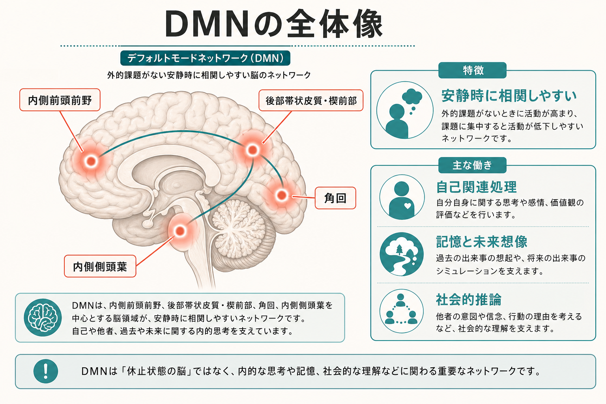
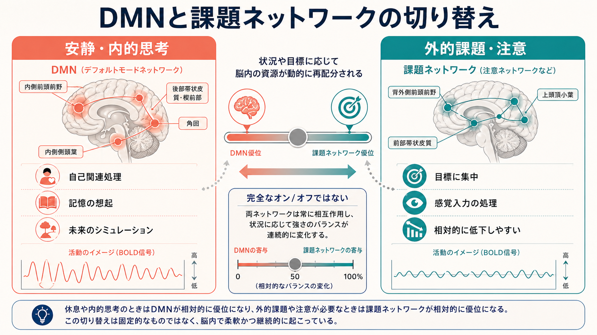
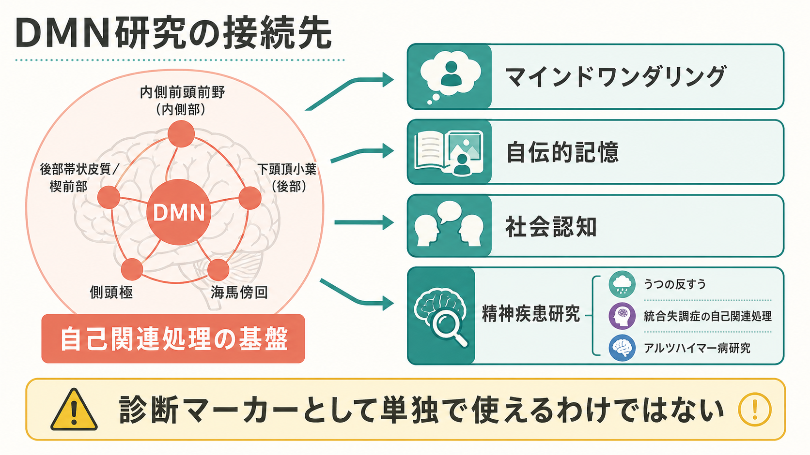

# デフォルトモードネットワークとは何か

## 要点

- デフォルトモードネットワーク（default mode network; DMN）は、安静時や外的課題が弱い状態で互いに相関しやすい脳領域群である[1][2]。
- 中心的な領域には、内側前頭前野、後部帯状皮質・楔前部、角回を含む下頭頂小葉、内側側頭葉が含まれる[3][4]。
- DMN は「何もしていない脳」ではなく、自己関連処理、自伝的記憶、未来のシミュレーション、他者理解など、内的な認知に関わる[3][6]。
- 注意を要する外的課題では相対的に活動が低下しやすいが、完全なオン/オフではなく、課題、文脈、個人差に応じて連続的に変化する[1][5]。
- 精神疾患や神経変性疾患との関連は研究されているが、DMN の所見だけで個別診断や治療方針を決められるわけではない[7][8]。

## この記事で答える問い

この記事では、次の問いに答える。

1. デフォルトモードネットワークとは、どのような脳ネットワークなのか。
2. なぜ「安静時」に注目して発見されたのか。
3. 内側前頭前野、後部帯状皮質、角回、内側側頭葉はどのように役割分担しているのか。
4. 自己関連処理、記憶、未来想像、社会認知とどのようにつながるのか。
5. 臨床・精神医学研究で DMN を読むとき、どこに注意すべきか。

## まず結論

デフォルトモードネットワークは、脳が外界の課題に集中していないときに、相互にまとまって変動しやすい大規模ネットワークである。代表的には、内側前頭前野、後部帯状皮質・楔前部、角回、内側側頭葉が含まれる[2][3]。

重要なのは、DMN を「休んでいる脳」と理解しないことである。安静時にも、脳は自己について考え、過去を思い出し、未来を想像し、他者の心を推測し、現在の自分の状態を評価している。DMN は、こうした内的な認知を支える基盤として理解される[3][6]。

一方で、DMN は単独で働く閉じた装置ではない。注意、実行制御、感覚処理、情動、[[神経可塑性は発達と学習をどう支えるのか|神経可塑性]]、神経伝達物質による調整と相互作用する。したがって DMN 研究は、「一つの領域が一つの機能を担う」という局在論ではなく、脳全体の状態遷移を読むための入口である。

## 背景

DMN 研究の出発点は、課題中の脳活動だけでなく、課題をしていないときの脳活動にも規則性があるという発見だった。Raichle らは、さまざまな外的課題で活動が下がりやすい領域群を整理し、安静時にも脳は高い代謝活動を保っていることを示した[1]。この「課題で下がる領域」は、後に安静時機能的 MRI の機能結合研究によって、互いに同期して変動するネットワークとして確認された[2]。

ここでいう「安静時」とは、脳が停止している状態ではない。実験上は、画面を見つめる、目を閉じる、特定の課題をしない、といった条件を指すことが多い。被験者の内側では、記憶、空想、自己評価、身体感覚への注意、実験状況への予測などが起きている可能性がある。DMN は、このような内的処理が自然に生じる背景状態を調べるための重要な窓になった。

## 基本概念

### DMN は領域名ではなくネットワーク名である

DMN は、単一の脳部位ではない。複数の領域が時間的に相関した活動を示す「ネットワーク」である。特に安静時 fMRI では、ある領域の BOLD 信号のゆっくりした揺らぎが、離れた別の領域の揺らぎと同期するかを調べる。このような[[構造的結合と機能的結合は何が違うのか|機能結合]]の解析によって、DMN は再現性の高い大規模ネットワークとして記述されてきた[2][5]。

中心的な構成要素は、内側前頭前野、後部帯状皮質・楔前部、下頭頂小葉の角回、内側側頭葉である[3][4]。内側前頭前野は自己評価や価値づけ、後部帯状皮質・楔前部は内的状態の統合や意識状態との関連、角回は概念的・社会的意味づけ、内側側頭葉は記憶や場面構成に関わると考えられている。ただし、これらの役割は一対一対応ではなく、課題や解析法によって見え方が変わる。

### 「デフォルト」は初期設定という意味に近い

「デフォルト」という名前は、脳が何もしていないという意味ではない。外的課題がないときに比較的よく観察される活動様式、つまり初期設定に近い状態を指す。外的な注意課題、作業記憶課題、知覚判断などでは、DMN の一部領域は相対的に活動が低下しやすい[1]。

ただし、DMN と課題ネットワークを「片方がオンなら片方がオフ」と単純化しすぎると誤解になる。自己について考える課題、記憶を使う課題、社会的推論を行う課題では、DMN が課題に積極的に関与することがある[3][4]。したがって DMN は「課題に不要なノイズ」ではなく、内的モデルや自己関連情報が必要なときに働くネットワークとして読む方が正確である。

## 仕組み

### ハブとしての後部帯状皮質・楔前部

後部帯状皮質・楔前部は、DMN の中核ハブとして扱われることが多い。多くの安静時機能結合研究で、この領域は内側前頭前野や下頭頂小葉、内側側頭葉と強い結合を示す[2][3]。また、意識状態、覚醒水準、内的注意と関連して議論されることも多い。

ただし、後部帯状皮質を「自己の座」と呼ぶのは過剰である。ハブという表現は、ネットワーク内外の情報統合に関わる可能性を示すものであり、単独で自己意識を生むという意味ではない。自己関連処理は、内側前頭前野、後部帯状皮質、側頭頭頂接合部、内側側頭葉などが文脈に応じて協調する過程として捉える必要がある。

### 内側前頭前野と自己関連処理

内側前頭前野は、自分に関係する情報を評価する課題で活動しやすい領域として知られる。Gusnard らは、内側前頭前野が自己参照的な心的活動と関係する可能性を示した[6]。たとえば、「この形容詞は自分に当てはまるか」「この出来事は自分にとってどんな意味を持つか」といった判断では、内側前頭前野が関わりやすい。

ここでいう自己関連処理は、単なる自己中心性ではない。自分の価値、目標、感情、過去経験、他者との関係を統合し、現在の判断に意味を与える処理である。[[セロトニンは気分だけに関わるのか|セロトニン]]や[[ドパミンは報酬だけの物質なのか|ドパミン]]のような神経調節系も、気分、価値づけ、動機づけを通じて、DMN と他ネットワークの状態に影響しうる。

### サブシステムとしての DMN

DMN は一枚岩ではない。Andrews-Hanna らは、DMN の中に、内側前頭前野と後部帯状皮質を中心とする中核、内側側頭葉を含む記憶関連サブシステム、背内側前頭前野を含む社会認知・メンタライジング関連サブシステムを区別できることを示した[4]。

この見方を使うと、DMN の機能をより細かく整理できる。過去の出来事を思い出すときは内側側頭葉系が重要になり、他者の信念や意図を考えるときは背内側前頭前野系が関わりやすい。後部帯状皮質・楔前部は、これらの内的情報を現在の自己状態や文脈と結びつける結節点として働く可能性がある。

## 図解

DMN を理解するときは、次の三層で整理すると見通しがよい。

| 観点 | 見るもの | 読み方 |
|---|---|---|
| 解剖 | どの領域が含まれるか | 内側前頭前野、後部帯状皮質・楔前部、角回、内側側頭葉 |
| 機能結合 | 領域間の活動がどれだけ相関するか | 安静時 fMRI のゆっくりした BOLD 変動を読む |
| 認知機能 | どの心的過程と関係するか | 自己、記憶、未来想像、社会認知、内的注意 |

図で示すと、DMN は「内側前頭前野が自己評価をし、内側側頭葉が記憶を出し、角回が意味をつけ、後部帯状皮質が統合する」という単純な直列回路ではない。むしろ、複数のハブとサブシステムが、現在の文脈に応じて重みづけを変える動的なネットワークである。

## 臨床・研究との接続

DMN は、うつ病、統合失調症、アルツハイマー病、自閉スペクトラム症、注意の問題、マインドワンダリング、反すう、自伝的記憶など、多くの研究領域と接続している[7][8]。たとえば、うつ病では反すうや自己関連的な否定的思考との関連、統合失調症では自己と他者の境界や内的思考のモニタリングとの関連が議論される。アルツハイマー病研究では、DMN 領域とアミロイド沈着・代謝低下の関係が注目されてきた[3]。

しかし、臨床研究で最も重要なのは、DMN 所見を診断名へ直結させないことである。機能結合の差は、薬物、睡眠、覚醒度、頭部運動、年齢、併存症、解析手法、サンプル特性の影響を受ける。したがって、DMN は疾患の「原因そのもの」や「単独診断マーカー」ではなく、症状、認知、発達、脳状態の関係を調べるための研究枠組みとして扱うのが妥当である[8]。

研究上は、DMN を他の大規模ネットワークと一緒に読む必要がある。注意ネットワーク、[[中央実行ネットワークとは何か|中央実行ネットワーク]]、[[サリエンスネットワークとは何か|サリエンスネットワーク]]、感覚運動ネットワークとの相互作用を調べることで、内的思考から外的課題へ切り替える能力、課題中の注意逸脱、反すう、柔軟性の低下などをより具体的に検討できる[5][7]。

## よくある誤解

### 誤解1: DMN は脳が休んでいる証拠である

DMN は、脳が停止している証拠ではない。安静時にも脳は高い代謝活動を維持し、内的な情報処理を行っている[1]。DMN は、その活動の一部がネットワークとしてまとまって見える現象である。

### 誤解2: DMN は悪いネットワークである

DMN は、注意散漫や反すうと結びつけて語られることがある。しかし、DMN は自伝的記憶、未来の計画、他者理解、価値判断にも関わる。問題は DMN の存在ではなく、状況に応じて他ネットワークと柔軟に切り替わるかどうかである。

### 誤解3: DMN が高いほど自己意識が強い

機能結合や BOLD 活動は、自己意識の量を直接測る指標ではない。DMN 活動は、自己関連処理と関係することがあるが、覚醒度、課題方略、記憶検索、感情、頭部運動などにも影響される。したがって、単一指標から心理状態を断定することは避けるべきである。

### 誤解4: DMN だけを見れば精神疾患がわかる

精神疾患は、症状、発達歴、環境、身体状態、薬物、社会的文脈を含む多因子的な現象である。DMN 研究は有用だが、個別診断や治療指示の代替にはならない。医療・精神医学に関する記述は、教育・研究目的として読む必要がある。

## 関連ノート

既存ノートとしては、大規模ネットワークの入口として [[脳内ネットワークとは何か]]、[[構造的結合と機能的結合は何が違うのか]]、[[ハブ領域とは何か]]、[[中央実行ネットワークとは何か]]、[[サリエンスネットワークとは何か]] が近い。回路機構の背景には、[[神経回路とは何か]]、[[フィードバック回路は脳内情報処理をどう調節するのか]]、[[リカレント回路はどのように記憶や持続活動を支えるのか]] が関連する。

基礎概念としては、[[ニューロンとは何か]]、[[シナプスとは何か]]、[[神経可塑性は発達と学習をどう支えるのか]] が土台になる。神経調節との接続では、[[ドパミンは報酬だけの物質なのか]]、[[セロトニンは気分だけに関わるのか]]、[[アセチルコリンは注意や記憶にどう関わるのか]] も背景知識になる。

今後の作成候補:

- 安静時 fMRI とは何か
- 実行制御ネットワークとは何か
- マインドワンダリングとは何か
- 反すうと思考の神経基盤
- 自伝的記憶とは何か

MOC 更新候補:

- `content/00_MOC/MOC｜脳・神経科学.md`
- `content/00_MOC/MOC｜認知科学・心理学.md`
- `content/00_MOC/MOC｜精神医学.md`

## 理解チェック

1. DMN が「安静時に活動しやすい」とは、脳が何もしていないという意味ではない。では、どのような内的処理が関係するか。
2. DMN の中心的領域を三つ以上挙げ、それぞれがどのような処理と関連して議論されるか説明できるか。
3. DMN と注意課題ネットワークを、単純なオン/オフとして理解すると何が問題か。
4. DMN の臨床研究所見を、個別診断に直結させてはいけない理由を説明できるか。

## 参考文献

[1] Raichle, M. E., MacLeod, A. M., Snyder, A. Z., Powers, W. J., Gusnard, D. A., & Shulman, G. L. (2001). A default mode of brain function. *Proceedings of the National Academy of Sciences*, 98(2), 676-682. https://doi.org/10.1073/pnas.98.2.676

[2] Greicius, M. D., Krasnow, B., Reiss, A. L., & Menon, V. (2003). Functional connectivity in the resting brain: A network analysis of the default mode hypothesis. *Proceedings of the National Academy of Sciences*, 100(1), 253-258. https://doi.org/10.1073/pnas.0135058100

[3] Buckner, R. L., Andrews-Hanna, J. R., & Schacter, D. L. (2008). The brain's default network: Anatomy, function, and relevance to disease. *Annals of the New York Academy of Sciences*, 1124, 1-38. https://doi.org/10.1196/annals.1440.011

[4] Andrews-Hanna, J. R., Reidler, J. S., Sepulcre, J., Poulin, R., & Buckner, R. L. (2010). Functional-anatomic fractionation of the brain's default network. *Neuron*, 65(4), 550-562. https://doi.org/10.1016/j.neuron.2010.02.005

[5] Yeo, B. T. T., Krienen, F. M., Sepulcre, J., Sabuncu, M. R., Lashkari, D., Hollinshead, M., Roffman, J. L., Smoller, J. W., Zollei, L., Polimeni, J. R., Fischl, B., Liu, H., & Buckner, R. L. (2011). The organization of the human cerebral cortex estimated by intrinsic functional connectivity. *Journal of Neurophysiology*, 106(3), 1125-1165. https://doi.org/10.1152/jn.00338.2011

[6] Gusnard, D. A., Akbudak, E., Shulman, G. L., & Raichle, M. E. (2001). Medial prefrontal cortex and self-referential mental activity: Relation to a default mode of brain function. *Proceedings of the National Academy of Sciences*, 98(7), 4259-4264. https://doi.org/10.1073/pnas.071043098

[7] Menon, V. (2023). 20 years of the default mode network: A review and synthesis. *Neuron*, 111(16), 2469-2487. https://doi.org/10.1016/j.neuron.2023.04.023

[8] Whitfield-Gabrieli, S., & Ford, J. M. (2012). Default mode network activity and connectivity in psychopathology. *Annual Review of Clinical Psychology*, 8, 49-76. https://doi.org/10.1146/annurev-clinpsy-032511-143049
