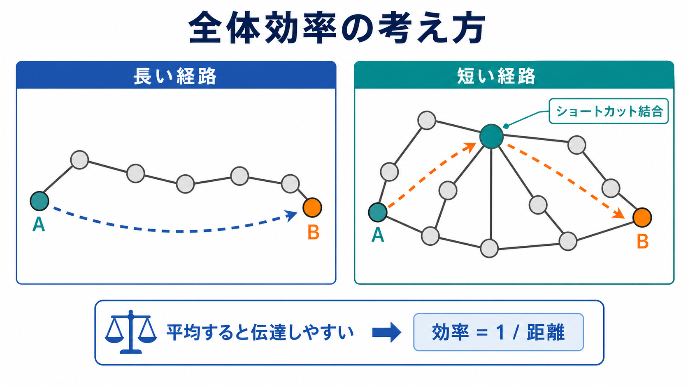
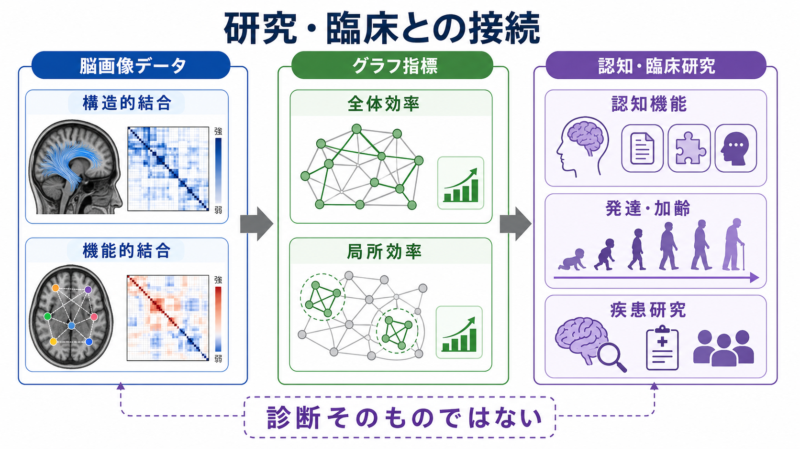

# ネットワーク効率とは何か

## 要点

- ネットワーク効率とは、脳領域どうしを結ぶネットワーク上で、情報がどれだけ短い経路で届きやすいかを表すグラフ理論の指標である。
- 全体効率は、離れたノード間の平均的な到達しやすさを測る。局所効率は、あるノードの近傍がどれだけ密に連携できるかを測る [1][2]。
- 脳では、高い効率だけでなく、配線コスト、代謝コスト、局所処理、モジュール性とのバランスが重要である [3][4][5]。
- 認知機能との関連は、知能、加齢、発達、疾患研究で報告されているが、ネットワーク効率は診断そのものではない [4][6][8]。
- 指標の値は、ノード分割、エッジ定義、重みづけ、しきい値、画像前処理に強く依存するため、単独の数値として読まず、解析条件とセットで読む必要がある [2]。

## この記事で答える問い

1. ネットワーク効率は、脳ネットワークの何を測っているのか。
2. 全体効率と局所効率は何が違うのか。
3. なぜネットワーク効率は認知機能と関係すると考えられるのか。
4. 研究・臨床でこの指標を読むとき、どこに注意すべきか。

## まず結論

ネットワーク効率は、「脳全体がどれだけ少ない中継で情報をやり取りできるか」を表す指標である。グラフ理論では、脳領域をノード、領域間の関係をエッジとして表し、任意の2ノード間の最短距離を調べる。距離が短いほど、情報は少ないステップで届きやすい。Latora と Marchiori は、この到達しやすさを距離の逆数として定式化し、ネットワークが全体として効率的か、局所的にも効率的かを測る枠組みを提案した [1]。

脳に応用すると、全体効率は離れた領域間の統合を、局所効率は近い領域内の分離処理や冗長性を反映しやすい。[[スモールワールドネットワークとは何か]]で扱うように、脳は局所的なまとまりを保ちながら、少数の長距離結合や[[ハブ領域とは何か|ハブ領域]]を通じて全体を結びつける構造をもつと考えられている [3][5][7]。

ただし、「効率が高いほどよい」とは言い切れない。遠距離結合を増やせば経路は短くなりやすいが、配線・維持・代謝のコストも増える。臨床研究でも、効率の低下や再編成は疾患群で報告されるが、それだけで個人の診断や治療方針を決められるわけではない [4][8]。

## 背景

脳は、単一の中枢が全情報を処理する装置ではなく、多数の領域が相互作用する分散システムである。視覚、記憶、注意、意思決定、運動制御は、それぞれ局所回路だけで完結せず、複数領域の連携として生じる。この見方では、[[脳内ネットワークとは何か]]で整理されるように、脳を「点と線」からなるネットワークとして扱う。

ここで重要になるのが、分離と統合の両立である。分離とは、局所モジュールが専門的な処理を行うことを指す。統合とは、離れたモジュールが必要に応じて情報を共有し、全体として一貫した認知や行動を作ることを指す。複雑脳ネットワーク研究では、この分離と統合を、クラスタリング、経路長、効率、モジュール性、中心性などの指標で測る [2][3]。

ネットワーク効率は、このうち「統合しやすさ」を特に直感的に表す。平均最短経路長も似た役割をもつが、ネットワークが完全に連結していない場合には距離が無限大になり、扱いにくい。効率は距離の逆数を使うため、つながっていないペアを 0 として扱いやすく、脳画像由来のネットワーク解析で広く使われる [1][2]。

## 基本概念

### ノードとエッジ

脳ネットワーク解析では、まず脳をノードとエッジに変換する。ノードは、脳領域、皮質区画、ボクセル、電極、神経細胞集団などである。エッジは、[[構造的結合と機能的結合は何が違うのか|構造的結合]]、[[構造的結合と機能的結合は何が違うのか|機能的結合]]、[[有効結合とは何か|有効結合]]などとして定義される。

構造的結合なら、拡散 MRI で推定される白質経路がエッジになりやすい。機能的結合なら、fMRI、EEG、MEG などで測った活動時系列の相関や同期性がエッジになりやすい。したがって、同じ「ネットワーク効率」という言葉でも、構造ネットワークの効率と機能ネットワークの効率は、測っている対象が異なる [2][3]。

### 距離と最短経路

グラフ上の距離とは、あるノードから別のノードへ移動するために必要なステップ数、または重みづけされたコストである。最短経路とは、2つのノードを結ぶ経路のうち、最も短いものを指す。

たとえば、A から B に行くのに 6 本のエッジをたどる必要があるネットワークより、2 本のエッジで届くネットワークのほうが、A と B の間の情報伝達は効率的だとみなされる。脳では、この「短さ」が、離れた領域間の素早い協調や統合処理のしやすさを表す近似指標として使われる。

### 全体効率

全体効率は、すべてのノードペアについて「距離の逆数」を平均したものである。直感的には、ネットワーク全体で任意の場所から任意の場所へどれだけ到達しやすいかを測る。

$$
E_{\mathrm{glob}} = \frac{1}{N(N-1)} \sum_{i \neq j} \frac{1}{d_{ij}}
$$

ここで $N$ はノード数、$d_{ij}$ はノード $i$ と $j$ の最短経路長である。$d_{ij}$ が短いほど $\frac{1}{d_{ij}}$ は大きくなる。つまり、ネットワーク内の多くのペアが短い経路で結ばれているほど、全体効率は高くなる [1][2]。

### 局所効率

局所効率は、あるノードの近傍ノードだけを取り出したサブネットワークが、どれだけ効率よく連携できるかを測る。直感的には、あるノードが一時的に使えなくなっても、その周囲が互いに連絡を取り合えるか、または局所モジュールがどれだけまとまって処理できるかを表す [1][2]。

脳では、局所効率は専門処理、冗長性、局所的な頑健性と関係づけて読まれることが多い。一方、全体効率は広域統合や長距離通信のしやすさと関係づけられる。ただし、どちらも直接に「神経信号の速度」を測っているわけではない。

## 仕組み

### ショートカット結合が全体効率を上げる

ネットワーク効率を理解する近道は、格子状ネットワークとランダムネットワークの中間を考えることである。格子状ネットワークは、近所どうしが密につながるため局所処理には向くが、遠いノードまで届くには多くの中継が必要になる。ランダムネットワークは遠くに届きやすいが、局所的なまとまりを失いやすい。

少数の長距離ショートカットをもつネットワークでは、局所的なまとまりを残しながら、平均経路長を大きく短縮できる。これは[[スモールワールドネットワークとは何か|スモールワールドネットワーク]]の基本的な考え方であり、脳ネットワークの効率性を説明する中心的な発想である [3][5]。

### ハブとリッチクラブ

全体効率は、単にエッジ数だけで決まるわけではない。どこにエッジがあるかが重要である。多くの経路が通る[[ハブ領域とは何か|ハブ領域]]や、ハブどうしが密に結ばれた[[リッチクラブ構造とは何か|リッチクラブ構造]]は、離れたモジュール間の統合を支え、ネットワーク全体の通信効率に大きく寄与すると考えられている [7]。

ただし、ハブは効率を高めるだけでなく、脆弱性も生む。重要なハブが損傷すると、局所損傷であっても広範なネットワーク機能に影響が広がる可能性がある。神経疾患のネットワーク研究では、このようなハブ過負荷やハブ障害の仮説が議論されている [8]。

### コストとのトレードオフ

効率を上げる最も単純な方法は、あらゆるノードを直接つなぐことである。しかし、脳でそれを行うには大量の白質配線、空間、代謝エネルギーが必要になる。したがって、実際の脳ネットワークは「できるだけ高い効率」と「できるだけ低いコスト」の間で折り合いをつけていると考えられる [3][4]。

Achard と Bullmore は、ヒトの機能的脳ネットワークが、比較的低い結合コストで高い全体効率と局所効率を示すこと、また加齢やドーパミン遮断によって効率が影響を受けることを報告した [4]。この研究は、ネットワーク効率を「脳の経済性」と結びつける代表的な研究である。

## 図解

図1は、ネットワーク効率を「短い経路」「全体効率」「局所効率」「認知機能との関係」としてまとめた概念地図である。脳全体の効率は、ひとつの領域だけではなく、複数の領域がどのような経路で結ばれるかに依存する。

図2は、長い経路しかないネットワークと、ショートカット結合をもつネットワークを比較している。少数のショートカットによって、A から B までの最短経路が短くなり、距離の逆数として表される効率が高くなる。

図3は、研究・臨床との接続を示す。脳画像データから構造的結合や機能的結合を推定し、そこから全体効率や局所効率を計算し、認知機能、発達、加齢、疾患研究と対応づける。ただし、図中のとおり、これは診断そのものではない。

## 臨床・研究との接続

### 認知機能との関係

ネットワーク効率が認知機能と関係すると考えられる理由は、認知課題の多くが複数領域の統合を必要とするからである。注意、作業記憶、推論、言語理解、意思決定では、感覚領域、前頭頭頂ネットワーク、[[中央実行ネットワークとは何か]]、[[デフォルトモードネットワークとは何か]]、[[サリエンスネットワークとは何か]]などが状況に応じて連携する。

Li らは、拡散テンソル画像から構築した構造的脳ネットワークにおいて、知能検査得点が高い群で全体効率が高く、IQ 得点と全体効率が相関することを報告した [6]。この結果は、情報伝達の効率性が高次認知の個人差と関連しうることを示す代表例である。

ただし、この種の研究は相関研究であり、「効率が高いから知能が高い」と単純に因果解釈できるわけではない。脳容量、発達歴、教育、測定法、解析パイプライン、サンプル特性などの交絡要因を慎重に扱う必要がある。

### 発達・加齢

発達と加齢では、脳ネットワークの効率とモジュール構造が変化する。発達では、局所的な結合の整理と長距離結合の成熟により、ネットワーク全体の統合性が変わる。加齢では、白質変化、神経血管応答、認知予備能、課題方略の変化が、ネットワーク効率の変化として観察されることがある [4][8]。

ここでも重要なのは、効率の変化を一方向に「良い・悪い」と読まないことである。課題や状態によっては、あるネットワークの効率低下が補償的な再編成と同時に起きる場合もある。全体効率、局所効率、モジュール性、ハブ性を組み合わせて読む必要がある。

### 疾患研究

神経疾患や精神疾患の研究では、認知症、てんかん、外傷性脳損傷、多発性硬化症、統合失調症などで、ネットワーク効率、ハブ、モジュール性、リッチクラブ構造の変化が検討されている [8]。これらの研究は、疾患を「局所病変」だけでなく「ネットワークの再編成」として理解する視点を与える。

しかし、ネットワーク効率は個別診断や治療指示に直結する指標ではない。教育・研究目的では有用だが、臨床判断には症状、病歴、神経心理検査、画像所見、神経生理、薬物・睡眠・運動などの情報を統合する必要がある。

## よくある誤解

### 誤解1: ネットワーク効率が高いほど、脳は常によい

高い全体効率は広域統合に有利だが、配線コストやノイズ拡散も増えうる。局所効率やモジュール性が低すぎると、専門処理や頑健性が弱くなる可能性もある。脳では、効率とコスト、分離と統合のバランスが重要である [3][4][5]。

### 誤解2: 全体効率は神経信号の伝導速度そのものである

全体効率は、グラフ上の最短経路から計算されるトポロジカルな指標である。軸索伝導速度、シナプス遅延、神経振動の位相同期、血流応答などを直接測るわけではない。[[髄鞘はなぜ神経伝導を速くするのか]]で扱う伝導速度とは、説明レベルが異なる。

### 誤解3: 機能的結合の効率は、白質配線の効率と同じである

機能的結合は活動の統計的関連であり、構造的結合は解剖学的経路である。両者は関係するが、同じではない。機能的結合には共通入力、間接経路、状態依存性、前処理の影響が含まれる [2][3]。

### 誤解4: ネットワーク効率だけで認知機能や疾患を説明できる

認知機能は、ネットワーク効率だけでなく、領域固有の処理、神経伝達物質、可塑性、課題方略、身体状態、環境、学習歴に依存する。ネットワーク効率は有用な集約指標だが、脳や症状を単独で説明するものではない。

## 関連ノート

- [[脳内ネットワークとは何か]]
- [[スモールワールドネットワークとは何か]]
- [[構造的結合と機能的結合は何が違うのか]]
- [[有効結合とは何か]]
- [[ハブ領域とは何か]]
- [[リッチクラブ構造とは何か]]
- [[局所回路と長距離結合は何が違うのか]]
- [[中央実行ネットワークとは何か]]
- [[デフォルトモードネットワークとは何か]]
- [[サリエンスネットワークとは何か]]

関連ノート候補:

- グラフ理論で脳をどう読むか
- モジュール性とは何か
- 平均経路長とは何か
- ネットワーク頑健性とは何か
- コネクトームとは何か

MOC 更新候補:

- `content/00_MOC/MOC・脳・神経科学.md`
- `content/00_MOC/MOC・数理モデル・計算論.md`

並列実行時の衝突を避けるため、このジョブでは MOC 本体は更新しない。

## 理解チェック

1. 全体効率は、最短経路長とどのような関係にあるか。
2. 局所効率が高いネットワークでは、どのような処理や頑健性が期待されるか。
3. 長距離結合は全体効率を高めうるが、なぜ無制限に増やせないのか。
4. 構造的結合ネットワークの効率と機能的結合ネットワークの効率を同じものとして読めない理由は何か。
5. ネットワーク効率を臨床研究で使うとき、なぜ単独の診断指標として扱いにくいのか。

## 参考文献

[1] Latora, V., & Marchiori, M. (2001). Efficient behavior of small-world networks. *Physical Review Letters, 87*(19), 198701. https://doi.org/10.1103/PhysRevLett.87.198701

[2] Rubinov, M., & Sporns, O. (2010). Complex network measures of brain connectivity: Uses and interpretations. *NeuroImage, 52*(3), 1059-1069. https://doi.org/10.1016/j.neuroimage.2009.10.003

[3] Bullmore, E., & Sporns, O. (2009). Complex brain networks: Graph theoretical analysis of structural and functional systems. *Nature Reviews Neuroscience, 10*, 186-198. https://doi.org/10.1038/nrn2575

[4] Achard, S., & Bullmore, E. (2007). Efficiency and cost of economical brain functional networks. *PLoS Computational Biology, 3*(2), e17. https://doi.org/10.1371/journal.pcbi.0030017

[5] Bassett, D. S., & Bullmore, E. T. (2017). Small-world brain networks revisited. *The Neuroscientist, 23*(5), 499-516. https://doi.org/10.1177/1073858416667720

[6] Li, Y., Liu, Y., Li, J., Qin, W., Li, K., Yu, C., & Jiang, T. (2009). Brain anatomical network and intelligence. *PLoS Computational Biology, 5*(5), e1000395. https://doi.org/10.1371/journal.pcbi.1000395

[7] van den Heuvel, M. P., & Sporns, O. (2011). Rich-club organization of the human connectome. *The Journal of Neuroscience, 31*(44), 15775-15786. https://doi.org/10.1523/JNEUROSCI.3539-11.2011

[8] Stam, C. J. (2014). Modern network science of neurological disorders. *Nature Reviews Neuroscience, 15*, 683-695. https://doi.org/10.1038/nrn3801

## 未解決問題

- ネットワーク効率の個人差が、どの程度まで認知機能の個人差を予測できるのか。
- 構造的効率、機能的効率、有効結合の効率を、同じ解析枠組みでどのように統合できるのか。
- 発達、加齢、疾患で見られる効率変化のうち、原因、結果、補償をどのように区別できるのか。
- ノード分割や前処理に依存しにくい、再現性の高い効率指標をどう設計するか。

## 更新ログ

- 2026-04-27: 初稿作成。ネットワーク効率の定義、全体効率・局所効率、認知機能との関係、研究・臨床上の注意点、図解、参考文献を整理。
