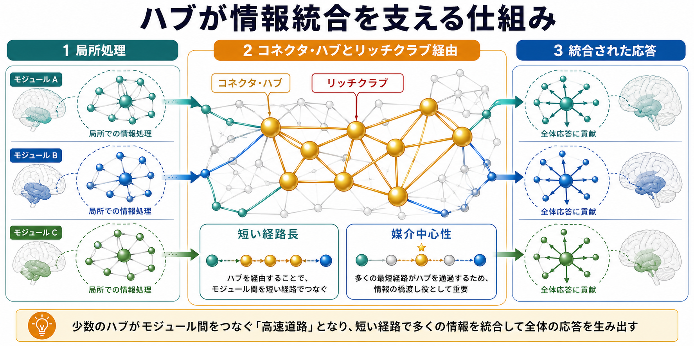
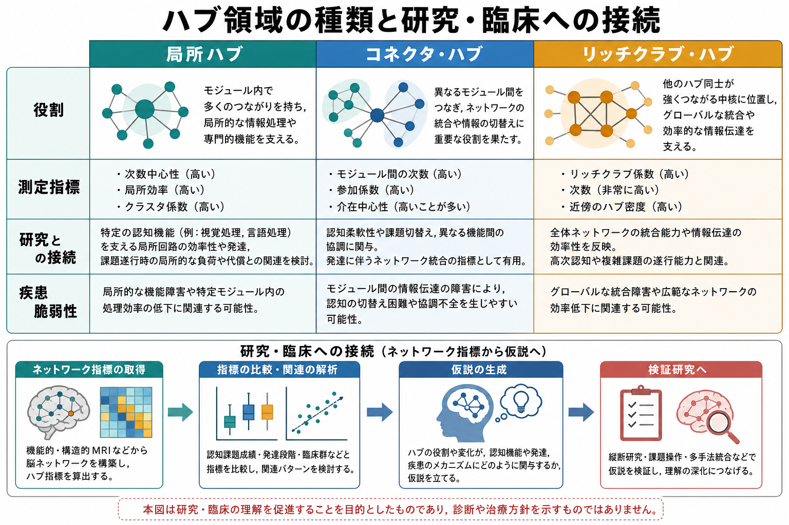

# ハブ領域とは何か

## 要点

- ハブ領域とは、脳ネットワークの中で多くの結合、重要な経路、または複数モジュールをつなぐ位置をもつ領域である。
- 「結合が多い領域」だけでなく、「短い経路を作る」「モジュール間を橋渡しする」「高コストだが高容量の通信を支える」領域として理解するとよい[1][2]。
- ハブは情報統合を助ける一方、損傷・発達変化・疾患関連変化の影響がネットワーク全体へ広がりやすい点でも重要である[4][7]。
- ハブは単一の脳部位名ではなく、構造的結合、機能的結合、解析尺度、課題状態、年齢、疾患群によって同定結果が変わるネットワーク上の性質である[1][3]。

## この記事で答える問い

1. 脳ネットワークで「ハブ」とは何を指すのか。
2. 次数中心性、媒介中心性、参加係数などの指標は何を見ているのか。
3. ハブ領域は、なぜ情報統合や高次認知に関係すると考えられるのか。
4. ハブの研究は、発達、認知、精神神経疾患研究にどう接続するのか。

## まず結論

ハブ領域は、脳の中で「たくさん線が集まる場所」というだけではない。局所的な処理単位であるモジュールをまたいで情報を通し、離れた領域間の通信を短い経路でつなぐ、ネットワーク上の交通結節点である。したがって、ハブは[[ニューロンとは何か|ニューロン]]や[[シナプスとは何か|シナプス]]の局所機構だけでは説明しにくい、脳全体の統合的な働きを理解するための概念である[1][2]。

ただし、ハブは「ここだけが重要」という意味ではない。脳は分散処理を行うため、ハブは専門処理を行う局所回路、広域の結合、課題状態、発達段階の中で相対的に定義される。重要なのは、ハブ領域を固定的な場所のリストとして覚えることではなく、どのネットワークで、どの指標により、どの機能的問いに対してハブと呼んでいるのかを確認することである[3][4]。

## 背景

脳は、個々の領域が独立に働く装置ではなく、多数の領域が結合した複雑ネットワークとして理解できる。構造的結合は白質線維などの解剖学的なつながりを、機能的結合は活動の時間的な共変動を、実効的結合は一方の活動が他方へ及ぼす方向性を含む影響を扱う。これらをグラフとして表すと、脳領域はノード、領域間の結合はエッジになる[2][3]。

この見方が重要なのは、脳が「局所分化」と「全体統合」を同時に行う必要があるからである。視覚、聴覚、運動、記憶、注意などはある程度分かれた回路で処理されるが、実際の行動ではそれらを組み合わせる必要がある。ハブ領域は、この局所処理と全体統合の両立を支える候補として研究されてきた[1][2]。

## 基本概念

### ハブ領域の定義

ハブ領域とは、ネットワーク上で相対的に中心的な位置を占める脳領域である。典型的には、次のような性質を持つ領域がハブと呼ばれる。

| 観点 | 代表的な指標 | 何を意味するか |
|---|---|---|
| 結合が多い | 次数中心性、強度 | 多くの領域と直接つながる |
| 経路上で重要 | 媒介中心性 | 領域間通信の通過点になりやすい |
| 複数モジュールをつなぐ | 参加係数 | 異なる機能モジュールを橋渡しする |
| 近くに到達しやすい | 近接中心性、効率 | 他領域へ短い経路で届きやすい |
| ハブ同士が強く結合する | リッチクラブ係数 | 高次数ノード同士が密に結びつく |

ハブは測定尺度に依存する。例えば、局所モジュール内で結合が多い領域は「局所ハブ」として重要だが、複数モジュールをつなぐ「コネクタ・ハブ」とは役割が異なる。さらに、高次数のハブ同士が互いに密に結合する場合、その中核構造はリッチクラブと呼ばれる[5][6]。

### 局所ハブ、コネクタ・ハブ、リッチクラブ

局所ハブは、特定のモジュール内で情報処理を効率化する。例えば、感覚処理や運動処理のように比較的専門化したネットワーク内で、局所的な情報統合を助けると考えられる。

コネクタ・ハブは、複数のモジュールをまたいで結合する。課題の切り替え、注意、記憶、意思決定のように、複数機能を同時に組み合わせる場面では、コネクタ・ハブの役割が特に重要になる[1][4]。

リッチクラブは、ハブ同士が互いに密に結合した高コスト・高容量の中核である。白質配線コストは大きいが、全脳的な通信効率を高める「バックボーン」として働く可能性が示されている[5][6]。

## 仕組み

### 1. 短い経路を作る

ネットワークの中でハブがあると、離れたモジュール同士が少ないステップでつながりやすくなる。これは小世界性と関係する。小世界ネットワークでは、局所的にはまとまりがありながら、全体としては短い経路で通信できる。脳ネットワークはこのような局所分化と全体統合のバランスを持つと考えられている[2][3]。

### 2. モジュール間の橋渡しをする

脳の処理はモジュール化されている。視覚、聴覚、運動、注意、記憶などのネットワークが完全に混ざっているわけではない。しかし複雑な行動では、これらを組み合わせる必要がある。参加係数の高いハブは、特定モジュールに閉じず、複数モジュールにまたがる結合を持つため、情報の切り替えや統合に関わる候補になる[1][4]。

### 3. 高コストだが高容量の通信路になる

長距離白質線維や高次数ハブの維持には、空間、代謝、発達上のコストがかかる。それでも脳がそのような結合を持つのは、全体の通信効率を高める利点があるためだと考えられる。リッチクラブ研究は、高次数領域同士が互いに結合し、全脳的な情報伝達を支える中核を形成する可能性を示している[5][6]。

### 4. 影響が広がりやすい

ハブは多くの経路に関わるため、そこに障害や機能低下があると、局所的な影響にとどまらずネットワーク全体へ波及しやすい。Crossleyらは、ヒト・コネクトームのハブが解剖、機能、疾患関連の複数側面で重要であることを示し、ハブが疾患脆弱性の研究対象になりうると論じている[7]。ただし、これは個人の診断や治療方針をハブ指標だけで決められるという意味ではない。

## 図解

上の図は、局所モジュールで処理された情報が、コネクタ・ハブやリッチクラブを経由して全体的な応答へ統合される流れを示している。ハブは「信号を集める点」ではなく、複数モジュールを短い経路でつなぐ構造として理解するとよい。

この図は、リッチクラブ結合、フィーダー結合、ローカル結合の違いを整理したものである。リッチクラブ結合は通信容量が高い一方で配線コストも高く、障害時の影響が広がりやすい可能性がある[5][6]。

この図は、局所ハブ、コネクタ・ハブ、リッチクラブ・ハブを比較し、ネットワーク指標が研究仮説へ接続される流れを示している。図中の臨床接続は研究上の理解を深めるためのものであり、単独の診断マーカーとして使えることを意味しない。

## 臨床・研究との接続

### 認知研究

ハブ領域は、注意、作業記憶、課題切り替え、複数感覚の統合など、高次認知を支えるネットワークの候補として研究される。例えば、課題中に複数の機能ネットワークを協調させるには、単に一つの感覚領域が活動するだけでなく、領域間の結合様式が変化する必要がある。ハブ指標は、その協調のしやすさや脳全体の効率を定量化する道具になる[1][3]。

この点は、[[アセチルコリンは注意や記憶にどう関わるのか|注意や記憶]]、[[ドパミンは報酬だけの物質なのか|報酬学習]]、[[GABAは脳で何をしているのか|興奮と抑制のバランス]]のような局所・広域調節の話とも接続する。神経修飾系や抑制性回路は、ネットワークのどの経路が使われやすいかを変えるため、ハブの機能的役割にも影響しうる。

### 発達研究

発達の中で、脳ネットワークは局所的な結合だけでなく長距離結合やモジュール間結合も変化する。ハブやリッチクラブの形成は、認知機能の成熟、学習、環境への適応と関連して研究される。これは[[神経可塑性は発達と学習をどう支えるのか|神経可塑性]]の全脳ネットワーク版として理解できる。

### 精神神経疾患研究

ハブは、統合失調症、うつ病、アルツハイマー病、外傷性脳損傷などの研究で注目されることがある。理由は、ハブの変化が広域ネットワークの効率、モジュール間通信、認知症状と関連する可能性があるためである[7]。ただし、脳ネットワーク指標は集団比較や仮説生成に有用な研究指標であり、個人の診断を単独で決めるものではない。

## よくある誤解

### 誤解1: ハブ領域は「一番大事な脳部位」のこと

ハブは重要だが、脳の働きはハブだけで完結しない。局所モジュールが専門処理を担い、ハブがそれらを統合しやすくする。ハブだけを取り出して「ここが司令塔」と考えると、分散処理としての脳ネットワークを見落とす。

### 誤解2: 結合数が多ければ必ずハブである

次数中心性は重要な指標だが、それだけでハブの役割は決まらない。モジュール内で結合が多い領域と、モジュール間を橋渡しする領域では意味が違う。目的に応じて、媒介中心性、参加係数、リッチクラブ係数などを組み合わせて読む必要がある[3]。

### 誤解3: ハブは常に同じ場所にある

構造的結合のハブと機能的結合のハブは一致することもあるが、完全に同じではない。さらに、安静時、課題中、発達段階、疾患群、解析単位の取り方によって、ハブとして同定される領域は変わりうる[1][4]。

### 誤解4: ハブ指標が高ければ臨床診断に使える

ハブ指標は、脳ネットワークの理解や研究仮説の生成には有用である。しかし、個人の診断や治療方針は、症状、経過、検査、生活背景、他の医学的評価を含む総合判断で扱う必要がある。ネットワーク指標を臨床的に読む場合も、教育・研究目的の知見として慎重に解釈する。

## 限界と未解決問題

- 脳領域をどの粒度でノード化するかによって、ハブの同定結果が変わる。
- 構造的結合、機能的結合、実効的結合のどれを使うかで、ハブの意味が変わる。
- fMRI、拡散MRI、電気生理など、測定手法ごとの時間・空間分解能の違いがある。
- ハブが「原因」として認知や疾患に影響するのか、それとも変化の結果として観察されるのかは、多くの場合まだ慎重に検討する必要がある。
- 個人差をどの程度まで安定して推定できるかは、臨床応用に向けた重要課題である。

## 関連ノート

- [[ニューロンとは何か]]
- [[シナプスとは何か]]
- [[神経可塑性は発達と学習をどう支えるのか]]
- [[アセチルコリンは注意や記憶にどう関わるのか]]
- [[GABAは脳で何をしているのか]]
- [[ドパミンは報酬だけの物質なのか]]

### 関連ノート候補

- コネクトームとは何か
- 小世界ネットワークとは何か
- リッチクラブとは何か
- 機能的結合と構造的結合の違い
- グラフ理論で脳を読む

### MOC更新候補

- `content/00_MOC/MOC｜脳・神経科学.md` の「大規模脳ネットワーク」または「神経回路・脳ネットワーク」配下に、本記事へのリンクを追加する候補。

## 理解チェック

1. ハブ領域を「結合数が多い領域」とだけ説明すると、何が抜け落ちるか。
2. 局所ハブとコネクタ・ハブは、どのように役割が違うか。
3. リッチクラブはなぜ高コストでありながら重要だと考えられるのか。
4. ハブ指標を臨床研究で使うとき、なぜ個人診断と混同してはいけないのか。

## 参考文献

[1] van den Heuvel, M. P., & Sporns, O. (2013). Network hubs in the human brain. *Trends in Cognitive Sciences*, 17(12), 683-696. https://doi.org/10.1016/j.tics.2013.09.012

[2] Bullmore, E., & Sporns, O. (2009). Complex brain networks: graph theoretical analysis of structural and functional systems. *Nature Reviews Neuroscience*, 10, 186-198. https://doi.org/10.1038/nrn2575

[3] Rubinov, M., & Sporns, O. (2010). Complex network measures of brain connectivity: uses and interpretations. *NeuroImage*, 52(3), 1059-1069. https://doi.org/10.1016/j.neuroimage.2009.10.003

[4] Sporns, O., Honey, C. J., & Kötter, R. (2007). Identification and classification of hubs in brain networks. *PLoS ONE*, 2(10), e1049. https://doi.org/10.1371/journal.pone.0001049

[5] van den Heuvel, M. P., & Sporns, O. (2011). Rich-club organization of the human connectome. *Journal of Neuroscience*, 31(44), 15775-15786. https://doi.org/10.1523/JNEUROSCI.3539-11.2011

[6] van den Heuvel, M. P., Kahn, R. S., Goñi, J., & Sporns, O. (2012). High-cost, high-capacity backbone for global brain communication. *Proceedings of the National Academy of Sciences*, 109(28), 11372-11377. https://doi.org/10.1073/pnas.1203593109

[7] Crossley, N. A., Mechelli, A., Scott, J., Carletti, F., Fox, P. T., McGuire, P., & Bullmore, E. T. (2014). The hubs of the human connectome are generally implicated in the anatomy of brain disorders. *Brain*, 137(8), 2382-2395. https://doi.org/10.1093/brain/awu132

[8] Hagmann, P., Cammoun, L., Gigandet, X., Meuli, R., Honey, C. J., Wedeen, V. J., & Sporns, O. (2008). Mapping the structural core of human cerebral cortex. *PLoS Biology*, 6(7), e159. https://doi.org/10.1371/journal.pbio.0060159
