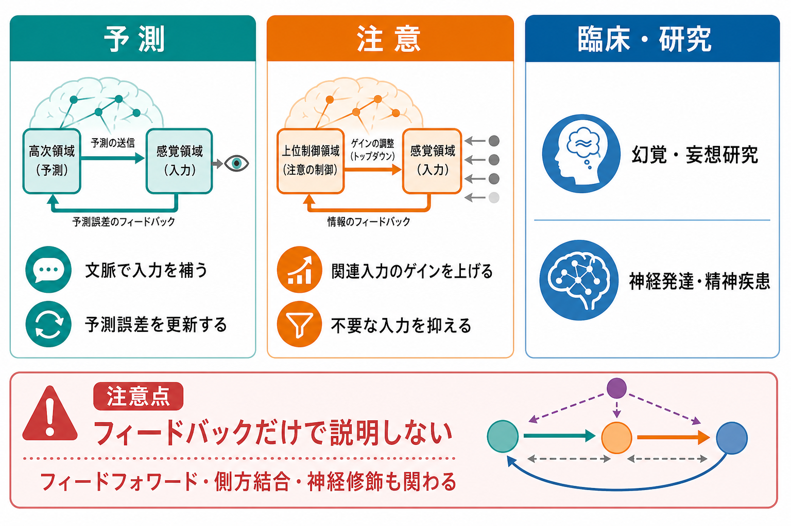
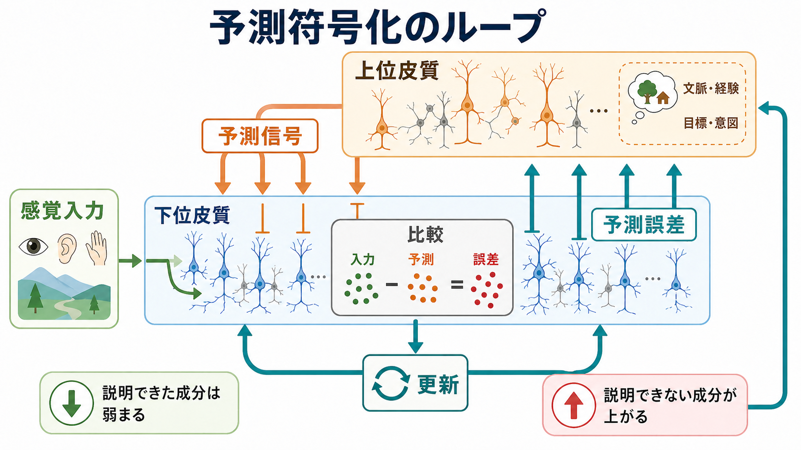

# フィードバック回路は脳内情報処理をどう調節するのか

## 要点

- フィードバック回路とは、上位の皮質領域や連合領域から、下位の感覚領域・局所回路へ戻る結合を含む回路である。
- 脳の情報処理は、入力が下から上へ一方向に流れるだけではない。上位領域は、文脈、目標、期待、過去経験に基づいて下位領域の処理を調節する[1][2]。
- 予測符号化では、上位領域からのフィードバックは「予測」を送り、下位領域からのフィードフォワード信号は「予測誤差」を上げるものとして整理される[3][4][5]。
- 注意は、すべての入力を均等に強めるのではなく、課題に関係する入力のゲインや精度を高め、不要な入力の影響を相対的に下げる働きとして理解できる[6][7]。
- 臨床・研究との接続は重要だが、個別の症状を「フィードバック異常」だけで説明するのは過度な単純化である。フィードフォワード入力、側方結合、抑制性回路、神経修飾、発達、課題文脈を合わせて考える必要がある[5][8]。

## この記事で答える問い

この記事では、次の問いに答える。

1. フィードバック回路は、フィードフォワード回路と何が違うのか。
2. 上位領域から下位領域へ戻る信号は、予測と予測誤差にどう関わるのか。
3. 注意は、フィードバック回路を通じて入力処理をどう変えるのか。
4. 臨床・研究でこの概念を使うとき、どこに注意すべきか。

## まず結論

フィードバック回路は、脳の情報処理を「入ってきた刺激への受動的反応」から、「文脈と目的に応じた能動的な解釈」へ変える仕組みである。感覚入力は、網膜、視床、一次感覚野、高次感覚野、連合野へとおおむね下から上へ伝わる。一方で、皮質階層には上位から下位へ戻る結合も豊富にあり、下位領域の活動をあらかじめ準備したり、入力の解釈を絞ったり、誤差に応じて予測を更新したりする[1][2]。

たとえば視覚では、線や色のような局所特徴だけでなく、物体、場面、課題、期待が知覚に影響する。これは「脳が勝手に見たいものを見る」という意味ではない。むしろ、曖昧でノイズを含む入力を、過去経験や現在の目的と照合しながら効率よく処理するために、上位領域が下位領域の処理条件を変えるということである[6][7]。

## 背景

古典的には、感覚処理は入力が低次から高次へ積み上がる階層として説明されてきた。Felleman と Van Essen は、霊長類大脳皮質の多数の領域間結合を整理し、視覚皮質を含む広い皮質ネットワークが階層的かつ再帰的に結びつくことを示した[1]。この見方では、低次領域は単純な特徴を処理し、高次領域はより複雑な特徴や文脈を扱う。

しかし実際の皮質回路は、一方向のパイプラインではない。高次領域から低次領域へ戻る結合、同じ階層内の側方結合、局所の[[介在ニューロンは神経回路で何をしているのか|介在ニューロン]]による抑制、[[アセチルコリンは注意や記憶にどう関わるのか|アセチルコリン]]などの神経修飾が組み合わさっている。Lamme と Roelfsema は、視覚処理には速いフィードフォワード処理だけでなく、再帰処理が関わり、意識的知覚、注意、図地分離などに重要だと論じた[2]。

## 基本概念

### フィードフォワードとフィードバック

フィードフォワード信号は、下位から上位へ進む信号である。感覚入力、局所特徴、予測誤差、課題に関連する新しい情報が、この方向で上がると考えられる。視覚でいえば、網膜から視床、一次視覚野、より高次の視覚領域へ進む流れが典型である。

フィードバック信号は、上位から下位へ戻る信号である。これは、下位領域を単に「命令」するものではない。上位領域が持つ文脈、目標、期待、行動方針をもとに、下位領域の入力選択、発火しやすさ、同期、抑制のかかり方を調節する信号として理解するとよい[5][6]。

### 再帰処理

再帰処理とは、同じ情報が一度だけ流れて終わるのではなく、複数の領域や局所回路を何度も行き来しながら処理されることを指す。[[シナプスとは何か|シナプス]]入力が[[活動電位はどのように発生するのか|活動電位]]へ変換される局所過程だけでなく、領域間の往復によって知覚や行動選択が整えられる。

この再帰性があるため、脳は同じ刺激に対しても、課題、注意、期待、疲労、情動、学習経験によって異なる応答を示す。同じ音でも、名前を呼ばれたときには目立ち、背景雑音として聞いているときには目立たない。これは、入力そのものだけでなく、その入力を処理する回路状態が変わるからである。

### 予測符号化

予測符号化は、脳が下位入力をただ受け取るのではなく、上位モデルから予測を送り、入力と予測の差である予測誤差を使ってモデルを更新するという枠組みである[3][4]。この枠組みでは、フィードバック信号は予測を運び、フィードフォワード信号は予測誤差を運ぶものとして扱われることが多い[5]。

重要なのは、予測が「思い込み」と同義ではないことである。予測は、入力を効率よく解釈するための仮説である。入力が予測どおりなら、説明済みの成分は弱まりやすい。予測と入力がずれれば、そのずれが予測誤差として上位へ送られ、次の解釈や行動の更新につながる[3][4]。

## 仕組み

### 1. 予測を下位領域へ送る

上位領域は、現在の文脈や課題に基づいて「次に来そうな入力」を下位領域へ送る。たとえば、暗い部屋で人の顔を探しているとき、視覚系は顔らしい配置や輪郭に敏感になりやすい。これは、[[ニューロンとは何か|ニューロン]]が物理的に別のものへ変わるというより、既存の回路の重みづけやゲインが変わるということである。

Rao と Ballard の古典的モデルは、視覚皮質で上位からの予測と下位からの誤差信号が相互作用する計算原理を示した[3]。その後、Friston はこの考えを、皮質応答を説明する一般的な理論として拡張した[4]。現在でも予測符号化は議論中の枠組みだが、フィードバック回路を理解する強力な入口になる。

### 2. 予測誤差で上位モデルを更新する

予測が入力を十分に説明できないとき、下位領域では予測誤差が残る。この誤差は、上位領域へ送られてモデル更新の材料になる。たとえば、見慣れた廊下にいつもと違う物体が置かれていると、背景は予測で説明されやすいが、違いのある部分が目立つ。これは、すべての入力を同じ強度で処理するより効率的である。

ただし、実際の神経活動を「予測ニューロン」と「誤差ニューロン」に単純に分けられるわけではない。Bastos らは、皮質の層構造、興奮性・抑制性回路、フィードフォワード・フィードバック結合を組み合わせた標準微小回路として予測符号化を整理した[5]。この見方は有用だが、どの細胞型・層・周波数帯がどの計算量を担うかは、領域や課題に依存する。

### 3. 注意によってゲインと精度を変える

注意は、フィードバック回路の代表的な働きである。注意を向けた刺激は、同じ物理入力でも神経応答が強くなったり、背景ノイズから分離されやすくなったりする。Gilbert と Li は、トップダウン影響が視覚処理を、文脈、注意、課題要求に応じて変えることを整理している[6]。

予測処理の言葉では、注意は「予測誤差の精度」を変える働きとして説明されることがある[7]。つまり、どの誤差を信頼すべきか、どの入力を学習や行動に反映すべきかを調節する。これにより、重要な入力の影響は強まり、無関係な入力の影響は相対的に弱まる。

### 4. 皮質層と周波数で方向性を分ける

皮質の結合は、どの層から出てどの層へ入るかによって、おおまかにフィードフォワード的かフィードバック的かを推定できる。典型的には、フィードフォワード結合は中間層へ入りやすく、フィードバック結合は表層・深層へ広がりやすい[1][5]。

また、領域間の情報流には周波数帯の違いも関わる。Bastos らの研究は、視覚皮質でフィードフォワード方向にはガンマ帯、フィードバック方向にはアルファ・ベータ帯が相対的に関わることを示し、方向性のある情報伝達を周波数チャネルとして捉える見方を強めた[8]。ただし、帯域名だけから心理状態や疾患を直接診断することはできない。

## 図解

図1は、フィードバック回路を予測、注意、臨床・研究への接続として整理したものである。フィードバックは、入力を補う、誤差を更新する、関連入力のゲインを上げる、不要な入力を抑える、といった複数の働きを持つ。

図2は、予測符号化のループを示している。上位皮質から下位皮質へ予測信号が戻り、下位皮質では感覚入力と予測が比較される。説明できない成分は予測誤差として上位へ送られ、次の予測が更新される。

## 臨床・研究との接続

フィードバック回路は、幻覚、妄想、注意障害、神経発達症、統合失調症、自閉スペクトラム症、うつ病などの研究でしばしば参照される。たとえば、予測が強すぎる、感覚誤差の精度づけが不安定である、上位文脈が下位入力を適切に調節できない、といった仮説が検討される。

ただし、ここで注意すべきなのは、これらが診断基準や治療指示ではないという点である。精神症状や認知特性は、多数の神経回路、発達、環境、身体状態、薬理、学習歴が関わる現象であり、単一のフィードバック回路だけで決まるものではない。本記事の内容は教育・研究目的の整理であり、個別の診断や治療判断を目的としない。

研究方法としては、fMRI、MEG/EEG、皮質電位記録、層特異的記録、神経刺激、光遺伝学、計算モデルなどが使われる。特に、予測、注意、誤差修正を同じ課題内で分けて測る設計が重要である。単に「活動が増えた・減った」だけでは、フィードバック、フィードフォワード、側方結合、神経修飾のどれが効いているかを区別しにくい。

## よくある誤解

### 誤解1: フィードバックは高次領域が低次領域を支配する仕組みである

フィードバックは一方的な支配ではない。下位領域からの入力や予測誤差がなければ、上位領域の予測は更新されない。知覚や行動は、フィードフォワード信号とフィードバック信号の相互作用で成り立つ。

### 誤解2: 予測は現実を歪めるだけである

予測は、曖昧でノイズを含む入力を効率よく処理するために必要である。問題になるのは、予測が強すぎる、誤差が過小評価される、逆に誤差が過大評価されるなど、予測と誤差のバランスが崩れる場合である[4][7]。

### 誤解3: 注意は入力を強くするだけである

注意は単なる増幅ではない。関連する入力のゲインを上げる一方で、不要な入力の影響を下げ、どの誤差を信頼するかを変える。したがって、注意は「信号の音量」だけでなく、「どの信号を学習や行動に使うか」を変える働きとして理解する必要がある[6][7]。

### 誤解4: 脳波の帯域名だけでフィードバック異常がわかる

アルファ、ベータ、ガンマなどの帯域は有用な指標だが、帯域名だけで情報の方向、心理状態、疾患を直接決められるわけではない。課題、記録部位、解析方法、個体差、発達段階を合わせて解釈する必要がある[8]。

## 関連ノート

- [[ニューロンとは何か]]
- [[シナプスとは何か]]
- [[シナプス可塑性とは何か]]
- [[神経可塑性は発達と学習をどう支えるのか]]
- [[介在ニューロンは神経回路で何をしているのか]]
- [[GABAは脳で何をしているのか]]
- [[グルタミン酸は脳で何をしているのか]]
- [[アセチルコリンは注意や記憶にどう関わるのか]]
- [[活動電位はどのように発生するのか]]

今後の作成候補: 「フィードフォワード回路は何をしているのか」「予測符号化とは何か」「トップダウン注意とは何か」「皮質階層とは何か」「脳波の周波数帯は何を意味するのか」。

MOC更新候補: `content/00_MOC/MOC｜脳・神経科学.md` と `content/00_MOC/MOC｜基礎神経科学.md` に、本記事へのリンクを追加する。並列ジョブとの競合を避けるため、今回はMOC本体は更新しない。

## 理解チェック

1. フィードフォワード信号とフィードバック信号の違いを、情報の方向と機能の両方から説明できるか。
2. 予測符号化において、「予測」と「予測誤差」はどの方向へ流れると考えられるか。
3. 注意が「入力を強める」だけでなく「精度やゲインを調節する」と言える理由を説明できるか。
4. フィードバック回路を臨床研究に使うとき、なぜ単一原因として断定してはいけないのか。

## 参考文献

[1] Felleman, D. J., & Van Essen, D. C. (1991). Distributed hierarchical processing in the primate cerebral cortex. *Cerebral Cortex, 1*(1), 1-47. https://doi.org/10.1093/cercor/1.1.1-a

[2] Lamme, V. A. F., & Roelfsema, P. R. (2000). The distinct modes of vision offered by feedforward and recurrent processing. *Trends in Neurosciences, 23*(11), 571-579. https://doi.org/10.1016/S0166-2236(00)01657-X

[3] Rao, R. P. N., & Ballard, D. H. (1999). Predictive coding in the visual cortex: a functional interpretation of some extra-classical receptive-field effects. *Nature Neuroscience, 2*, 79-87. https://doi.org/10.1038/4580

[4] Friston, K. (2005). A theory of cortical responses. *Philosophical Transactions of the Royal Society B: Biological Sciences, 360*(1456), 815-836. https://doi.org/10.1098/rstb.2005.1622

[5] Bastos, A. M., Usrey, W. M., Adams, R. A., Mangun, G. R., Fries, P., & Friston, K. J. (2012). Canonical microcircuits for predictive coding. *Neuron, 76*(4), 695-711. https://doi.org/10.1016/j.neuron.2012.10.038

[6] Gilbert, C. D., & Li, W. (2013). Top-down influences on visual processing. *Nature Reviews Neuroscience, 14*, 350-363. https://doi.org/10.1038/nrn3476

[7] Summerfield, C., & de Lange, F. P. (2014). Expectation in perceptual decision making: neural and computational mechanisms. *Nature Reviews Neuroscience, 15*, 745-756. https://doi.org/10.1038/nrn3838

[8] Bastos, A. M., Vezoli, J., Bosman, C. A., Schoffelen, J.-M., Oostenveld, R., Dowdall, J. R., De Weerd, P., Kennedy, H., & Fries, P. (2015). Visual areas exert feedforward and feedback influences through distinct frequency channels. *Neuron, 85*(2), 390-401. https://doi.org/10.1016/j.neuron.2014.12.018

## 未解決問題

- 予測、注意、行動目標が、同じフィードバック結合上でどのように分離または統合されるのか。
- 皮質層、細胞型、周波数帯の対応が、どの程度領域や課題を超えて一般化できるのか。
- 精神疾患研究でいう「予測の異常」や「精度づけの異常」を、個人差、薬理、発達、環境要因からどう切り分けるのか。
- 実験課題で観察されるフィードバック調節が、日常的な知覚や社会的相互作用にどこまで外挿できるのか。

## 更新ログ

- 2026-04-27: 初稿作成。フィードバック回路、予測符号化、注意、臨床・研究との接続を中心に整理。
