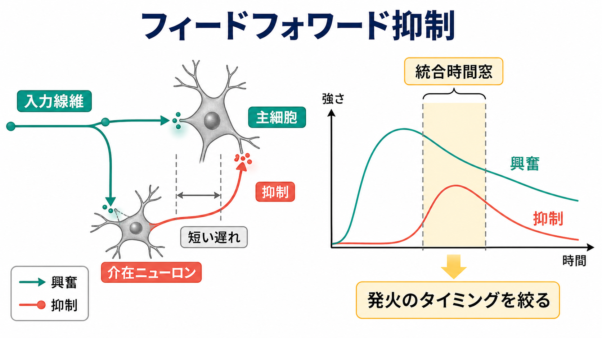
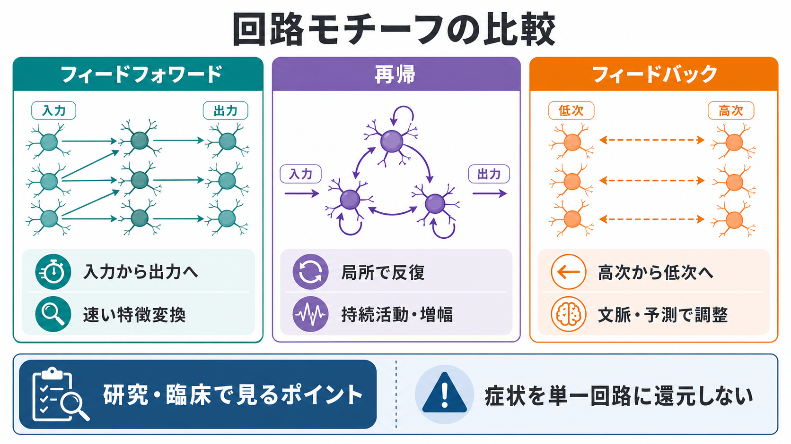

# フィードフォワード回路はどのように情報を処理するのか

## 要点

- フィードフォワード回路とは、情報が入力側から出力側へ、主に一方向に伝わる回路モチーフである。感覚系では、視床から一次感覚野、さらに高次皮質へ進む流れとして考えやすい[1][2]。
- 一方向に流れるだけでなく、各段階で[[シナプスとは何か|シナプス]]結合、[[興奮性ニューロンと抑制性ニューロンは何が違うのか|興奮と抑制]]、[[ニューロンは複数の入力をどのように統合するのか|入力統合]]によって、刺激の表現が変換される[3][4]。
- フィードフォワード抑制では、同じ入力が主細胞と[[介在ニューロンは神経回路で何をしているのか|介在ニューロン]]をほぼ同時に駆動し、少し遅れた抑制によって発火できる時間窓を狭める[5][6]。
- 実際の脳は純粋な一方向回路だけで動くわけではない。再帰結合、側方結合、フィードバック、神経修飾が重なり、フィードフォワード処理はその中の初期・高速成分として働く[7][8]。

## この記事で答える問い

1. フィードフォワード回路とは、神経回路の中で何を意味するのか。
2. 感覚入力は、なぜ段階を進むたびに別の表現へ変わるのか。
3. フィードフォワード抑制は、単に活動を弱めるだけでなく、どのように情報処理を助けるのか。
4. フィードフォワード、再帰、フィードバックをどう区別すればよいのか。

## まず結論

フィードフォワード回路は、「入力をそのまま次へ渡す管」ではない。入力を受け取る各段階で、ニューロンは複数の[[シナプス後電位とは何か|シナプス後電位]]を時間的・空間的に統合し、閾値を超えた場合に[[活動電位はどのように発生するのか|活動電位]]として次の段階へ送る。つまり、フィードフォワード処理とは、段階ごとに信号を選び、圧縮し、強調し、別の表現へ変換する過程である。

感覚処理で重要なのは、初期段階ほど「入力に近い特徴」を扱い、高次段階ほど「組み合わせられた特徴」や「行動に使いやすい表現」を扱いやすい点である。視覚系なら、網膜・外側膝状体・一次視覚野・高次視覚野へ進むにつれて、局所的な明暗や線分から、形、運動、物体、文脈へと処理が広がる[1][2][7]。

## 背景

神経科学で「回路」というとき、単一の[[ニューロンとは何か|ニューロン]]だけでなく、どの細胞が、どの細胞へ、どのタイミングで信号を送るかを問題にする。フィードフォワード回路は、その中でも最も基本的なモチーフの一つである。入口から出口へ向かう方向性が明確なので、感覚入力がどのように変換されるかを説明する入口になる。

古典的な視覚野研究では、Hubel と Wiesel がネコ一次視覚野の受容野を調べ、特定の向きの線分やエッジに反応するニューロンを報告した[1]。その後、視床から皮質への特異的な結合や、皮質内の興奮性・抑制性回路が、方位選択性などの特徴抽出に関わることが検討されてきた[2][3]。

ただし、「下位から上位へ一方向に進む」という説明だけでは不十分である。大脳皮質には局所再帰結合が多く、上位領域から下位領域へ戻るフィードバックも豊富である[7][8]。したがって、フィードフォワード回路は、脳全体の説明というより、入力駆動性の速い情報処理を取り出して理解するための基本単位と考えるとよい。

## 基本概念

### フィードフォワードとは何か

フィードフォワードとは、信号が前段から後段へ進む構造を指す。典型的には、感覚受容器、視床、一次感覚野、高次感覚野、運動・意思決定系へ向かう流れとして表現される。各段階は単なる中継点ではなく、入力の組み合わせや重みづけを変える処理単位である。

たとえば、あるニューロンが複数の前段ニューロンから入力を受けると、その細胞の[[樹状突起はどのように情報を受け取るのか|樹状突起]]と細胞体で電位変化が統合される。興奮性入力が十分にそろえば発火しやすくなり、抑制性入力が同時に入れば発火しにくくなる。このため、フィードフォワード回路は「線」ではなく、重みづけされた多数の入力をまとめる「層」として働く。

### 特徴抽出としてのフィードフォワード処理

感覚入力は、末梢から中枢へ進むほど抽象化される傾向がある。視覚では、網膜や視床で局所的な明暗や位置情報が扱われ、一次視覚野では線分の向きや空間周波数などの特徴が強く表れる[1][3]。この変換は、前段のニューロン群から後段のニューロンへ収束する結合、抑制性回路、受容野構造によって支えられる[2][3]。

機械学習の多層ニューラルネットワークに似ている部分もあるが、脳の回路は固定された層だけではない。実際にはスパイクのタイミング、抑制性細胞型、神経修飾、発達や学習による[[シナプス可塑性とは何か|シナプス可塑性]]が関わる。そのため、人工ニューラルネットワークの「順伝播」と脳のフィードフォワード処理を同一視しすぎないことが重要である。

## 仕組み

### 1. 入力を収束させる

前段の多数のニューロンが、後段の少数または別の集団へ信号を送ると、後段ニューロンは入力の組み合わせに選択的に反応できる。これは、単一の点刺激ではなく、複数の場所・時間・特徴がそろったときに反応する細胞を作る基礎になる[2][3]。

### 2. 閾値で情報を選ぶ

ニューロンは入力を連続量として受け取りながら、出力はスパイク列として送る。弱い入力やばらばらな入力は発火に至らず、時間的にそろった入力や十分強い入力だけが次段階に伝わりやすい。ここで[[EPSPとIPSPはどのように発火を調節するのか|EPSP と IPSP]]の足し合わせが重要になる。

### 3. フィードフォワード抑制で時間窓を狭める

フィードフォワード抑制では、同じ入力線維が主細胞を興奮させると同時に、抑制性介在ニューロンも興奮させる。介在ニューロンからの抑制はわずかに遅れて主細胞へ戻るため、主細胞は入力直後の短い時間だけ発火しやすくなる[5][6]。この仕組みによって、偶然そろった入力を選びやすくなり、発火タイミングの精度が高まる。

### 4. 興奮と抑制のバランスで表現を整える

興奮性入力だけなら、入力が少し増えただけで出力が飽和しやすい。抑制性入力が適切に加わることで、回路は過活動を避け、入力の差を保ったまま表現できる。抑制は「止める信号」ではなく、発火率、同期、時間窓、空間的なコントラストを調整する制御成分である[6]。

### 5. 再帰・フィードバックと組み合わさる

フィードフォワード処理は、刺激が入った直後の速い反応を説明しやすい。一方、同じ細胞集団内での反復処理は再帰、上位領域から下位領域への調整はフィードバックと呼ばれる。皮質の階層構造では、下位から上位への流れと上位から下位への流れが同時に存在し、予測、注意、文脈によって感覚処理が変わる[7][8]。

## 図解

| 図 | 見るポイント |
|---|---|
| 図1 | 視床入力が皮質の層を通って上位・出力側へ進む流れ。興奮性の流れだけでなく、局所抑制や再帰も重なっている。 |
| 図2 | 入力が主細胞と介在ニューロンへ分岐し、少し遅れた抑制が発火時間窓を狭める。 |
| 図3 | フィードフォワード、再帰、フィードバックは別々の部品ではなく、実際の皮質回路で重なり合うモチーフである。 |

## 臨床・研究との接続

フィードフォワード回路は、基礎神経科学だけでなく、発達、感覚過敏、注意、てんかん、精神疾患研究とも接続する。ただし、臨床症状を「フィードフォワード回路の異常」と単純に断定することはできない。ヒトの症状は、分子、細胞、局所回路、広域ネットワーク、環境要因が重なって生じるためである。

研究では、動物モデルの電気生理、光遺伝学、カルシウムイメージング、ヒトの EEG/MEG、fMRI、計算モデルが組み合わされる。たとえば、抑制性介在ニューロンの働きを変えると、発火タイミング、ガンマ帯域活動、感覚応答の選択性が変わる可能性がある[5][6]。しかし、それをそのまま個人の診断や治療指示へ結びつけることはできず、教育・研究上の仮説として慎重に扱う必要がある。

## よくある誤解

### 誤解1: フィードフォワード回路は単なる中継である

中継ではなく変換である。各段階で入力は重みづけされ、抑制され、閾値で選別される。出力は入力のコピーではなく、回路が作った新しい表現である。

### 誤解2: 抑制は情報を消すだけである

抑制は情報を消すだけではない。フィードフォワード抑制は発火できる時間窓を短くし、同時に来た入力を選びやすくする。側方抑制はコントラストを強め、過剰な同期や飽和を避ける働きもある[5][6]。

### 誤解3: 感覚処理は完全に一方向である

初期応答にはフィードフォワード成分が重要だが、実際の知覚は再帰結合、フィードバック、注意、予測の影響を受ける。したがって、フィードフォワード処理は「脳の全処理」ではなく、「入力駆動性の速い骨格」として理解するのがよい[7][8]。

### 誤解4: 人工ニューラルネットワークの順伝播と同じである

似た比喩は使えるが、脳の回路にはスパイク、抑制性細胞型、神経修飾、可塑性、発達、身体との相互作用がある。人工モデルは理解の補助になるが、生物学的回路の置き換えではない。

## 関連ノート

- [[MOC｜脳・神経科学]]
- [[MOC｜基礎神経科学]]
- [[ニューロンとは何か]]
- [[シナプスとは何か]]
- [[ニューロンは複数の入力をどのように統合するのか]]
- [[EPSPとIPSPはどのように発火を調節するのか]]
- [[介在ニューロンは神経回路で何をしているのか]]
- [[興奮性ニューロンと抑制性ニューロンは何が違うのか]]
- [[GABAは脳で何をしているのか]]
- [[グルタミン酸は脳で何をしているのか]]

## MOC更新候補

- [[MOC｜脳・神経科学]] の「神経回路・脳ネットワーク」領域に追加。
- [[MOC｜基礎神経科学]] の「神経回路」または「興奮と抑制」周辺に追加。

## 理解チェック

1. フィードフォワード回路が「単なる中継」ではなく「変換」だと言える理由を説明できるか。
2. フィードフォワード抑制では、なぜ抑制が少し遅れて来ることが重要なのか。
3. フィードフォワード、再帰、フィードバックの違いを、信号の向きで説明できるか。
4. 感覚処理をフィードフォワードだけで説明すると、何を見落としやすいか。

## 参考文献

[1] Hubel, D. H., & Wiesel, T. N. (1962). Receptive fields, binocular interaction and functional architecture in the cat's visual cortex. *The Journal of Physiology*, 160(1), 106-154. https://doi.org/10.1113/jphysiol.1962.sp006837

[2] Reid, R. C., & Alonso, J. M. (1995). Specificity of monosynaptic connections from thalamus to visual cortex. *Nature*, 378, 281-284. https://doi.org/10.1038/378281a0

[3] Ferster, D., & Miller, K. D. (2000). Neural mechanisms of orientation selectivity in the visual cortex. *Annual Review of Neuroscience*, 23, 441-471. https://doi.org/10.1146/annurev.neuro.23.1.441

[4] Douglas, R. J., & Martin, K. A. C. (2004). Neuronal circuits of the neocortex. *Annual Review of Neuroscience*, 27, 419-451. https://doi.org/10.1146/annurev.neuro.27.070203.144152

[5] Pouille, F., & Scanziani, M. (2001). Enforcement of temporal fidelity in pyramidal cells by somatic feed-forward inhibition. *Science*, 293(5532), 1159-1163. https://doi.org/10.1126/science.1060342

[6] Isaacson, J. S., & Scanziani, M. (2011). How inhibition shapes cortical activity. *Neuron*, 72(2), 231-243. https://doi.org/10.1016/j.neuron.2011.09.027

[7] Felleman, D. J., & Van Essen, D. C. (1991). Distributed hierarchical processing in the primate cerebral cortex. *Cerebral Cortex*, 1(1), 1-47. https://doi.org/10.1093/cercor/1.1.1

[8] Bastos, A. M., Usrey, W. M., Adams, R. A., Mangun, G. R., Fries, P., & Friston, K. J. (2012). Canonical microcircuits for predictive coding. *Neuron*, 76(4), 695-711. https://doi.org/10.1016/j.neuron.2012.10.038

## 未解決問題

- フィードフォワード成分とフィードバック成分を、ヒトの非侵襲計測でどこまで分離できるか。
- 抑制性介在ニューロンの細胞型ごとの役割を、感覚知覚や精神症状へどの程度対応づけられるか。
- 人工ニューラルネットワークの階層表現と、生物学的な皮質階層表現の対応をどの水準で比較すべきか。

## 更新ログ

- 2026-04-27: 初版作成。フィードフォワード回路、感覚処理、フィードフォワード抑制、再帰・フィードバックとの違い、図版3点を追加。
