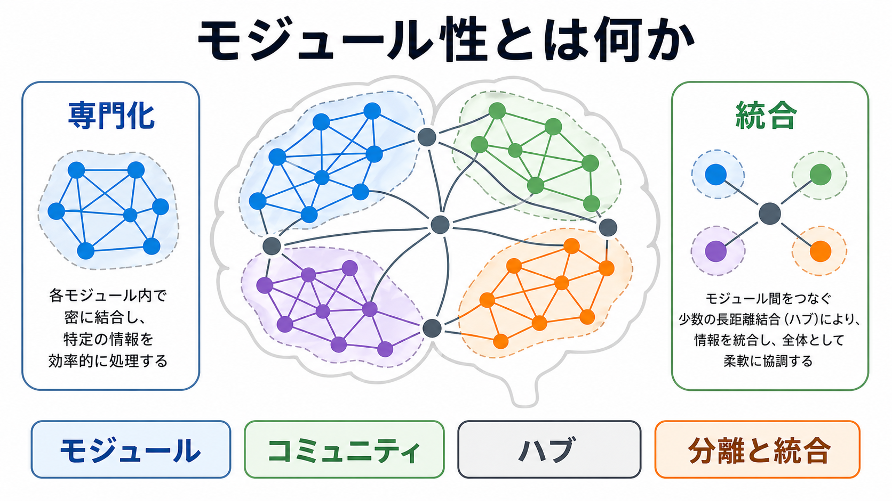
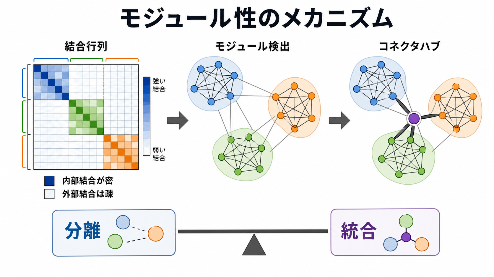
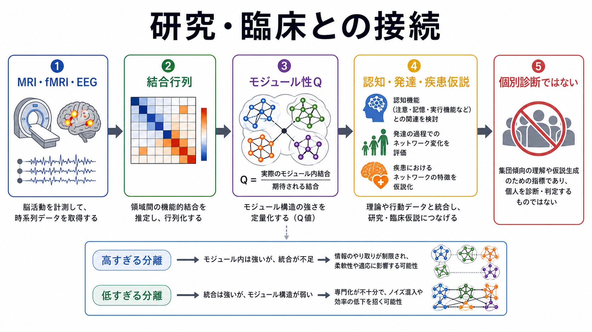

# モジュール性とは何か

## 要点

- **モジュール性**とは、ネットワークが「内部では密につながり、外部とは比較的疎につながるまとまり」に分かれる性質である。グラフ理論では、このまとまりをモジュール、コミュニティ、サブネットワークと呼ぶことが多い [1][2]。
- 脳では、視覚、運動、聴覚、注意、自己関連処理、認知制御などの機能的まとまりが、構造的結合や機能的結合のネットワークとして観察される。これは [[脳内ネットワークとは何か]]、[[構造的結合と機能的結合は何が違うのか]] と接続する基本概念である [3][6]。
- モジュール性は「分業」だけを意味しない。モジュール内の専門化と、モジュール間をつなぐハブ・長距離結合による統合が同時に必要である [2][4]。
- モジュール性の代表的な指標である $Q$ は、観測されたモジュール内結合が、ランダムな期待値よりどれだけ多いかを測る。ただし、値はノード定義、エッジ定義、閾値、アルゴリズム、解像度に大きく依存する [1][3]。
- 研究・臨床との接続では、モジュール性は認知機能、発達、加齢、精神・神経疾患の仮説生成に役立つが、単独で個別診断や治療方針を決める指標ではない [3][8]。

## この記事で答える問い

1. モジュール性とは、ネットワークのどのような性質か。
2. 脳ネットワークにおいて、モジュール性は専門化と統合をどう両立させるのか。
3. モジュール性 $Q$ やコミュニティ検出は、何を測り、何を測っていないのか。
4. 認知・発達・精神医学研究では、モジュール性をどのように解釈すべきか。

## まず結論

モジュール性とは、脳を「ばらばらな部品」ではなく、「比較的独立した処理単位が、必要に応じて連絡し合うネットワーク」として見るための概念である。局所的な情報処理はモジュール内の密な結合に支えられ、複数の処理結果を行動や意識状態へまとめる過程は、モジュール間結合、[[ハブ領域とは何か|ハブ領域]]、[[リッチクラブ構造とは何か|リッチクラブ構造]]、長距離結合に支えられる [2][4]。

したがって、モジュール性は「脳は完全に区分けされた部署の集合である」という意味ではない。むしろ、脳が局所処理の効率と全体統合の柔軟性を両立させるための、中間的な組織原理である。モジュール性が高すぎれば、情報が閉じたまとまりの中に留まりやすい。低すぎれば、まとまりのある専門処理が弱まり、ノイズや不要な相互干渉が増える可能性がある。

## 背景

脳ネットワーク研究では、脳領域、ボクセル、電極、ニューロン集団などを**ノード**、それらの結合や統計的関係を**エッジ**として扱う。エッジは、白質線維束のような構造的結合でも、fMRI や EEG/MEG の時系列相関として推定される機能的結合でもよい [3]。

この見方が重要なのは、脳機能の多くが単一領域だけでは説明しにくいからである。視覚、運動、記憶、注意、情動、自己関連処理、意思決定は、それぞれ関連領域のまとまりを持つ一方で、課題や状態に応じて別のまとまりとも結合する。ネットワーク神経科学は、この「まとまり」と「つながり」を同時に扱う枠組みを提供する [2][3]。

モジュール性の概念は、社会ネットワーク、代謝ネットワーク、コンピュータネットワークなど、複雑ネットワーク一般の研究から発展した。Newman は、ネットワークの分割がどれほど良いコミュニティ構造を作っているかを評価する代表的な指標として、モジュール性 $Q$ を定式化した [1]。脳研究では、この考え方が構造的・機能的コネクトーム解析に導入され、脳の分業、階層性、ハブ、発達、疾患研究と結びついてきた [2][3][5]。

## 基本概念

### モジュール

モジュールとは、ネットワーク内で互いに密につながるノード群である。脳ネットワークでは、視覚関連領域、感覚運動領域、デフォルトモードネットワーク、前頭頭頂ネットワーク、サリエンスネットワークなどが、解析条件によってモジュールとして現れることがある [6]。

ただし、モジュールは解剖学的な境界そのものではない。ノードの作り方、対象とする時間窓、課題、安静時か課題中か、構造的結合か機能的結合かによって、同じ脳でも異なるモジュール分割が得られる。

### コミュニティ検出

コミュニティ検出とは、ネットワークからモジュールを推定する方法群である。代表的には、ネットワークをいくつかのグループに分けたとき、グループ内結合が期待値より多くなる分割を探す。Newman のモジュール性最大化は、その代表的な方法である [1]。

直感的には、次のように考えるとよい。

$$
Q = \text{実際のモジュール内結合} - \text{ランダムに期待されるモジュール内結合}
$$

より形式的には、無向重みなしネットワークの一例では、次のように表せる。

$$
Q = \frac{1}{2m}\sum_{ij}\left(A_{ij} - \frac{k_i k_j}{2m}\right)\delta(c_i,c_j)
$$

ここで $A_{ij}$ はノード $i$ と $j$ の結合、$k_i$ はノード $i$ の次数、$m$ はエッジ数、$c_i$ はノード $i$ が属するコミュニティ、$\delta(c_i,c_j)$ は同じコミュニティなら 1、異なれば 0 になる関数である [1]。

### 分離と統合

モジュール性が示す中心的な直観は、**分離**と**統合**のバランスである。分離とは、ある機能に関わる処理がまとまりの中で効率よく行われることである。統合とは、複数のまとまりから来た情報が、行動、判断、意識状態、学習に使えるように結び合わされることである [2][4]。

[[スモールワールドネットワークとは何か]] は、このバランスを別の角度から説明する。局所的なクラスタリングが高く、全体としては短い経路でつながるネットワークは、モジュール内処理とモジュール間通信の両方に向いている [3]。

## 仕組み

### 1. 結合行列を作る

まず、脳領域同士の関係を行列として表す。fMRI なら BOLD 信号の相関、EEG/MEG なら周波数帯域ごとの同期や相互情報量、拡散 MRI なら白質路の推定結合などが使われる。行列の各セルは、ある領域ペアの結合の強さを表す [3]。

### 2. 内部結合が密なまとまりを探す

次に、結合行列をネットワークとして扱い、内部結合が密で、外部結合が相対的に疎なノード群を探す。これがモジュール検出である。機能的ネットワークでは、感覚運動、視覚、注意、デフォルトモードなど、既知の大規模機能系と対応するまとまりが得られることがある [6]。

### 3. モジュール間をつなぐノードを見る

モジュール性が高いだけでは、脳全体の統合は説明できない。重要なのは、モジュール間をまたいで結合するノードである。Guimerà と Amaral は、ノードが自分のモジュール内にどれほど結合しているか、他モジュールへどれほど広く結合しているかによって、ノードの役割を分類する考え方を示した [4]。

この視点では、あるハブは主に自分のモジュール内で働く「局所的な中核」となり、別のハブは複数モジュールを結ぶ「コネクタ」となる。[[ハブ領域とは何か]] や [[リッチクラブ構造とは何か]] は、この統合側の仕組みを理解するための関連概念である。

### 4. 階層性を考える

脳のモジュールは一段階だけではない。大きな視覚モジュールの中に、一次視覚野、腹側視覚経路、背側視覚経路に関わるより細かなサブモジュールがあるように、モジュールの中にさらにモジュールが入ることがある。Meunier らは、ヒト機能的脳ネットワークに階層的モジュール構造が見られることを示し、関連皮質領域にコネクタノードやハブが多いことを報告した [5]。

## 図解

図1は、モジュール性を「専門化」と「統合」の両面から示している。各色のまとまりは、内部で密に結合した処理単位である。灰色のノードや長距離結合は、モジュール間の情報のやり取りを支える。

図2は、結合行列からモジュールを見つけ、コネクタハブを通じて全体統合が成立する流れを示している。結合行列の対角ブロックが濃いとき、同じモジュール内の結合が強いことを意味する。

図3は、研究・臨床仮説への接続を示している。モジュール性は、認知機能、発達、疾患群の集団差や仮説生成に使えるが、個人を診断・判定する指標ではない。

## 臨床・研究との接続

### 認知機能

認知は、単一の「司令塔」だけで成り立つわけではない。課題に応じて、感覚処理、記憶、注意、実行制御、情動評価、身体状態の情報が組み合わさる。モジュール性は、こうした処理がどの程度分離され、どの程度統合されるかを調べる入口になる [2][7]。

Bertolero らは、ヒト脳の機能的ネットワークを、モジュール内処理とモジュール間統合の両方から捉え、複数のネットワークを横断して結合する領域が統合的機能に関わる可能性を論じた [7]。これは、脳を「領域ごとの専門化」だけでなく、「ネットワーク間の橋渡し」として読む見方につながる。

### 発達と加齢

発達に伴い、局所的な結合、長距離結合、ハブの配置、モジュール間結合は変化する。一般に、成熟した脳ネットワークは、単純な局所結合の集合ではなく、機能的に意味のあるまとまりと、遠隔領域を結ぶ統合経路を持つ。モジュール性は、こうした発達的再編成を測る指標の一つになる [2][5]。

ただし、「発達すれば必ずモジュール性が高くなる」と単純化してはいけない。年齢、計測法、頭部運動、解析パイプライン、課題状態によって結果は変わる。発達研究では、モジュール性だけでなく、ネットワーク効率、ハブ、リッチクラブ、構造的結合、行動指標を併せて読む必要がある。

### 精神・神経疾患

精神・神経疾患研究では、モジュール性の低下、高すぎる分離、モジュール間結合の異常、ハブの脆弱性などが検討されてきた。Stam は、神経疾患を単一部位の障害だけでなく、ネットワーク全体の組織化の変化として理解する現代的視点を整理している [8]。

精神医学でも、統合失調症、うつ病、自閉スペクトラム症、ADHD、認知症などで、機能的結合やモジュール構造の違いが研究される。ただし、これらは集団レベルの研究知見であり、個別診断や治療適応を単独で決めるものではない。臨床的には、症状、生活機能、発達歴、身体疾患、薬物、睡眠、環境要因と統合して解釈する必要がある。

## よくある誤解

### 誤解1: モジュールは脳の固定された部品である

モジュールは、解析によって推定されるネットワーク上のまとまりであり、常に同じ境界を持つ固定部品ではない。ノード分割、エッジ定義、閾値、時間窓、課題、状態によって変化しうる [2][3]。

### 誤解2: モジュール性が高いほどよい

高いモジュール性は局所処理に有利なことがあるが、過度な分離はモジュール間の柔軟な情報交換を妨げる可能性がある。逆に低すぎるモジュール性は、専門化された処理のまとまりが弱いことを示すかもしれない。重要なのは、課題、発達段階、疾患、測定条件に照らして読むことである。

### 誤解3: $Q$ は脳の機能的よさを直接表す

$Q$ は、ある分割においてモジュール内結合が期待値より多いかを示す指標であり、脳機能の優劣を直接表すものではない。比較対象となるランダムネットワーク、閾値、重み付き・方向付きエッジの扱い、解像度パラメータによって値は変わる [1][3]。

### 誤解4: 機能的モジュールは構造的結合そのものである

構造的結合は機能的結合を制約するが、両者は同一ではない。間接経路、共通入力、神経調節、課題状態、時間スケール、血管応答などによって、機能的結合は構造的結合と異なるパターンを示す [3]。

## 関連ノート

確認済みの関連ノート:

- [[脳内ネットワークとは何か]]
- [[構造的結合と機能的結合は何が違うのか]]
- [[スモールワールドネットワークとは何か]]
- [[ハブ領域とは何か]]
- [[リッチクラブ構造とは何か]]
- [[サリエンスネットワークとは何か]]
- [[デフォルトモードネットワークとは何か]]

関連ノート候補:

- グラフ理論は脳ネットワーク解析にどう使われるのか
- コミュニティ検出とは何か
- モジュール性は脳の分業と統合をどう支えるのか
- ネットワーク効率とは何か
- 精神疾患における機能的結合異常とは何か

MOC更新候補:

- `content/00_MOC/` の脳・神経科学系 MOC に、神経回路・脳ネットワークの基礎概念として本記事を追加する。
- 並列ジョブとの競合を避けるため、この作業では MOC 本体は更新しない。

## 理解チェック

1. モジュール性とは、ネットワーク内のどのような結合パターンを指すか。
2. モジュール性が「専門化」だけでなく「統合」とも関係するのはなぜか。
3. モジュール性 $Q$ は、何と何を比較している指標か。
4. コネクタハブは、モジュール性の高いネットワークでどのような役割を持つか。
5. 脳画像研究で得られたモジュール性の差を、個別診断に直結させてはいけない理由は何か。

## 参考文献

[1] Newman, M. E. J. (2006). Modularity and community structure in networks. *Proceedings of the National Academy of Sciences, 103*(23), 8577-8582. https://doi.org/10.1073/pnas.0601602103

[2] Sporns, O., & Betzel, R. F. (2016). Modular brain networks. *Annual Review of Psychology, 67*, 613-640. https://doi.org/10.1146/annurev-psych-122414-033634

[3] Bullmore, E., & Sporns, O. (2009). Complex brain networks: Graph theoretical analysis of structural and functional systems. *Nature Reviews Neuroscience, 10*, 186-198. https://doi.org/10.1038/nrn2575

[4] Guimerà, R., & Amaral, L. A. N. (2005). Functional cartography of complex metabolic networks. *Nature, 433*, 895-900. https://doi.org/10.1038/nature03288

[5] Meunier, D., Lambiotte, R., Fornito, A., Ersche, K. D., & Bullmore, E. T. (2009). Hierarchical modularity in human brain functional networks. *Frontiers in Neuroinformatics, 3*, 37. https://doi.org/10.3389/neuro.11.037.2009

[6] Power, J. D., Cohen, A. L., Nelson, S. M., Wig, G. S., Barnes, K. A., Church, J. A., Vogel, A. C., Laumann, T. O., Miezin, F. M., Schlaggar, B. L., & Petersen, S. E. (2011). Functional network organization of the human brain. *Neuron, 72*(4), 665-678. https://doi.org/10.1016/j.neuron.2011.09.006

[7] Bertolero, M. A., Yeo, B. T. T., & D'Esposito, M. (2015). The modular and integrative functional architecture of the human brain. *Proceedings of the National Academy of Sciences, 112*(49), E6798-E6807. https://doi.org/10.1073/pnas.1510619112

[8] Stam, C. J. (2014). Modern network science of neurological disorders. *Nature Reviews Neuroscience, 15*, 683-695. https://doi.org/10.1038/nrn3801

## 未解決問題

- モジュール性の変化が、疾患原因、代償過程、薬物・睡眠・生活環境の影響のどれを反映しているのかをどう分離するか。
- 個人内で変動する動的モジュール構造を、安定した特性指標としてどこまで扱えるか。
- fMRI、EEG/MEG、拡散 MRI、行動データを統合して、モジュール性の生物学的意味をどこまで精密化できるか。
- モジュール性、スモールワールド性、ハブ、リッチクラブ構造を、同じ研究デザイン内でどう一貫して解釈するか。
