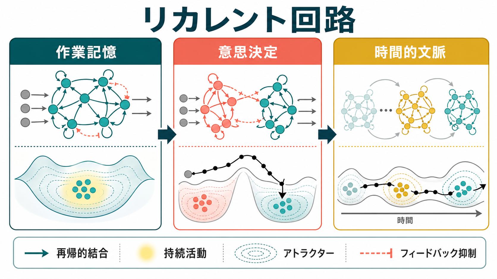
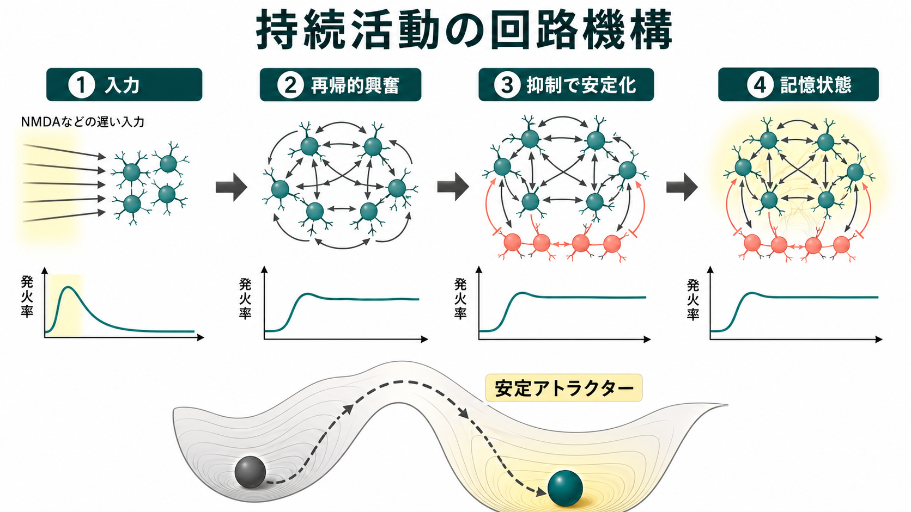
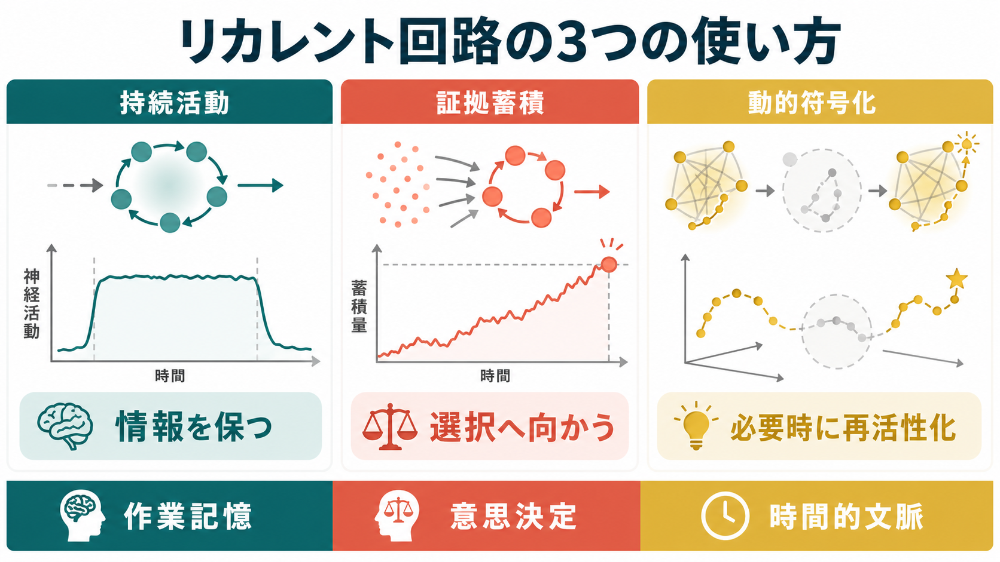

# リカレント回路はどのように記憶や持続活動を支えるのか

## 要点

- リカレント回路とは、出力が同じ回路内へ戻り、次の活動を再び変える再帰的結合をもつ[[ニューロンとは何か|ニューロン]]集団である。
- 作業記憶では、外部刺激が消えたあとも活動が残る「持続活動」が、情報を一時的に保つ候補機構として研究されてきた。[1][2]
- 持続活動は、再帰的興奮だけでは不安定になりやすく、[[GABAは脳で何をしているのか|抑制性入力]]や[[介在ニューロンは神経回路で何をしているのか|介在ニューロン]]によるフィードバック抑制と組み合わさることで安定する。[3][4]
- 意思決定では、リカレント回路が証拠を少しずつ積み上げ、選択肢に対応するアトラクター状態へ近づくモデルとして説明される。[4]
- ただし、記憶は常に固定した発火率で保持されるわけではない。近年は、活動が一時的に見えなくなる activity-silent 状態や、時間とともに変わる集団軌道としての動的符号化も重視される。[5][6]

## この記事で答える問い

1. リカレント回路は、フィードフォワード回路と何が違うのか。
2. 再帰的結合は、なぜ刺激が消えたあとの持続活動を生みうるのか。
3. 作業記憶、意思決定、時間的文脈処理は、同じ回路原理でどこまで説明できるのか。
4. 「作業記憶 = 持続発火」と言い切れない理由は何か。

## まず結論

リカレント回路の中心的な役割は、現在の入力だけで反応を決めるのではなく、直前までの活動状態を次の状態へ持ち越すことである。フィードフォワード回路では、情報はおおむね入力層から出力層へ進む。一方、リカレント回路では、同じ集団内の活動が回り込み、過去の入力、現在の入力、抑制性制御、神経修飾の影響が混ざった「回路状態」を作る。

この性質によって、リカレント回路は短い刺激を数秒間保持したり、曖昧な証拠を時間的に積み上げたり、課題文脈に応じて同じ感覚入力を別の意味で処理したりできる。[3][4][7] ただし、記憶を支える表現は単純な「ずっと同じ発火が続く状態」だけではない。人口活動の軌道、短期[[シナプス可塑性とは何か|シナプス可塑性]]、潜在状態、再活性化のような仕組みも、作業記憶や文脈処理の説明に必要である。[5][6][8]

## 背景

刺激が目の前から消えても、数秒後にその位置や特徴を使って行動できる。このような遅延反応課題では、前頭前野や視床などの細胞が、刺激提示後の遅延期間にも発火率を変え続けることが古くから示されてきた。[1] その後、サル前頭前野で空間位置に選択的な遅延活動が観察され、作業記憶を支える神経基盤として注目された。[2]

この発見は、記憶を「保存棚に置かれた静的な内容」と見るのではなく、「回路が一時的に入り続ける活動状態」と見る方向を開いた。リカレント結合をもつ集団では、あるニューロン群の活動が別のニューロン群を励起し、その活動がまた元の集団へ戻る。これにより、外部入力が短くても、回路内部の反響によって活動が延長される可能性がある。[3]

## 基本概念

### リカレント結合

リカレント結合とは、回路の出力が同じ回路内へ戻る結合である。単一細胞が自分自身へ直接戻るという意味だけではなく、A群がB群を活動させ、B群がA群やC群を活動させるような集団レベルの再帰も含む。

この再帰性によって、回路は入力に対して一回だけ反応するのではなく、時間をかけて状態を更新する。言い換えると、リカレント回路は「入力を変換する装置」であると同時に、「状態をもつ力学系」である。[7]

### 持続活動

持続活動とは、外部刺激が消えたあとも特定の発火パターンが続く現象である。作業記憶課題では、保持すべき位置、方向、色、周波数などに応じて、遅延期間の活動が変わることがある。[1][2]

持続活動は、[[EPSPとIPSPはどのように発火を調節するのか|興奮性入力と抑制性入力]]のバランスの上に成り立つ。興奮が弱すぎれば活動は消え、強すぎれば回路全体が過剰に活動する。したがって、持続活動は単なる「興奮の残り火」ではなく、再帰的興奮、フィードバック抑制、遅い[[シナプスとは何か|シナプス]]電流、ノイズの相互作用として理解する必要がある。[3][4]

### アトラクター

アトラクターとは、力学系が自然に近づきやすい安定状態である。作業記憶モデルでは、刺激の位置やカテゴリに対応する活動パターンがアトラクターとして表されることがある。入力が一度その状態へ回路を押し込むと、入力が消えても活動がその近くに保たれる。[3]

空間位置のような連続量を保持する場合は、離散的な点ではなく、連続的な「線」や「山」のようなアトラクターで説明されることがある。これは、記憶内容が1か0ではなく、少しずつ異なる値をもつ場合に重要である。[3][8]

## 仕組み

### 1. 入力が回路状態を押し出す

感覚入力や手がかり刺激が入ると、特定のニューロン集団が一時的に活動する。その活動は、[[グルタミン酸は脳で何をしているのか|グルタミン酸]]性の興奮性結合を通じて、同じ特徴や同じ選択肢に関係するニューロンをさらに活動させる。

### 2. 再帰的興奮が活動を延長する

興奮性細胞同士が互いに結合していると、外部入力が終わっても、集団内の活動が互いを支え合う。Compteらの皮質回路モデルでは、NMDA受容体を介する遅い興奮性電流と局所回路構造が、空間作業記憶に対応する選択的持続活動を支える要素として扱われた。[3]

### 3. 抑制が回路を安定化する

再帰的興奮だけでは、活動はすぐ消えるか、広がりすぎるかのどちらかになりやすい。そこで重要になるのがフィードバック抑制である。抑制性介在ニューロンは、活動が強くなりすぎた集団を抑え、競合する表現を分離し、回路全体の発火率を安定させる。[4]

### 4. 意思決定では証拠を蓄積する

二つの選択肢のどちらが正しいかを判断する課題では、リカレント回路は証拠を時間的に積み上げる積分器として働く。Wangのレビューでは、遅い再帰的興奮と速いフィードバック抑制が、カテゴリ選択のアトラクターと、証拠蓄積に対応する長い過渡状態を作ると整理されている。[4]

重要なのは、意思決定が一瞬の入力で決まるとは限らない点である。弱くノイズを含む証拠は、回路状態を少しずつ選択肢の方向へ動かす。十分に偏ると、回路は片方の選択状態へ落ち込み、行動が準備される。

### 5. 文脈処理では同じ入力の意味を切り替える

前頭前野のリカレントダイナミクスは、課題文脈に応じて何を選び、何を無視するかを切り替える仕組みとしても研究されている。Manteらは、サル前頭前野の集団活動と訓練済みリカレントネットワークを比較し、文脈依存的な選択と証拠積分が、単一ニューロンではなく集団ダイナミクスとして理解できることを示した。[7]

これは「一つのニューロンが一つの意味を固定的に表す」という見方を弱める。むしろ、同じ細胞でも、回路全体の状態や課題文脈が変わると、情報処理への寄与が変わる。

## 図解

図1は、リカレント回路が作業記憶、意思決定、時間的文脈を結ぶ概念地図である。作業記憶では情報を保ち、意思決定では選択へ向かい、時間的文脈では過去の状態が現在の処理を変える。

図2は、入力、再帰的興奮、抑制による安定化、記憶状態の流れを示している。図の下部にあるアトラクター地形は、回路状態が安定した活動パターンへ落ち込むという直感的な表現である。

図3は、リカレント回路の使い方を「持続活動」「証拠蓄積」「動的符号化」に分けて比較している。どれも再帰的結合を使うが、同じ状態を保つ、選択へ向かう、時間とともに表現を変える、という計算上の役割が異なる。

## 臨床・研究との接続

作業記憶の障害は、統合失調症、ADHD、うつ病、神経変性疾患など多くの臨床領域で問題になる。ただし、本記事で述べたリカレント回路の説明は、個別患者の診断や治療方針を直接決めるものではない。教育・研究目的の枠組みとして、細胞・回路・行動をつなぐ見取り図を与えるものである。

研究上は、持続活動を観察するだけでは不十分である。遅延期間の発火が本当に記憶内容を保持しているのか、注意、運動準備、報酬期待、課題規則を反映しているのかを分ける必要がある。[6] また、発火率として見えない潜在状態が、手がかりや刺激で再活性化される場合もあるため、「活動がない = 記憶がない」とは言えない。[5]

人工リカレントニューラルネットワークは、神経回路を完全に再現するものではないが、集団ダイナミクスを理解するための有用なモデルである。固定点、アトラクター、過渡軌道、カオス、低次元構造などの概念は、実験データと計算モデルを結ぶ共通語になっている。[7][8]

## よくある誤解

### 誤解1: 作業記憶は常に持続発火で保持される

持続発火は重要な候補機構だが、作業記憶のすべてではない。刺激が現在の行動に不要な時期には、発火率としては見えにくい activity-silent 状態で保持され、再び必要になったときに再活性化される可能性がある。[5]

### 誤解2: リカレント回路は興奮性結合が強ければよい

強い興奮だけでは、回路は飽和したり発散したりしやすい。安定した持続活動には、抑制性入力、遅いシナプス電流、ノイズへの耐性、適切な結合構造が必要である。[3][4]

### 誤解3: アトラクターは比喩であり、実際の脳には関係ない

アトラクターは単なる比喩ではなく、回路状態がどのように安定し、どのように別の状態へ遷移するかを記述する数学的な考え方である。ただし、実際の脳では状態が完全に静止するとは限らず、時間とともに変わる軌道や文脈依存的な再構成も同時に考える必要がある。[6][8]

### 誤解4: 単一ニューロンの役割を読めば回路計算が分かる

単一ニューロンの発火は重要な手がかりだが、リカレント回路では集団全体の状態が計算の単位になることが多い。Manteらの研究は、複雑な単一ニューロン応答を、集団ダイナミクスとして見ることで理解しやすくなることを示している。[7]

## 関連ノート

- [[ニューロンとは何か]]
- [[シナプスとは何か]]
- [[シナプス可塑性とは何か]]
- [[Hebb則とは何か]]
- [[EPSPとIPSPはどのように発火を調節するのか]]
- [[GABAは脳で何をしているのか]]
- [[介在ニューロンは神経回路で何をしているのか]]
- [[グルタミン酸は脳で何をしているのか]]

関連ノート候補:

- 作業記憶とは何か
- アトラクターとは何か
- 前頭前野は認知制御で何をしているのか
- 意思決定のドリフト拡散モデルとは何か
- リカレントニューラルネットワークとは何か
- activity-silent working memoryとは何か

MOC更新候補:

- `content/00_MOC/MOC｜脳・神経科学.md` の「神経回路・脳ネットワーク」系の項目に `[[リカレント回路はどのように記憶や持続活動を支えるのか]]` を追加する候補。
- `content/00_MOC/MOC｜数理モデル・計算論.md` に、アトラクター・力学系・リカレントニューラルネットワークとの接続として追加する候補。
- 並列生成ジョブとの衝突を避けるため、今回はMOCファイル本体は更新しない。

## 理解チェック

1. フィードフォワード回路とリカレント回路の違いを、時間と状態の観点から説明できるか。
2. 再帰的興奮だけでは持続活動が不安定になりやすい理由を説明できるか。
3. アトラクターという概念を、作業記憶の保持と結びつけて説明できるか。
4. 意思決定における「証拠蓄積」とリカレント回路の関係を説明できるか。
5. activity-silent な作業記憶が、単純な持続発火モデルにどのような修正を迫るか説明できるか。

## 参考文献

[1] Fuster, J. M., & Alexander, G. E. (1971). Neuron activity related to short-term memory. *Science*, 173(3997), 652-654. https://doi.org/10.1126/science.173.3997.652

[2] Funahashi, S., Bruce, C. J., & Goldman-Rakic, P. S. (1989). Mnemonic coding of visual space in the monkey's dorsolateral prefrontal cortex. *Journal of Neurophysiology*, 61(2), 331-349. https://doi.org/10.1152/jn.1989.61.2.331

[3] Compte, A., Brunel, N., Goldman-Rakic, P. S., & Wang, X. J. (2000). Synaptic mechanisms and network dynamics underlying spatial working memory in a cortical network model. *Cerebral Cortex*, 10(9), 910-923. https://doi.org/10.1093/cercor/10.9.910

[4] Wang, X. J. (2008). Decision making in recurrent neuronal circuits. *Neuron*, 60(2), 215-234. https://doi.org/10.1016/j.neuron.2008.09.034

[5] Stokes, M. G. (2015). 'Activity-silent' working memory in prefrontal cortex: a dynamic coding framework. *Trends in Cognitive Sciences*, 19(7), 394-405. https://doi.org/10.1016/j.tics.2015.05.004

[6] Curtis, C. E., & Sprague, T. C. (2021). Persistent activity during working memory from front to back. *Frontiers in Neural Circuits*, 15, 696060. https://doi.org/10.3389/fncir.2021.696060

[7] Mante, V., Sussillo, D., Shenoy, K. V., & Newsome, W. T. (2013). Context-dependent computation by recurrent dynamics in prefrontal cortex. *Nature*, 503, 78-84. https://doi.org/10.1038/nature12742

[8] Barak, O., Sussillo, D., Romo, R., Tsodyks, M., & Abbott, L. F. (2013). From fixed points to chaos: three models of delayed discrimination. *Progress in Neurobiology*, 103, 214-222. https://doi.org/10.1016/j.pneurobio.2013.02.002

## 未解決問題

- 持続発火、短期シナプス可塑性、潜在状態、再活性化が、実際の作業記憶課題でどの割合で使われるのか。
- アトラクター状態と時間変化する集団軌道を、同じ実験データの中でどう区別するか。
- 前頭前野、頭頂葉、視覚野、海馬、視床、基底核が、作業記憶と意思決定でどのように役割分担するのか。
- 人工リカレントネットワークの内部表現を、生物学的な[[活動電位はどのように発生するのか|活動電位]]、シナプス、神経修飾とどこまで対応づけられるか。

## 更新ログ

- 2026-04-27: 初稿作成。リカレント回路、持続活動、アトラクター、意思決定、動的符号化、図解、関連ノート、参考文献を整理。
