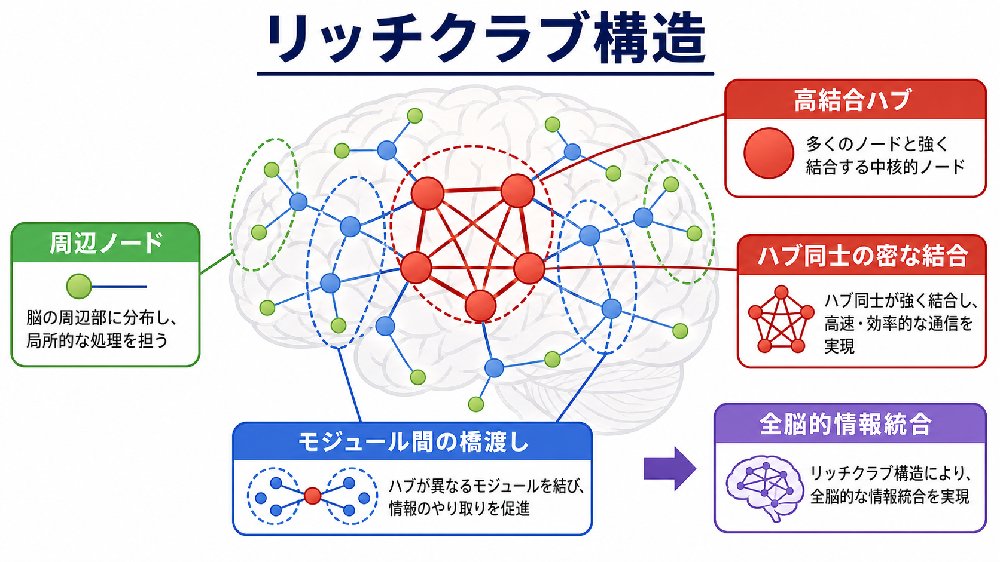
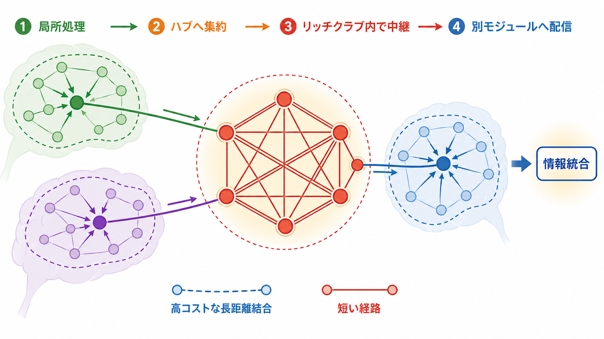
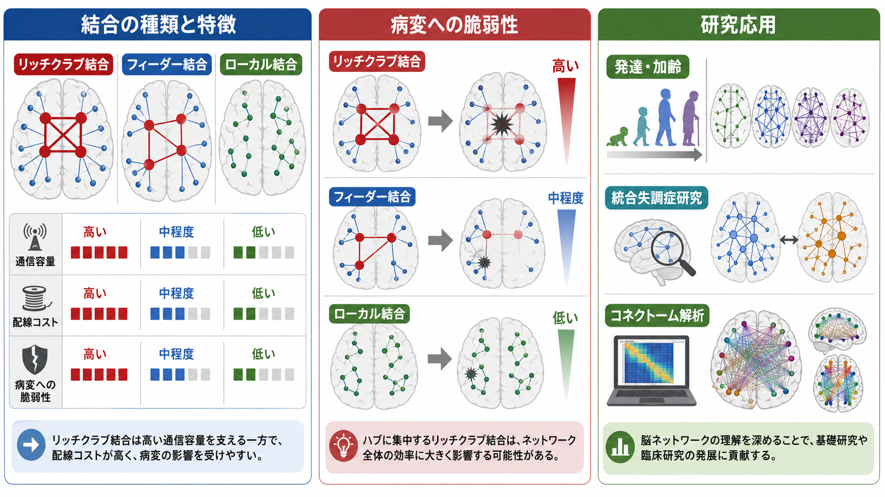

# リッチクラブ構造とは何か

## 要点

- リッチクラブ構造とは、ネットワーク内で多くの結合をもつハブ同士が、偶然や次数分布だけでは説明しにくいほど密に結びつく構造である。[1]
- 脳では、前頭、頭頂、内側皮質、皮質下領域などの高結合ハブが互いに結びつき、離れたモジュール間の通信を支える「高コスト・高容量」の中核として研究されている。[2][3]
- リッチクラブ結合は長距離で配線コストが高い一方、短い経路、全脳的情報統合、機能的結合の多様性に寄与する可能性がある。[3][5]
- ただし、リッチクラブは「意識の座」や「最高中枢」ではない。拡散MRI、トラクトグラフィー、ノード分割、しきい値設定、ランダムネットワークの作り方に依存する解析概念である。

## この記事で答える問い

1. リッチクラブ構造は、通常のハブやモジュールと何が違うのか。
2. 脳ネットワークでは、なぜハブ同士の密な結合が重要と考えられるのか。
3. リッチクラブ構造は、発達、加齢、精神疾患研究とどう接続するのか。

## まず結論

リッチクラブ構造は、脳を「領域の集合」ではなく「結合のネットワーク」として見るときに現れる全体構造である。各脳領域をノード、白質線維や機能的関連をエッジとして表すと、一部のノードは多くの領域と結合するハブになる。リッチクラブとは、そのハブ同士が互いに密に結びつくサブネットワークを指す。[1][2]

この構造の意義は、単に「中心に重要な領域がある」ということではない。局所モジュールで処理された情報がハブへ集まり、リッチクラブ結合を通って別のモジュールへ送られることで、脳全体の統合的な通信が効率化される可能性がある。[3][4] その一方で、リッチクラブ結合は長く、白質量、代謝、発達期間などのコストが高い。高い機能的利益と高い脆弱性を同時にもつ構造として理解するとよい。[5]

## 背景

脳は、多数の神経細胞、局所回路、長距離線維からなるネットワークである。単一ニューロンの発火や[[シナプスとは何か|シナプス]]の可塑性だけでは、注意、記憶、意思決定、意識のような広域機能は説明しきれない。そこで近年のネットワーク神経科学では、脳領域間の結合パターンをグラフとして表し、ハブ、モジュール、小世界性、効率、リッチクラブ構造などを調べる。[6]

リッチクラブという名前は、社会ネットワークで「影響力の大きい人同士が互いにつながる」現象になぞらえたものである。ネットワーク科学では、次数の高いノードだけを取り出し、それらがどの程度互いに結合しているかをリッチクラブ係数で評価する。重要なのは、高次数ノードはそもそも結合が多いため、単純な密度だけでは不十分だという点である。そのため、次数分布を保存したランダムネットワークと比較し、正規化されたリッチクラブ係数が 1 を超えるかどうかを見る。[1][4]

## 基本概念

### ハブ、モジュール、リッチクラブ

ハブは、多くのノードと結合する中心的ノードである。脳では、構造的結合、機能的結合、中心性指標、参加係数などによって候補が変わる。ハブは[[軸索はどのように情報を遠くへ伝えるのか|長距離軸索]]を介して複数のシステムをつなぐことが多く、認知機能や情報統合に関わると考えられる。[6]

モジュールは、内部では密につながり、外部とは比較的疎につながるまとまりである。視覚、運動、聴覚、内受容、認知制御などの機能的分業は、モジュール性と相性がよい。一方で、脳は分業だけでは働かない。異なるモジュール間で情報を統合する必要がある。

リッチクラブは、この「分業と統合」の橋渡しに関わる構造である。高結合ハブが各モジュールに散らばっていても、ハブ同士が互いに疎なら、情報は遠回りしやすい。ハブ同士が密に結合すれば、局所モジュールから集まった情報を短い経路で別モジュールへ再配信できる。[3][4]

### リッチクラブ結合、フィーダー結合、ローカル結合

リッチクラブ研究では、結合を次の 3 種類に分けることが多い。[4]

| 結合の種類 | 定義 | 役割のイメージ |
|---|---|---|
| リッチクラブ結合 | リッチクラブノード同士の結合 | 中核ハブ間の高容量通信 |
| フィーダー結合 | リッチクラブノードと非リッチクラブノードの結合 | 局所モジュールから中核への出入り口 |
| ローカル結合 | 非リッチクラブノード同士の結合 | モジュール内の局所処理 |

この分類によって、「脳ネットワーク全体の効率を支えるのは、どの種類の結合か」を調べやすくなる。

## 仕組み

リッチクラブ構造が情報統合に寄与する仕組みは、次のように整理できる。

1. 局所モジュールで感覚、運動、記憶、内的状態などの情報が処理される。
2. モジュール内のハブやフィーダー結合を通じて、高結合ハブへ情報が集まる。
3. リッチクラブ結合が、ハブ同士の短い経路を提供する。
4. 別のモジュールへ情報が配信され、広域的な機能状態が形成される。

ヒト拡散MRI研究では、リッチクラブ結合は全結合の一部でありながら、短い通信経路に過剰に関与することが示された。van den Heuvel らの PNAS 論文では、リッチクラブ結合が全通信コストの約 40% を占め、全ノード対の最短経路の約 69% がリッチクラブを通ると報告されている。[3] これは、リッチクラブが「たくさんある結合の一部」ではなく、全脳通信の幹線として働きうることを示す。

ただし、ここでいう通信は、実際のスパイク伝播を直接観察したものではない。多くの場合、構造結合グラフ上の最短経路や効率を使った理論的推定である。したがって、リッチクラブ構造は神経活動の実時間ダイナミクスを完全に説明するものではなく、脳が取りうる通信の制約条件を示すモデルとして読むのが適切である。

## 図解

リッチクラブ構造を直感的に理解するには、交通網の比喩が役に立つ。ローカル結合は住宅街の道、フィーダー結合は幹線道路への入口、リッチクラブ結合は都市間高速道路に近い。ただし、脳では道路のように一方向に車が流れるだけではなく、[[GABAは脳で何をしているのか|抑制]]、同期、神経修飾、[[神経可塑性は発達と学習をどう支えるのか|可塑性]]が重なって通信状態が変わる。

## 臨床・研究との接続

### 発達と加齢

新生児期や胎児期後半の研究では、リッチクラブ様の構造が出生前から見られる可能性が報告されている。Ball らは、妊娠 30 週ごろには相互結合した皮質ハブの構造が存在し、その後、コアハブと他領域を結ぶ結合が増えていくと述べている。[7] これは、リッチクラブ構造が成人脳だけの特徴ではなく、発達過程で早くから全体構造の足場になる可能性を示す。

一方、発達研究では注意が必要である。拡散MRIから推定される結合は、髄鞘化、線維交差、頭部運動、解析パイプラインの影響を受ける。[[髄鞘はなぜ神経伝導を速くするのか|髄鞘]]や白質成熟の変化を、そのまま「認知機能の成熟」と同一視しないことが重要である。

### 精神疾患研究

統合失調症研究では、リッチクラブ構造やその機能的ダイナミクスの異常が検討されてきた。van den Heuvel らは、統合失調症群でリッチクラブ組織の変化と機能的脳活動ダイナミクスの関連を報告した。[8] これは、精神疾患を単一領域の異常ではなく、広域ネットワークの結合様式として考える方向と接続する。

ただし、臨床応用はまだ研究段階である。個人の診断、治療選択、予後予測にリッチクラブ指標をそのまま使えるわけではない。精神医学では、症状、生活機能、発達歴、身体疾患、薬物、環境要因などを総合して評価する必要がある。リッチクラブ解析は、個別診断の道具ではなく、疾患メカニズムを理解するための研究枠組みと位置づけるのがよい。

### マカク・比較神経科学

マカク皮質のトレーサー研究でも、リッチクラブ構造が報告されている。[4] 非ヒト霊長類の利点は、ヒト拡散MRIよりも直接的に解剖学的投射を調べられることである。Harriger らは、マカクのリッチクラブ領域が短い経路に過剰に関与し、モジュール間通信に重要な位置を占めると述べている。[4] これにより、ヒト画像研究だけでなく、比較解剖学からもリッチクラブの妥当性を検討できる。

## よくある誤解

### 誤解1: リッチクラブは「脳の司令塔」である

リッチクラブは司令塔というより、全体通信の通り道になりやすい高結合ハブの集合である。意思決定や意識を一方的に命令する場所ではない。脳機能は、局所回路、長距離結合、神経修飾、身体状態、環境との相互作用から生じる。

### 誤解2: ハブが多いほどよい

ハブやリッチクラブ結合は有用だが、高コストでもある。Collin らは、リッチクラブ領域と結合が白質組織、代謝、発達軌道、機能的結合の面で高コストな特徴をもつと報告している。[5] 高度な統合を支える構造は、損傷や発達上の変化に対して脆弱になりうる。

### 誤解3: リッチクラブ係数が高ければ機能的に重要と断定できる

リッチクラブ係数はトポロジーの指標であり、機能的重要性そのものではない。ノード分割、エッジ重み、しきい値、ランダム化手法、被験者集団、画像品質によって結果は変わる。機能的意義を述べるには、課題fMRI、安静時機能的結合、病変研究、発達研究、計算モデルなどとの対応づけが必要である。

## 関連ノート

確認済みの関連ノート:

- [[MOC｜脳・神経科学]]
- [[神経可塑性は発達と学習をどう支えるのか]]
- [[軸索はどのように情報を遠くへ伝えるのか]]
- [[髄鞘はなぜ神経伝導を速くするのか]]
- [[シナプスとは何か]]
- [[GABAは脳で何をしているのか]]

今後の作成候補:

- グラフ理論は脳ネットワーク解析にどう使われるのか
- コネクトームとは何か
- ハブ領域とは何か
- ネットワーク効率とは何か
- モジュール性は脳の分業と統合をどう支えるのか
- 小世界ネットワークとは何か

MOC更新候補:

- `content/00_MOC/MOC｜脳・神経科学.md` に本記事を追加する。ただし、並列ジョブとの競合を避けるため今回は編集しない。

## 理解チェック

1. リッチクラブ構造は、単に「結合数の多いハブがある」こととどう違うか。
2. リッチクラブ係数をランダムネットワークで正規化するのはなぜか。
3. リッチクラブ結合、フィーダー結合、ローカル結合はそれぞれ何を表すか。
4. リッチクラブ構造が高コストであるにもかかわらず維持される理由として、どのような機能的利益が考えられるか。
5. 精神疾患研究でリッチクラブ指標を使うとき、なぜ個別診断へ直結させてはいけないのか。

## 参考文献

[1] Colizza, V., Flammini, A., Serrano, M. A., & Vespignani, A. (2006). Detecting rich-club ordering in complex networks. *Nature Physics*, 2, 110-115. https://doi.org/10.1038/nphys209

[2] van den Heuvel, M. P., & Sporns, O. (2011). Rich-club organization of the human connectome. *The Journal of Neuroscience*, 31(44), 15775-15786. https://doi.org/10.1523/JNEUROSCI.3539-11.2011

[3] van den Heuvel, M. P., Kahn, R. S., Goni, J., & Sporns, O. (2012). High-cost, high-capacity backbone for global brain communication. *Proceedings of the National Academy of Sciences*, 109(28), 11372-11377. https://doi.org/10.1073/pnas.1203593109

[4] Harriger, L., van den Heuvel, M. P., & Sporns, O. (2012). Rich club organization of macaque cerebral cortex and its role in network communication. *PLOS ONE*, 7(9), e46497. https://doi.org/10.1371/journal.pone.0046497

[5] Collin, G., Sporns, O., Mandl, R. C. W., & van den Heuvel, M. P. (2014). Structural and functional aspects relating to cost and benefit of rich club organization in the human cerebral cortex. *Cerebral Cortex*, 24(9), 2258-2267. https://doi.org/10.1093/cercor/bht064

[6] van den Heuvel, M. P., & Sporns, O. (2013). Network hubs in the human brain. *Trends in Cognitive Sciences*, 17(12), 683-696. https://doi.org/10.1016/j.tics.2013.09.012

[7] Ball, G., Aljabar, P., Zebari, S., Tusor, N., Arichi, T., Merchant, N., Robinson, E. C., Ogundipe, E., Rueckert, D., Edwards, A. D., & Counsell, S. J. (2014). Rich-club organization of the newborn human brain. *Proceedings of the National Academy of Sciences*, 111(20), 7456-7461. https://doi.org/10.1073/pnas.1324118111

[8] van den Heuvel, M. P., Sporns, O., Collin, G., Scheewe, T., Mandl, R. C. W., Cahn, W., Goni, J., Hulshoff Pol, H. E., & Kahn, R. S. (2013). Abnormal rich club organization and functional brain dynamics in schizophrenia. *JAMA Psychiatry*, 70(8), 783-792. https://doi.org/10.1001/jamapsychiatry.2013.1328

## 未解決問題

- リッチクラブ構造は、実際の神経活動のルーティングをどの程度反映しているのか。
- 構造的リッチクラブと機能的ネットワークの関係は、課題、覚醒水準、発達段階でどう変わるのか。
- 精神疾患におけるリッチクラブ異常は、原因、結果、補償、薬物や生活要因の影響のどれを反映しているのか。
- 個人差や縦断変化を、どの程度安定して測定できるのか。
