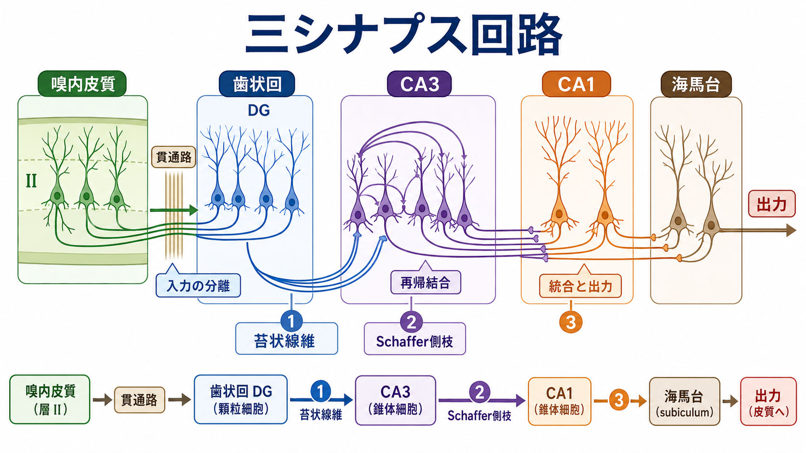
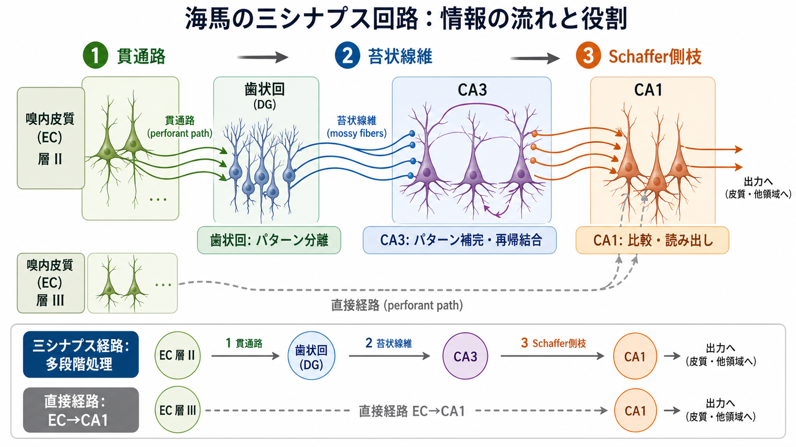
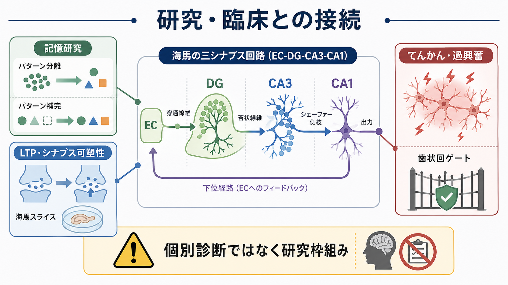

# 三シナプス回路とは何か

## 要点

- 三シナプス回路とは、嗅内皮質第II層から歯状回、CA3、CA1へ進む海馬の古典的な興奮性経路である。代表的には「貫通路」「苔状線維」「Schaffer側枝」という3つのシナプス段階で説明される。[1][2]
- この経路は、海馬を「入力を分け、連想的に再結合し、読み出す」回路として理解するための入口になる。歯状回はパターン分離、CA3は再帰結合とパターン補完、CA1は嗅内皮質からの直接入力と三シナプス入力の比較・読み出しに関わると整理されることが多い。[3][4][5]
- ただし、三シナプス回路は海馬の全体像ではない。嗅内皮質からCA1への直接経路、嗅内皮質からCA3への入力、CA3の再帰結合、抑制性介在ニューロン、海馬台を介する出力を含めて読む必要がある。[2][6]
- [[長期増強LTPとは何か|LTP]]、[[シナプス可塑性とは何か|シナプス可塑性]]、[[エピソード記憶とは何か|エピソード記憶]]、空間記憶、てんかん研究をつなぐ基礎概念だが、個別の診断や治療方針を直接決める概念ではない。[7][8]

## この記事で答える問い

1. 三シナプス回路は、どの脳領域をどの順番で結ぶ経路なのか。
2. なぜ「3つのシナプス」と呼ばれるのか。
3. 歯状回、CA3、CA1はそれぞれ何をしていると考えられるのか。
4. 三シナプス回路だけで海馬の働きを説明してよいのか。
5. 記憶研究、LTP、てんかん研究では、この回路がどのように使われるのか。

## まず結論

三シナプス回路は、海馬の情報処理を理解するための古典的な骨格である。流れは、嗅内皮質第II層のニューロンが貫通路を通って歯状回顆粒細胞へ入力し、歯状回顆粒細胞が苔状線維でCA3錐体細胞へ投射し、CA3錐体細胞がSchaffer側枝でCA1錐体細胞へ投射する、という順序で説明される。[1][2]

この経路が重要なのは、単なる配線図ではなく、情報処理の役割分担を考える枠組みになるからである。歯状回は似た入力を区別しやすい表現へ変換する「パターン分離」、CA3は部分的な手がかりから記憶表現を補う「パターン補完」、CA1は三シナプス経路から来る処理済み情報と嗅内皮質からの直接入力を照合する場として議論される。[3][4][5]

一方で、この説明は短く便利であるぶん、過度に単純化されやすい。海馬には直接経路、再帰結合、抑制性回路、縦軸方向の結合、海馬台や深層嗅内皮質への出力がある。したがって、三シナプス回路は「海馬のすべて」ではなく、「海馬回路を読み始めるための標準モデル」と考えるのがよい。[2][6]

## 背景

海馬は[[記憶の固定化とは何か|記憶の固定化]]、空間ナビゲーション、エピソード記憶、文脈学習に深く関わる内側側頭葉の構造である。海馬そのものは孤立した記憶装置ではなく、嗅内皮質を中心とする皮質-海馬系の中で働く。嗅内皮質は新皮質からの多様な情報を海馬へ送り、海馬の出力はCA1や海馬台を介して再び嗅内皮質・皮質領域へ戻る。[2][6]

この大きなループのうち、古典的に注目された海馬内部の流れが三シナプス回路である。解剖学的には、嗅内皮質から歯状回への貫通路、歯状回からCA3への苔状線維、CA3からCA1へのSchaffer側枝が中核になる。[1][2] この経路は、海馬スライス実験やin vivo電気生理で扱いやすく、[[スパイクタイミングはなぜ重要なのか|スパイクタイミング]]、[[EPSPとIPSPはどのように発火を調節するのか|EPSP/IPSP]]、LTPを考える標準的な舞台にもなった。[7]

## 基本概念

### 1. 嗅内皮質から歯状回へ: 貫通路

最初のシナプスは、嗅内皮質第II層の細胞から歯状回顆粒細胞への入力である。この線維束は貫通路と呼ばれる。嗅内皮質は新皮質からの情報を受け取り、海馬形成へ入力する主要な玄関口として働く。[1][2]

歯状回は、多数の入力を比較的疎な顆粒細胞活動へ変換する構造をもつ。このため、よく似た経験や文脈を別々の表現として分けるパターン分離に関与すると考えられる。[3][4] これは「似た場所を別の場所として扱う」「似た出来事を混同しにくくする」といった記憶機能の基盤として議論される。

### 2. 歯状回からCA3へ: 苔状線維

第二のシナプスは、歯状回顆粒細胞からCA3錐体細胞への投射で、苔状線維と呼ばれる。苔状線維入力は強力で、少数の顆粒細胞活動がCA3の活動状態を大きく変える可能性をもつ。[1][3]

CA3の特徴は、外からの入力を受けるだけではなく、CA3錐体細胞どうしが再帰結合を作る点である。この再帰結合は、部分的な手がかりから過去の表現を補うパターン補完や、連想記憶のネットワークとして理解される。[4][5] ただし、CA3の働きは単純な「記憶の倉庫」ではなく、入力状態、抑制、発達段階、課題条件によって変わる。

### 3. CA3からCA1へ: Schaffer側枝

第三のシナプスは、CA3錐体細胞からCA1錐体細胞への投射で、Schaffer側枝と呼ばれる。CA1は海馬の主要な出力段階の一つであり、CA3からの処理済み情報と、嗅内皮質第III層からCA1へ入る直接経路の情報を受ける。[2][6]

このためCA1は、三シナプス経路を通って変換された情報と、比較的直接的に届く皮質入力を照合する場として考えられることがある。[6] CA1からの出力は海馬台や嗅内皮質深層へ向かい、海馬内で処理された情報をより広い皮質-海馬ループへ戻す。

## 仕組み

### 三シナプスという名前の意味

「三シナプス」とは、海馬の主要な興奮性経路を3つの連続したシナプス段階で数える呼び方である。

| 段階 | 経路 | 主な細胞・線維 | よく使われる機能的説明 |
|---|---|---|---|
| 1 | 嗅内皮質第II層 → 歯状回 | 貫通路 | 皮質入力の受け取り、パターン分離 |
| 2 | 歯状回 → CA3 | 苔状線維 | 疎な入力からCA3表現を駆動 |
| 3 | CA3 → CA1 | Schaffer側枝 | CA3表現の読み出し、CA1での統合 |

この表は学習用には有用だが、厳密な全経路リストではない。嗅内皮質からCA1への直接経路は、三シナプス経路より短い時間でCA1へ情報を届ける。古典的経路と直接経路は競合するというより、異なる時間遅れ・異なる情報変換をもつ並列入力として読む方が自然である。[6]

### 歯状回の「ゲート」とパターン分離

歯状回は、海馬入力の通過を制御するゲートのように説明されることがある。これは、歯状回がすべての入力をそのままCA3へ流すのではなく、抑制性回路や顆粒細胞の疎な発火を通じて、CA3へ届く入力を選別するという意味である。[3][8]

てんかん研究では、このゲート機能が破綻すると過剰興奮が海馬回路へ広がりやすくなる、という枠組みで議論される。[8] ただし、これは研究上の回路仮説であり、個別患者の症状を歯状回だけで説明できるという意味ではない。

### CA3の再帰結合とパターン補完

CA3では、苔状線維からの入力に加え、CA3錐体細胞どうしの再帰結合が重要である。この構造は、部分的な入力から全体の記憶表現を再構成するパターン補完の候補機構として扱われる。[4][5]

たとえば、ある場所の一部の手がかりだけで「以前行った場所だ」と感じるとき、完全な入力がなくても記憶表現が再活性化されている可能性がある。CA3の再帰ネットワークは、そのような連想的補完を説明するモデルとして使われる。ただし、実際の記憶はCA3だけで閉じておらず、歯状回、CA1、嗅内皮質、前頭前野、扁桃体などとの相互作用を含む。

### CA1の比較・読み出し

CA1は、CA3からのSchaffer側枝入力と嗅内皮質からの直接入力を受ける。三シナプス経路は多段階処理を経た情報を運び、直接経路は皮質入力を比較的短い経路でCA1へ届ける。[6] この二つの入力を考えると、CA1は単なる出口ではなく、予測・文脈・現在入力の比較に関わる節点として読める。

この見方は、[[フィードフォワード回路はどのように情報を処理するのか|フィードフォワード回路]]と[[リカレント回路はどのように記憶や持続活動を支えるのか|リカレント回路]]を海馬内で組み合わせて考える入口にもなる。

## 図解

図1は、三シナプス回路を嗅内皮質、歯状回、CA3、CA1、海馬台の順に並べた概念地図である。ここでは、3つのシナプス段階だけでなく、CA3の再帰結合、CA1以降の出力、歯状回での入力の分離も一緒に示している。

図2は、三シナプス経路と直接経路を比較した図である。三シナプス経路は EC layer II → DG → CA3 → CA1 と進む多段階処理であり、直接経路は EC layer III → CA1 と進む。海馬研究では、この二つの入力がCA1でどのように統合されるかが重要な問いになる。[6]

図3は、研究・臨床との接続をまとめたものである。三シナプス回路は、記憶研究、シナプス可塑性、海馬スライス実験、てんかんにおける過興奮の理解に接続する。ただし、回路図は診断名や治療選択をそのまま決めるものではない。臨床的な意味づけでは、症状、経過、検査、薬物、発達、全脳ネットワークを合わせて読む必要がある。

## 臨床・研究との接続

### LTPと記憶研究

海馬はLTP研究の中心的な場であり、貫通路-歯状回、苔状線維-CA3、Schaffer側枝-CA1の各シナプスは、活動依存的な可塑性を調べる重要な対象になってきた。BlissとLomoによる貫通路刺激後の長期増強の報告は、LTP研究の古典的出発点である。[7]

ただし、LTPが見つかることと、特定の記憶がそのシナプスに保存されていることは同じではない。近年のレビューでは、単一シナプスの可塑性から、ニューロン集団、回路、行動、因果操作を結びつける必要が強調されている。[5]

### パターン分離・パターン補完

歯状回のパターン分離とCA3のパターン補完は、三シナプス回路の機能的説明としてよく使われる。歯状回は似た入力を離し、CA3は部分的な手がかりから全体表現を補う。この役割分担は、記憶の混同、文脈識別、エピソード記憶の再構成を考える上で有用である。[3][4]

しかし、これは単純な一対一対応ではない。歯状回は検索や識別にも関わり、CA3は入力条件によって新規符号化にも再活性化にも関わる。機能名を部位名に固定しすぎると、実際の回路ダイナミクスを見落とす。

### てんかんと過興奮

海馬は興奮性結合が豊富で、てんかん研究でも重要な領域である。歯状回のゲート機能、CA3の再帰結合、抑制性介在ニューロンの働きは、過剰興奮がどのように広がるかを考える際の手がかりになる。[8]

臨床的には、三シナプス回路は教育・研究上の説明枠組みである。てんかん、認知症、精神疾患、外傷後の記憶障害などに海馬が関与することはあるが、三シナプス回路だけで個別の症状や診断を断定してはいけない。

## よくある誤解

### 誤解1: 三シナプス回路が海馬の唯一の経路である

三シナプス回路は代表的経路であって、唯一の経路ではない。嗅内皮質からCA1への直接経路、嗅内皮質からCA3への入力、CA3内部の再帰結合、抑制性介在ニューロン、海馬台を介する出力がある。[2][6]

### 誤解2: 歯状回は分離、CA3は補完、CA1は出力だけをする

この対応は学習には便利だが、固定的に考えすぎると誤解になる。歯状回は符号化だけでなく検索や識別にも関わり、CA3は課題や状態に応じて新規表現の形成にも既存表現の再活性化にも関与する。[3][4]

### 誤解3: 三シナプス回路は人間の記憶をそのまま説明する

三シナプス回路は多くの動物実験、スライス実験、計算モデルから発展した概念である。人間のエピソード記憶は、海馬だけでなく、前頭前野、頭頂葉、側頭葉、扁桃体、視床、デフォルトモードネットワークなどを含む広いネットワークに支えられる。したがって、三シナプス回路は必要な基礎だが、十分な全体説明ではない。

### 誤解4: 回路異常がわかれば診断や治療が直接決まる

回路レベルの知見は、仮説形成、病態理解、薬理学・神経刺激・リハビリテーション研究には役立つ。しかし、個別診断や治療判断には、症状、経過、検査、生活背景、併存症、薬剤、本人の価値観を含む臨床評価が必要である。

## 関連ノート

- [[神経回路とは何か]]
- [[シナプスとは何か]]
- [[ニューロンとは何か]]
- [[シナプス可塑性とは何か]]
- [[長期増強LTPとは何か]]
- [[EPSPとIPSPはどのように発火を調節するのか]]
- [[エピソード記憶とは何か]]
- [[シータリズムは記憶とナビゲーションをどう支えるのか]]
- [[リカレント回路はどのように記憶や持続活動を支えるのか]]
- [[フィードフォワード回路はどのように情報を処理するのか]]
- [[興奮性ニューロンと抑制性ニューロンは回路内でどう協調するのか]]

関連ノート候補:

- 嗅内皮質とは何か
- 歯状回とは何か
- CA3は記憶のパターン補完にどう関わるのか
- CA1は海馬出力で何を比較しているのか
- 海馬台とは何か
- パターン分離とパターン補完は何が違うのか

MOC更新候補:

- `content/00_MOC/MOC・脳・神経科学.md` または神経回路・記憶関連MOCの海馬回路セクションに本記事を追加する。
- 並列生成ジョブとの衝突を避けるため、このタスクではMOC本体は更新しない。

## 理解チェック

1. 三シナプス回路を、嗅内皮質、歯状回、CA3、CA1、海馬台の順に説明できるか。
2. 貫通路、苔状線維、Schaffer側枝がそれぞれどの領域を結ぶか説明できるか。
3. 歯状回のパターン分離とCA3のパターン補完を、混同せずに説明できるか。
4. 三シナプス経路と嗅内皮質からCA1への直接経路の違いを説明できるか。
5. LTPやてんかん研究で三シナプス回路が使われる理由と、その限界を説明できるか。

## 参考文献

[1] Amaral, D. G., & Witter, M. P. (1989). The three-dimensional organization of the hippocampal formation: a review of anatomical data. *Neuroscience, 31*(3), 571-591. https://doi.org/10.1016/0306-4522(89)90424-7

[2] Witter, M. P., Canto, C. B., Couey, J. J., Koganezawa, N., & O'Reilly, K. C. (2014). Architecture of spatial circuits in the hippocampal region. *Philosophical Transactions of the Royal Society B: Biological Sciences, 369*(1635), 20120515. https://doi.org/10.1098/rstb.2012.0515

[3] Hainmueller, T., & Bartos, M. (2020). Dentate gyrus circuits for encoding, retrieval and discrimination of episodic memories. *Nature Reviews Neuroscience, 21*, 153-168. https://doi.org/10.1038/s41583-019-0260-z

[4] Rolls, E. T. (2013). The mechanisms for pattern completion and pattern separation in the hippocampus. *Frontiers in Systems Neuroscience, 7*, 74. https://doi.org/10.3389/fnsys.2013.00074

[5] Neves, G., Cooke, S. F., & Bliss, T. V. P. (2008). Synaptic plasticity, memory and the hippocampus: a neural network approach to causality. *Nature Reviews Neuroscience, 9*, 65-75. https://doi.org/10.1038/nrn2303

[6] Basu, J., & Siegelbaum, S. A. (2015). The corticohippocampal circuit, synaptic plasticity, and memory. *Cold Spring Harbor Perspectives in Biology, 7*(11), a021733. https://doi.org/10.1101/cshperspect.a021733

[7] Bliss, T. V. P., & Lomo, T. (1973). Long-lasting potentiation of synaptic transmission in the dentate area of the anaesthetized rabbit following stimulation of the perforant path. *The Journal of Physiology, 232*(2), 331-356. https://doi.org/10.1113/jphysiol.1973.sp010273

[8] Scharfman, H. E. (2012). Imaging of hippocampal circuits in epilepsy. In J. L. Noebels et al. (Eds.), *Jasper's Basic Mechanisms of the Epilepsies* (4th ed.). NCBI Bookshelf. https://www.ncbi.nlm.nih.gov/books/NBK98171/

## 未解決問題

- 歯状回のパターン分離、CA3のパターン補完、CA1の比較機能を、人間の自然なエピソード記憶課題でどの程度分離して測定できるのか。
- 三シナプス経路と直接経路の時間差・入力差が、記憶の符号化と想起でどのように切り替わるのか。
- てんかん、認知症、精神疾患における海馬回路変化を、個人差を含めてどの粒度で臨床的に解釈できるのか。
- 海馬スライスや動物実験で得られた回路知見を、人間の大規模脳ネットワーク研究とどのように統合するのか。

## 更新ログ

- 2026-04-27: 初版作成。三シナプス回路の基本経路、機能的解釈、直接経路との関係、LTP・てんかん研究との接続、図解3点を整理。
