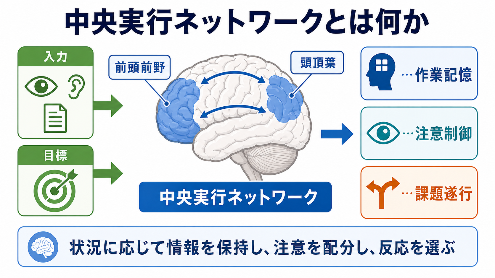
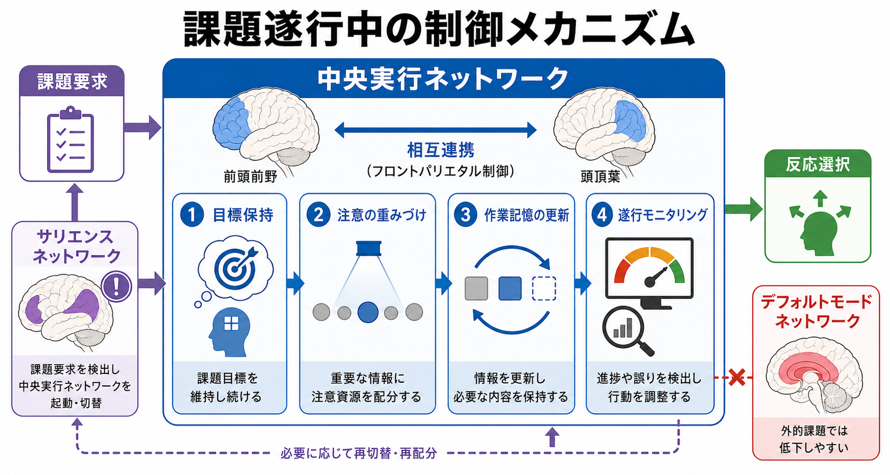

# 中央実行ネットワークとは何か

## 要点

- 中央実行ネットワーク（central executive network; CEN）は、背外側前頭前野と後部頭頂皮質を中心に、目標保持、作業記憶、注意配分、反応選択を支える大規模脳ネットワークである[1][2]。
- 認知神経科学では、CEN は「前頭頭頂ネットワーク」「前頭頭頂制御ネットワーク」「executive-control network」とかなり重なって使われる。ただし、研究ごとに領域定義や解析手法は異なる[2][3]。
- 課題が難しくなると、前頭・頭頂領域を含む multiple-demand system が広く動員され、多様な課題要求にまたがる汎用的な制御を担うと考えられている[4]。
- CEN は単独で働くのではなく、[[サリエンスネットワークとは何か|サリエンスネットワーク]]、デフォルトモードネットワーク（DMN）と相互作用する。重要な課題要求が検出されると、外的課題へ制御を寄せ、DMN 活動は低下しやすい[5][6]。
- 臨床・精神医学研究では、CEN の機能結合や課題時活動は実行機能障害の候補機序として扱われるが、個別診断や治療方針を単独で決める指標ではない[5][7]。

## この記事で答える問い

1. 中央実行ネットワークは、どの脳領域からなるのか。
2. 作業記憶・注意制御・課題遂行とどう関係するのか。
3. 前頭頭頂ネットワーク、multiple-demand system、三大ネットワークモデルとはどう違うのか。
4. 臨床・研究でこの概念を使うとき、何に注意すべきか。

## まず結論

中央実行ネットワークは、「いま何をするべきか」を保ち、その目標に合う情報へ注意を向け、必要な情報を作業記憶で更新し、反応を選ぶための前頭頭頂系である。背外側前頭前野は課題ルールや目標を保持し、頭頂皮質は注意の配分や空間・刺激情報の選択に関わる。両者の相互連携によって、目の前の入力、内的目標、運動・言語・記憶系などが課題文脈に沿って組み替えられる[1][2]。

ただし、CEN を「脳の社長」や「意志の座」として実体化しすぎると誤解しやすい。実際には、CEN は複数の皮質領域が課題要求に応じて結合様式を変えるネットワークであり、[[神経回路とは何か|神経回路]]の階層的・分散的な制御の一部である。情動、身体状態、報酬、習慣、環境の手がかりも行動を強く左右する。

## 背景

認知制御の古典的な考え方では、前頭前野は目標やルールを能動的に保持し、それに沿って他の脳領域の情報処理をバイアスする領域として整理されてきた[1]。たとえば「赤い文字だけを読む」「誘惑を無視して作業を続ける」「途中でルールが変わったら切り替える」といった場面では、単に刺激へ反射的に反応するだけでは不十分である。現在の目標に照らして、どの情報を重視し、どの反応を抑えるかを決める必要がある。

fMRI 研究が進むと、こうした制御は前頭前野だけではなく、頭頂皮質を含む前頭頭頂ネットワークとして観察されることが明確になった。安静時機能結合研究では、1,000人規模のデータから、感覚運動ネットワーク、注意ネットワーク、デフォルトネットワーク、前頭頭頂制御ネットワークなどの大規模ネットワークが再現的に分割されている[3]。この文脈で、CEN は「課題遂行時に外界へ向いた制御を支えるネットワーク」として位置づけられる。

一方で、課題時活動の観点からは、前頭・頭頂領域を中心とする multiple-demand system という概念も重要である。これは、ワーキングメモリ、推論、ルール切替、注意制御など、多様な認知的負荷で共通して動員される領域群を指す[4]。CEN と multiple-demand system は完全に同義ではないが、どちらも「特定の内容領域に閉じない、汎用的な課題制御」を考えるうえで近い概念である。

## 基本概念

### 中央実行ネットワークの主な構成

CEN の中核としてよく挙げられるのは、背外側前頭前野（dorsolateral prefrontal cortex; dlPFC）と後部頭頂皮質（posterior parietal cortex; PPC）である[2][5]。研究によっては、下前頭接合部、前頭眼野、前補足運動野、背側前帯状皮質、外側頭頂皮質などが含まれることもある。これは、脳ネットワークの境界が固定された解剖学的線ではなく、解析手法、課題、閾値、個人差によって変わるためである。

背外側前頭前野は、現在の目標、課題ルール、文脈情報を保持し、それに基づいて下流領域の処理を調整する役割をもつと整理される[1]。後部頭頂皮質は、注意の向け先、刺激の優先順位、視空間情報、行動に必要な選択肢の表現と関わる。両者は相互に連携し、入力と目標を結びつける。

### 「中央実行」という名前の注意点

「中央実行」という言葉は、作業記憶モデルの central executive を連想させる。心理学では、中央実行系は情報保持だけでなく、注意の配分、抑制、更新、二重課題調整などを担う制御機構として扱われてきた。脳ネットワークとしての CEN は、この心理学的機能を前頭頭頂系に対応づける便利な概念である。

ただし、心理学モデルの central executive と、fMRI で定義される central executive network は一対一対応ではない。前者は機能的な概念であり、後者は神経活動・機能結合から推定されるネットワークである。記事内では、両者を混同しないため、脳ネットワークとしての CEN を中心に扱う。

## 仕組み

### 1. 目標を保持する

課題遂行には、刺激そのものよりも「いまのルール」が重要になる場面が多い。たとえば同じ赤い信号でも、実験課題では「赤なら左」「赤なら押さない」など、文脈によって意味が変わる。前頭前野の認知制御理論では、前頭前野が目標やルールを活動パターンとして保持し、その情報が他領域の処理を方向づけると考える[1]。

この保持は、単なる短期保存ではない。CEN は、保持した目標をもとに、感覚入力、記憶、反応選択を再構成する。[[ノルアドレナリンは覚醒とストレスにどう関わるのか]]で扱うように、前頭前野の作業記憶・注意制御は覚醒水準やストレスにも影響されるため、同じ課題でも状態によって遂行は変わる。

### 2. 注意の重みづけを変える

CEN は、課題に関係する刺激や特徴を優先し、関係しない情報の影響を相対的に弱める。これは「注意を向ける」という主観的表現の背後で、感覚領域や記憶領域の処理が課題目標に沿って重みづけられることを意味する。前頭頭頂系は、視覚探索、空間注意、反応選択、課題切替などで繰り返し関与が報告されている[2][4]。

[[アセチルコリンは注意や記憶にどう関わるのか]]で扱われるコリン作動性調節も、注意や記憶の精度に関わる。したがって、CEN は孤立した制御装置ではなく、神経修飾系や感覚・運動ネットワークと結びついた制御回路として読む必要がある。

### 3. 作業記憶を更新する

作業記憶では、保持すべき情報を残し、不要になった情報を捨て、新しい情報を取り込む必要がある。CEN はこの更新過程に関わる。課題が変わると、前頭頭頂ネットワークの結合パターンも変わり、どの領域と協調するかが課題要求に応じて再構成される[2]。

Cole らの研究は、前頭頭頂ネットワークが「柔軟なハブ」として、課題状態に応じて他のネットワークとの機能結合を変える可能性を示した[2]。これは、CEN が一つの固定機能だけを担うというより、視覚、運動、記憶、言語などの処理系を課題文脈に応じて編成するという見方につながる。

### 4. 遂行をモニタリングし、反応を調整する

課題中には、間違い、遅れ、葛藤、予想外の入力が生じる。CEN は、こうした変化に応じて目標や反応を更新する。multiple-demand system の考え方では、前頭頭頂領域は複雑な行動を下位課題へ分け、現在の認知操作に焦点を合わせ、次の操作へ素早く切り替えることに関わる[4]。

この過程では、[[サリエンスネットワークとは何か|サリエンスネットワーク]]との関係が重要である。サリエンスネットワークは、前部島皮質や背側前帯状皮質を中心に、重要な変化や課題要求を検出し、CEN と DMN の切り替えに関与するとされる[6]。

## 図解

図1は、CEN を「入力・目標・前頭頭頂連携・出力」の流れとして示している。重要なのは、CEN が作業記憶、注意制御、課題遂行を別々に担当する箱ではなく、同じ課題文脈の中で結びつけるネットワークだという点である。

図2は、課題要求が検出され、CEN が目標保持、注意の重みづけ、作業記憶の更新、遂行モニタリングを行う流れを示す。サリエンスネットワークは、課題要求や予想外の変化を拾い、CEN の動員に関わる。DMN は外的課題に集中すると相対的に低下しやすいが、完全に「停止」するわけではない。

図3は、CEN、DMN、サリエンスネットワークの比較である。CEN は外向き注意と課題遂行、DMN は内省・自己関連処理・記憶、サリエンスネットワークは重要性検出と切り替えに関わると大づかみに理解できる。ただし実際の脳活動は連続的で重なりもあり、三つのネットワークが常に完全に分離しているわけではない[5][6]。

## 臨床・研究との接続

精神医学・臨床神経科学では、CEN は実行機能障害、注意制御困難、作業記憶低下、認知的柔軟性の低下を考えるための候補ネットワークとして使われる。Menon の三大ネットワークモデルでは、CEN、DMN、サリエンスネットワークのアクセス・関与・離脱の不調が、統合失調症、うつ、不安、認知症、自閉スペクトラムなどの幅広い病態理解に関わる可能性が論じられた[5]。

また、前頭頭頂制御システムの異常は、複数の精神疾患を横断する実行制御の脆弱性として検討されている[7]。この見方は、診断名ごとに脳部位を一対一対応させるのではなく、認知制御、情動調整、自己関連処理などの機能次元から病態を理解する方向に近い。

ただし、CEN の活動や機能結合をそのまま個人の能力、意志、病気の有無に読み替えることはできない。fMRI のネットワーク指標は、解析パイプライン、課題、サンプル、状態、薬物、睡眠、運動、発達段階などの影響を受ける。臨床的には、教育・研究目的の概念として扱い、個別診断や治療指示として断定しないことが重要である。

## よくある誤解

### 誤解1: 中央実行ネットワークは「意思決定の司令塔」である

CEN は目標保持や制御に関わるが、行動は CEN だけで決まらない。報酬系、扁桃体、海馬、運動系、自律神経、身体状態、習慣、社会的文脈も行動に影響する。CEN はそれらを上から命令する単一中枢ではなく、課題文脈に応じて他ネットワークと協調する制御ネットワークである。

### 誤解2: CEN が強いほど常に良い

課題に集中すると CEN 活動は高まりやすいが、常に高ければよいわけではない。休息、内省、記憶想起、創造的連想では DMN 側の処理も重要である。重要なのは、CEN、DMN、サリエンスネットワークが状況に応じて柔軟に切り替わることである[5][6]。

### 誤解3: CEN と前頭頭頂ネットワークは完全に同じである

多くの文献で重なって使われるが、完全な同義語ではない。CEN は三大ネットワークモデルや実行機能の文脈で使われやすく、前頭頭頂ネットワークは機能結合・課題活動・ネットワーク分割の文脈で広く使われる。研究ごとの定義を確認する必要がある[2][3]。

### 誤解4: ネットワーク名がわかれば心理状態を診断できる

これは危険な単純化である。CEN の結合低下や活動変化は研究上の仮説や群差として意味をもつことがあるが、個人の診断や治療方針を単独で決めるものではない。ネットワーク指標は、行動指標、症状評価、発達歴、環境要因、縦断変化と合わせて慎重に解釈する。

## 関連ノート

- [[サリエンスネットワークとは何か]]: CEN と DMN の切り替えを考えるうえで重要。
- [[神経回路とは何か]]: ネットワークを、単一部位ではなく接続と活動パターンとして読むための基礎。
- [[ノルアドレナリンは覚醒とストレスにどう関わるのか]]: 前頭前野の作業記憶・注意制御と覚醒水準の関係。
- [[アセチルコリンは注意や記憶にどう関わるのか]]: 注意・記憶を支える神経修飾系との接続。
- [[ガンマ振動は認知機能にどう関わるのか]]: 局所回路の同期と認知機能をつなぐ視点。

### 関連ノート候補

- デフォルトモードネットワークとは何か
- 前頭前野とは何か
- 作業記憶とは何か
- 認知制御とは何か
- 実行機能とは何か
- 前頭頭頂ネットワークとは何か

### MOC更新候補

- `content/00_MOC/MOC｜脳・神経科学.md`
- `content/00_MOC/MOC｜認知科学・心理学.md`

## 理解チェック

1. 中央実行ネットワークの中核としてよく挙げられる二つの皮質領域は何か。
2. CEN が「作業記憶を支える」と言うとき、単なる情報保存以上に何をしているか。
3. サリエンスネットワークは、CEN と DMN の関係でどのような役割をもつと考えられているか。
4. CEN の活動変化を、個人の診断や治療指示として単純に使えない理由は何か。

## 未解決問題

- CEN、前頭頭頂ネットワーク、multiple-demand system の境界を、個人差を含めてどこまで統一的に定義できるか。
- 安静時機能結合で見えるネットワークと、課題時に必要な制御過程をどのように対応づけるべきか。
- CEN の変化が精神疾患の原因、結果、補償、状態依存変化のどれを反映するのか。
- 薬物、睡眠、ストレス、発達、学習が CEN の柔軟性にどう影響するか。

## 参考文献

[1] Miller, E. K., & Cohen, J. D. (2001). An integrative theory of prefrontal cortex function. *Annual Review of Neuroscience*, 24, 167-202. https://doi.org/10.1146/annurev.neuro.24.1.167

[2] Cole, M. W., Reynolds, J. R., Power, J. D., Repovs, G., Anticevic, A., & Braver, T. S. (2013). Multi-task connectivity reveals flexible hubs for adaptive task control. *Nature Neuroscience*, 16, 1348-1355. https://doi.org/10.1038/nn.3470

[3] Yeo, B. T. T., Krienen, F. M., Sepulcre, J., Sabuncu, M. R., Lashkari, D., Hollinshead, M., et al. (2011). The organization of the human cerebral cortex estimated by intrinsic functional connectivity. *Journal of Neurophysiology*, 106(3), 1125-1165. https://doi.org/10.1152/jn.00338.2011

[4] Duncan, J. (2010). The multiple-demand (MD) system of the primate brain: mental programs for intelligent behaviour. *Trends in Cognitive Sciences*, 14(4), 172-179. https://doi.org/10.1016/j.tics.2010.01.004

[5] Menon, V. (2011). Large-scale brain networks and psychopathology: a unifying triple network model. *Trends in Cognitive Sciences*, 15(10), 483-506. https://doi.org/10.1016/j.tics.2011.08.003

[6] Sridharan, D., Levitin, D. J., & Menon, V. (2008). A critical role for the right fronto-insular cortex in switching between central-executive and default-mode networks. *Proceedings of the National Academy of Sciences*, 105(34), 12569-12574. https://doi.org/10.1073/pnas.0800005105

[7] Cole, M. W., Repovs, G., & Anticevic, A. (2014). The frontoparietal control system: a central role in mental health. *The Neuroscientist*, 20(6), 652-664. https://doi.org/10.1177/1073858414525995

[8] Seeley, W. W., Menon, V., Schatzberg, A. F., Keller, J., Glover, G. H., Kenna, H., Reiss, A. L., & Greicius, M. D. (2007). Dissociable intrinsic connectivity networks for salience processing and executive control. *Journal of Neuroscience*, 27(9), 2349-2356. https://doi.org/10.1523/JNEUROSCI.5587-06.2007
