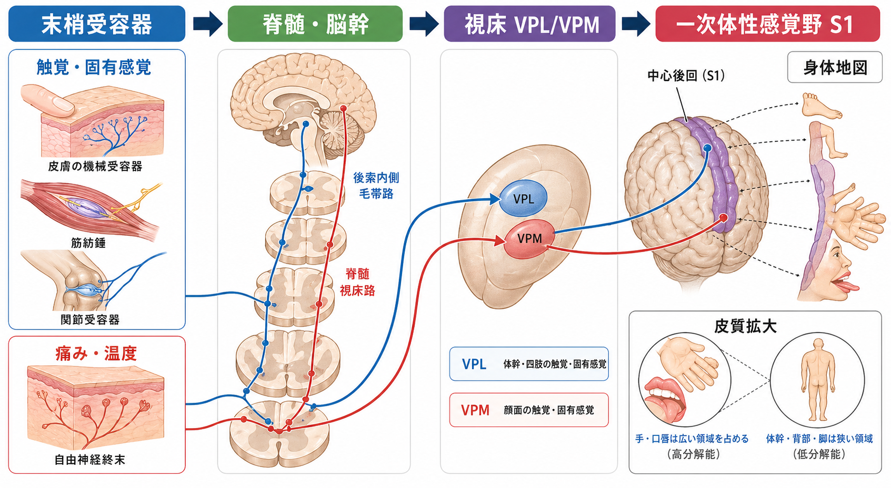
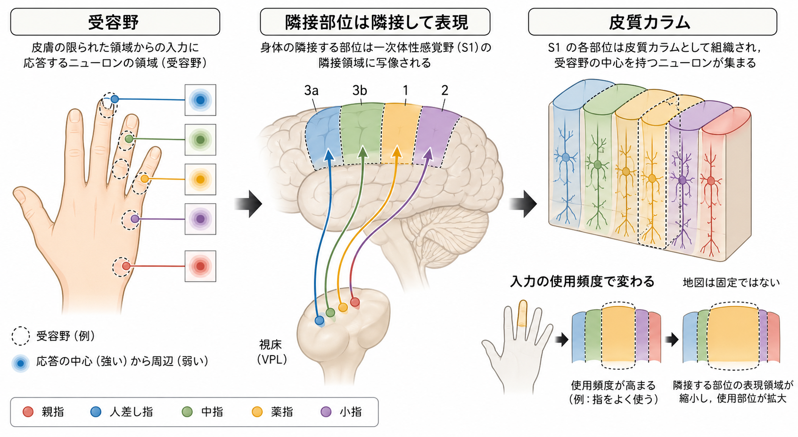

# 体性感覚ネットワークは身体情報をどう表現するのか

## 要点

- 体性感覚ネットワークは、皮膚・筋・関節・内臓に由来する入力を、末梢神経、脊髄・脳幹、視床、一次体性感覚野（S1）へ段階的に中継する。
- 精密触覚、振動覚、意識できる固有感覚は主に後索内側毛帯路を通り、痛み・温度は主に脊髄視床路を通る。どちらも視床の腹側後核群を経て皮質へ届くが、交叉の位置や脊髄での処理が異なる[1][2]。
- S1 では身体表面が連続的な地図として表現される。ただし地図は身体の実寸大ではなく、手指・口唇のように高解像度の入力をもつ部位ほど広い皮質領域を占める[3][4]。
- S1 は単一の均質な領域ではなく、3a、3b、1、2 などのサブ領域が、皮膚入力、固有感覚、形状・運動情報を段階的に統合する[5][6]。
- 身体地図は固定配線ではない。末梢入力の喪失、使用頻度、学習に応じて、受容野や表現領域は変化しうる[7][8]。

## この記事で答える問い

体性感覚は「身体のどこが、どのように触れられ、動いているか」をどうやって脳内表現に変換しているのか。この記事では、末梢受容器から視床、S1 までの経路をたどりながら、身体地図、受容野、皮質カラム、可塑性という 4 つの観点で整理する。

## まず結論

体性感覚ネットワークは、身体情報を単なる点の集合としてではなく、**身体部位、感覚モダリティ、空間的近接性、入力の信頼度、行動上の重要性**を反映した多層的な地図として表現する。

この地図の基本単位は、末梢では受容器と感覚線維、脊髄・脳幹では上行路、視床では中継核、皮質では受容野と皮質カラムである。S1 の身体地図は「足は内側、顔は外側」というように大まかな体部位順序を保つが、皮質面積は身体の大きさではなく、入力密度と識別精度に強く左右される[3][4]。そのため、身体地図は解剖学的な縮尺図ではなく、感覚探索と行動制御のための機能地図である。

## 背景

体性感覚は、触覚、圧覚、振動覚、痛み、温度、固有感覚などを含む。視覚や聴覚が外界の物体や音源を中心に表現するのに対して、体性感覚は「身体そのもの」を座標系として使う。したがって、体性感覚の問題は、刺激の種類を検出する問題であると同時に、身体部位の位置関係を保ったまま情報を並べ替える問題でもある。

この身体座標の考え方は、Penfield と Boldrey による電気刺激研究で有名になった。彼らは大脳皮質の刺激によって生じる感覚・運動経験を調べ、中心後回付近に身体部位ごとの秩序だった表現があることを示した[3]。ただし、現在の理解では、ホムンクルスは固定された「小人」ではなく、複数の皮質領域にまたがる動的な表現の一部として捉える方がよい。

この点は、[[脳内ネットワークとは何か]]や[[神経回路とは何か]]で扱う「ネットワークとしての脳」とつながる。体性感覚の身体地図は、末梢から皮質へ一方向に写し取られるだけでなく、注意、運動、予測、学習によって調節される。

## 基本概念

### 受容器とモダリティ

皮膚の機械受容器は、圧、振動、皮膚伸展、接触の時間変化などを異なる時間・空間特性で符号化する。筋紡錘や腱器官、関節受容器は、筋長、張力、関節位置などを通じて固有感覚に寄与する。侵害受容器と温度受容器は、組織損傷の危険や温度変化を反映する[1][2]。

重要なのは、受容器が「触れた」という抽象的な事実を送っているわけではないことだ。末梢から上行する信号は、線維径、発火頻度、時間パターン、投射先によって、どの種類の感覚で、どの身体部位に由来するかを区別できるように組織されている。

### 受容野

受容野とは、あるニューロンの発火を変化させる身体表面または筋・関節の領域である。指先のように高解像度の識別が必要な部位では、末梢受容器が密で、皮質ニューロンの受容野も相対的に小さくなりやすい。S1 の area 3b では、指腹上の細かな刺激配置に対する受容野構造が詳細に調べられている[6]。

受容野は「ひとつの点」ではない。中心部では刺激に強く応答し、周辺部では弱く応答したり、抑制性の影響を受けたりする。こうした構造は、刺激位置やエッジ、運動方向、テクスチャを識別するための前処理になる。

### 身体地図と皮質拡大

身体地図とは、隣り合う身体部位が神経系の中でもおおむね隣り合って表現される構造である。後索、内側毛帯、視床、S1 では、完全に同一ではないものの、体部位の順序が保存される[1][2]。

ただし、皮質地図は身体の幾何学的な面積をそのまま写すものではない。手指や口唇は身体全体から見れば小さいが、触覚識別や探索行動で重要なため、S1 では広い領域を占める[3][4]。これを皮質拡大と呼ぶ。

## 仕組み

### 1. 後索内側毛帯路：精密触覚と固有感覚の高解像度経路

精密触覚、振動覚、二点弁別、意識できる固有感覚の多くは、後索内側毛帯路を通る。一次求心性線維の細胞体は後根神経節にあり、末梢の受容器から入力を受けた軸索は脊髄後索を同側性に上行する。下肢由来の線維は薄束、上肢由来の線維は楔状束を通り、延髄の薄束核・楔状束核で二次ニューロンに中継される[1]。

二次ニューロンの軸索は延髄で交叉し、内側毛帯として上行する。最終的に視床の VPL に投射し、そこから内包を経て中心後回の S1 に至る[1][2]。この経路では、体部位の順序が比較的よく保たれるため、皮質で身体地図を形成しやすい。

### 2. 脊髄視床路：痛み・温度の警告経路

痛みと温度の主要な上行路は脊髄視床路である。侵害受容器や温度受容器からの入力は脊髄後角で早く中継され、比較的低いレベルで反対側へ交叉してから前外側系を上行する[2]。この経路も視床を経て皮質へ届くが、痛みは単なる位置情報ではなく、情動、注意、自律反応、運動回避と結びつきやすい。

そのため、痛みの皮質表現は S1 だけで完結しない。S1 は位置や強度の識別に関わるが、島皮質、帯状皮質、前頭前野なども、痛みの主観的なつらさや行動選択に関与する。この記事では基礎経路に絞るが、臨床的な痛みを考えるときには、体性感覚ネットワークをより広い[[脳内ネットワークとは何か]]の文脈で見る必要がある。

### 3. 視床：単なる中継所ではなく、身体地図のゲート

体性感覚入力は視床の腹側後核群に集まる。身体由来の入力は主に VPL、顔面由来の入力は主に VPM に入り、そこから S1 へ投射する[2]。視床は情報を皮質へ渡すだけでなく、睡眠覚醒状態、注意、皮質からのフィードバックによって入力の通し方を調節する。

このため、視床は「身体地図の中継核」であると同時に、「いま皮質へ届けるべき身体情報を選ぶゲート」でもある。感覚入力が同じでも、注意を向けているとき、能動的に触っているとき、睡眠に入る直前では、皮質に届く情報の重みは変わりうる。

### 4. S1：3a、3b、1、2 の分業と統合

S1 は中心後回を中心とする領域で、Brodmann area 3a、3b、1、2 を含むとされる。霊長類研究では、3b と 1 が皮膚入力を中心とした身体表面の表現をもち、3a と 2 は筋・関節由来の固有感覚や深部入力と関係するという分業が示されている[5]。

ただし、分業は完全な分離ではない。たとえば area 3b は古典的には皮膚入力の初期中継として説明されるが、近年の研究では複数指や時空間的な情報統合にも関わる可能性が示されている[6]。S1 は、末梢入力をそのまま映す受動的な投影面ではなく、触覚対象を識別するための初期計算を行う皮質ネットワークである。

### 5. 皮質カラム：地図を縦方向にも読む

S1 の表現は、皮質表面上の 2 次元地図だけでは説明しきれない。皮質には層構造があり、視床入力、皮質内処理、他領域への出力が層ごとに異なる。さらに、近い受容野や似た入力特性をもつニューロンが縦方向にまとまる[[皮質カラムとは何か]]という見方も重要である。

したがって、身体情報は「皮質表面上の位置」と「皮質層・カラム内の処理」という 2 つの軸で表現される。ある指先の入力は、S1 の特定の場所に届くだけでなく、視床入力を受ける層、局所抑制、水平結合、上位皮質への出力を通じて、触覚特徴として再構成される。

### 6. 可塑性：身体地図は経験で更新される

身体地図は発達で作られたあと完全に固定されるわけではない。末梢神経損傷や除神経の後には、隣接する身体部位の入力が、入力を失った皮質領域を占めるように見える再編成が報告されている[7]。また、行動的に制御された触覚刺激の反復によって、成体の S1 表現が変化することも示されている[8]。

ただし、可塑性を「どんな地図でも自由に書き換えられる」と理解するのは誤りである。再編成の範囲、時間経過、行動上の意味は、残存入力、皮質内結合、視床・脳幹レベルの変化、注意や学習条件に依存する。ここは[[シナプス可塑性とは何か]]や[[神経可塑性は発達と学習をどう支えるのか]]と接続して理解するとよい。

## 図解

| 図 | 読み取り方 |
|---|---|
| 全体概念図 | 末梢受容器から脊髄・脳幹、視床 VPL/VPM、S1 へ至る段階的な中継を示す。触覚・固有感覚と痛み・温度は経路が異なるが、身体部位の秩序を保ちながら皮質表現へ向かう。 |
| メカニズム図 | 指先の受容野、視床から S1 への投射、3a/3b/1/2 のサブ領域、皮質カラム、使用頻度による地図変化をまとめる。 |

## 臨床・研究との接続

臨床神経学では、どの感覚が、身体のどこで、どのように失われたかを調べることで、病変部位の推定に役立てる。たとえば、振動覚や位置覚の障害は後索内側毛帯路、痛み・温度の障害は脊髄視床路との関連を考える。ただし、個別の症状から診断を断定することはできず、神経診察、画像検査、電気生理検査などを合わせて判断される。

研究面では、体性感覚ネットワークは「身体所有感」「能動的触覚」「道具使用」「痛みの慢性化」「義手・ブレインマシンインターフェース」と深く関係する。身体地図がどの程度安定し、どの条件で更新されるかは、リハビリテーションや神経補綴を考えるうえでも重要な問題である。

## よくある誤解

### 誤解 1：ホムンクルスは脳内に固定された小人である

ホムンクルスは教育的には有用だが、実際の S1 表現は複数のサブ領域、層、カラム、上位体性感覚野との相互作用から成る。固定された小人というより、入力密度と行動経験を反映する機能地図である。

### 誤解 2：S1 は末梢入力をそのままコピーしている

S1 は末梢信号の単純な写しではない。受容野、抑制、サブ領域間の連結、フィードバックによって、位置、強度、形状、運動、身体姿勢に関する情報を再構成している。

### 誤解 3：痛みも触覚と同じ地図だけで説明できる

痛みには身体部位の識別という側面がある一方で、警告、情動、注意、回避行動が強く関わる。そのため、S1 の身体地図だけでは慢性痛や痛みのつらさを説明しきれない。

### 誤解 4：可塑性があるなら、訓練すれば地図は自由に変えられる

可塑性は制約をもつ。変化は入力の種類、残存経路、年齢、学習条件、注意、損傷の範囲に依存する。可塑性は万能な書き換え能力ではなく、既存回路が経験に応じて重みを変える性質である。

## 関連ノート

- [[神経回路とは何か]]
- [[脳内ネットワークとは何か]]
- [[皮質カラムとは何か]]
- [[シナプス可塑性とは何か]]
- [[神経可塑性は発達と学習をどう支えるのか]]
- [[神経細胞の種類はどのように分類されるのか]]

MOC 更新候補: [[MOC｜脳・神経科学]]、[[MOC｜基礎神経科学]]

## 理解チェック

1. 後索内側毛帯路と脊髄視床路は、どの感覚モダリティを主に運ぶか。
2. VPL と VPM は、それぞれどの身体領域の入力と関係するか。
3. S1 の身体地図で手指や口唇が広い領域を占めるのはなぜか。
4. 受容野と身体地図はどのように違うか。
5. 体性感覚地図の可塑性を、固定地図説と万能可塑性説のどちらにも偏らず説明するとどうなるか。

## 参考文献

[1] Purves D, Augustine GJ, Fitzpatrick D, et al., editors. *Neuroscience. 2nd edition.* The Major Afferent Pathway for Mechanosensory Information: The Dorsal Column-Medial Lemniscus System. NCBI Bookshelf, 2001. https://www.ncbi.nlm.nih.gov/books/NBK11142/

[2] Purves D, Augustine GJ, Fitzpatrick D, et al., editors. *Neuroscience. 2nd edition.* The Somatic Sensory Components of the Thalamus. NCBI Bookshelf, 2001. https://www.ncbi.nlm.nih.gov/books/NBK10950/

[3] Penfield W, Boldrey E. Somatic motor and sensory representation in the cerebral cortex of man as studied by electrical stimulation. *Brain*, 60(4), 389-443, 1937. https://doi.org/10.1093/brain/60.4.389

[4] StatPearls. Neuroanatomy, Somatosensory Cortex. NCBI Bookshelf. https://www.ncbi.nlm.nih.gov/books/NBK555915/

[5] Kaas JH. The functional organization of somatosensory cortex in primates. *Annals of Anatomy*, 175(6), 509-518, 1993. https://doi.org/10.1016/S0940-9602(11)80212-8

[6] DiCarlo JJ, Johnson KO, Hsiao SS. Structure of receptive fields in area 3b of primary somatosensory cortex in the alert monkey. *Journal of Neuroscience*, 18(7), 2626-2645, 1998. https://doi.org/10.1523/JNEUROSCI.18-07-02626.1998

[7] Merzenich MM, Kaas JH, Wall J, Nelson RJ, Sur M, Felleman D. Topographic reorganization of somatosensory cortical areas 3b and 1 in adult monkeys following restricted deafferentation. *Neuroscience*, 8(1), 33-55, 1983. https://doi.org/10.1016/0306-4522(83)90024-6

[8] Jenkins WM, Merzenich MM, Ochs MT, Allard T, Guic-Robles E. Functional reorganization of primary somatosensory cortex in adult owl monkeys after behaviorally controlled tactile stimulation. *Journal of Neurophysiology*, 63(1), 82-104, 1990. https://doi.org/10.1152/jn.1990.63.1.82

## 未解決問題

- S1 の身体地図と S2、後部頭頂皮質、島皮質の表現は、能動的触覚の中でどのように統合されるのか。
- 慢性痛や幻肢痛で観察される身体表現の変化は、原因、結果、補償反応のどれとして理解すべきか。
- 触覚訓練、リハビリテーション、神経補綴は、どの条件で S1 の可塑性を機能回復に結びつけられるのか。
