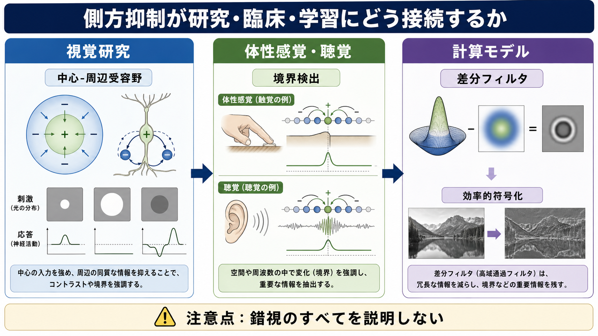
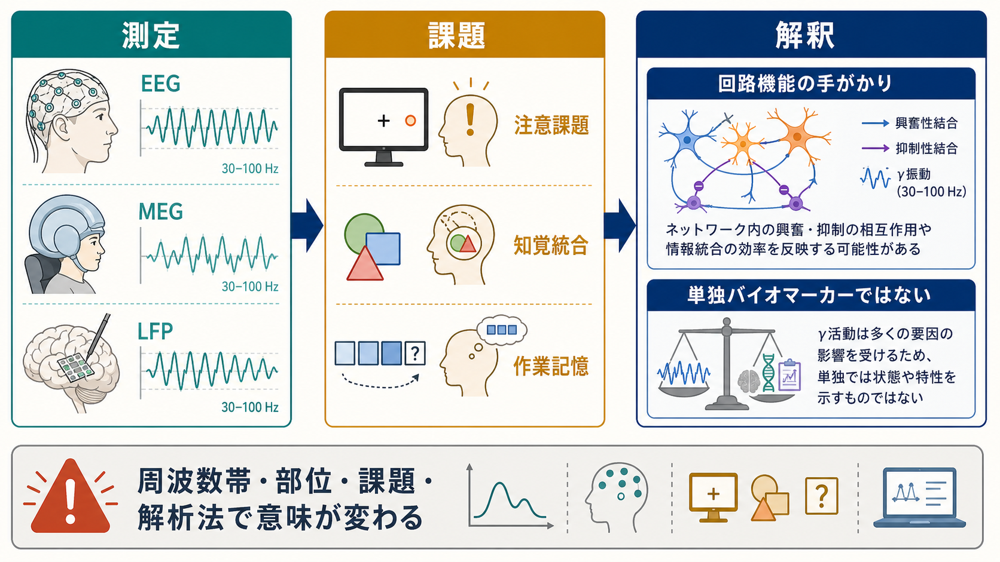

# 側方抑制はなぜコントラストを強調するのか

## 要点

- 側方抑制とは、ある感覚ニューロンの活動が、近くのニューロンの活動を抑える局所回路のことである。
- 入力が一様な場所では、近傍からの抑制もほぼ一様なので出力差は小さい。
- 明暗や圧力などが急に変わる境界では、左右から受ける抑制量が非対称になり、境界近くの出力差が広がる。
- 網膜では中心-周辺受容野や水平細胞・アマクリン細胞を含む回路が、このような空間的な差分処理に関わる。
- 側方抑制は錯視の一部を説明するが、知覚全体を単独で説明する万能原理ではない。

## この記事で答える問い

「隣のニューロンを抑える」と聞くと、活動が弱くなって情報が失われるように見える。では、なぜ側方抑制はむしろ輪郭やコントラストを鮮明にするのか。このノートでは、[[神経回路とは何か]]、[[興奮性ニューロンと抑制性ニューロンは回路内でどう協調するのか]]、[[介在ニューロンは神経回路で何をしているのか]]と接続しながら、感覚入力を「そのまま写す」のではなく「変化を目立たせる」回路として側方抑制を整理する。

## まず結論

側方抑制がコントラストを強調する理由は、近傍の平均的な入力を差し引くことで、空間的にゆっくり変わる成分を弱め、急に変わる境界成分を残すからである。単純化すれば、各位置の出力は次のように表せる。

$$
y_i = x_i - w(x_{i-1} + x_{i+1})
$$

ここで $x_i$ は位置 $i$ の入力、$y_i$ は出力、$w$ は近傍からの抑制の強さである。入力が平坦なら $x_i$ と近傍入力は似ているため差し引き後の変化は小さい。境界では、明るい側の細胞は暗い側からの抑制が相対的に弱く、暗い側の細胞は明るい側からの抑制が相対的に強くなる。その結果、境界の明るい側はより強く、暗い側はより弱く表現され、出力上の差が拡大する。

## 背景

側方抑制は、視覚研究、とくにカブトガニの複眼や哺乳類網膜の研究から古典的に調べられてきた。Hartline らはカブトガニの個眼で、ある受容単位の活動が周囲の受容単位の応答を抑えることを示し、隣接ユニット間の抑制的相互作用が明暗境界の強調に関わることを明らかにした [1]。Kuffler は哺乳類網膜の神経節細胞に、中心部と周辺部が逆の符号で作用する受容野、すなわち中心-周辺型の受容野があることを示した [2]。

この発見は重要である。網膜はカメラのフィルムのように光をそのまま写しているのではなく、すでに局所的な比較を行っている。視覚系に入る最初期の段階から、[[ニューロンは複数の入力をどのように統合するのか]]という問題は、単なる加算ではなく、興奮と抑制のバランスとして現れる。

## 基本概念

### 側方抑制

側方抑制とは、あるニューロンまたは受容単位が、近傍のニューロンの活動を抑える回路機構である。ここでいう「側方」は、物理的な横方向だけでなく、感覚地図上で近い位置、近い周波数、近い特徴をもつユニット間の局所的な相互作用を指す。

### 中心-周辺受容野

網膜神経節細胞では、受容野の中心に光を当てると発火が増え、周辺に光を当てると発火が減る「ON中心/OFF周辺」型、またはその逆の「OFF中心/ON周辺」型が見られる [2]。この構造により、細胞は絶対的な明るさよりも、中心と周辺の差に敏感になる。これは[[EPSPとIPSPはどのように発火を調節するのか]]で扱う興奮性入力と抑制性入力の統合を、空間的な感覚処理に拡張した例である。

### 差分フィルタとしての見方

数理的には、側方抑制は近傍平均を差し引く差分フィルタに近い。網膜モデルでは、中心の興奮性成分と周辺の抑制性成分を異なる幅のガウス関数で近似する Difference of Gaussians 型の表現がよく使われる。これは、滑らかな背景成分を弱め、輪郭や局所変化を残す処理として理解できる [6]。

## 仕組み

### 1. 一様な入力では差が消えやすい

均一な灰色面のように、隣り合う受容器への入力がほぼ同じ場合、それぞれの細胞は似た強さで近傍を抑制し合う。興奮も抑制も空間的にほぼ釣り合うため、出力には大きな境界信号が生まれない。これは「情報を消している」というより、冗長な一様成分を弱めていると考えられる。

### 2. 境界では抑制が非対称になる

明るい領域と暗い領域の境界を考える。明るい側の境界細胞は強く興奮するが、暗い側の隣接細胞から受ける抑制は相対的に弱い。反対に、暗い側の境界細胞は入力が弱いにもかかわらず、明るい側の隣接細胞から強い抑制を受ける。この非対称性により、明るい側の出力は相対的に高く、暗い側の出力は相対的に低くなる。

### 3. 網膜回路では水平細胞・アマクリン細胞が関わる

網膜では、光受容器、双極細胞、水平細胞、アマクリン細胞、神経節細胞が階層的かつ横方向に結合している。外網膜では水平細胞が光受容器・双極細胞系に横方向の相互作用を与え、内網膜ではアマクリン細胞が時間的・空間的な抑制を加える。外網膜の横方向相互作用については、水平細胞から錐体へのフィードバックを含む複数の機構が提案されており、単一のシナプス機構だけに還元しにくい [3][4]。

### 4. 変化を強調することは効率的でもある

自然画像には、隣接する点同士が似ているという強い冗長性がある。すべての画素の明るさを同じ重みで送るより、変化の大きい場所を強調したほうが、限られた神経資源で重要な情報を伝えやすい。効率的符号化の考え方では、感覚系は環境の統計構造に合わせて冗長性を減らし、予測しにくい差分を相対的に強調すると考えられる [5][6]。

## 図解

画像生成では、記事全体の概念地図と、研究・モデルへの接続図を作成した。機構を文章でさらに図解すると、次のようになる。

| 場面 | 近傍入力 | 抑制の釣り合い | 出力で起きること |
|---|---|---|---|
| 一様な明るさ | どの細胞も似た入力を受ける | 左右からの抑制がほぼ対称 | 変化は小さく、境界信号は弱い |
| 明るい側の境界 | 自分は強く、暗い側の隣は弱い | 暗い側からの抑制が弱い | 明るい側の応答が相対的に高くなる |
| 暗い側の境界 | 自分は弱く、明るい側の隣は強い | 明るい側からの抑制が強い | 暗い側の応答が相対的に低くなる |
| 境界全体 | 抑制が非対称 | 出力差が拡大 | コントラストや輪郭が強調される |

## 臨床・研究との接続

側方抑制は、視覚の基礎研究だけでなく、感覚過敏、疼痛、体性感覚の空間分解能、聴覚の周波数選択性などを考えるときの基本語彙になる。ただし、臨床的な症状を「側方抑制が強い/弱い」だけで説明するのは単純化しすぎである。実際の知覚には、末梢受容器、脊髄・脳幹・視床、皮質、注意、予測、学習、神経修飾が重なっている。

研究上は、側方抑制は「局所回路が入力の何を強調し、何を捨てるか」を考える入口になる。[[局所回路と長距離結合は何が違うのか]]や[[脳内ネットワークとは何か]]で扱うような広域ネットワークに進む前に、近傍相互作用だけでも感覚表現が大きく変わることを示す好例である。

## よくある誤解

### 誤解1: 側方抑制は情報を減らすだけである

側方抑制は入力の総量を減らすことがあるが、目的は単なる弱化ではない。隣接した似た情報を抑え、空間的な差を相対的に浮かび上がらせる。つまり、冗長性を減らし、境界情報を強調する処理である。

### 誤解2: 側方抑制だけで錯視をすべて説明できる

Mach band のような明暗境界の錯視は側方抑制で直感的に説明しやすいが、錯視全体はより複雑である。文脈、注意、奥行き、照明推定、経験、皮質処理も関わる。側方抑制は重要な部品だが、知覚全体の単独原因ではない。

### 誤解3: 抑制性ニューロンが常に悪い働きをしている

抑制は活動を止めるだけではない。タイミングを整え、発火の範囲を絞り、特徴選択性を作り、過剰な興奮を防ぐ。側方抑制は、[[GABAは脳で何をしているのか]]で扱う抑制性伝達が、情報処理そのものを形作る例である。

## 関連ノート

- [[神経回路とは何か]]
- [[興奮性ニューロンと抑制性ニューロンは回路内でどう協調するのか]]
- [[興奮性ニューロンと抑制性ニューロンは何が違うのか]]
- [[介在ニューロンは神経回路で何をしているのか]]
- [[EPSPとIPSPはどのように発火を調節するのか]]
- [[ニューロンは複数の入力をどのように統合するのか]]
- [[局所回路と長距離結合は何が違うのか]]
- [[脳内ネットワークとは何か]]

### MOC更新候補

- `content/00_MOC/MOC｜脳・神経科学.md`
- `content/00_MOC/MOC｜基礎神経科学.md`

### 今後の作成候補

- 視覚受容野とは何か
- 中心-周辺受容野とは何か
- Mach band 錯視とは何か
- 網膜はどのように画像を前処理するのか
- 効率的符号化仮説とは何か

## 理解チェック

1. 側方抑制では、なぜ一様な領域より境界で出力差が大きくなるのか。
2. 中心-周辺受容野は、絶対的な明るさではなく何に敏感な構造か。
3. 側方抑制で錯視のすべてを説明できない理由は何か。
4. 側方抑制を差分フィルタとして見ると、どのような情報が弱まり、どのような情報が残りやすいか。

## 参考文献

[1] Hartline, H. K., Wagner, H. G., & Ratliff, F. (1956). Inhibition in the eye of Limulus. *Journal of General Physiology*, 39(5), 651-673. https://doi.org/10.1085/jgp.39.5.651

[2] Kuffler, S. W. (1953). Discharge patterns and functional organization of mammalian retina. *Journal of Neurophysiology*, 16(1), 37-68. https://doi.org/10.1152/jn.1953.16.1.37

[3] Werblin, F. S., & Dowling, J. E. (1969). Organization of the retina of the mudpuppy, Necturus maculosus. II. Intracellular recording. *Journal of Neurophysiology*, 32(3), 339-355. https://doi.org/10.1152/jn.1969.32.3.339

[4] Thoreson, W. B., & Mangel, S. C. (2012). Lateral interactions in the outer retina. *Progress in Retinal and Eye Research*, 31(5), 407-441. https://doi.org/10.1016/j.preteyeres.2012.04.003

[5] Barlow, H. B. (1961). Possible principles underlying the transformations of sensory messages. In W. A. Rosenblith (Ed.), *Sensory Communication*. MIT Press. https://doi.org/10.7551/mitpress/9780262518420.003.0013

[6] Atick, J. J., & Redlich, A. N. (1992). What does the retina know about natural scenes? *Neural Computation*, 4(2), 196-210. https://doi.org/10.1162/neco.1992.4.2.196

