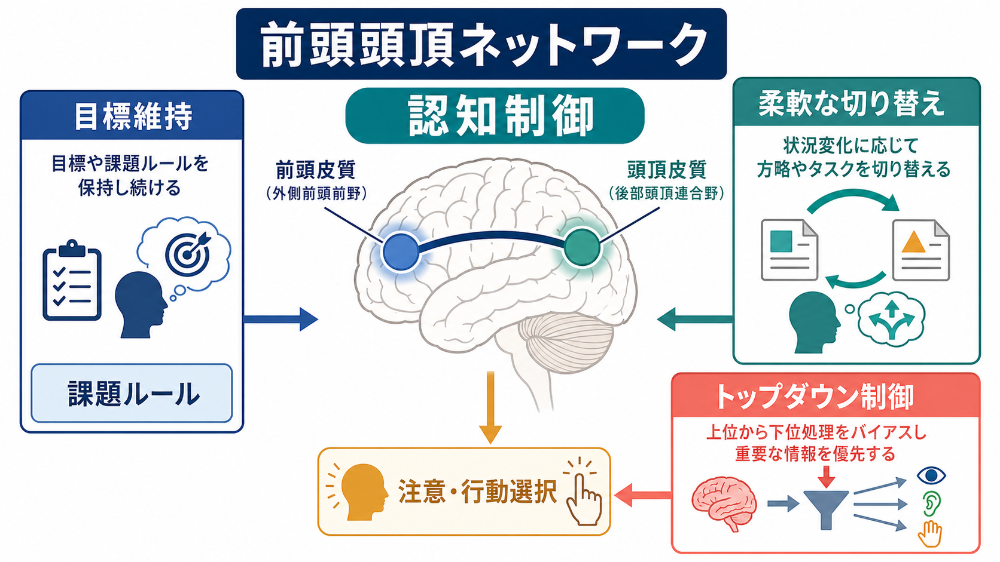
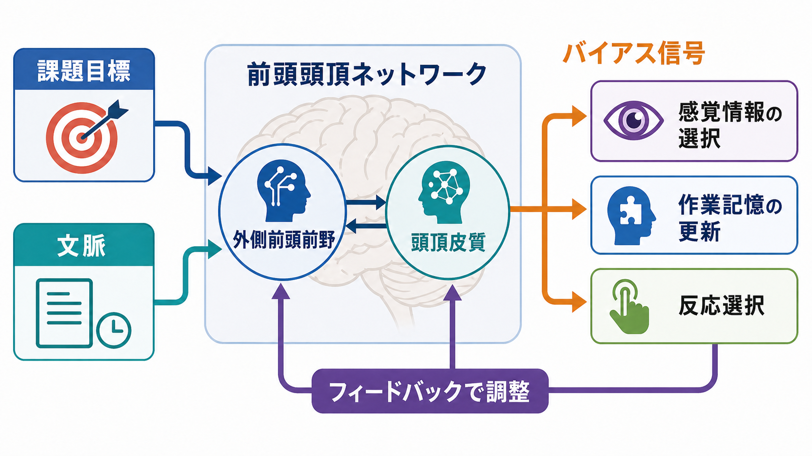
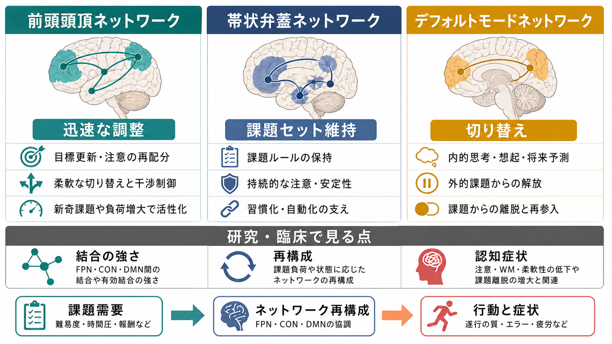

# 前頭頭頂ネットワークは認知制御をどう支えるのか

## 要点

- 前頭頭頂ネットワークは、外側前頭前野と後部頭頂皮質を中心に、課題目標、ルール、注意配分、反応選択を状況に応じて調整する大規模[[脳内ネットワークとは何か|脳内ネットワーク]]である[3][5]。
- 認知制御の中核は、目標を保持し、その目標に合う情報処理を強め、合わない処理を弱めるトップダウンのバイアスである[1]。
- 前頭頭頂ネットワークは、長時間安定して同じ課題セットを保つ装置というより、課題要求が変わったときにネットワーク全体の結合パターンを素早く組み替える「柔軟な調整役」として理解しやすい[3][6]。
- 実行機能、作業記憶、抑制、切り替え、計画などは完全に別々の部位で担われるのではなく、前頭・頭頂・帯状・島皮質などを含む上位の制御ネットワークが重なり合って支える[4]。
- 精神医学・神経疾患研究では、前頭頭頂ネットワークの結合や再構成が認知症状と関係づけられることがある。ただし、これは研究上の回路仮説であり、個別診断や治療指示を単独で決めるものではない[8]。

## この記事で答える問い

1. 前頭頭頂ネットワークとは、どのような脳領域のまとまりなのか。
2. 目標維持、柔軟な切り替え、トップダウン制御は、どのように結びつくのか。
3. 帯状弁蓋ネットワークやデフォルトモードネットワークとは何が違うのか。
4. 研究・臨床では、このネットワークをどのような注意つきで読むべきか。

## まず結論

前頭頭頂ネットワークは、脳の「課題に合わせて処理モードを組み替える仕組み」として理解するとよい。目の前の情報をそのまま処理するだけでは、私たちは「今は赤い刺激ではなく文字の意味に答える」「前のルールを捨てて新しいルールに従う」「誘惑される反応を抑えて目的に合う行動を選ぶ」といった制御を実行できない。

このとき、外側前頭前野は課題目標や文脈を保持し、頭頂皮質は注意配分、空間的・抽象的な選択、感覚情報と行動候補の対応づけに関わる。両者を含むネットワークは、感覚野、運動関連領域、記憶系、デフォルトモードネットワークなどとの機能的結合を変え、現在の課題に必要な情報を通しやすくする[1][6]。

したがって、前頭頭頂ネットワークは「賢い前頭葉が命令する」という単純な階層モデルではない。むしろ、複数の脳領域が、課題要求に応じて結合の重みと情報の流れを変える分散システムである。[[有効結合とは何か|有効結合]]や機能的結合を読むときも、単に「つながりが強いか弱いか」ではなく、「どの課題で、どの時間スケールで、何を制御しているのか」を見る必要がある。

## 背景

認知制御とは、習慣的・自動的な反応だけでは不十分な場面で、目標に沿って知覚、記憶、注意、行動を調整する働きである。Miller と Cohen は、前頭前野が目標や文脈を能動的に保持し、その表象が他領域の情報処理をバイアスするという統合理論を提案した[1]。この理論では、前頭前野は個々の刺激や反応を直接すべて処理するのではなく、「今、どの処理を優先すべきか」を他のシステムに伝える。

一方、認知制御を前頭前野だけに閉じ込めると、現代のネットワーク神経科学とは合わない。Duncan は、多様な課題で前頭・頭頂・帯状皮質などが共通して活動する multiple-demand system を整理し、知的行動は複数領域からなる柔軟な課題プログラムに支えられると論じた[2]。Dosenbach らは、制御領域を前頭頭頂成分と帯状弁蓋成分に分け、前頭頭頂成分は制御の開始・調整、帯状弁蓋成分は課題セットの安定維持に関わると整理した[3]。

安静時 fMRI による大規模ネットワーク研究も、この見方を強めた。Yeo らは、内在的機能結合に基づいて大脳皮質を複数ネットワークに分け、その中に frontoparietal control network を含めた[5]。Power らも、ヒト脳の機能ネットワーク構成を整理し、制御系ネットワークを視覚・運動・注意・デフォルトモードなどのネットワークと区別して扱った[7]。

## 基本概念

### 前頭頭頂ネットワーク

前頭頭頂ネットワークは、典型的には背外側前頭前野、下前頭接合部、前頭眼野、下頭頂小葉、上頭頂小葉、頭頂間溝周辺などを含む。ただし、研究ごとに境界や名称は異なる。frontoparietal network、frontoparietal control network、central executive network、multiple-demand system は重なる部分が大きいが、同義語として完全に置き換えられるわけではない[2][5]。

大事なのは、これは単一の解剖学的束ではなく、課題中や安静時に一緒に働きやすい領域群として定義される点である。[[局所回路と長距離結合は何が違うのか|長距離結合]]を介した情報統合、課題に応じた機能的結合、領域間の一時的な協調が中心になる。

### 認知制御

認知制御は、実行機能と近い概念である。作業記憶、反応抑制、課題切り替え、計画、葛藤処理、エラー後調整などが含まれる。ただし、これらは「脳内の別々の箱」に入っている機能ではない。メタ解析では、多様な実行機能課題に共通する上位の制御ネットワークが示される一方、課題ごとの固有成分も残る[4]。

### トップダウン制御

トップダウン制御とは、目標、期待、文脈、ルールが、感覚入力や行動選択の処理を方向づけることである。たとえば同じ文字列を見ても、「色を答える」課題と「意味を答える」課題では、優先される処理が異なる。前頭頭頂ネットワークは、こうした課題ルールをもとに、処理経路の利得を変える。

## 仕組み

### 1. 目標を保持する

認知制御は、まず「何を達成するべきか」を保持しなければ始まらない。目標表象は、短時間の作業記憶として保たれることもあれば、課題ブロック全体にわたるルールとして保たれることもある。前頭前野の目標表象は、感覚野や運動系に対して、どの特徴を選ぶか、どの反応を準備するかを方向づける[1]。

ただし、目標維持は前頭前野だけの仕事ではない。頭頂皮質は注意の焦点、優先順位、刺激と反応の対応づけに関わり、前頭前野と相互作用しながら現在の課題空間を構成する。ここでは[[神経同期とは何か|神経同期]]や[[ガンマ振動は認知機能にどう関わるのか|ガンマ振動]]のような時間的協調も、情報伝達を支える候補機構として研究される。

### 2. 必要な処理を強める

Miller と Cohen の理論では、前頭前野の表象は、下流領域に対するバイアス信号として働く[1]。これは、すべての処理を中央で計算するという意味ではない。視覚野、聴覚野、記憶系、運動系はそれぞれ専門的な処理を行うが、前頭頭頂ネットワークは「今の目標に合う処理が勝ちやすい」状態を作る。

たとえば、視覚探索では目標特徴に合う刺激が選ばれやすくなり、ストループ課題では習慣的な読み反応を抑えて色名反応を優先する必要がある。こうした制御は、注意、作業記憶、反応選択をまたいで生じるため、単一領域の活動量だけで説明するよりも、ネットワーク全体の状態として読む方が自然である[4]。

### 3. 状況変化に合わせて結合を組み替える

前頭頭頂ネットワークの重要な特徴は、柔軟性である。Cole らは、複数課題中の機能的結合を調べ、前頭頭頂ネットワークが課題要求に応じて脳全体との結合パターンを大きく変えることを示した[6]。この結果は、前頭頭頂ネットワークを「flexible hub」、つまり多様な課題に応じて他ネットワークとの連絡様式を変えるハブとして見る考え方を支える。

この再構成は、日常的には「やり方を切り替える」能力として現れる。文章を読んでいた人が通知に反応し、会議では相手の表情を読み、実験課題では刺激と反応のルールを切り替える。状況が変わるたびに、同じ脳領域が同じ仕事をするのではなく、どのネットワークと協調するかが変わる。

### 4. 安定維持と柔軟調整を分担する

Dosenbach らの二重ネットワーク仮説では、前頭頭頂ネットワークは試行ごとの調整やエラー後の修正に関わり、帯状弁蓋ネットワークは課題ブロックを通じた安定したセット維持に関わるとされる[3]。この区別は絶対ではないが、認知制御には「すぐ変える力」と「変えずに保つ力」の両方が必要であることをよく示している。

たとえば、ルールを頻繁に変える課題では前頭頭頂ネットワークの柔軟性が重要になる。一方、長い課題をぶれずに続けるには、課題セットを保ち、注意を維持し、エラーを監視する仕組みも必要になる。[[サリエンスネットワークとは何か|サリエンスネットワーク]]や帯状弁蓋ネットワークは、こうした切り替えや維持の議論と強く関係する。

## 図解

図1は、前頭頭頂ネットワークを中心に、目標維持、柔軟な切り替え、トップダウン制御の関係を整理した概念図である。外側前頭前野と頭頂皮質は、課題ルールを保持し、注意と行動選択を現在の目標に合わせる。

図2は、課題目標と文脈が前頭頭頂ネットワークに入り、そこから感覚情報の選択、作業記憶の更新、反応選択へバイアス信号が送られる流れを示している。ここでの「バイアス」は、特定の処理を直接命令するというより、競合する処理の中で目標に合う処理を勝ちやすくする調整である。

図3は、前頭頭頂ネットワーク、帯状弁蓋ネットワーク、デフォルトモードネットワークの関係を比較している。前頭頭頂ネットワークは迅速な調整、帯状弁蓋ネットワークは課題セット維持、デフォルトモードネットワークは内的思考や自己関連処理と結びつけて語られることが多い。ただし、実際の脳活動は連続的で重なりも大きく、図はあくまで研究概念の地図である[5][7]。

## 臨床・研究との接続

前頭頭頂ネットワークは、統合失調症、うつ病、不安、発達障害、認知症、脳損傷、加齢研究などで扱われる。共通する関心は、注意、作業記憶、柔軟性、課題持続、エラー調整といった認知症状が、単一部位ではなく大規模ネットワークのアクセス、関与、離脱の問題として理解できるかである[8]。

ただし、ここには慎重さが必要である。機能的結合の低下や過剰結合が見つかったとしても、それだけで病名や症状の原因を決めることはできない。fMRI の結合指標は、課題、安静状態、頭部運動、解析パイプライン、薬剤、年齢、睡眠、サンプル構成に影響される。臨床的には、ネットワーク研究は診断の代替ではなく、症状を支える神経回路仮説を作るための研究枠組みとして読むのが適切である。

学習やリハビリテーションとの接続も重要である。課題練習によって、前頭頭頂ネットワークへの依存が下がり、より専門化した感覚・運動・記憶系へ処理が移ることがある。これは「前頭頭頂ネットワークが不要になる」という意味ではなく、新奇で難しい課題ほど柔軟な制御を要し、習慣化した課題ほど制御負荷が減るという見方である。[[神経可塑性は発達と学習をどう支えるのか|神経可塑性]]の議論とも接続できる。

## よくある誤解

### 誤解1: 前頭頭頂ネットワークは前頭葉だけの機能である

前頭前野は重要だが、認知制御は前頭葉単独では成立しない。頭頂皮質、帯状皮質、島皮質、感覚野、運動系、皮質下領域との相互作用が必要である。前頭頭頂ネットワークという名前自体が、前頭葉と頭頂葉の協調を示している。

### 誤解2: トップダウン制御は下位領域への一方的な命令である

トップダウン制御は一方通行ではない。感覚入力、報酬、エラー、身体状態、課題成績からのフィードバックによって制御信号は調整される。実際の制御は、上位から下位への命令というより、再帰的な相互調整である。

### 誤解3: 前頭頭頂ネットワークが強く活動すれば常に良い

制御ネットワークの活動が強いことは、課題が難しい、処理が非効率、疲労や不安で余分な制御が必要、という可能性もある。熟練した課題では、前頭頭頂活動がむしろ下がることもある。活動量だけで「良い脳」「悪い脳」と判断しない。

### 誤解4: ネットワーク名が同じなら研究間で同じ対象を見ている

frontoparietal network、central executive network、multiple-demand system は重なるが、定義、解析法、課題、空間分解能が異なる。論文を読むときは、どのアトラス、どの領域定義、どの結合指標を使ったかを確認する必要がある[5][7]。

## 関連ノート

- [[脳内ネットワークとは何か]]
- [[有効結合とは何か]]
- [[局所回路と長距離結合は何が違うのか]]
- [[サリエンスネットワークとは何か]]
- [[神経同期とは何か]]
- [[ガンマ振動は認知機能にどう関わるのか]]
- [[神経可塑性は発達と学習をどう支えるのか]]
- [[アセチルコリンは注意や記憶にどう関わるのか]]

### 関連ノート候補

- 中央実行ネットワークとは何か
- 帯状弁蓋ネットワークとは何か
- デフォルトモードネットワークとは何か
- 作業記憶とは何か
- 課題切り替えとは何か
- 認知制御とは何か
- 多重需要システムとは何か

### MOC更新候補

- 並列実行時の競合を避けるため、本ジョブでは MOC を直接更新しない。
- 統合ジョブで `content/00_MOC/MOC｜脳・神経科学.md` または `content/00_MOC/MOC｜基礎神経科学.md` の「神経回路・脳ネットワーク」関連項目に本記事を追加するとよい。

## 理解チェック

1. 前頭頭頂ネットワークが「柔軟なハブ」と呼ばれる理由を説明できるか。
2. 目標維持とトップダウン制御は、どのように違い、どのように結びつくか。
3. 前頭頭頂ネットワークと帯状弁蓋ネットワークの役割分担を、安定維持と柔軟調整の観点から説明できるか。
4. fMRI の機能的結合を、個別診断の根拠として単純に読んではいけない理由を説明できるか。

## 参考文献

[1] Miller, E. K., & Cohen, J. D. (2001). An integrative theory of prefrontal cortex function. *Annual Review of Neuroscience*, 24, 167-202. https://doi.org/10.1146/annurev.neuro.24.1.167

[2] Duncan, J. (2010). The multiple-demand (MD) system of the primate brain: Mental programs for intelligent behaviour. *Trends in Cognitive Sciences*, 14(4), 172-179. https://doi.org/10.1016/j.tics.2010.01.004

[3] Dosenbach, N. U. F., Fair, D. A., Cohen, A. L., Schlaggar, B. L., & Petersen, S. E. (2008). A dual-networks architecture of top-down control. *Trends in Cognitive Sciences*, 12(3), 99-105. https://doi.org/10.1016/j.tics.2008.01.001

[4] Niendam, T. A., Laird, A. R., Ray, K. L., Dean, Y. M., Glahn, D. C., & Carter, C. S. (2012). Meta-analytic evidence for a superordinate cognitive control network subserving diverse executive functions. *Cognitive, Affective, & Behavioral Neuroscience*, 12, 241-268. https://doi.org/10.3758/s13415-011-0083-5

[5] Yeo, B. T. T., Krienen, F. M., Sepulcre, J., Sabuncu, M. R., Lashkari, D., Hollinshead, M., Roffman, J. L., Smoller, J. W., Zollei, L., Polimeni, J. R., Fischl, B., Liu, H., & Buckner, R. L. (2011). The organization of the human cerebral cortex estimated by intrinsic functional connectivity. *Journal of Neurophysiology*, 106(3), 1125-1165. https://doi.org/10.1152/jn.00338.2011

[6] Cole, M. W., Reynolds, J. R., Power, J. D., Repovs, G., Anticevic, A., & Braver, T. S. (2013). Multi-task connectivity reveals flexible hubs for adaptive task control. *Nature Neuroscience*, 16, 1348-1355. https://doi.org/10.1038/nn.3470

[7] Power, J. D., Cohen, A. L., Nelson, S. M., Wig, G. S., Barnes, K. A., Church, J. A., Vogel, A. C., Laumann, T. O., Miezin, F. M., Schlaggar, B. L., & Petersen, S. E. (2011). Functional network organization of the human brain. *Neuron*, 72(4), 665-678. https://doi.org/10.1016/j.neuron.2011.09.006

[8] Menon, V. (2011). Large-scale brain networks and psychopathology: A unifying triple network model. *Trends in Cognitive Sciences*, 15(10), 483-506. https://doi.org/10.1016/j.tics.2011.08.003

## 未解決問題

- 前頭頭頂ネットワークの「柔軟性」は、どの時間スケールで測るのが最も妥当か。
- 機能的結合の再構成は、神経発火、局所振動、神経修飾物質、白質構造とどのように対応するのか。
- 認知制御の個人差を、課題成績、日常生活機能、臨床症状へどこまで橋渡しできるのか。
- 前頭頭頂ネットワーク、帯状弁蓋ネットワーク、サリエンスネットワーク、デフォルトモードネットワークの境界を、課題・発達・疾患をまたいでどこまで共通化できるのか。
