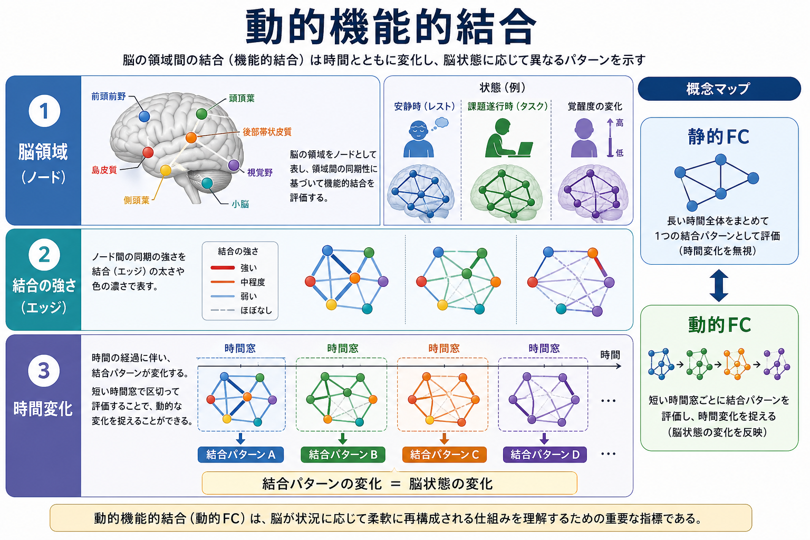
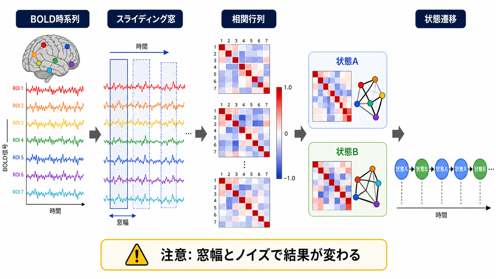
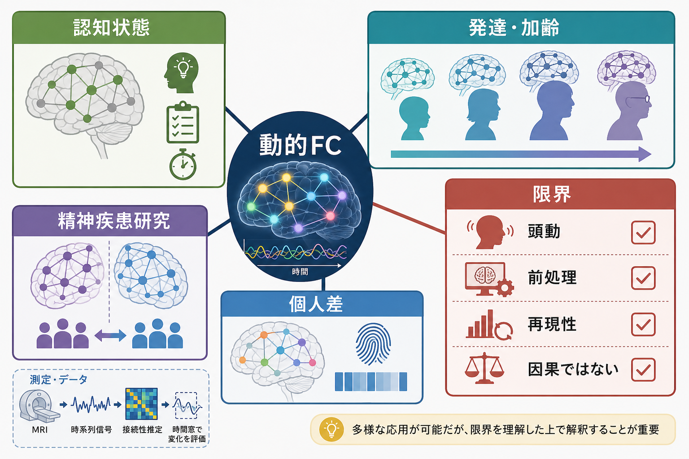

# 動的機能的結合とは何か

## 要点

- **動的機能的結合**とは、脳領域間の活動の連動性が、測定時間の中でどのように変化するかを捉える考え方である。
- 典型的にはBOLD信号やEEG/MEGの時系列から、短い時間窓ごとの相関・同期・ネットワーク状態を推定する。
- 静的な[[構造的結合と機能的結合は何が違うのか|機能的結合]]が「測定全体を平均した結合」を見るのに対し、動的機能的結合は「いつ、どの結合パターンに移ったか」を見る。
- ただし、頭動、前処理、窓幅、自己相関、サンプルサイズ、統計的検定に強く依存するため、単純に「脳が実際にその状態へ切り替わった」と断定してはいけない。

## この記事で答える問い

この記事では、動的機能的結合 dynamic functional connectivity, dFC が何を測ろうとしているのか、どのように推定されるのか、[[脳内ネットワークとは何か|脳内ネットワーク]]研究や精神疾患研究でなぜ注目されるのかを整理する。特に、静的機能的結合、[[有効結合とは何か|有効結合]]、脳状態、バイオマーカー解釈との違いを意識しながら読むと理解しやすい。

## まず結論

動的機能的結合は、「脳領域AとBは平均的にどれくらい一緒に変動するか」ではなく、「その連動性が時間の中でどのように強まったり弱まったりし、どのようなネットワーク状態を行き来するか」を問う枠組みである。安静時fMRI研究では、安静中であっても[[デフォルトモードネットワークとは何か|デフォルトモードネットワーク]]、注意・実行制御系、[[サリエンスネットワークとは何か|サリエンスネットワーク]]などの大規模ネットワークが固定的ではなく、状態依存的に再構成されうることが示されてきた[1][2][3]。

しかし、dFCは「脳内の真の結合変化」を直接観察する手法ではない。多くの場合、観測された信号時系列から相関や共分散を推定しているだけであり、その変動には神経活動、血流応答、眠気、課題方略、頭動、ノイズ、推定手法の性質が混ざる[4][5][6]。したがって、dFCは強力な発見ツールである一方、解釈には統計的検証と再現性確認が必要である。

## 背景

機能的結合は、もともと複数の脳領域の活動が時間的にどれくらい関連しているかを表す概念として整理されてきた[7]。安静時fMRIでは、課題をしていない状態でも領域間BOLD信号に再現性のある相関パターンが見られることが示され、安静時ネットワーク研究の基盤になった[1]。

初期の多くの研究では、数分から十数分の測定全体をまとめて相関行列を作り、1つの平均的なネットワークとして扱っていた。これは「静的FC」と呼べる。静的FCは、個人差、発達、加齢、疾患群比較を扱いやすい一方で、測定中に起きる認知状態、覚醒度、内的思考、課題方略の変化を平均化してしまう。

この問題意識から、測定全体を1枚のネットワークとしてではなく、時間的に移り変わるネットワークとして見る研究が増えた。Calhounらは、時間変化する結合ネットワークを探索する方向性を「chronnectome」として提案し、fMRIデータ発見の重要な前線と位置づけた[2]。その後、dFC研究はスライディング窓、時周波数解析、隠れマルコフモデル、共活性パターン、エッジ時系列など多様な方法へ広がっている[3][8]。

## 基本概念

### 静的機能的結合との違い

静的機能的結合は、測定時間全体を使って領域間の相関を1回だけ推定する。たとえば、前頭前野と頭頂葉のBOLD時系列を10分間まとめて相関し、その値を「この2領域の機能的結合」とする。

動的機能的結合では、同じ10分間を短い時間窓に分け、各窓で相関行列を作る。すると、同じ領域ペアでも、ある時点では結合が強く、別の時点では弱い、あるいは別のネットワーク状態へ移る、という表現ができる。これは[[中央実行ネットワークとは何か|中央実行ネットワーク]]や注意ネットワークが、課題要求や覚醒度に応じて一時的に結合を変える可能性を扱ううえで有用である。

### 機能的結合と有効結合の違い

dFCが扱う「結合」は、多くの場合、相関や同期の時間変化である。これは方向性や因果を意味しない。AとBの相関が一時的に高まっても、AがBを駆動しているとは限らず、第三の領域C、共通入力、全身性ノイズ、血流応答の変化でも説明できる。方向性や因果的影響を問う場合は、[[有効結合とは何か|有効結合]]、動的因果モデリング、Granger因果、摂動実験など、別の枠組みが必要になる[7]。

### 脳状態という読み方

dFC研究では、時間窓ごとの相関行列をクラスタリングし、似た結合パターンを「状態A」「状態B」のようにまとめることがある。各状態にどれくらい滞在するか、どの順番で遷移するか、状態間の切り替わりが速いか遅いかを指標にできる[3][8]。

この「状態」は便利な要約だが、心理状態や臨床状態と1対1に対応するとは限らない。脳状態は、測定データ、解析法、パラメータ、クラスタ数、ノイズ処理に依存して定義されるモデル上の状態である。

## 仕組み

代表的なdFC解析は、次の手順で進む。

1. 脳をROIやネットワークに分け、各領域の時系列を取り出す。
2. 時系列を短い時間窓に区切る。
3. 各窓で領域間相関や共分散を計算し、時点ごとの結合行列を作る。
4. 結合行列の系列から、結合の変動量、状態、遷移、滞在時間、柔軟性などを要約する。
5. 認知課題、行動指標、臨床尺度、年齢、個人差などと関連づける。

最もよく知られるのは**スライディング窓相関**である。これは、一定幅の窓を少しずつずらしながら相関行列を計算する方法で、直感的で実装しやすい[3]。一方で、窓幅が短すぎると推定が不安定になり、長すぎると短時間の変化を平均化してしまう。窓幅、フィルタ、自己相関、信号の周波数成分は、観測されるdFC変動に大きく影響する[5][6]。

スライディング窓以外にも、時周波数解析、時変共分散モデル、隠れマルコフモデル、独立成分分析に基づく状態推定、時間点ごとの共活性パターン、エッジ単位の時系列解析などがある[3][8]。どの方法も「時間変化する結合」を扱うが、何を状態とみなすか、どの時間スケールを重視するか、ノイズをどう扱うかが異なる。

## 図解

| 観点 | 静的FC | 動的FC |
|---|---|---|
| 主な問い | 測定全体で、どの領域同士が平均的に連動するか | 連動パターンが、いつ、どのように変わるか |
| 入力 | 領域ごとの時系列 | 領域ごとの時系列 |
| 出力 | 1つの相関行列・ネットワーク | 時間窓ごとの相関行列、状態、遷移 |
| 強み | 安定した要約、群比較、個人差解析に向く | 覚醒度、課題、内的状態、疾患状態の揺らぎを扱いやすい |
| 注意点 | 時間変化を平均化する | 窓幅、頭動、前処理、統計的検定に敏感 |
| 解釈 | 平均的な共変動 | 時間変化する共変動。因果や方向性ではない |

図解としては、「脳領域をノード、結合をエッジとして描き、時間軸上でエッジの太さや色が変化する」と考えるとよい。重要なのは、dFCが1つの結合値ではなく、結合行列の時間系列を扱う点である。

## 臨床・研究との接続

dFCは、認知状態の変化、発達・加齢、睡眠や覚醒度、学習、精神疾患・神経疾患のネットワーク異常を調べるために使われる[2][3][8]。たとえば、疾患群で特定のネットワーク状態への滞在時間が長い、状態遷移が少ない、あるいは大規模ネットワーク間の再構成が乏しいといった仮説を立てることができる。これはネットワーク神経科学が精神医学に提供する発想の一つである。

ただし、臨床応用には慎重さが必要である。dFC指標は、個人診断や治療選択にそのまま使える段階にあるとは言いにくい。特に、頭動補正、睡眠・覚醒度、薬剤、測定時間、スキャナ差、前処理パイプライン、解析パラメータが結果に影響する。大規模データ、事前登録、外部検証、再現性評価がなければ、疾患特異的な結論として扱うべきではない[4][8]。

## よくある誤解

### 誤解1: 動的FCは脳の「真の接続変化」を直接測っている

多くのdFCは、観測信号の相関構造の時間変化を推定している。シナプス結合や白質線維の変化を直接測っているわけではない。fMRIの場合は、神経活動に関連する血流応答を介した間接指標である。

### 誤解2: 短い窓ほど細かい時間変化が見える

短い窓は時間分解能を上げるように見えるが、相関推定に使えるデータ点が少なくなるため不安定になる。窓幅が信号の周波数成分や自己相関に対して不適切だと、実際には固定的な関係でも見かけ上の変動が生じうる[5][6]。

### 誤解3: 状態Aは特定の心理状態を意味する

クラスタリングで得た状態は、データ駆動的な要約である。状態Aが「注意」、状態Bが「内省」といった意味を持つには、独立した行動指標、生理指標、課題操作、再現性検証が必要である。

### 誤解4: dFCの群差は疾患の原因を示す

群差は、疾患、症状、薬剤、睡眠、動き、生活歴、測定条件などの複合的な違いを反映しうる。dFCは病態仮説を作るうえで有用だが、単独で原因や診断基準を与えるものではない。

## 関連ノート

- [[脳内ネットワークとは何か]]
- [[構造的結合と機能的結合は何が違うのか]]
- [[有効結合とは何か]]
- [[デフォルトモードネットワークとは何か]]
- [[サリエンスネットワークとは何か]]
- [[中央実行ネットワークとは何か]]

関連ノート候補: BOLD信号とは何か、fMRIは神経活動を直接測っているのか、ROI解析と全脳解析は何が違うのか、シードベース解析とは何か、頭動補正はfMRIでなぜ重要なのか、脳画像研究の再現性問題とは何か。

## MOC更新候補

- `content/00_MOC/` 配下の脳・神経科学、神経回路、脳ネットワーク、神経画像関連MOCに、本記事へのリンクを追加する候補。
- 並列生成ジョブとの競合を避けるため、このジョブではMOC本体は更新しない。

## 理解チェック

1. 静的FCと動的FCは、同じ時系列データから何を違って要約しているか。
2. スライディング窓相関で、窓幅が短すぎるとどのような問題が起きるか。
3. dFCの状態A・状態Bを、心理状態や疾患状態と直ちに対応づけてはいけない理由は何か。
4. dFCと有効結合は、因果や方向性の点で何が違うか。
5. 臨床研究でdFCを使うとき、頭動・前処理・再現性を確認する必要があるのはなぜか。

## 未解決問題

- dFC変動のうち、どこまでが神経活動由来で、どこからが血流・測定・推定手法由来なのか。
- 個人内で安定して再現するdFC指標は何か。
- fMRI、EEG、MEG、行動、生理指標を統合して、脳状態をどこまで妥当に推定できるか。
- 精神疾患研究で、dFC指標を診断名ではなく症状次元・認知機能・治療反応とどう接続するか。

## 参考文献

[1] Biswal, B., Yetkin, F. Z., Haughton, V. M., & Hyde, J. S. (1995). Functional connectivity in the motor cortex of resting human brain using echo-planar MRI. *Magnetic Resonance in Medicine, 34*(4), 537-541. https://doi.org/10.1002/mrm.1910340409

[2] Calhoun, V. D., Miller, R., Pearlson, G., & Adali, T. (2014). The chronnectome: Time-varying connectivity networks as the next frontier in fMRI data discovery. *Neuron, 84*(2), 262-274. https://doi.org/10.1016/j.neuron.2014.10.015

[3] Preti, M. G., Bolton, T. A. W., & Van De Ville, D. (2017). The dynamic functional connectome: State-of-the-art and perspectives. *NeuroImage, 160*, 41-54. https://doi.org/10.1016/j.neuroimage.2016.12.061

[4] Lurie, D. J., Kessler, D., Bassett, D. S., Betzel, R. F., Breakspear, M., Kheilholz, S., Kucyi, A., Liegeois, R., Lindquist, M. A., McIntosh, A. R., et al. (2020). Questions and controversies in the study of time-varying functional connectivity in resting fMRI. *Network Neuroscience, 4*(1), 30-69. https://doi.org/10.1162/netn_a_00116

[5] Leonardi, N., & Van De Ville, D. (2015). On spurious and real fluctuations of dynamic functional connectivity during rest. *NeuroImage, 104*, 430-436. https://doi.org/10.1016/j.neuroimage.2014.09.007

[6] Hindriks, R., Adhikari, M. H., Murayama, Y., Ganzetti, M., Mantini, D., Logothetis, N. K., & Deco, G. (2016). Can sliding-window correlations reveal dynamic functional connectivity in resting-state fMRI? *NeuroImage, 127*, 242-256. https://doi.org/10.1016/j.neuroimage.2015.11.055

[7] Friston, K. J. (1994). Functional and effective connectivity in neuroimaging: A synthesis. *Human Brain Mapping, 2*(1-2), 56-78. https://doi.org/10.1002/hbm.460020107

[8] Allen, E. A., Damaraju, E., Plis, S. M., Erhardt, E. B., Eichele, T., & Calhoun, V. D. (2014). Tracking whole-brain connectivity dynamics in the resting state. *Cerebral Cortex, 24*(3), 663-676. https://doi.org/10.1093/cercor/bhs352
