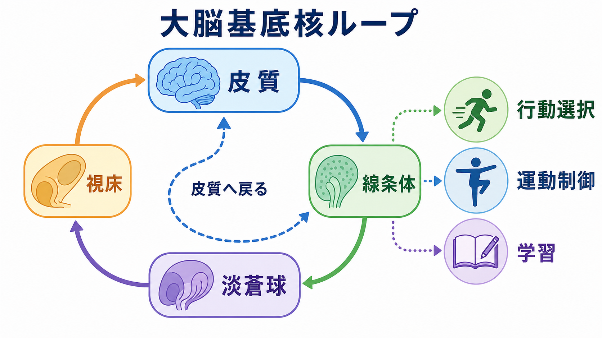
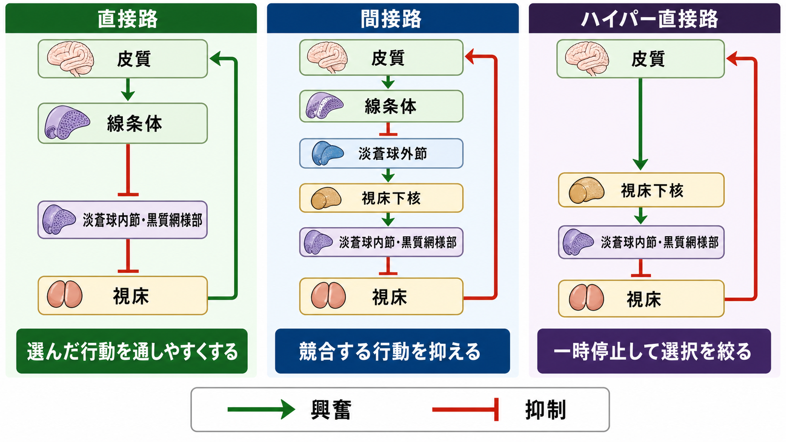

# 大脳基底核ループとは何か

## 要点

- 大脳基底核ループとは、皮質から線条体へ入り、淡蒼球・黒質・視床を経て皮質へ戻る、閉じた再帰的な[[神経回路とは何か|神経回路]]である。
- 基底核は「運動を直接作る装置」というより、複数の行動候補のうち、実行しやすくするものと抑えるものを調整する回路として理解しやすい [3]。
- 古典的には直接路と間接路が対比されるが、実際の回路はハイパー直接路、ドーパミン調節、皮質領域ごとの並列ループを含む [1][2][4][5]。
- 運動制御だけでなく、手続き学習、習慣、報酬にもとづく行動更新、認知・情動制御とも接続する [1][6]。
- パーキンソン病、ハンチントン病、ジストニア、強迫症状、依存などを考える入口になるが、臨床的解釈は個別診断や治療指示ではなく、教育・研究上の説明として扱う。

## この記事で答える問い

1. 大脳基底核ループは、どの脳部位をどの順序で結ぶのか。
2. 直接路、間接路、ハイパー直接路は何を分担しているのか。
3. なぜ基底核は、運動だけでなく行動選択や学習と関係するのか。
4. この回路の理解は、疾患や研究モデルとどう接続するのか。

## まず結論

大脳基底核ループは、皮質が出した行動候補を、線条体、淡蒼球、黒質、視床を介して再び皮質活動へ戻す「選択と抑制のループ」である。皮質が「この行動を準備する」として複数の候補を立てると、基底核はその候補の通りやすさを調整する。直接路は選ばれた行動を相対的に通しやすくし、間接路は競合する行動を抑えやすくし、ハイパー直接路は広い抑制をすばやくかけて、選択前の一時停止や切り替えに関わると考えられる [3][4]。

ただし、この説明はあくまで入口である。基底核は単純な Go/No-Go スイッチではなく、皮質領域ごとの並列ループ、線条体内の細胞種、ドーパミン、視床下核、黒質緻密部、可塑性、行動文脈が重なって働く[[脳内ネットワークとは何か|脳内ネットワーク]]である [1][5]。

## 背景

大脳基底核は、線条体、淡蒼球、視床下核、黒質などからなる皮質下核群である。古くから運動障害との関係で研究され、パーキンソン病では動作緩慢や筋強剛、ハンチントン病では不随意運動などが問題になる。これらの疾患は、基底核が運動の開始、抑制、滑らかな切り替えに深く関わることを示してきた [7][8]。

一方で、基底核は運動だけの回路ではない。Alexander、DeLong、Strick は、運動系、眼球運動系、前頭前野系、辺縁系などの皮質-基底核-視床-皮質ループが、機能的に分かれつつ並列に走るという見方を整理した [2]。この考え方に立つと、基底核は「身体を動かす回路」だけでなく、「何を選び、何を保留し、どの行動を習慣化するか」に関わる回路として見えてくる。

## 基本概念

大脳基底核ループの基本形は、次のように整理できる。

| 段階 | 主な部位 | 役割の目安 |
|---|---|---|
| 入力 | 皮質から線条体へ | 行動候補、文脈、目標、感覚・運動情報を送る |
| 統合 | 線条体 | 皮質入力とドーパミン調節を受け、候補の重みづけに関わる |
| 出力調整 | 淡蒼球内節・黒質網様部 | 視床への抑制性出力を調整する |
| 中継 | 視床 | 皮質へ戻る活動を調整する |
| 再入力 | 皮質 | 次の行動準備、評価、修正へつながる |

このループでは、基底核の主要な出力核である淡蒼球内節と黒質網様部が、通常は視床を抑制している。直接路はこの出力核を抑えることで、視床への抑制をゆるめ、関連する皮質活動を通しやすくする。これを脱抑制という。間接路は、淡蒼球外節と視床下核を介して出力核の抑制性出力を強め、視床から皮質への流れを抑えやすくする [1][5]。

ドーパミンは、この通りやすさを一様に上げる物質ではない。黒質緻密部から線条体へのドーパミン入力は、直接路と間接路の細胞群に異なる影響を及ぼし、行動価値、予測、学習、運動実行可能性の調整に関わる。詳しくは [[ドパミンは報酬だけの物質なのか]] と接続して読むとよい。

## 仕組み

### 直接路

直接路は、皮質から線条体へ入り、線条体から淡蒼球内節・黒質網様部へ向かい、そこから視床、そして皮質へ戻る経路である。線条体の抑制性ニューロンが出力核を抑えるため、出力核から視床への抑制が弱まり、視床を介した皮質活動が相対的に通りやすくなる [1][5]。

このため、直接路は「選ばれた行動を実行しやすくする」方向に働くと説明される。ただし、これは筋肉へ直接命令するという意味ではない。基底核は運動指令そのものを生成するというより、皮質や脳幹が持つ行動プログラムのうち、どれが実行へ進みやすいかを調整する [3]。

### 間接路

間接路は、皮質から線条体へ入り、淡蒼球外節、視床下核、淡蒼球内節・黒質網様部、視床を経て皮質へ戻る経路である。古典的モデルでは、間接路は出力核の活動を高め、視床への抑制を強める方向に働く [1][5]。

このため、間接路は「競合する行動を抑える」経路として説明される。たとえば、ある動作を開始するには、その動作を通すだけでなく、同時に起こりうる別の動作を抑える必要がある。Mink のモデルでは、基底核は選ばれた運動プログラムを焦点化し、競合するプログラムを抑制する仕組みとして位置づけられた [3]。

### ハイパー直接路

ハイパー直接路は、皮質から視床下核へ直接入り、そこから淡蒼球内節・黒質網様部へ向かう経路である。線条体を経由しないため、比較的すばやく基底核出力核へ影響し、広い範囲の視床-皮質活動を一時的に抑えると考えられる [4]。

この経路は、行動開始前に「いったん止める」「候補を絞る」「反応を切り替える」といった制御と関係づけられる。特に、急な文脈変化や競合がある状況では、すぐに実行するよりも、短い停止を挟んで選択を再調整することが有利になる。

## 図解

上の 1 枚目は、皮質、線条体、淡蒼球、視床が閉じたループを作り、行動選択・運動制御・学習へ接続するという全体像を示す。2 枚目は、直接路、間接路、ハイパー直接路を対比し、基底核が単純に運動を「出す」のではなく、行動候補の通りやすさを調整することを示す。

図を読むときは、矢印を「命令の直線的な流れ」と考えすぎないほうがよい。実際の脳では、皮質領域ごとのループ、線条体内の細胞集団、ドーパミン、GABA、グルタミン酸、視床核、脳幹出力が相互作用する。ここでの図は、複雑な回路を理解するための入口である。

## 臨床・研究との接続

基底核ループは、運動障害の理解に直結する。パーキンソン病では黒質緻密部のドーパミンニューロンが失われ、線条体での調節が変化することで、基底核-視床-皮質ループの活動バランスが変わる。古典的モデルでは、低運動性の症状は、視床-皮質活動が過度に抑えられる方向の変化として説明されてきた [7][8]。

ただし、近年の研究は、古典的な直接路・間接路モデルだけでは不十分であることも示している。細胞種ごとの活動、発火パターン、同期、可塑性、皮質からの入力、視床下核の役割などを含める必要がある [5]。この点は、[[神経同期とは何か]] や [[有効結合とは何か]] の観点からも読み替えられる。

基底核はまた、習慣形成や手続き学習とも関係する。繰り返し経験される行動は、評価、報酬、文脈、運動系列と結びつき、線条体を含む回路で表現が変化する。Graybiel は、習慣や反復行動を、基底核を含む回路の経験依存的可塑性として理解する視点を整理している [6]。

認知・情動面では、前頭前野や辺縁系と接続するループが重要になる。たとえば、行動の切り替え、価値にもとづく選択、サリエンス検出、努力配分、反応抑制は、皮質-基底核ループと他の大規模ネットワークの相互作用として研究される。[[サリエンスネットワークとは何か]] と接続すると、「何が重要かを検出すること」と「どの行動を通すか」の関係が見えやすい。

## よくある誤解

### 誤解1: 基底核は運動を作る中枢である

基底核は運動に重要だが、筋肉への詳細な運動命令を単独で作るわけではない。基底核は、皮質や脳幹にある行動・運動プログラムの選択、抑制、切り替え、学習に関わると考えるほうが正確である [3]。

### 誤解2: 直接路は良い経路、間接路は悪い経路である

直接路と間接路は、どちらか一方が常に良いわけではない。行動には、実行すべきものを通すことと、実行すべきでないものを抑えることの両方が必要である。間接路の抑制は、混乱を防ぎ、選択を安定させるためにも必要である。

### 誤解3: ドーパミンが多いほど運動も学習も良くなる

ドーパミンは回路の利得や可塑性を調整するが、多ければよいという単純な物質ではない。部位、受容体、時間スケール、課題、疾患状態によって意味が変わる。医療・精神医学に関する内容は、個別の診断や治療判断として読まない。

### 誤解4: 基底核ループは一本の回路である

実際には、運動系、眼球運動系、認知系、情動系など、複数の並列ループがある [2]。また、それらは完全に独立しているわけではなく、行動文脈に応じて相互作用する。[[局所回路と長距離結合は何が違うのか]] の観点から見ると、基底核ループは局所処理と長距離結合が組み合わさった典型例である。

## 関連ノート

- [[神経回路とは何か]]
- [[脳内ネットワークとは何か]]
- [[局所回路と長距離結合は何が違うのか]]
- [[有効結合とは何か]]
- [[神経同期とは何か]]
- [[ドパミンは報酬だけの物質なのか]]
- [[サリエンスネットワークとは何か]]

### 関連ノート候補

- 直接路と間接路は何が違うのか
- 視床下核は行動停止にどう関わるのか
- パーキンソン病と基底核回路
- 習慣形成と線条体
- 強化学習とドーパミン

### MOC更新候補

- `content/00_MOC/MOC｜脳・神経科学.md`
- `content/00_MOC/MOC｜基礎神経科学.md`

## 理解チェック

1. 皮質-線条体-淡蒼球-視床-皮質ループは、なぜ「再帰的な」回路と呼べるのか。
2. 直接路が行動を通しやすくする、という説明で使われる「脱抑制」とは何か。
3. 間接路は、なぜ行動選択に必要な抑制として理解できるのか。
4. ハイパー直接路は、直接路・間接路と比べてどの点で速いのか。
5. 基底核が運動だけでなく、習慣や認知制御にも関わると考えられる理由は何か。

## 限界と未解決問題

- 直接路・間接路モデルは教育的に有用だが、実際の基底核活動をすべて説明するわけではない。
- ヒトの認知・情動ループでは、動物実験で得られた細胞レベルの知見をどこまで一般化できるかに注意が必要である。
- 疾患モデルでは、平均発火率だけでなく、同期、バースト、可塑性、ネットワーク状態、薬物治療や深部脳刺激の時間的効果を含めて考える必要がある。
- 「行動選択」という言葉は広く使われるが、運動プログラムの選択、価値にもとづく意思決定、反応抑制、習慣化を同じ概念で扱いすぎないようにする必要がある。

## 参考文献

[1] Lanciego, J. L., Luquin, N., & Obeso, J. A. (2012). Functional neuroanatomy of the basal ganglia. *Cold Spring Harbor Perspectives in Medicine*, 2(12), a009621. https://doi.org/10.1101/cshperspect.a009621

[2] Alexander, G. E., DeLong, M. R., & Strick, P. L. (1986). Parallel organization of functionally segregated circuits linking basal ganglia and cortex. *Annual Review of Neuroscience*, 9, 357-381. https://doi.org/10.1146/annurev.ne.09.030186.002041

[3] Mink, J. W. (1996). The basal ganglia: Focused selection and inhibition of competing motor programs. *Progress in Neurobiology*, 50(4), 381-425. https://doi.org/10.1016/S0301-0082(96)00042-1

[4] Nambu, A., Tokuno, H., & Takada, M. (2002). Functional significance of the cortico-subthalamo-pallidal "hyperdirect" pathway. *Neuroscience Research*, 43(2), 111-117. https://doi.org/10.1016/S0168-0102(02)00027-5

[5] Nelson, A. B., & Kreitzer, A. C. (2014). Reassessing models of basal ganglia function and dysfunction. *Annual Review of Neuroscience*, 37, 117-135. https://doi.org/10.1146/annurev-neuro-071013-013916

[6] Graybiel, A. M. (2008). Habits, rituals, and the evaluative brain. *Annual Review of Neuroscience*, 31, 359-387. https://doi.org/10.1146/annurev.neuro.29.051605.112851

[7] Albin, R. L., Young, A. B., & Penney, J. B. (1989). The functional anatomy of basal ganglia disorders. *Trends in Neurosciences*, 12(10), 366-375. https://deepblue.lib.umich.edu/handle/2027.42/28186

[8] DeLong, M. R. (1990). Primate models of movement disorders of basal ganglia origin. *Trends in Neurosciences*, 13(7), 281-285. https://doi.org/10.1016/0166-2236(90)90110-V
