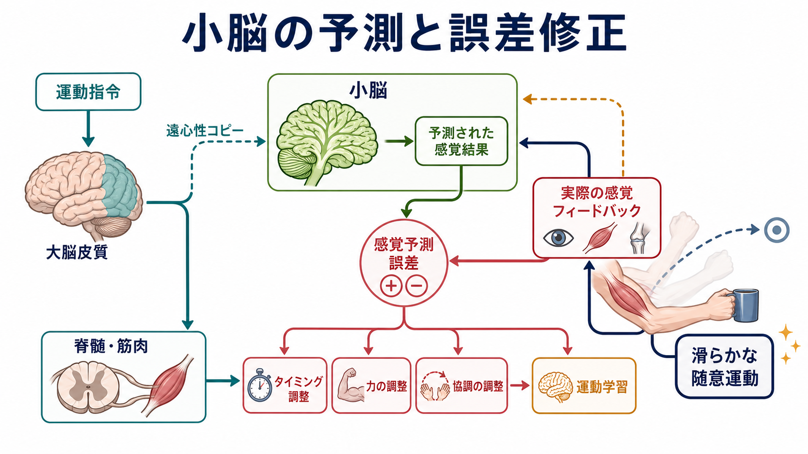
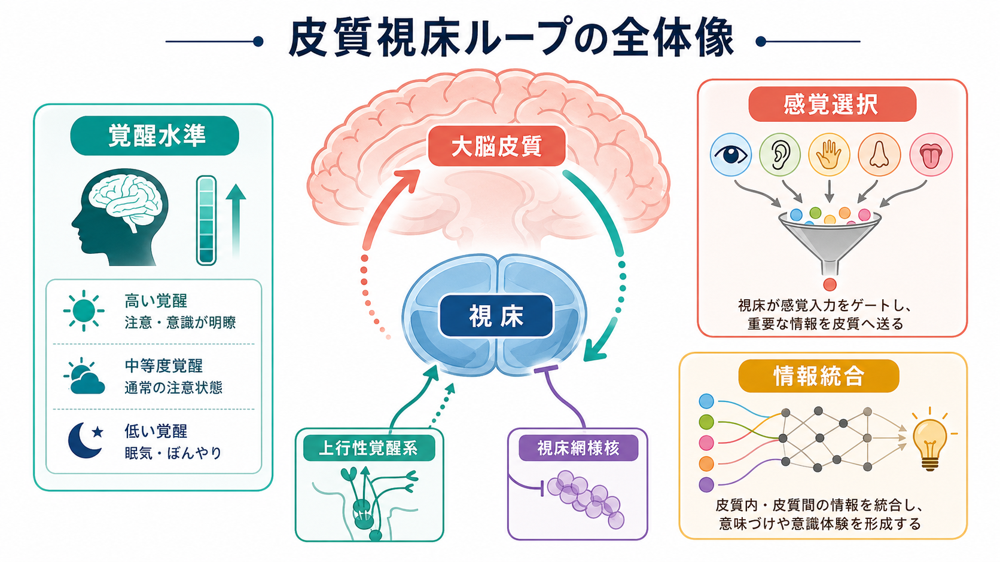

# 大脳皮質の層構造は情報の流れをどう決めるのか

## 要点

- 大脳新皮質の6層構造は、単なる解剖学的な縞模様ではなく、入力を受ける場所、局所処理を行う場所、遠くへ出力する場所を分ける回路設計である[1][2]。
- 典型的には、第4層は視床からのフィードフォワード入力を受け、第2/3層は皮質内・皮質間の統合、第5層は皮質下への強い出力、第6層は視床へのフィードバックに深く関わる[2][3]。
- 第1層は細胞体が少ないが、錐体細胞の遠位樹状突起と高次皮質・視床・修飾系からの入力が集まるため、文脈や予測が局所処理を調整する場所として重要である[4][5]。
- ただし「第4層 = 入力」「第5層 = 出力」と固定的に覚えるだけでは不十分で、皮質領域、細胞型、感覚・運動・認知課題によって層ごとの使われ方は変わる[1][3]。

## この記事で答える問い

1. 大脳皮質の第1層から第6層は、それぞれ何をしているのか。
2. 視床から皮質へ入る情報、皮質から皮質へ渡る情報、皮質から皮質下へ出る情報は、どの層を通るのか。
3. フィードフォワードとフィードバックは、なぜ別の層を使うことが多いのか。
4. この層構造は、[[神経回路とは何か]]、[[局所回路と長距離結合は何が違うのか]]、[[抑制性介在ニューロンにはどのような種類があるのか]]とどうつながるのか。

## まず結論

大脳皮質の層構造は、情報の「内容」だけでなく、情報の「出どころ」と「行き先」を分ける仕組みである。感覚系を単純化して言えば、外界からの信号は視床を経て主に第4層へ入り、第4層から第2/3層へ上がり、そこで局所回路や隣接カラムとの相互作用を受ける。その後、情報は第2/3層から他の皮質領域へ送られたり、第5層から脳幹・脊髄・基底核などの皮質下構造へ送られたり、第6層から視床へ戻されたりする[2][3][6]。

しかし、これは一方通行のパイプラインではない。第1層には高次皮質からのフィードバックや調節入力が入り、錐体細胞の遠位樹状突起を介して、同じ感覚入力でも「注意しているか」「予測と合うか」「行動目標に関係するか」によって反応の仕方を変える[4][5][8]。つまり皮質層は、入力を受け取る深さ、統合する深さ、出力する深さを分けることで、ボトムアップ信号とトップダウン信号を同じ神経回路内で出会わせる。

## 背景

大脳新皮質は、哺乳類で発達した薄いシート状の神経組織で、視覚、聴覚、体性感覚、運動、言語、推論、社会認知など多様な機能に関わる。領域ごとに厚みや細胞密度は異なるが、多くの領域では表面側から白質側へ向かって第1層から第6層までの層構造を持つ[1]。

この層構造が重要なのは、細胞が均一に並んでいないからである。層ごとに、存在する錐体細胞・星状細胞・介在ニューロンの種類、樹状突起の伸び方、軸索の投射先、受ける入力が異なる。したがって、同じ「皮質への入力」でも、第4層に入る入力と第1層に入る入力では、局所回路に与える意味が違う[3][4]。

古典的な「標準的マイクロ回路」という考え方は、皮質の局所回路には領域を超えて繰り返される基本設計がある、という見方である[2]。ただし近年の研究は、この基本設計が完全に同一ではなく、感覚野、運動野、前頭前野、種差、発達段階、細胞型によってかなり変形されることも強調している[1]。

## 基本概念

### 第1層

第1層は、皮質表面に最も近い層で、ニューロンの細胞体は少ない。一方で、第2/3層や第5層の錐体細胞が伸ばす遠位樹状突起、皮質間フィードバック、非特異的視床入力、神経修飾系入力が集まりやすい。したがって第1層は、外界からの一次入力をそのまま受ける場所というより、すでに処理された文脈・予測・注意・状態信号が、局所回路の感度を調整する場所として理解しやすい[4][5]。

### 第2/3層

第2層と第3層は、しばしば第2/3層としてまとめて扱われる。主な役割は、同じ皮質領域内の局所結合、隣接する皮質カラム、他の皮質領域との結合を通じた統合である。感覚皮質では、第4層から上がってきた情報を受け取り、同じ領域内で特徴を組み合わせたり、上位皮質へ送ったりする[1][3]。

第2/3層は、[[局所回路と長距離結合は何が違うのか]]を考えるうえで特に重要である。局所回路の再帰結合によって特徴表現を安定させつつ、長距離結合によって他領域へ情報を送る接点になるからである。

### 第4層

第4層は、一次感覚野で特に発達し、視床からの主要なフィードフォワード入力を受ける層として知られる。たとえば一次視覚野や一次体性感覚野では、視床中継核からの入力が第4層に入り、そこから第2/3層や深層へ伝わる[2][3]。

ただし第4層は、すべての皮質領域で同じように発達しているわけではない。運動野のように第4層が目立たない領域もある。したがって、第4層は「外界入力の玄関」と覚えるより、「視床性の駆動入力が強く入ることが多い層」と理解する方がよい。

### 第5層

第5層には、大きな錐体細胞が多く、皮質下構造への出力に深く関わる。投射先には、脳幹、脊髄、上丘、基底核などが含まれる。運動指令、行動選択、感覚情報を行動へ変換する過程では、第5層の出力が重要になる[1][3]。

第5層錐体細胞は、深層に細胞体を置きながら、樹状突起を第1層まで伸ばすことが多い。この形は、下位からの入力と上位からのフィードバックを1つの細胞内で結合する基盤になる。Larkum が論じたように、遠位樹状突起への入力と細胞体側の入力が同時に入ると、単なる加算を超えた強い応答が生じうる[5]。

### 第6層

第6層は、白質に近い深層であり、視床へのフィードバック、皮質内深層結合、皮質間結合に関わる。特に第6層皮質視床ニューロンは、視床中継核へ戻る投射を持ち、視床から皮質への情報流入を調整する位置にある[6]。

重要なのは、このフィードバックが単なる「戻り信号」ではないことである。第6層から視床への投射は、視床中継細胞を直接興奮させるだけでなく、視床網様核を介した抑制も含みうるため、視床入力のゲイン、焦点、時間的通りやすさを調整する[6]。

## 仕組み

### 1. フィードフォワード入力は中間層を起点にする

感覚系で最も典型的な流れは、視床から第4層へ入り、第4層から第2/3層へ伝わる経路である。第4層の興奮性ニューロンは、局所的な増幅と初期特徴抽出を担い、その出力を第2/3層へ送る。第2/3層では、同じ皮質領域内の再帰結合や[[抑制性介在ニューロンにはどのような種類があるのか|抑制性介在ニューロン]]によって、信号の選択性、タイミング、競合関係が整えられる[2][3]。

このとき抑制は、単なるブレーキではない。PV細胞、SST細胞、VIP細胞などの介在ニューロンは、細胞体、樹状突起、他の介在ニューロンなど異なる標的を持つため、どの入力を強め、どの入力を抑え、どの時間窓で信号を通すかを変える[1][3]。

### 2. 皮質間の階層は層の起始・終止で推定される

皮質領域同士の結合では、どの層から出て、どの層に終わるかが、階層関係の手がかりになる。古典的な視覚皮質研究では、低次領域から高次領域へ向かうフィードフォワード結合は、比較的表層から出て第4層周辺に終わりやすい。一方、高次領域から低次領域へ戻るフィードバック結合は、第1層や深層など、第4層以外に広く終止しやすい[4][7]。

この区別は、[[脳内ネットワークとは何か]]で扱う広域ネットワークを、細胞・層レベルに戻して読むための橋渡しになる。fMRI や拡散 MRI で見える領域間結合は粗い地図であり、実際にはどの層に終わるかによって、信号の意味が変わる。

### 3. フィードバックは第1層と深層を使って文脈を入れる

フィードバック入力は、外界からの信号をもう一度同じ形式で送るというより、局所回路の解釈を変える。第1層への入力は、錐体細胞の遠位樹状突起に作用し、細胞体近くに届くフィードフォワード入力と組み合わさる。これにより、予測と一致する入力、注意している対象、課題に関係する特徴が、より強くまたは異なるタイミングで表現される可能性がある[5][8]。

予測符号化の文脈では、フィードフォワード信号とフィードバック信号は、異なる層・異なる周波数帯・異なる細胞集団に対応づけられることがある[8]。ただしこれは有力な理論枠組みであり、すべての皮質領域や課題で単純に同じ対応が成り立つと断定するべきではない。

### 4. 深層は出力と再入力の分岐点になる

第5層と第6層は、皮質が外へ働きかける出口である。第5層は、皮質下構造へ強い出力を送り、感覚表現を行動や運動系へつなぐ。第6層は、視床へ戻るフィードバックを通じて、次に皮質へ入ってくる入力の通り方を調整する[3][6]。

このため、皮質は単に「入力を受けて処理して終わる」装置ではない。皮質は、自分が受け取る入力そのものを視床レベルで調整し、同時に皮質下構造へ行動関連の出力を送る。層構造は、この入出力の閉ループを空間的に整理する。

## 図解

| 経路 | 主に関わる層 | 情報の向き | 回路上の意味 |
|---|---|---|---|
| 視床皮質入力 | 第4層、第6層 | 視床から皮質へ | 感覚情報や視床性入力を皮質へ入れる |
| 局所層間処理 | 第4層から第2/3層、第2/3層から第5/6層 | 皮質内 | 入力を特徴表現、文脈、出力候補へ変換する |
| 皮質間フィードフォワード | 第2/3層を含む表層から上位領域へ | 低次から高次へ | より抽象的な表現へ送る |
| 皮質間フィードバック | 第1層、深層を含む終止 | 高次から低次へ | 予測、注意、課題文脈で局所処理を調整する |
| 皮質下出力 | 第5層 | 皮質から脳幹・脊髄・基底核などへ | 表現を行動・運動・調節へ変換する |
| 皮質視床フィードバック | 第6層 | 皮質から視床へ | 視床入力のゲインや焦点を調整する |

## 臨床・研究との接続

皮質層の理解は、臨床診断を直接決めるものではないが、脳活動を解釈するための重要な基礎になる。たとえば EEG/MEG や皮質脳波で観察される[[神経同期とは何か|神経同期]]は、表層・深層、局所回路、皮質間フィードバックのどれが関与しているかで意味が変わる。予測符号化や注意の研究では、フィードフォワードとフィードバックを層・周波数・結合方向の違いとして調べる発想が使われる[8]。

また、精神医学や神経発達研究では、興奮性・抑制性バランス、皮質間結合、視床皮質ループの変化がしばしば議論される。ただし、層構造の異常を個別疾患の診断根拠として短絡することはできない。教育・研究目的では、「どの層のどの細胞型が、どの入力と出力を変えたのか」という仮説に分解して考えるのが安全である。

研究方法としては、層別電気生理、層別 fMRI、光遺伝学、トレーシング、単一細胞トランスクリプトミクス、コネクトミクスなどが使われる。これらを組み合わせることで、単なる「活動が増えた/減った」ではなく、入力層、統合層、出力層のどこが変化したかを問える。

## よくある誤解

### 誤解1: 第4層だけが入力層である

第4層は一次感覚野で重要な入力層だが、入力は第4層だけに入るわけではない。第1層にはフィードバックや調節入力が入り、第6層にも視床皮質入力や深層結合が関わる。入力の種類によって、入る層が違う[3][4]。

### 誤解2: 第1層は細胞が少ないので重要ではない

第1層は細胞体が少ないため目立たないが、錐体細胞の遠位樹状突起が集まり、高次入力が局所処理を調整する場所になる。細胞体の密度だけで層の機能的重要性を判断してはいけない[5]。

### 誤解3: 6層構造はすべての皮質領域で同じように働く

新皮質には共通する設計があるが、領域ごとの差も大きい。感覚野、運動野、連合野では、第4層の発達、深層出力、皮質間結合の比重が異なる。標準的マイクロ回路は出発点であって、完全な設計図ではない[1][2]。

### 誤解4: フィードフォワードは正確で、フィードバックは主観的である

フィードフォワードもフィードバックも、どちらも神経回路上の実体を持つ信号である。フィードバックは「主観的なゆがみ」ではなく、予測、注意、課題文脈、行動目標を使って入力処理を調整する経路である[4][8]。

## 関連ノート

- [[神経回路とは何か]]
- [[局所回路と長距離結合は何が違うのか]]
- [[抑制性介在ニューロンにはどのような種類があるのか]]
- [[脳内ネットワークとは何か]]
- [[神経同期とは何か]]

MOC更新候補: `content/00_MOC/` 配下の脳・神経科学、神経回路、脳ネットワーク関連 MOC に追加する。

今後の作成候補: 視床皮質ループとは何か、予測符号化における皮質層の役割、皮質カラムとは何か、第5層錐体細胞とは何か。

## 理解チェック

1. 一次感覚野で視床からの主要なフィードフォワード入力を受けやすい層はどこか。
2. 第1層が、細胞体の少なさにもかかわらず重要だと言える理由は何か。
3. 第5層と第6層の出力先は、どのように違うか。
4. フィードフォワード結合とフィードバック結合は、終止層の違いからどのように区別されることが多いか。
5. 標準的マイクロ回路を、すべての皮質領域にそのまま当てはめると何が問題になるか。

## 参考文献

[1] Harris, K. D., & Shepherd, G. M. G. (2015). The neocortical circuit: themes and variations. *Nature Neuroscience*, 18, 170-181. https://doi.org/10.1038/nn.3917

[2] Douglas, R. J., & Martin, K. A. C. (2004). Neuronal circuits of the neocortex. *Annual Review of Neuroscience*, 27, 419-451. https://doi.org/10.1146/annurev.neuro.27.070203.144152

[3] Thomson, A. M., & Lamy, C. (2007). Functional maps of neocortical local circuitry. *Frontiers in Neuroscience*, 1, 19-42. https://doi.org/10.3389/neuro.01.1.1.002.2007

[4] D'Souza, R. D., & Burkhalter, A. (2017). A laminar organization for selective cortico-cortical communication. *Frontiers in Neuroanatomy*, 11, 71. https://doi.org/10.3389/fnana.2017.00071

[5] Larkum, M. (2013). A cellular mechanism for cortical associations: an organizing principle for the cerebral cortex. *Trends in Neurosciences*, 36(3), 141-151. https://doi.org/10.1016/j.tins.2012.11.006

[6] Lam, Y. W., & Sherman, S. M. (2010). Functional organization of the somatosensory cortical layer 6 feedback to the thalamus. *Cerebral Cortex*, 20(1), 13-24. https://doi.org/10.1093/cercor/bhp077

[7] Felleman, D. J., & Van Essen, D. C. (1991). Distributed hierarchical processing in the primate cerebral cortex. *Cerebral Cortex*, 1(1), 1-47. https://doi.org/10.1093/cercor/1.1.1-a

[8] Bastos, A. M., Usrey, W. M., Adams, R. A., Mangun, G. R., Fries, P., & Friston, K. J. (2012). Canonical microcircuits for predictive coding. *Neuron*, 76(4), 695-711. https://doi.org/10.1016/j.neuron.2012.10.038
