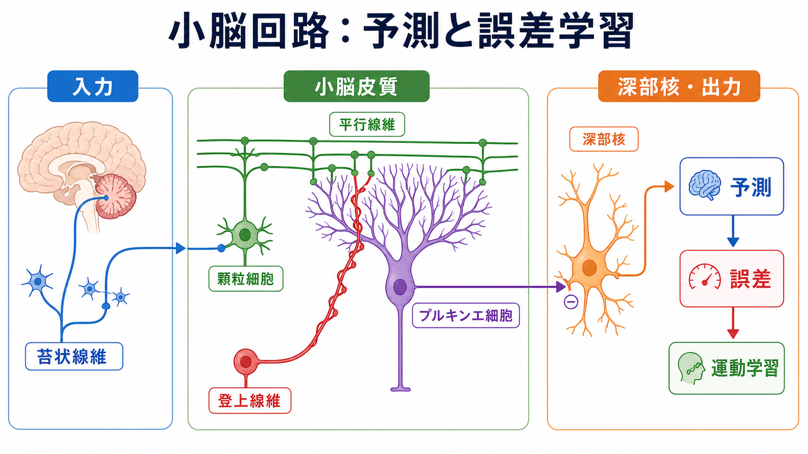
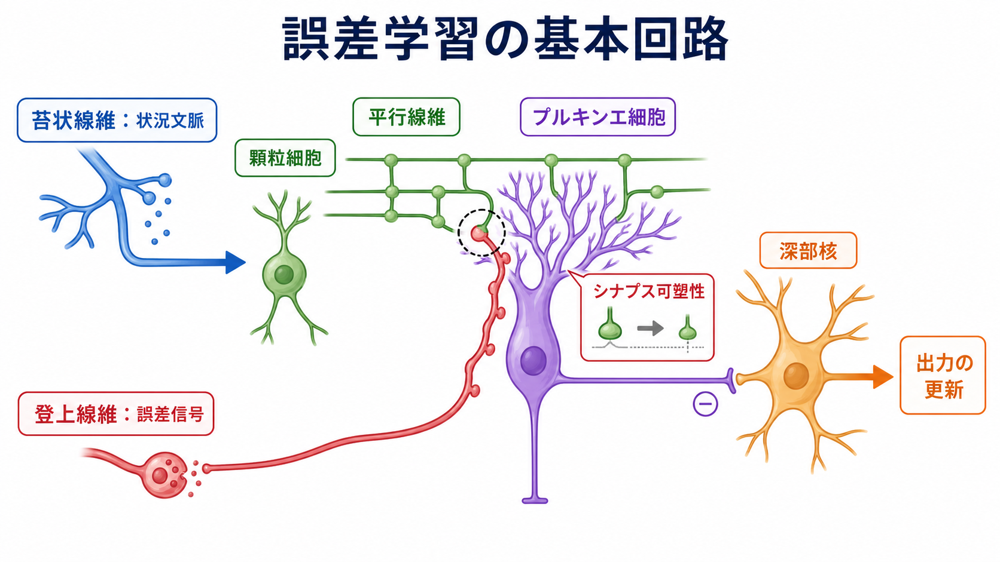
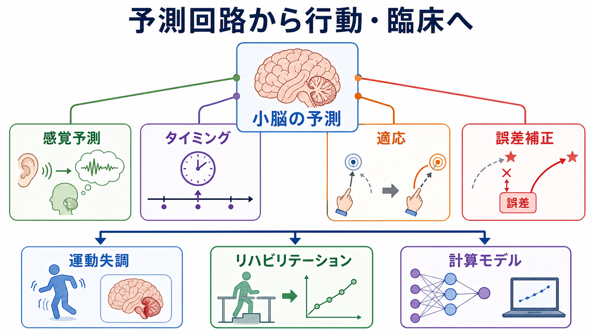

# 小脳回路は予測と誤差学習にどう関わるのか

## 要点

- 小脳は、運動指令と感覚フィードバックを照合し、次に何が起こるかを予測しながら出力を微調整する[[神経回路とは何か|神経回路]]として理解できる。[1][6]
- 苔状線維は文脈、感覚、運動指令のコピーなどを広く運び、顆粒細胞・平行線維を介してプルキンエ細胞へ分散表現を作る。[1][2][3]
- 登上線維は下オリーブ核に由来し、プルキンエ細胞に強力な入力を与える。古典的には「教師信号」、近年は予測誤差を含む複合的な誤差信号として扱われる。[4][5][7]
- プルキンエ細胞は小脳皮質の唯一の出力細胞で、深部小脳核を抑制する。深部核は苔状線維・登上線維側副枝とプルキンエ細胞入力を統合し、小脳全体の出力を作る。[1]
- 小脳学習は「平行線維-プルキンエ細胞シナプスのLTD」だけでは説明しきれない。深部核、抑制性介在ニューロン、複数の可塑性、行動課題ごとの回路差を含めて読む必要がある。[1][5]

## この記事で答える問い

1. 小脳皮質、深部核、苔状線維、登上線維はどのように接続しているのか。
2. 小脳はなぜ「予測」と結びつけて理解されるのか。
3. 登上線維はどのような意味で誤差信号・教師信号なのか。
4. 運動学習や臨床的な運動失調の理解にどうつながるのか。

## まず結論

小脳回路は、現在の状態と運動指令をもとに「次に生じる感覚結果」を予測し、その予測と実際の結果のずれを使って出力を更新するシステムとして理解できる。苔状線維は、身体状態、感覚入力、運動指令のコピー、課題文脈などの高次元入力を小脳へ入れる。顆粒細胞はそれを非常に多数の平行線維活動へ展開し、プルキンエ細胞はその組み合わせを読み出す。[1][2][3]

一方、登上線維はプルキンエ細胞に強力な複合スパイクを生じさせ、平行線維入力との組み合わせに応じてシナプス可塑性を誘導する。古典的なMarr-Albus-Ito型の考え方では、登上線維は「何が間違っていたか」を知らせる教師信号であり、平行線維-プルキンエ細胞シナプスの重みを更新する。[2][3][4][5]

ただし、現在の理解では、小脳を単純な教師あり学習装置としてだけ見るのは狭すぎる。登上線維活動は単なる運動エラーだけでなく、予期しない刺激、予測された刺激、報酬関連信号、時間差分型の予測誤差に似た信号を含みうる。[7] また、深部核や小脳皮質内の多様な可塑性も学習に関わるため、小脳は「誤差で一箇所のシナプスを弱める回路」ではなく、「予測、タイミング、適応を分散的に更新する回路」と考えるのがよい。[1][8]

## 背景

小脳は伝統的に、姿勢、眼球運動、歩行、到達運動、発話運動などの運動制御に関わる構造として研究されてきた。小脳損傷では、筋力そのものが大きく落ちなくても、運動のタイミング、滑らかさ、目標への到達精度が崩れる。このため、小脳は「運動を作る場所」というより、運動を予測し、誤差から調整する場所として理解される。[6][8]

この発想は、[[脳内ネットワークとは何か|脳内ネットワーク]]の一部として小脳を見ると分かりやすい。大脳皮質、橋核、脊髄、前庭系、下オリーブ核、視床などが小脳とループを作り、局所回路と長距離結合が組み合わさる。詳しくは[[局所回路と長距離結合は何が違うのか]]も参照できる。

## 基本概念

### 小脳皮質

小脳皮質は、分子層、プルキンエ細胞層、顆粒細胞層からなる層構造をもつ。主な流れは、苔状線維が顆粒細胞を興奮させ、顆粒細胞の軸索である平行線維がプルキンエ細胞へ入力する経路である。プルキンエ細胞はGABA作動性の抑制性細胞で、小脳皮質から深部小脳核へ出る主要な出力を担う。[1]

この構造は一見単純だが、近年のレビューでは、細胞型、領域差、介在ニューロン、可塑性機構が古典モデルよりはるかに多様であることが強調されている。[1] したがって、小脳皮質は「同じモジュールの反復」だけでなく、「反復構造を土台にしつつ、領域ごとに違う計算を行う回路」と読む必要がある。

### 苔状線維

苔状線維は、橋核、脊髄、前庭核などから小脳へ入る主要入力である。顆粒細胞を介して平行線維活動を作るだけでなく、深部小脳核にも側副枝を送る。小脳が現在の身体状態、運動指令、感覚文脈を知るための主要な入力路と考えられる。[1][3]

Albusの理論では、苔状線維-顆粒細胞系は入力を高次元のパターンへ展開し、プルキンエ細胞がそのパターンを学習できるようにする仕組みとして位置づけられた。[3] これは機械学習でいう特徴展開に似た発想であり、[[Hebb則とは何か|Hebb則]]的な単純な相関学習とは異なり、登上線維による教師信号を組み合わせる点が特徴である。

### 登上線維

登上線維は下オリーブ核から来る入力で、1本の登上線維がプルキンエ細胞の樹状突起に強い入力を与える。プルキンエ細胞では複合スパイクを生じさせ、平行線維活動と組み合わさることで長期抑圧LTDなどの可塑性を誘導する。[4][5]

古典的には、登上線維は「誤りを知らせる教師」として理解されてきた。しかし近年の眼瞼条件づけ研究では、登上線維が予期しない刺激の到来だけでなく、予期された刺激や予期された刺激の省略にも反応し、強化学習における時間差分予測誤差に似た性質を示すことが報告されている。[7]

### 深部小脳核

深部小脳核は、小脳の出力ゲートである。苔状線維や登上線維の側副枝から興奮性入力を受け、同時にプルキンエ細胞から抑制性入力を受ける。小脳皮質が学習によってプルキンエ細胞出力を変えると、深部核の発火タイミングと出力パターンが変わる。[1]

ここで重要なのは、深部核が単なる中継核ではないことだ。深部核自体にも可塑性があり、運動学習の保持や出力調整に関与すると考えられる。[1]

## 仕組み

### 1. 文脈を広げる

運動を行うとき、脳は筋肉への指令だけでなく、その指令によってどの感覚結果が返ってくるかを予測する必要がある。苔状線維は、現在の姿勢、視覚・前庭・体性感覚、運動指令のコピー、課題文脈を小脳へ届ける。顆粒細胞はそれらを膨大な組み合わせに展開し、平行線維を通じてプルキンエ細胞に渡す。[1][3]

この段階は、入力を単に足し合わせるだけではない。多数の顆粒細胞が、状況を細かいパターンとして符号化することで、どの文脈でどの出力を変えるべきかを学習しやすくする。

### 2. 予測を作る

小脳が内部モデルを持つという考えでは、順モデルは「この運動指令を出すと、次にどの感覚結果が起こるか」を予測し、逆モデルは「望む運動結果を得るには、どの運動指令が必要か」を推定する。[6] フィードバックには遅れがあるため、実際の感覚結果を待つだけでは滑らかな運動制御に間に合わない。予測は、その遅れを補うために必要である。

この見方では、小脳は単なる運動の補助装置ではなく、身体と環境の変化を先回りして推定する回路である。予測がよければ、深部核からの出力は適切なタイミングで運動系へ戻り、予測が外れれば誤差信号が回路を更新する。

### 3. 誤差で重みを更新する

平行線維入力と登上線維入力が同じプルキンエ細胞で組み合わさると、平行線維-プルキンエ細胞シナプスの伝達効率が長期的に下がることがある。これが小脳LTDであり、小脳運動学習の代表的な細胞機構として研究されてきた。[4][5]

この仕組みを直感的にいうと、ある文脈で特定のプルキンエ細胞出力が誤った結果につながった場合、その文脈を表す平行線維入力の重みが変わり、次回の深部核出力が調整される。これは、[[GABAは脳で何をしているのか|GABA]]作動性のプルキンエ細胞が深部核を抑制するため、「シナプスが弱まること」がそのまま出力低下を意味しない点に注意が必要である。

### 4. 深部核で出力を整える

深部核は、苔状線維側副枝からの速い興奮性入力と、プルキンエ細胞からの抑制性入力を受ける。この組み合わせにより、運動出力の大きさだけでなく、タイミング、開始、停止、誤差補正が調整される。[1]

したがって、小脳学習を理解するときは「皮質で学習し、核が出す」という一方向だけでは不十分である。小脳皮質と深部核の両方に可塑性があり、出力の更新は複数の場所で起こる。

## 図解

図1は、苔状線維、顆粒細胞、平行線維、プルキンエ細胞、登上線維、深部核を「予測と誤差学習」の流れとしてまとめた概念地図である。小脳は、入力を分散表現へ展開し、誤差信号で重みを変え、深部核から出力を更新する。

図2は、誤差学習の最小回路を示す。苔状線維が状況文脈を運び、登上線維が誤差信号を運び、プルキンエ細胞のシナプス可塑性を介して深部核出力が更新される。

図3は、小脳回路を運動学習、臨床、計算モデルへ接続する見取り図である。運動失調、適応学習、リハビリテーション研究では、小脳がどの予測を作り、どの誤差で更新しているのかを分けて考える必要がある。

## 臨床・研究との接続

小脳障害では、測定障害、企図振戦、眼振、構音障害、歩行失調などがみられる。これらは単に筋力が弱いというより、予測、タイミング、誤差補正がうまく働かない状態として理解しやすい。たとえば到達運動で目標を行き過ぎる場合、運動途中の感覚フィードバックだけでなく、運動の結果を先に見積もる予測制御が不正確になっている可能性がある。[6][8]

研究では、眼球運動適応、プリズム適応、眼瞼条件づけ、到達運動、歩行適応などが小脳学習のモデル課題として使われる。登上線維活動を記録すると、単純な「エラーが起きたときだけ発火する」信号ではなく、学習の進行、刺激の予測可能性、課題文脈によって変わる信号が見えてくる。[7]

臨床的には、小脳回路の知識をそのまま個別診断や治療指示に使うことはできない。教育・研究目的では、どの行動課題が小脳依存的か、どの誤差情報が学習を駆動しているか、どの出力が深部核や大脳皮質ループを介して変化するかを分けて読むことが重要である。

## よくある誤解

### 誤解1: 小脳は運動だけの器官である

小脳は運動制御で最もよく研究されてきたが、予測、タイミング、誤差補正という計算は、認知課題や情動関連課題にも拡張して議論されている。[8] ただし、すべての認知機能を小脳で説明できるわけではない。課題、回路、測定法ごとに根拠の強さを分ける必要がある。

### 誤解2: 登上線維は単純なエラー検出器である

登上線維は誤差信号として重要だが、単に「ミスが起きたら発火する線」ではない。予測された刺激、予期しない刺激、刺激の省略、報酬関連情報など、課題に応じて多様な信号を運びうる。[7]

### 誤解3: 小脳学習はLTDだけで説明できる

LTDは重要な現象だが、現在の小脳研究では、プルキンエ細胞の内在性可塑性、抑制性シナプスの可塑性、深部核の可塑性なども重視される。[1][5] そのため、LTDは小脳学習の代表的な入口であって、全体像そのものではない。

### 誤解4: 予測モデルは比喩にすぎない

内部モデルという言葉は比喩的に使われることもあるが、運動制御ではフィードバック遅延を補う計算として具体的に定式化されている。[6] ただし、どの小脳領域がどの内部モデルを持つかは課題依存であり、単一の「小脳モデル」にまとめすぎない方がよい。

## 関連ノート

- [[神経回路とは何か]]
- [[脳内ネットワークとは何か]]
- [[局所回路と長距離結合は何が違うのか]]
- [[Hebb則とは何か]]
- [[GABAは脳で何をしているのか]]
- [[神経同期とは何か]]

関連ノート候補:

- 小脳とは何か
- 運動学習とは何か
- 内部モデルとは何か
- 予測誤差とは何か
- プルキンエ細胞とは何か
- 登上線維とは何か
- 苔状線維とは何か
- 深部小脳核とは何か

MOC更新候補:

- `content/00_MOC/` 配下の脳・神経科学系MOCがあれば、「神経回路・脳ネットワーク」または「運動制御」周辺に本記事を追加する。
- 並列記事生成ジョブとの衝突を避けるため、このタスクではMOC本体は更新しない。

## 理解チェック

1. 苔状線維と登上線維は、それぞれどのような情報を小脳へ運ぶと考えられるか。
2. プルキンエ細胞が深部核を抑制することは、小脳出力の解釈をどう難しくするか。
3. 小脳の順モデルは、フィードバック遅延の問題をどのように補うか。
4. 登上線維を「誤差信号」と呼ぶとき、どのような注意が必要か。
5. 小脳LTDだけでは運動学習を説明しきれない理由は何か。

## 参考文献

[1] Hull, C., & Regehr, W. G. (2022). The cerebellar cortex. *Annual Review of Neuroscience*, 45, 151-175. https://doi.org/10.1146/annurev-neuro-091421-125115

[2] Marr, D. (1969). A theory of cerebellar cortex. *The Journal of Physiology*, 202(2), 437-470. https://doi.org/10.1113/jphysiol.1969.sp008820

[3] Albus, J. S. (1971). A theory of cerebellar function. *Mathematical Biosciences*, 10, 25-61. https://www.nist.gov/publications/theory-cerebellar-function

[4] Ito, M., & Kano, M. (1982). Long-lasting depression of parallel fiber-Purkinje cell transmission induced by conjunctive stimulation of parallel fibers and climbing fibers in the cerebellar cortex. *Neuroscience Letters*, 33(3), 253-258. https://doi.org/10.1016/0304-3940(82)90380-9

[5] Ito, M. (2002). The molecular organization of cerebellar long-term depression. *Nature Reviews Neuroscience*, 3, 896-902. https://doi.org/10.1038/nrn962

[6] Wolpert, D. M., Miall, R. C., & Kawato, M. (1998). Internal models in the cerebellum. *Trends in Cognitive Sciences*, 2(9), 338-347. https://doi.org/10.1016/S1364-6613(98)01221-2

[7] Ohmae, S., & Medina, J. F. (2015). Climbing fibers encode a temporal-difference prediction error during cerebellar learning in mice. *Nature Neuroscience*, 18, 1798-1803. https://doi.org/10.1038/nn.4167

[8] Popa, L. S., & Ebner, T. J. (2019). Cerebellum, predictions and errors. *Frontiers in Cellular Neuroscience*, 12, 524. https://doi.org/10.3389/fncel.2018.00524

## 未解決問題

- 登上線維が運ぶ信号を、運動誤差、感覚予測誤差、報酬予測誤差、注意・新奇性信号へどう分解するか。
- 小脳皮質の可塑性と深部核の可塑性が、行動学習の獲得・保持・消去でどう分担するか。
- 運動領域で確立された内部モデルの考え方を、認知・情動領域へどの範囲まで拡張できるか。
- 小脳回路の障害を、個別症状やリハビリテーション反応の予測にどう結びつけるか。
