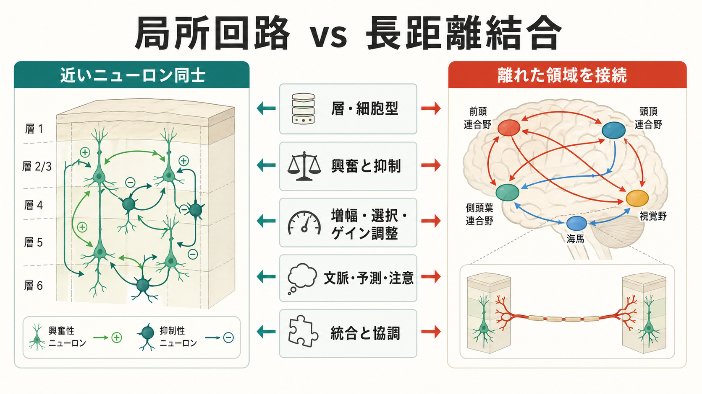
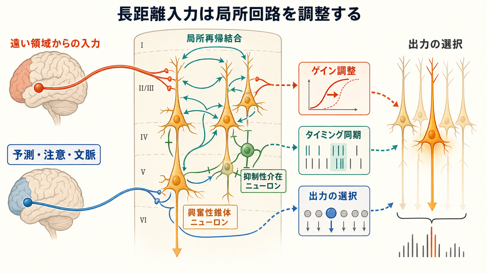
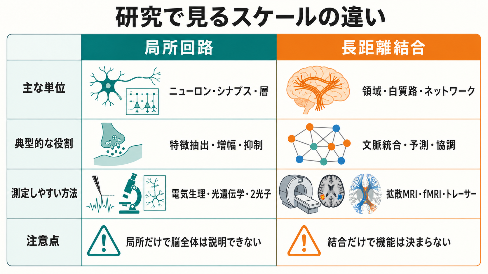

# 局所回路と長距離結合は何が違うのか

## 要点

- **局所回路**は、同じ皮質領域内の近いニューロン同士が、層構造、細胞型、興奮・抑制のバランスを通じて入力を変換する仕組みである。
- **長距離結合**は、離れた皮質領域や皮質下構造を結び、文脈、予測、注意、行動目標を局所回路へ届ける仕組みである。
- 皮質の情報処理は、局所回路だけでも長距離結合だけでも説明できない。局所で特徴を選び、遠距離ネットワークで複数領域を協調させる、という分業として考えると理解しやすい。

## この記事で答える問い

- 皮質内の「近い結合」と、領域間をまたぐ「遠い結合」は何が違うのか。
- 局所回路は何を計算し、長距離結合は何を調整するのか。
- 脳画像、電気生理、精神疾患研究で、この違いをどう読むべきか。

## まず結論

局所回路は、入力をその場で「使える神経表現」に変換する処理単位である。たとえば感覚入力は、[[ニューロンとは何か|ニューロン]]、[[シナプスとは何か|シナプス]]、[[介在ニューロンは神経回路で何をしているのか|介在ニューロン]]、層間結合を通じて増幅、抑制、選択、時間調整を受ける。新皮質の局所回路には、領域ごとの違いがありつつも、興奮性錐体ニューロンと抑制性介在ニューロンが層構造の中で相互作用する、ある程度共通した設計があると考えられてきた [1]。

一方、長距離結合は、別の領域で処理された情報を局所回路へ持ち込む。視覚皮質の入力処理であっても、高次皮質からのフィードバックは行動文脈や注意と結びつき、局所の発火パターンや感覚符号化を変える [2]。つまり、長距離結合は「情報を遠くへ運ぶ線」ではあるが、それ以上に、局所回路が何を強調し、何を無視し、どのタイミングで発火しやすくなるかを変える調整経路でもある。

## 背景

神経科学では、脳を少なくとも二つのスケールで見る必要がある。一つは、細胞、シナプス、皮質層、数百マイクロメートルから数ミリメートル程度の局所回路である。もう一つは、複数の皮質領域、白質路、機能ネットワーク、脳全体のグラフ構造である。前者は「どの入力がどの細胞に入り、どのように発火へ変換されるか」を問う。後者は「離れた領域がどのように情報を共有し、統合された行動や認知を支えるか」を問う。

この区別が重要なのは、同じ「結合」という言葉でも、測っている対象が違うからである。ペア記録や光遺伝学で見る結合は、特定の細胞型やシナプスの因果的な入力出力に近い。拡散 MRI や fMRI の結合は、白質路や活動の相関として見える大規模な関係であり、個々のシナプスを直接測っているわけではない [6]。

## 基本概念

### 局所回路

局所回路とは、同じ皮質領域内の比較的近いニューロン群が作る回路である。主な構成要素は、[[興奮性ニューロンと抑制性ニューロンは何が違うのか|興奮性ニューロンと抑制性ニューロン]]、皮質層、樹状突起、軸索側枝、局所シナプスである。局所回路の特徴は、単に距離が近いことではなく、入力を選別し、時間幅を整え、過剰な興奮を抑え、集団発火を安定化させる点にある [1]。

代表的な役割は、特徴抽出、入力の増幅、側方抑制、ゲイン調整、時間窓の制御である。[[GABAは脳で何をしているのか|GABA]] 作動性介在ニューロンは、発火しやすさや同期のタイミングを変え、[[グルタミン酸は脳で何をしているのか|グルタミン酸]] 作動性の興奮性入力と組み合わさって局所の計算を形作る [3]。

### 長距離結合

長距離結合とは、離れた皮質領域同士、または皮質と視床、基底核、海馬などを結ぶ結合である。解剖学的には白質線維や領域間投射として、機能的には fMRI、EEG、MEG などで観察される相関・同期・有効結合として扱われる。マカク皮質のトレーサー研究では、領域間結合は単純な疎な地図ではなく、強さに大きな偏りを持つ高密度な結合網として記述されている [4]。

長距離結合の役割は、局所回路が扱う入力に「文脈」を与えることである。たとえば、同じ視覚入力でも、注意、課題、予測、記憶によって処理は変わる。この変化は、遠い領域からのフィードバックやトップダウン入力が局所回路の感受性を変えることで実現されうる [2]。

## 仕組み

局所回路と長距離結合は、別々に働く二つの部品ではない。長距離入力は、局所回路の中にある興奮性・抑制性ニューロンへ入り、局所の再帰結合と相互作用する。その結果、同じ外部入力でも、ある状態では増幅され、別の状態では抑えられる。

この関係は、次のように整理できる。

| 観点 | 局所回路 | 長距離結合 |
|---|---|---|
| 主な空間スケール | 同一領域内、皮質層、近接ニューロン | 領域間、半球間、皮質-皮質下 |
| 主な構成要素 | シナプス、細胞型、層、局所軸索側枝 | 白質線維、領域間投射、機能ネットワーク |
| 得意な役割 | 特徴抽出、抑制、増幅、入力統合 | 文脈付け、予測、注意、全体協調 |
| よく使う測定法 | ペア記録、細胞内記録、2光子、光遺伝学 | トレーサー、拡散 MRI、fMRI、EEG/MEG |
| 注意点 | 局所だけでは認知全体を説明しにくい | 結合があっても機能の向きや細胞機構は直ちに決まらない |

## 図解

局所回路は、入力された信号をその場で変換する「処理装置」に近い。[[ニューロンは複数の入力をどのように統合するのか|複数の入力の統合]]、[[シナプス後電位とは何か|シナプス後電位]]、[[活動電位はどのように発生するのか|活動電位]]、抑制性入力のタイミングが、局所集団の出力を決める。

長距離結合は、この処理装置同士を結ぶ「通信と制御の経路」に近い。ただし、単なる電話線ではない。遠い領域からの入力は、局所回路内のどの細胞群が発火しやすいか、どの時間窓で情報が通りやすいかを変える。位相同期や神経コヒーレンスの研究は、離れた神経集団が同じタイミングで興奮しやすい状態になると、情報伝達が効率化しうることを示唆している [7], [8]。

## 臨床・研究との接続

精神医学や神経疾患研究では、「局所回路の異常」と「長距離結合の異常」がしばしば区別される。たとえば、局所の興奮・抑制バランス、介在ニューロン機能、シナプス可塑性の変化は、微小回路レベルの仮説として扱われる。一方、前頭-側頭、前頭-頭頂、デフォルトモードネットワークなどの変化は、長距離ネットワークの仮説として扱われる。

ただし、この二分法は慎重に使う必要がある。fMRI で長距離機能結合が低下して見えても、その原因が白質路の障害、局所回路の興奮・抑制バランス、神経血管結合、課題遂行方略の違いのどれにあるかは、それだけでは分からない。複雑ネットワーク研究は、脳がモジュール性、ハブ、小世界性、階層性を持つことを示してきたが、グラフのノードとエッジは生物学的詳細を大きく要約した表現である [5]。

研究上は、局所回路と長距離結合を対応づける設計が重要になる。たとえば、動物実験で細胞型特異的な局所回路操作を行い、その効果を広域記録や行動で見る。ヒト研究では、拡散 MRI、fMRI、EEG/MEG、神経刺激を組み合わせ、白質構造、同期、課題依存的な有効結合を分けて解釈する。ヒト connectome 研究では、高度に中心的なハブ領域が全体統合に関わる可能性が示されており、長距離結合のコストと効率の問題を考える手がかりになる [6]。

## よくある誤解

### 誤解1：局所回路は低次で、長距離結合は高次である

局所回路は単純な前処理装置ではない。局所の再帰結合、抑制性介在ニューロン、層間結合は、入力選択、予測誤差、注意効果、時間的文脈の形成に深く関わる。高次領域からの入力も、最終的には局所回路の細胞群に作用して表現を変える。

### 誤解2：長距離結合が強いほどよい

結合は強ければよいわけではない。脳は情報統合と配線コストの制約を同時に受ける。局所的なモジュール化と、少数の効率的な遠距離経路の組み合わせが重要であり、過剰な同期や不適切な結合はむしろ柔軟性を下げる可能性がある [5]。

### 誤解3：脳画像の結合は、シナプス結合をそのまま表す

fMRI の機能結合は活動の統計的関係であり、シナプス結合そのものではない。拡散 MRI は白質線維の方向性を推定するが、単一軸索やシナプスの機能を直接測るものではない。測定スケールの違いを混同しないことが重要である。

## 関連ノート

- [[ニューロンとは何か]]
- [[シナプスとは何か]]
- [[介在ニューロンは神経回路で何をしているのか]]
- [[興奮性ニューロンと抑制性ニューロンは何が違うのか]]
- [[ニューロンは複数の入力をどのように統合するのか]]
- [[軸索はどのように情報を遠くへ伝えるのか]]
- [[髄鞘はなぜ神経伝導を速くするのか]]
- [[シナプス可塑性とは何か]]

## MOC更新候補

- [[MOC｜脳・神経科学]]
- [[MOC｜基礎神経科学]]

## 理解チェック

1. 局所回路が主に担う「入力変換」とは、具体的にどのような処理を指すか。
2. 長距離結合は、なぜ単なる情報の通り道ではなく、局所回路の調整経路と考えられるのか。
3. fMRI の機能結合を、シナプス結合そのものとして読んではいけない理由は何か。
4. 精神疾患研究で「局所回路異常」と「長距離結合異常」を分けて考える利点と限界は何か。

## 参考文献

[1] Douglas, R. J., & Martin, K. A. C. (2004). Neuronal circuits of the neocortex. *Annual Review of Neuroscience*, 27, 419-451. https://doi.org/10.1146/annurev.neuro.27.070203.144152

[2] Harris, K. D., & Mrsic-Flogel, T. D. (2013). Cortical connectivity and sensory coding. *Nature*, 503, 51-58. https://doi.org/10.1038/nature12654

[3] Thomson, A. M., & Lamy, C. (2007). Functional maps of neocortical local circuitry. *Frontiers in Neuroscience*, 1, 19-42. https://doi.org/10.3389/neuro.01.1.1.002.2007

[4] Markov, N. T., Ercsey-Ravasz, M., Van Essen, D. C., Knoblauch, K., Toroczkai, Z., & Kennedy, H. (2013). Cortical high-density counterstream architectures. *Science*, 342(6158), 1238406. https://doi.org/10.1126/science.1238406

[5] Bullmore, E., & Sporns, O. (2009). Complex brain networks: graph theoretical analysis of structural and functional systems. *Nature Reviews Neuroscience*, 10, 186-198. https://doi.org/10.1038/nrn2575

[6] van den Heuvel, M. P., & Sporns, O. (2011). Rich-club organization of the human connectome. *Journal of Neuroscience*, 31(44), 15775-15786. https://doi.org/10.1523/JNEUROSCI.3539-11.2011

[7] Varela, F., Lachaux, J.-P., Rodriguez, E., & Martinerie, J. (2001). The brainweb: Phase synchronization and large-scale integration. *Nature Reviews Neuroscience*, 2, 229-239. https://doi.org/10.1038/35067550

[8] Fries, P. (2005). A mechanism for cognitive dynamics: neuronal communication through neuronal coherence. *Trends in Cognitive Sciences*, 9(10), 474-480. https://doi.org/10.1016/j.tics.2005.08.011

## 未解決問題

- 局所回路の細胞型特異的な変化が、ヒトの大規模機能結合の変化としてどのように現れるのか。
- 長距離結合の強さ、方向性、同期のどれが、認知機能や症状と最も安定して対応するのか。
- 個人差、発達、加齢、学習によって、局所回路と長距離ネットワークの分業がどの程度変化するのか。
