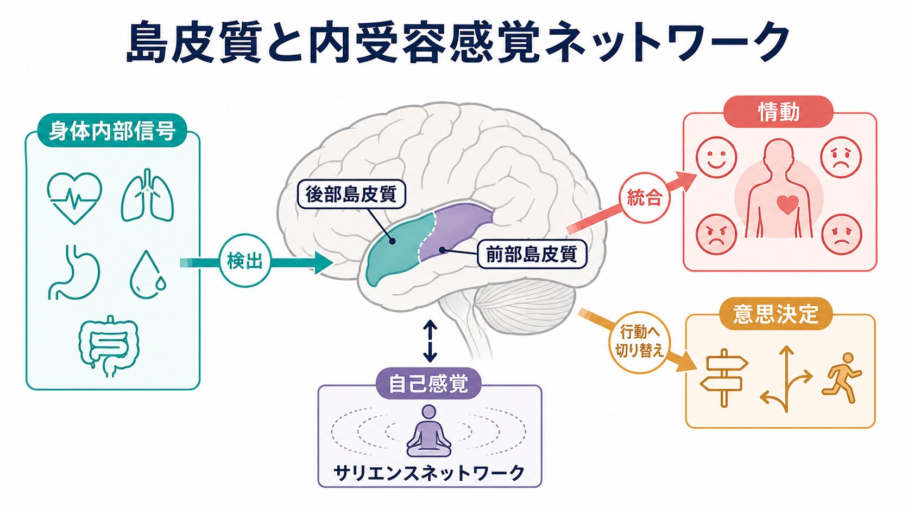
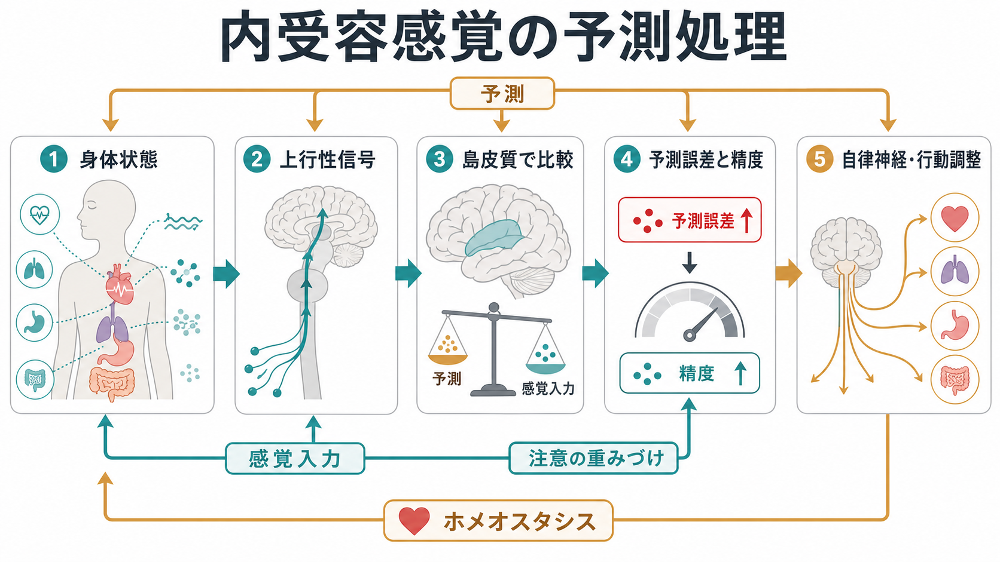
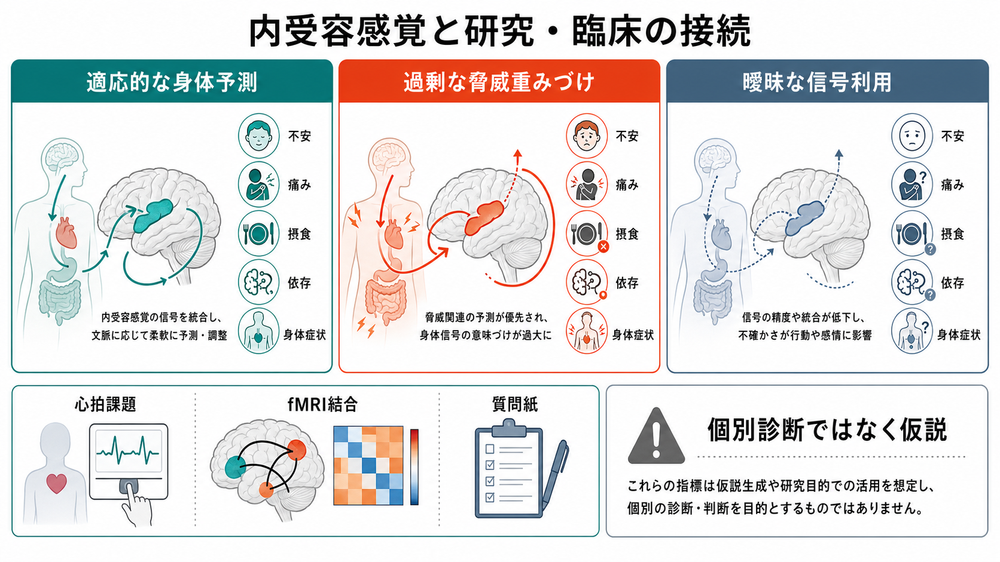

# 島皮質は内受容感覚ネットワークで何をしているのか

## 要点

- 島皮質は、心拍、呼吸、胃腸、痛み、温度、代謝状態などの身体内部信号を、情動・注意・行動選択に使える形へ変換する中継・統合領域である。
- 大まかには、後部から中部の島皮質がより感覚的・身体状態的な表現に関わり、前部島皮質が主観的気づき、情動的意味づけ、[[サリエンスネットワークとは何か|サリエンスネットワーク]]の切り替えに深く関わる。
- 島皮質は「身体を感じる場所」だけではなく、身体信号がいまの目標、危険、欲求、文脈にとってどれほど重要かを評価し、[[意思決定とは何か|意思決定]]や行動調整へ橋渡しする。
- 予測処理の観点では、島皮質は身体状態を受け取るだけでなく、「身体はこうなっているはずだ」という予測と、実際の感覚入力とのずれを調整する場として理解できる。

## この記事で答える問い

内受容感覚とは、身体内部の生理状態を神経系が感知・解釈・統合する過程である。では、島皮質はこのネットワークのなかで何をしているのか。この記事では、島皮質を単一の「感情中枢」とみなすのではなく、身体内部信号を、情動、注意、自己感覚、行動選択へ接続するネットワーク上のハブとして整理する。

## まず結論

島皮質の中心的な仕事は、身体内部信号を「いまの自分にとって意味のある状態」として再表現することである。心拍が速い、息苦しい、胃が重い、体温が変わる、痛みがある、といった信号は、それだけではまだ行動の指針にならない。島皮質はこれらを、危険、欲求、疲労、安心、不快、努力、自己感覚などの文脈へ結びつける。

この働きは段階的である。Craig の内受容感覚モデルでは、身体内部状態を表す求心性信号が島皮質へ入り、後部島皮質から前部島皮質へ向かうなかで、より統合的・主観的な身体感覚へ再表現されると考えられた[1]。心拍検出課題を用いた fMRI 研究では、右前部島皮質の活動と灰白質量が、内受容感覚の正確さや身体への気づきと関連することが示された[2]。ただし、後部が低次、前部が高次という単純な階層だけでは不十分で、島皮質内部には感覚運動、嗅味覚、社会情動、認知などに対応する機能分化と、前背側島皮質を中心とする統合の両方がある[4]。

## 背景

外界の感覚は見えやすい。視覚なら物体、聴覚なら音、[[体性感覚ネットワークは身体情報をどう表現するのか|体性感覚]]なら皮膚や筋肉の状態が対象になる。一方、内受容感覚は、心拍、血圧、呼吸、胃腸、膀胱、体温、痛み、炎症、代謝、ホルモン状態など、身体内部の変化を扱う。これらは常に意識されるわけではないが、気分、疲労感、空腹、緊張、違和感、安心感の背景を形づくる。

島皮質が重要なのは、内受容感覚が単なる「身体のモニター」ではないからである。身体内部状態は、情動の強さ、注意の向き、行動の準備、リスク評価、自己感覚に影響する。たとえば同じ心拍上昇でも、運動中なら自然な身体反応として処理され、暗い場所で物音を聞いた直後なら危険信号として解釈される。この文脈依存的な意味づけに島皮質が関わる。

## 基本概念

### 内受容感覚

内受容感覚は、身体内部からの信号を神経系が感知し、身体調節と経験に利用する過程である。Craig は、内受容感覚を「身体の生理状態の感覚」として定義し、痛み、温度、粘膜・内臓感覚、代謝状態などを含む広い身体状態表現として整理した[1]。現代的な整理では、内受容感覚は意識的な身体感覚だけでなく、自律神経、内分泌、免疫、代謝の調整に関わる無意識的過程も含む[8]。

### 島皮質

島皮質は外側溝の奥にある大脳皮質領域で、味覚、内臓感覚、痛み、温度、嫌悪、共感、リスク、 craving、自己感覚など多くの課題で活動する。多機能に見える理由は、島皮質が「何でもする領域」だからではなく、身体状態を多くの認知・情動機能へ接続する位置にあるからである。メタ解析では、島皮質は感覚運動、嗅味覚、社会情動、認知の複数ネットワークにまたがる機能分化を示す一方、前背側島皮質には複数機能の重なりがみられる[4]。

### サリエンスネットワーク

[[サリエンスネットワークとは何か|サリエンスネットワーク]]は、前部島皮質・前頭島皮質と背側前帯状皮質を主要ノードとし、注意を向けるべき内外の信号を検出し、他の大規模ネットワークの切り替えに関わるとされる。Seeley らは、安静時機能結合からサリエンス処理と実行制御に関わるネットワークを分離し、前頭島皮質と前帯状皮質を中核とするネットワークを示した[3]。Menon と Uddin は、前部島皮質を、内的自己関連処理と外的課題処理のあいだでネットワーク状態を切り替えるハブとして位置づけた[5]。

## 仕組み

### 1. 身体信号を受け取り、地図化する

内受容感覚の入口では、心臓、肺、消化管、血管、筋、皮膚深部などからの信号が、脊髄、脳幹、視床などを経て島皮質へ届く。島皮質はこれらを、身体内部状態の地図として表現する。ここで重要なのは、身体信号は一種類ではないという点である。痛み、温度、胃の張り、心拍、呼吸努力、血糖や空腹に関わる状態は、それぞれ異なる情報を持つ。

この段階の島皮質は、[[神経回路とは何か|神経回路]]としてみると、身体内部から上がってくる信号と、皮質・辺縁系・自律神経系からの調整信号が合流する場所である。したがって、島皮質の活動は「身体そのもの」だけでなく、「身体をどの文脈で読むか」にも左右される。

### 2. 後部島皮質から前部島皮質へ、身体信号を意味づける

古典的なモデルでは、後部島皮質はより一次的な身体状態表現に、前部島皮質は主観的感覚や情動的意味づけに関わるとされる[1]。たとえば、心拍が速いという信号は、後部・中部島皮質で身体状態として表現され、前部島皮質では「不安」「興奮」「努力」「予感」などの意味を帯びる可能性がある。

ただし、これは単純な一方向の階段ではない。Simmons らは、食物画像への反応が末梢グルコース状態と関連する部位が吻側ではなく尾側寄りの島皮質にみられることを示し、身体需要に応じた統合が後方領域にもありうることを報告した[6]。したがって、島皮質は「後ろが身体、前が心」という固定的な分業ではなく、身体状態、課題、文脈、ネットワーク結合によって機能が変わる領域とみる必要がある。

### 3. 重要な身体信号をサリエンス化する

島皮質は、身体信号を単に受けるだけでなく、それがいま重要かどうかを評価する。たとえば、喉の渇き、息苦しさ、痛み、吐き気、動悸は、現在の行動を止めたり、注意を内側へ向けたり、環境探索を強めたりする。前部島皮質はこの「身体信号の重要性」を、前帯状皮質、扁桃体、前頭前野、線条体などと連携して行動へつなぐ。

この働きは、[[デフォルトモードネットワークとは何か|デフォルトモードネットワーク]]、[[中央実行ネットワークとは何か|中央実行ネットワーク]]、[[前頭頭頂ネットワークは認知制御をどう支えるのか|前頭頭頂ネットワーク]]との切り替えとしても理解できる。内側の身体状態に注意を向けるべきか、外的課題に集中すべきか、行動を変更すべきかを決める場面で、前部島皮質はネットワーク状態の調整点になる[5]。

### 4. 予測と予測誤差を調整する

予測処理の観点では、脳は身体から信号を受動的に読むだけではない。脳は「次に身体がどうなるか」「この状況なら心拍や呼吸はどの程度変化するか」を予測し、その予測と実際の身体入力のずれを使って身体調整と経験を更新する。Barrett と Simmons は、内受容感覚を、身体内部状態に対する予測と予測誤差の階層的処理として整理した[7]。

この見方では、島皮質は内受容感覚の予測誤差や、その誤差をどれだけ信頼するかという精度重みづけに関わる。身体信号を過大に重みづければ、軽い動悸が強い危険信号として感じられるかもしれない。逆に、身体信号の精度が低く扱われれば、疲労、空腹、痛み、緊張への気づきが曖昧になり、行動調整が遅れるかもしれない。

### 5. 自己感覚へ接続する

「自分がここにいて、身体を持っている」という感覚は、視覚や体性感覚だけでなく、内受容感覚にも支えられる。心拍、呼吸、胃の感じ、体温、痛み、疲労感は、[[最小自己とは何か|最小自己]]や[[身体所有感とは何か|身体所有感]]の背景をつくる。Craig は、内受容感覚の統合が「物質的な私」の表現を支える可能性を提案した[1]。

ただし、島皮質だけが自己感覚を作るわけではない。自己感覚は、体性感覚、前庭感覚、運動予測、記憶、社会的自己評価、[[自己関連処理の脳ネットワークとは何か|自己関連処理の脳ネットワーク]]を含む多層的な現象である。島皮質はそのなかで、「身体内部から見た自己」の重みを与える役割を担う。

## 図解

上の 2 枚は、島皮質の全体像と予測処理としてのメカニズムを示している。もう少し臨床・研究側へ寄せると、島皮質の内受容処理は次のような問いに接続する。

## 臨床・研究との接続

内受容感覚は、不安、抑うつ、摂食、依存、身体症状、慢性痛などの研究で重要な構成概念になっている。Khalsa らは、内受容感覚の異常が複数の精神的健康状態に関わる可能性を整理し、感覚検出、解釈、予測、調整、主観報告を分けて測る必要を示した[8]。これは、島皮質を「疾患の原因」と短絡するのではなく、身体信号の処理様式が症状形成にどう寄与するかを研究する枠組みである。

測定では注意が必要である。心拍検出課題、呼吸負荷、胃内感覚、痛み課題、質問紙、fMRI 機能結合などは、それぞれ違う側面を測る。したがって「内受容感覚が高い／低い」と一言で言うより、感覚検出、主観的気づき、信念・解釈、身体調整のどのレベルを扱っているかを明確にする必要がある[8]。

臨床的には、研究知見を個別診断や治療指示として直接使うべきではない。たとえば不安で動悸が強く感じられる場合、それが前部島皮質の過活動だけで説明できるとは限らない。自律神経、呼吸、認知的評価、生活文脈、学習歴、疾患、薬剤、睡眠などが関わる。教育・研究目的では、島皮質は「身体信号が症状や行動に変換される過程を見る窓」として有用である。

## よくある誤解

### 誤解1: 島皮質は「感情の場所」である

島皮質は情動に深く関わるが、情動だけを担う場所ではない。味覚、痛み、温度、内臓感覚、注意、認知制御、社会情動などにも関わる。島皮質の特徴は、感情そのものを保存することではなく、身体状態を情動や行動に使える表現へ変換することにある。

### 誤解2: 内受容感覚は意識的に身体を感じることだけである

意識的な動悸や空腹感は内受容感覚の一部だが、内受容処理の多くは無意識的に進む。自律神経、内分泌、免疫、呼吸、循環、代謝の調整は、意識に上らないまま行動や気分を変える。

### 誤解3: 後部島皮質が低次、前部島皮質が高次と完全に分かれる

後部から前部への再表現という考え方は有用だが、島皮質の機能分化はより複雑である。メタ解析は、島皮質に複数の機能領域があり、前背側島皮質が統合的な重なりを示すことを報告している[4]。身体需要の統合が尾側寄りの島皮質でみられる研究もあり、単純な前後軸だけでは説明しきれない[6]。

### 誤解4: 島皮質を鍛えればすべての心身症状が改善する

内受容感覚への注意や解釈は、ストレス、痛み、不安、摂食、依存などの研究で重要だが、個別の症状は多因子的である。島皮質の知見は、診断や治療の直接指示ではなく、身体信号の処理を理解するための研究枠組みとして使うのが適切である。

## 関連ノート

- [[サリエンスネットワークとは何か]]
- [[体性感覚ネットワークは身体情報をどう表現するのか]]
- [[神経回路とは何か]]
- [[脳ネットワークの破綻は精神疾患をどう説明するのか]]
- [[身体と感情はどのようにつながるのか]]
- [[感情は身体感覚の予測なのか]]
- [[予測処理とは何か]]
- [[最小自己とは何か]]
- [[身体所有感とは何か]]
- [[リスク下の意思決定はどのように行われるのか]]

## MOC更新候補

- `content/00_MOC/MOC｜意識・自己・身体性.md`
- 脳ネットワーク系の MOC が統合ジョブで更新される場合は、[[サリエンスネットワークとは何か]]、[[体性感覚ネットワークは身体情報をどう表現するのか]]、[[脳ネットワークの破綻は精神疾患をどう説明するのか]]の近くに配置すると読みやすい。

## 理解チェック

1. 島皮質が「身体内部信号を受け取る」だけでなく、「意味づける」と言える理由は何か。
2. 後部島皮質と前部島皮質の分業を、単純化しすぎずに説明するとどうなるか。
3. サリエンスネットワークにおける前部島皮質の役割は、注意や行動切り替えとどう関係するか。
4. 内受容感覚を予測処理として見ると、不安や身体症状の研究でどのような問いが立てられるか。
5. 内受容感覚の測定で、課題成績、主観的自信、質問紙を分ける必要があるのはなぜか。

## 未解決問題

- 島皮質内部の機能分化を、解剖学的区分、機能結合、課題活動、個人差のどのレベルで対応づけるべきか。
- 内受容感覚の「正確さ」「敏感さ」「不快さ」「信頼度」「注意の向け方」を、どのように分離して測るべきか。
- 島皮質の活動異常が症状の原因なのか、結果なのか、補償なのかを縦断研究や介入研究でどう検証するか。
- 内受容感覚の予測処理モデルを、個別症状の説明に使う際、どこまで定量化できるか。

## 参考文献

[1] Craig, A. D. (2002). How do you feel? Interoception: the sense of the physiological condition of the body. *Nature Reviews Neuroscience*, 3, 655-666. https://doi.org/10.1038/nrn894

[2] Critchley, H. D., Wiens, S., Rotshtein, P., Ohman, A., & Dolan, R. J. (2004). Neural systems supporting interoceptive awareness. *Nature Neuroscience*, 7, 189-195. https://doi.org/10.1038/nn1176

[3] Seeley, W. W., Menon, V., Schatzberg, A. F., Keller, J., Glover, G. H., Kenna, H., Reiss, A. L., & Greicius, M. D. (2007). Dissociable intrinsic connectivity networks for salience processing and executive control. *Journal of Neuroscience*, 27(9), 2349-2356. https://doi.org/10.1523/JNEUROSCI.5587-06.2007

[4] Kurth, F., Zilles, K., Fox, P. T., Laird, A. R., & Eickhoff, S. B. (2010). A link between the systems: functional differentiation and integration within the human insula revealed by meta-analysis. *Brain Structure and Function*, 214, 519-534. https://doi.org/10.1007/s00429-010-0255-z

[5] Menon, V., & Uddin, L. Q. (2010). Saliency, switching, attention and control: a network model of insula function. *Brain Structure and Function*, 214, 655-667. https://doi.org/10.1007/s00429-010-0262-0

[6] Simmons, W. K., Rapuano, K. M., Kallman, S. J., Ingeholm, J. E., Miller, B., Gotts, S. J., Avery, J. A., Hall, K. D., & Martin, A. (2013). Category-specific integration of homeostatic signals in caudal but not rostral human insula. *Nature Neuroscience*, 16, 1551-1552. https://doi.org/10.1038/nn.3535

[7] Barrett, L. F., & Simmons, W. K. (2015). Interoceptive predictions in the brain. *Nature Reviews Neuroscience*, 16, 419-429. https://doi.org/10.1038/nrn3950

[8] Khalsa, S. S., Adolphs, R., Cameron, O. G., Critchley, H. D., Davenport, P. W., Feinstein, J. S., Feusner, J. D., Garfinkel, S. N., Lane, R. D., Mehling, W. E., Meuret, A. E., Nemeroff, C. B., Oppenheimer, S., Petzschner, F. H., Pollatos, O., Rhudy, J. L., Schramm, L. P., Simmons, W. K., Stein, M. B., Stephan, K. E., Van den Bergh, O., Van Diest, I., von Leupoldt, A., & Zucker, N. (2018). Interoception and mental health: a roadmap. *Biological Psychiatry: Cognitive Neuroscience and Neuroimaging*, 3(6), 501-513. https://doi.org/10.1016/j.bpsc.2017.12.004
