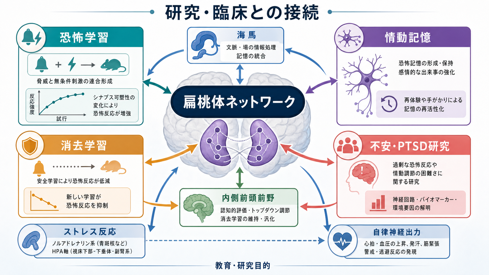
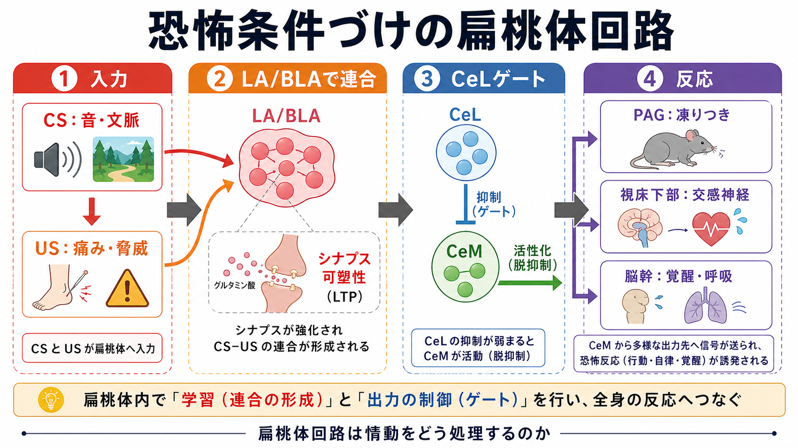
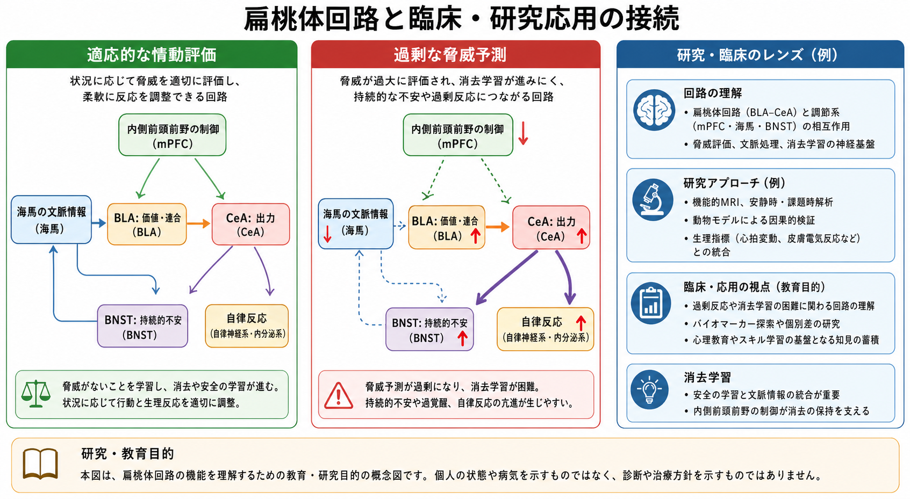

# 扁桃体回路は情動をどう処理するのか

## 要点

- 扁桃体は「恐怖だけの中枢」ではなく、刺激の生物学的価値、予測、文脈、身体反応を結びつける回路群である。
- 外側核・基底核・副基底核を含む基底外側複合体（BLA）は、感覚入力、文脈、価値情報を統合し、経験依存的な連合を形成する。
- 中心核（CeA）は、視床下部、PAG、脳幹へ出力し、凍りつき、心拍・血圧、覚醒、内分泌反応などを組織化する。
- 海馬と内側前頭前野は、文脈情報とトップダウン制御を通じて、恐怖反応の汎化や消去学習に関わる。

## この記事で答える問い

扁桃体は、音・表情・痛み・文脈のような入力をどのように「情動的に意味のある出来事」として処理し、行動や自律反応へ変換するのだろうか。ここでは、[[神経回路とは何か]]、[[恐怖条件づけとは何か]]、[[自律神経ネットワークは内臓状態をどう制御するのか]]と接続しながら、扁桃体内外の結合を整理する。

## まず結論

扁桃体回路は、刺激を単に「怖い」と判定する装置ではない。感覚入力と文脈情報を BLA で結びつけ、CeA を通じて視床下部・PAG・脳幹へ出力し、状況に応じた行動、覚醒、自律反応をまとめる予測制御系として働く。恐怖条件づけではこの仕組みが特に明瞭に見えるが、扁桃体は報酬、曖昧性、社会的手がかり、内受容信号などにも関わるため、情動評価の一般的な回路として理解する方が正確である [1][2][5]。

## 背景

扁桃体は側頭葉内側にある核群で、単一の構造というより、複数の核が異なる入力・出力をもつ回路集合である。大まかには、感覚・文脈・価値を統合する BLA、出力制御に強く関わる CeA、嗅覚や内側辺縁系との接続をもつ皮質内側部などに分けられる [1]。

古典的な恐怖条件づけでは、音などの条件刺激（CS）と痛みなどの無条件刺激（US）が繰り返し対提示される。すると、音だけで凍りつきや心拍上昇が生じるようになる。この学習は、扁桃体でのシナプス可塑性と、CeA から脳幹・視床下部への出力によって説明できる [2][3]。

## 基本概念

**BLA**

BLA は外側核、基底核、副基底核を含む領域で、聴覚・視覚・体性感覚入力、海馬由来の文脈情報、前頭前野からの制御信号を受ける。ここでは「この音は危険を予測する」「この文脈では安全である」といった連合が形成される [1][3]。

**CeA**

CeA は扁桃体の主要な出力核として、PAG、視床下部、脳幹へ信号を送る。とくに中心核外側部（CeL）と中心核内側部（CeM）の抑制性マイクロ回路は、恐怖反応を通すか抑えるかを調節するゲートとして働く [6]。

**文脈と制御**

[[海馬回路は記憶をどう形成するのか|海馬回路]]は「どの場所・状況で学習されたか」を与え、[[前頭前野は情動制御にどう関わるのか|前頭前野]]は安全学習や消去学習の保持に関わる。したがって、扁桃体回路の出力は刺激だけでなく、文脈、予測、過去経験、認知的評価によって変わる [4][7]。

## 仕組み

恐怖条件づけを例にすると、処理は次のように進む。

1. 音、視覚刺激、文脈、痛みなどの入力が、視床・皮質・海馬などを介して BLA に入る。
2. BLA では CS と US の連合が形成され、シナプス可塑性により、CS だけで脅威予測が立ち上がるようになる [3]。
3. BLA は CeA に信号を送り、CeL/CeM の抑制性回路を介して出力の強さを調節する [6]。
4. CeM から PAG、視床下部、脳幹へ出力され、凍りつき、交感神経活動、呼吸・覚醒、ストレスホルモン系の反応が組織化される [2][6]。

重要なのは、CeA 出力が「反射」をそのまま出しているだけではない点である。出力は BLA、前頭前野、海馬、BNST、視床下部などとの相互作用を受け、急性の恐怖、持続的な不安、文脈依存的な安全学習を分けて調節する [4][5][7]。

## 図解

扁桃体回路は、次の三層で見ると理解しやすい。

| 層 | 主な構造 | 役割 |
|---|---|---|
| 入力・評価 | 感覚皮質、視床、海馬、BLA | 刺激、文脈、価値、予測誤差を統合する |
| ゲート・選択 | BLA、CeL、CeM、介在ニューロン | どの反応を出すか、どの反応を抑えるかを調節する |
| 出力・身体化 | 視床下部、PAG、脳幹、自律神経系 | 行動、覚醒、自律反応、内分泌反応として表現する |

この三層は固定的な直列処理ではない。皮質や海馬からのフィードバックにより、同じ刺激でも「危険」「安全」「曖昧」「報酬的」といった意味づけが変化する。この点は、[[情動と認知は分けられるのか]]という問いとも深く関わる。

## 臨床・研究との接続

不安症や PTSD 研究では、扁桃体過活動、前頭前野による制御、海馬による文脈処理、消去学習の困難がよく検討される。ただし、これらは集団研究や実験課題から見える傾向であり、個人の診断や治療方針を直接決めるものではない [7][8]。

動物研究では、特定の扁桃体ニューロン集団や投射経路を操作し、恐怖反応や回避行動がどう変わるかを調べられる。ヒト研究では fMRI、皮膚電気反応、心拍変動、驚愕反射、質問紙を組み合わせて、情動評価と身体反応の対応を推定する [4][8]。この接続は、[[扁桃体過活動は不安症やPTSDにどう関わるのか]]や[[PTSDでは恐怖記憶ネットワークに何が起きているのか]]を読む前提にもなる。

## よくある誤解

**誤解1: 扁桃体は恐怖だけを処理する。**

恐怖条件づけで有名だが、扁桃体は報酬、嫌悪、曖昧性、社会的意味、注意を引く刺激にも関わる。より広くは、刺激の価値と行動上の重要性を学習する回路と考える方がよい [5]。

**誤解2: 扁桃体が活動すれば病的である。**

扁桃体活動は適応的な警戒や学習にも必要である。問題になるのは、文脈に合わない過剰反応、消去学習の困難、制御回路との不均衡などである [7][8]。

**誤解3: 前頭前野は扁桃体を一方的に抑える。**

前頭前野と扁桃体の関係は単純なブレーキではない。安全学習、再評価、注意、行動選択の文脈によって、促進的にも抑制的にも働きうる。

## 関連ノート

- [[神経回路とは何か]]
- [[恐怖条件づけとは何か]]
- [[海馬回路は記憶をどう形成するのか]]
- [[前頭前野は情動制御にどう関わるのか]]
- [[自律神経ネットワークは内臓状態をどう制御するのか]]
- [[情動と認知は分けられるのか]]
- [[扁桃体過活動は不安症やPTSDにどう関わるのか]]
- [[PTSDでは恐怖記憶ネットワークに何が起きているのか]]

## 理解チェック

1. BLA と CeA は、扁桃体回路の中でそれぞれどのような役割を担うか。
2. 恐怖条件づけでは、CS と US の連合はどのように行動・自律反応へ変換されるか。
3. 海馬と前頭前野を加えると、扁桃体回路の理解はどのように変わるか。
4. 「扁桃体は恐怖中枢である」という説明には、どのような限界があるか。

## 未解決問題

- ヒトの自然な情動経験を、実験室の恐怖条件づけ課題だけでどこまで説明できるか。
- 扁桃体の活動増加が、脅威評価、注意、覚醒、記憶増強のどれを主に反映しているのかをどう分離するか。
- 個人差、発達、ストレス経験、薬物療法・心理療法による回路変化を、臨床的に有用な形でどう測定するか。

## MOC更新候補

- `content/00_MOC/` 配下の神経科学・神経回路系 MOC に追加候補。並列ジョブとの競合を避けるため、本記事では MOC ファイルを直接更新しない。

## 参考文献

[1] Sah, P., Faber, E. S. L., Lopez De Armentia, M., & Power, J. (2003). The amygdaloid complex: Anatomy and physiology. *Physiological Reviews, 83*(3), 803-834. https://doi.org/10.1152/physrev.00002.2003

[2] LeDoux, J. E. (2000). Emotion circuits in the brain. *Annual Review of Neuroscience, 23*, 155-184. https://doi.org/10.1146/annurev.neuro.23.1.155

[3] Pape, H. C., & Pare, D. (2010). Plastic synaptic networks of the amygdala for the acquisition, expression, and extinction of conditioned fear. *Physiological Reviews, 90*(2), 419-463. https://doi.org/10.1152/physrev.00037.2009

[4] Herry, C., & Johansen, J. P. (2014). Encoding of fear learning and memory in distributed neuronal circuits. *Nature Neuroscience, 17*, 1644-1654. https://doi.org/10.1038/nn.3869

[5] Janak, P. H., & Tye, K. M. (2015). From circuits to behaviour in the amygdala. *Nature, 517*, 284-292. https://doi.org/10.1038/nature14188

[6] Ciocchi, S., Herry, C., Grenier, F., Wolff, S. B. E., Letzkus, J. J., Vlachos, I., Ehrlich, I., Sprengel, R., Deisseroth, K., Stadler, M. B., Muller, C., & Luthi, A. (2010). Encoding of conditioned fear in central amygdala inhibitory circuits. *Nature, 468*, 277-282. https://doi.org/10.1038/nature09559

[7] Quirk, G. J., & Mueller, D. (2008). Neural mechanisms of extinction learning and retrieval. *Neuropsychopharmacology, 33*, 56-72. https://doi.org/10.1038/sj.npp.1301555

[8] Phelps, E. A., & LeDoux, J. E. (2005). Contributions of the amygdala to emotion processing: From animal models to human behavior. *Neuron, 48*(2), 175-187. https://doi.org/10.1016/j.neuron.2005.09.025
