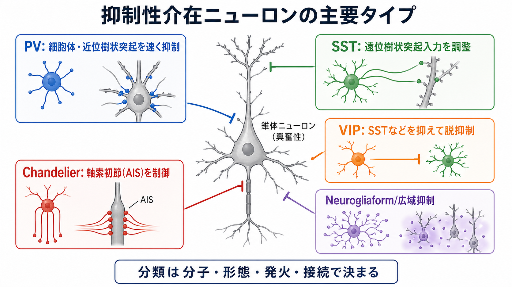
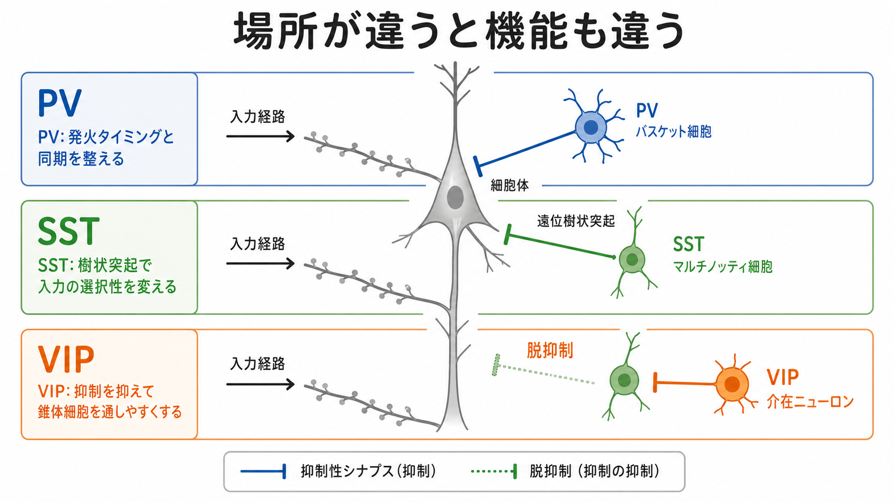
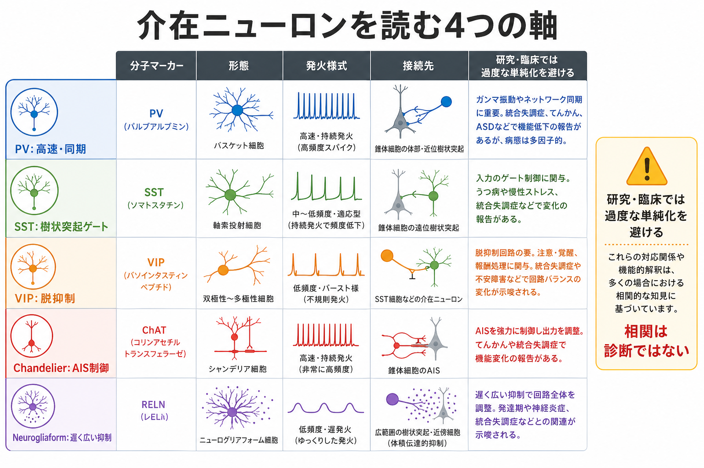

# 抑制性介在ニューロンにはどのような種類があるのか

## 要点

- 抑制性介在ニューロンは、多くの場合 [[GABAは脳で何をしているのか|GABA]] を放出し、局所回路の発火タイミング、入力選択性、同期、脱抑制を調整する細胞群である。
- 「種類」は単一の基準では決まらない。分子マーカー、形態、発火様式、接続先、発生起源、トランスクリプトームを組み合わせて分類する必要がある[1][5][7]。
- 大脳皮質でよく使われる入口は、PV、SST、VIPという3群である。PV細胞は細胞体周辺や軸索初節近くで出力を鋭く制御し、SST細胞は遠位樹状突起入力を調整し、VIP細胞は主に他の抑制性細胞を抑えることで脱抑制を生む[2][4]。
- ただし、PV・SST・VIPは完成された分類表ではない。バスケット細胞、シャンデリア細胞、Martinotti細胞、neurogliaform細胞などの形態・接続に基づく名前と重なり合う[1][2]。
- 精神疾患や発達障害との関係は重要な研究領域だが、「PV細胞の異常 = 特定の診断」と単純化してはいけない。回路、発達、脳領域、行動課題を含めて読む必要がある[8]。

## この記事で答える問い

1. 抑制性介在ニューロンは、どのような基準で分類されるのか。
2. PV、SST、VIP細胞は、それぞれ何をしているのか。
3. 代表的な細胞型を、[[シナプスとは何か|シナプス]]の標的部位と回路機能からどう理解すればよいのか。
4. 研究・臨床の文脈で、どこまで言えて、どこから慎重に扱うべきか。

## まず結論

抑制性介在ニューロンは「脳のブレーキ」というより、[[神経細胞の種類はどのように分類されるのか|神経細胞]]の活動を、場所と時間に応じて整形する局所制御装置である。細胞体近くを抑えるPV細胞は発火タイミングを鋭くし、[[樹状突起はどのように情報を受け取るのか|樹状突起]]を抑えるSST細胞は入力の通りやすさを調整し、VIP細胞はSST細胞などを抑えることで錐体細胞への抑制を一時的に外す。したがって、介在ニューロンを理解する近道は「どの分子を持つか」だけでなく、「どの細胞の、どの部位を、どの時間スケールで抑えるか」を見ることである[2][3]。

## 背景

大脳皮質では、興奮性ニューロンが長距離投射や局所興奮を担う一方、抑制性介在ニューロンは局所回路の中で活動の広がりを制御する。数としては少数派でも、錐体細胞の細胞体、[[軸索小丘はなぜ発火の起点になるのか|軸索初節]]、近位樹状突起、遠位樹状突起、他の介在ニューロンなど、戦略的な標的に入力するため、回路全体の出力に大きな影響を持つ[2]。

歴史的には、介在ニューロンは形態や発火様式から名づけられてきた。たとえばバスケット細胞は細胞体周辺に軸索終末を作り、シャンデリア細胞は軸索初節へ特徴的に入力する。近年は、PV、SST、VIP、Pvalb、Sst、Vipなどの分子マーカー、単一細胞RNA-seq、形態電気生理データを統合して分類する方向へ進んでいる[5][6][7]。

## 基本概念

### 分類の4つの軸

介在ニューロン分類で混乱しやすいのは、分類軸が複数あることだ。Petilla terminology は、形態、分子、発火パターン、機能的性質を整理する共通語彙の必要性を示した[1]。現在もこの考え方は重要で、単一のマーカーだけで細胞型を完全に決めるより、複数の特徴を重ねて同定するのが妥当である。

| 分類軸 | 例 | 何がわかるか |
|---|---|---|
| 分子マーカー | PV、SST、VIP、NPY、nNOS | 細胞群の大まかな系統や実験操作の入口 |
| 形態 | バスケット細胞、シャンデリア細胞、Martinotti細胞 | どこへ軸索を伸ばし、どこを抑えるか |
| 発火様式 | fast-spiking、regular-spiking、late-spiking | どの時間スケールで応答するか |
| 接続先 | 細胞体、軸索初節、遠位樹状突起、他の介在ニューロン | 回路機能に直結する標的 |

### PV細胞

PV細胞は、parvalbuminを発現する介在ニューロン群で、fast-spikingな発火特性を持つことが多い。代表例はPVバスケット細胞とPVシャンデリア細胞である。バスケット細胞は錐体細胞の細胞体や近位樹状突起を抑え、シャンデリア細胞は軸索初節を標的にするため、発火の出力段階を強く制御する[2]。

機能的には、PV細胞は発火タイミング、E/Iバランス、同期活動、ガンマ帯域リズムなどと関係づけられることが多い。ただし、PV細胞も均質ではなく、脳領域や層、発達段階、標的細胞によって性質は変わる[2][5]。

### SST細胞

SST細胞は、somatostatinを発現する介在ニューロン群で、皮質ではMartinotti細胞が代表例としてよく挙げられる。SST細胞は錐体細胞の遠位樹状突起へ入力することが多く、樹状突起上で受け取る長距離入力、局所入力、トップダウン入力の通りやすさを調整する[2]。

PV細胞が「発火するかどうか」の出口近くに効きやすいのに対し、SST細胞は「どの入力をどれだけ統合するか」に効きやすい。したがって、SST細胞は感覚入力、文脈、注意、可塑性の調整と結びつけて考えると理解しやすい。

### VIP細胞

VIP細胞は、vasoactive intestinal peptideを発現する介在ニューロン群で、しばしば他の抑制性介在ニューロン、とくにSST細胞を抑える。つまり、VIP細胞は錐体細胞を直接強く興奮させるというより、「抑制を抑える」ことで錐体細胞への入力を通しやすくする脱抑制回路に関与する[4]。

Pfefferらの視覚皮質研究は、PV、SST、VIPという分子的に異なる集団の間に、相補的な抑制ネットワークがあることを示した。特にVIP細胞がSST細胞を優先的に抑える構図は、皮質回路での脱抑制を考える基本モデルになっている[4]。

## 仕組み

### 標的部位が機能を決める

抑制性介在ニューロンの機能差は、標的部位を見ると整理しやすい。細胞体周辺を抑えれば、発火の最終出力を鋭く制御できる。遠位樹状突起を抑えれば、特定の入力枝で起きる統合や可塑性を調整できる。軸索初節を抑えれば、活動電位が始まる入口に直接作用できる。他の介在ニューロンを抑えれば、抑制の強さを回路状態に応じて切り替えられる[2][3]。

### 代表的な整理

| 細胞型 | 典型的な標的 | 代表的な機能 | 注意点 |
|---|---|---|---|
| PVバスケット細胞 | 細胞体、近位樹状突起 | 発火タイミング、同期、出力ゲイン調整 | PV細胞すべてが同じ働きをするわけではない |
| PVシャンデリア細胞 | 軸索初節 | 活動電位開始部位の制御 | 条件によって効果の解釈が複雑になる |
| SST/Martinotti細胞 | 遠位樹状突起 | 入力選択性、樹状突起計算、可塑性調整 | 層や投射入力との関係が重要 |
| VIP細胞 | SST細胞などの抑制性細胞 | 脱抑制、状態依存的なゲート | 直接興奮ではなく抑制ネットワーク内の制御として読む |
| Neurogliaform細胞 | 周辺の広い領域、遅い抑制 | 体積伝達的・広域的な抑制 | PV/SST/VIPだけでは拾いきれない多様性がある |

## 図解

下の図は、介在ニューロンを読むときの4つの軸をまとめたものである。研究では、分子マーカーだけでなく、形態、発火様式、接続先、単一細胞トランスクリプトームを組み合わせて「細胞型」を定義する方向へ進んでいる[5][6][7]。

## 臨床・研究との接続

抑制性介在ニューロンは、てんかん、統合失調症、自閉スペクトラム症、認知機能障害などの研究で重要視されている。特にPV細胞は、皮質リズム、同期、認知課題中の情報処理と関係づけられ、発達や精神疾患研究でも頻繁に議論される[8]。

ただし、臨床的には慎重な表現が必要である。介在ニューロンの異常は、疾患を説明する可能性のある回路レベルの仮説であって、個別診断や治療指示そのものではない。ヒトの症状は、遺伝、発達、環境、薬物、複数脳領域、興奮性細胞、グリア、神経修飾系の相互作用から生じる。したがって、研究知見を読むときは「どの細胞型が、どの脳領域で、どの発達段階に、どの測定指標で変化したのか」を確認する必要がある。

## よくある誤解

### 誤解1: 抑制性介在ニューロンはすべて同じ働きをする

同じGABA作動性でも、PV、SST、VIP、シャンデリア細胞、neurogliaform細胞では標的部位と時間スケールが異なる。抑制は一枚岩ではなく、回路のどこに作用するかで意味が変わる[1][2]。

### 誤解2: PV・SST・VIPで全種類を説明できる

PV・SST・VIPは便利な入口だが、介在ニューロンの全多様性を尽くすものではない。単一細胞RNA-seqでは、より細かなトランスクリプトーム型が多数報告されている[6]。また、形態電気生理と遺伝子発現を統合すると、同じ大分類の内部にも多様な型が見えてくる[7]。

### 誤解3: VIP細胞は錐体細胞を単純に興奮させる

VIP細胞の重要な働きは、しばしば他の抑制性細胞を抑えることである。結果として錐体細胞が活動しやすくなるため「脱抑制」と呼ばれるが、これは直接の興奮性入力とは異なる[4]。

### 誤解4: 精神疾患は特定の介在ニューロンだけで説明できる

PV細胞やGABA作動性介在ニューロンの異常は精神疾患研究で重要だが、個別の症状や診断を単一細胞型へ還元するのは過度な単純化である。介在ニューロン研究は、症状を回路機能として理解するための重要な手がかりとして扱うのがよい[8]。

## 関連ノート

- [[介在ニューロンは神経回路で何をしているのか]]
- [[興奮性ニューロンと抑制性ニューロンは何が違うのか]]
- [[GABAは脳で何をしているのか]]
- [[シナプスとは何か]]
- [[樹状突起はどのように情報を受け取るのか]]
- [[軸索小丘はなぜ発火の起点になるのか]]
- [[神経細胞の種類はどのように分類されるのか]]

## MOC更新候補

- [[MOC｜脳・神経科学]]
- [[MOC｜基礎神経科学]]

## 理解チェック

1. PV細胞、SST細胞、VIP細胞の標的部位と主な機能を、それぞれ一文で説明できるか。
2. 「分子マーカーだけで介在ニューロン型を完全に分類できない」理由を説明できるか。
3. 脱抑制とは何かを、VIP細胞とSST細胞の関係から説明できるか。
4. 介在ニューロン研究を精神疾患と接続するとき、なぜ過度な単純化を避ける必要があるか。

## 参考文献

[1] The Petilla Interneuron Nomenclature Group. (2008). Petilla terminology: nomenclature of features of GABAergic interneurons of the cerebral cortex. *Nature Reviews Neuroscience*, 9, 557-568. https://doi.org/10.1038/nrn2402

[2] Tremblay, R., Lee, S., & Rudy, B. (2016). GABAergic Interneurons in the Neocortex: From Cellular Properties to Circuits. *Neuron*, 91(2), 260-292. https://doi.org/10.1016/j.neuron.2016.06.033

[3] Kepecs, A., & Fishell, G. (2014). Interneuron cell types are fit to function. *Nature*, 505, 318-326. https://doi.org/10.1038/nature12983

[4] Pfeffer, C. K., Xue, M., He, M., Huang, Z. J., & Scanziani, M. (2013). Inhibition of inhibition in visual cortex: the logic of connections between molecularly distinct interneurons. *Nature Neuroscience*, 16, 1068-1076. https://doi.org/10.1038/nn.3446

[5] Huang, Z. J., & Paul, A. (2019). The diversity of GABAergic neurons and neural communication elements. *Nature Reviews Neuroscience*, 20, 563-572. https://doi.org/10.1038/s41583-019-0195-4

[6] Tasic, B., Yao, Z., Graybuck, L. T., et al. (2018). Shared and distinct transcriptomic cell types across neocortical areas. *Nature*, 563, 72-78. https://doi.org/10.1038/s41586-018-0654-5

[7] Gouwens, N. W., Sorensen, S. A., Baftizadeh, F., et al. (2020). Integrated Morphoelectric and Transcriptomic Classification of Cortical GABAergic Cells. *Cell*, 183(4), 935-953.e19. https://doi.org/10.1016/j.cell.2020.09.057

[8] Marín, O. (2012). Interneuron dysfunction in psychiatric disorders. *Nature Reviews Neuroscience*, 13, 107-120. https://doi.org/10.1038/nrn3155

## 未解決問題

- PV・SST・VIPなどの細胞群を、ヒトの認知機能や症状次元へどの程度対応づけられるか。
- トランスクリプトーム分類と、実際の回路機能分類をどのように統合するか。
- 発達期の介在ニューロン成熟が、成人期のE/Iバランス、可塑性、精神疾患脆弱性へどう影響するか。
- 動物モデルで同定された細胞型機能を、ヒト皮質や臨床データへどう橋渡しするか。

## 更新ログ

- 2026-04-27: 初版作成。PV・SST・VIP細胞を中心に、分類軸、作用部位、図解、研究・臨床との接続、参考文献を追加。
