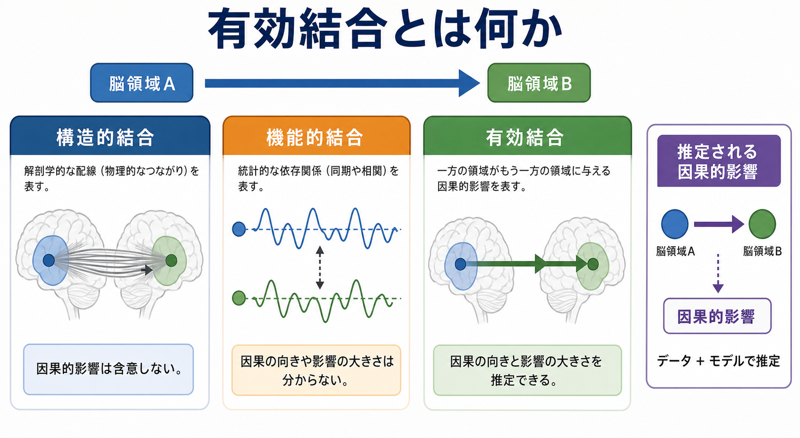
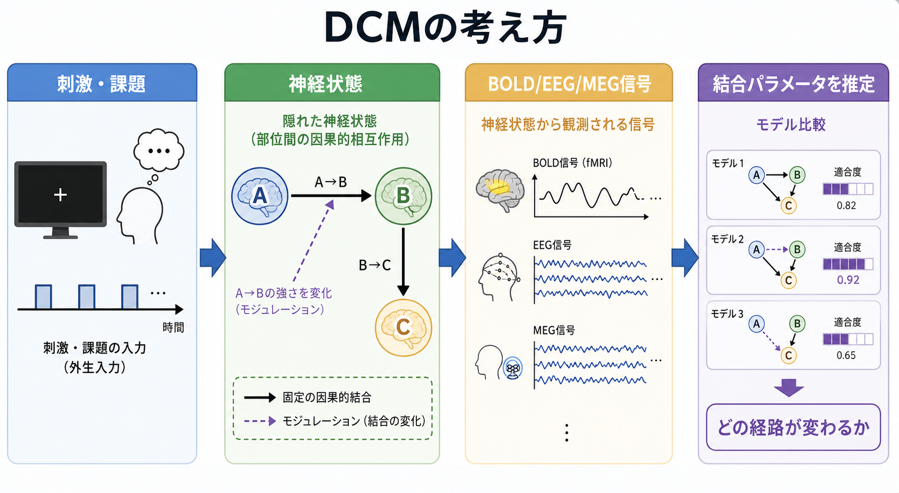
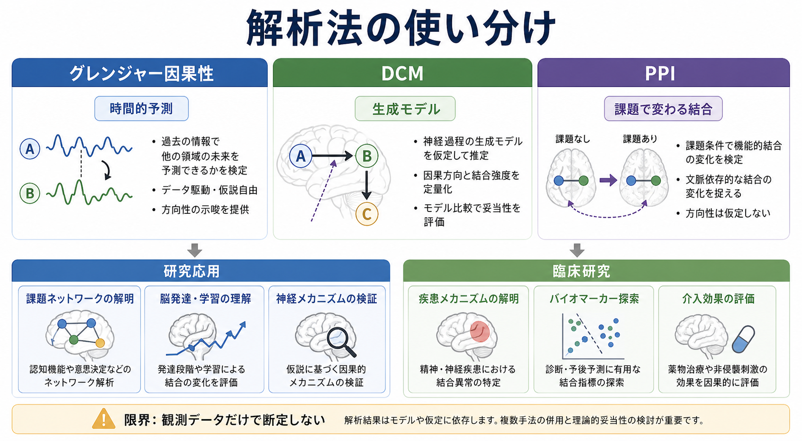

# 有効結合とは何か

## 要点

- 有効結合とは、ある神経集団または脳領域の活動が、別の領域の活動に及ぼす「方向性をもつ影響」を推定する考え方である。
- 構造的結合は「配線」、機能的結合は「活動の共変動」、有効結合は「どちらがどちらに影響したか」というモデル化された関係を扱う。
- 代表的な解析には、動的因果モデリング（DCM）、グレンジャー因果性、精神生理学的相互作用（PPI）がある。
- 有効結合は観測データから因果関係を自動的に発見する魔法ではない。測定法、時間分解能、課題設計、モデル仮定、事前知識に強く依存する。

## この記事で答える問い

1. 有効結合は、構造的結合や機能的結合と何が違うのか。
2. DCM、グレンジャー因果性、PPI は何を推定しているのか。
3. fMRI、EEG、MEG のデータから「因果的影響」を語るとき、どこに限界があるのか。
4. 研究や臨床研究で、有効結合の結果をどう読むべきか。

## まず結論

有効結合は、脳領域間の単なる相関ではなく、「領域Aの状態が領域Bの状態変化をどの程度説明するか」を、明示的なモデルの中で推定する枠組みである。古典的には Friston が、機能的結合を時間的相関または共分散、有効結合を一つの神経系が別の神経系へ及ぼす影響として整理した[1]。その後、DCM、グレンジャー因果性、PPI などの方法が、神経画像・電気生理データに応じて発展した[2][3][4]。

## 背景

脳機能は、単一の領域が孤立して働くというより、複数の領域が動的に相互作用するネットワークとして理解されるようになってきた[7]。たとえば注意、記憶、感情制御、意思決定では、前頭前野、頭頂葉、視床、辺縁系、感覚野などが課題や状態に応じて相互作用する。

このとき、脳ネットワークには少なくとも三つの見方がある。

| 種類 | 問い | 典型的なデータ | 注意点 |
|---|---|---|---|
| 構造的結合 | どこが物理的につながっているか | 拡散MRI、トラクトグラフィ、解剖学 | 配線があっても常に機能するとは限らない |
| 機能的結合 | どの領域が一緒に変動するか | fMRI、EEG、MEG、神経活動時系列 | 相関なので方向性や原因は直接示さない |
| 有効結合 | どの領域がどの領域に影響するか | fMRI、EEG、MEG、局所電場電位など | モデル仮定に依存する |

有効結合は、この三つ目の見方である。重要なのは、「因果」という語が含まれていても、解析結果は必ずモデル依存の推定であり、実験操作や外部妥当性なしに臨床的な原因を断定するものではない、という点である[5][6]。

## 基本概念

### 有効結合は「方向つきの影響」である

機能的結合では、領域Aと領域Bの活動が同時に上下するかを見る。これに対して有効結合では、AからBへの影響、BからAへの影響、課題条件による影響の変化などを区別しようとする。たとえば、視覚刺激中に視覚野から頭頂葉への影響が強まるのか、注意課題中に前頭前野から感覚野へのトップダウン制御が強まるのか、といった問いである。

ただし、有効結合の「方向」は、測定された時系列だけから直接見えているわけではない。研究者が仮定するネットワーク、入力、観測モデル、ノイズモデル、時間遅れの扱いによって推定される[3][6]。

### 何が「因果的」なのか

有効結合でいう因果性には、少なくとも二つのニュアンスがある。

- 介入的な因果性: 領域Aを操作すると領域Bが変わる、という意味。刺激、薬理操作、TMS、DBS、病変研究などと相性がよい。
- 予測的・モデル的な因果性: Aの過去やモデル内状態を含めると、Bの変化をよりよく説明できる、という意味。グレンジャー因果性や DCM の一部の解釈に関わる。

神経画像研究で多いのは後者であり、実験操作を伴わない観察データだけで強い介入因果を主張するのは危険である[6]。この点は [[MOC｜因果推論]] と接続して読むと理解しやすい。

## 仕組み

### DCM: 生成モデルとして結合を推定する

動的因果モデリング（Dynamic Causal Modeling; DCM）は、観測された fMRI、EEG、MEG 信号が、背後の神経状態と観測過程からどのように生じたかをモデル化する方法である[2][3]。DCM では、領域間の結合、外部入力が入る領域、課題条件によって変化する結合を仮定し、そのモデルがデータをどれだけよく説明するかをベイズ的に評価する。

DCM のポイントは、「結合を直接測る」のではなく、「このネットワーク構造を仮定したとき、観測信号がどの程度説明できるか」を比較することにある。したがって、DCM は仮説駆動型の解析に向いている。候補モデルを事前に用意し、どの経路が課題や群差によって変わるかを問う研究で使いやすい[2][3]。

### グレンジャー因果性: 時間的予測で方向性を見る

グレンジャー因果性は、ある時系列Aの過去を使うと、時系列Bの未来をよりよく予測できるかを調べる考え方である[4]。EEG、MEG、局所電場電位のように時間分解能が高いデータでは、時間的順序を利用しやすい。

一方、fMRI では BOLD 応答が神経活動より遅く、領域ごとに血行動態の遅れが異なる可能性がある。そのため、fMRI に単純な時間遅れベースの因果推定を適用すると、神経活動の方向ではなく血行動態や前処理の影響を拾う危険がある[5][6]。

### PPI: 課題で変わる結合を調べる

精神生理学的相互作用（psychophysiological interaction; PPI）は、ある種の課題条件で、 seed 領域と他領域の関係が変わるかを調べる方法である[8]。たとえば、情動刺激を見るときだけ扁桃体と前頭前野の関係が強まるか、といった問いに使われる。

PPI は、DCM ほど詳細な生成モデルを置かずに、課題依存的な結合変化を比較的簡潔に調べられる。一方で、方向性や神経機構の解釈は限定的であり、「課題条件で共変動の関係が変わった」という結果を、有効結合の強い因果主張として読みすぎないことが重要である。

## 図解

### 図1: 有効結合の概念地図

図1は、構造的結合、機能的結合、有効結合の違いを示している。構造的結合はネットワークの物理的制約、機能的結合は活動パターンの共変動、有効結合は方向をもつ影響として読む。

### 図2: DCM の推定過程

図2は、刺激や課題が神経状態を変え、それが BOLD、EEG、MEG などの観測信号として現れる、という DCM の考え方を示している。結合パラメータは、観測信号そのものではなく、神経状態と観測過程を結ぶモデルの中で推定される。

### 図3: 解析法の使い分け

図3は、グレンジャー因果性、DCM、PPI の違いを整理している。時間分解能、仮説駆動性、課題設計、観測モデルへの依存が異なるため、研究目的に応じて方法を選ぶ必要がある。

## 臨床・研究との接続

有効結合は、精神疾患や神経疾患を「単一部位の異常」ではなく「回路機能の変化」として捉える研究と相性がよい。たとえば、うつ病における情動制御回路、統合失調症における前頭側頭ネットワーク、自閉スペクトラム症における感覚・社会認知ネットワーク、認知症における大規模ネットワークの変化などが検討対象になる。

臨床研究で重要なのは、群差として見えた有効結合の変化を、個人の診断や治療方針に直結させないことである。多くの研究は集団レベルの推定であり、測定条件、前処理、モデル選択、サンプルサイズ、再現性の影響を受ける。したがって、結果は「病態仮説を支える回路レベルの証拠」として読むのが妥当である。

また、治療研究では、薬物療法、心理療法、脳刺激、リハビリテーションの前後でネットワークの方向性がどう変わるかを調べられる。これは「治療がどの回路を変えた可能性があるか」を考える助けになるが、個別患者への治療指示としては使えない。

## よくある誤解

### 相関より高度だから、必ず因果がわかる

有効結合解析は、相関解析より強い仮定を置くが、それだけで因果が確定するわけではない。fMRI の時間分解能、BOLD 応答の遅れ、未観測の第三変数、共通入力、モデル選択の自由度が残る[5][6]。

### 矢印があるので、解剖学的な線維方向を示している

有効結合の矢印は、解剖学的線維そのものを示すとは限らない。構造的結合が直接存在しなくても、間接経路や共通入力を通じて推定上の影響が現れることがある。解剖学的制約は有用だが、推定結果と同一ではない。

### DCM、グレンジャー因果性、PPI は同じ答えを出す

これらは問いが違う。DCM は仮説モデル間の比較、グレンジャー因果性は時間的予測、PPI は課題依存的な関係変化に焦点を置く。したがって、同じデータに適用しても、結果が完全に一致するとは限らない[3][4][8]。

### 臨床で個人診断に使える

現時点では、有効結合解析は主に研究用途であり、個人の診断や治療選択を単独で決める検査ではない。教育・研究目的の指標として扱い、臨床判断には症状、経過、神経心理検査、画像所見、生活背景などを総合する必要がある。

## 関連ノート

確認済みの内部リンク:

- [[MOC｜脳・神経科学]]
- [[MOC｜因果推論]]
- [[MOC｜数理モデル・計算論]]

今後の作成・リンク候補:

- 機能的結合とは何か
- 構造的結合とは何か
- DCMとは何か
- グレンジャー因果性とは何か
- PPI解析とは何か
- fMRIのBOLD信号とは何か
- 脳ネットワーク解析とは何か

MOC 更新候補:

- `content/00_MOC/MOC｜脳・神経科学.md`
- `content/00_MOC/MOC｜因果推論.md`
- `content/00_MOC/MOC｜数理モデル・計算論.md`

## 理解チェック

1. 機能的結合と有効結合の違いを、一文で説明できるか。
2. DCM が「観測信号から結合を直接読む方法」ではなく「生成モデルの比較」である理由を説明できるか。
3. fMRI におけるグレンジャー因果性の解釈で、BOLD 応答の遅れが問題になる理由を説明できるか。
4. 有効結合の結果を、個人の診断や治療方針に直結させてはいけない理由を説明できるか。

## 参考文献

[1] Friston, K. J. (1994). Functional and effective connectivity in neuroimaging: A synthesis. *Human Brain Mapping*, 2(1-2), 56-78. https://doi.org/10.1002/hbm.460020107

[2] Friston, K. J., Harrison, L., & Penny, W. (2003). Dynamic causal modelling. *NeuroImage*, 19(4), 1273-1302. https://doi.org/10.1016/S1053-8119(03)00202-7

[3] Valdes-Sosa, P. A., Roebroeck, A., Daunizeau, J., & Friston, K. (2011). Effective connectivity: Influence, causality and biophysical modeling. *NeuroImage*, 58(2), 339-361. https://doi.org/10.1016/j.neuroimage.2011.03.058

[4] Seth, A. K., Barrett, A. B., & Barnett, L. (2015). Granger causality analysis in neuroscience and neuroimaging. *Journal of Neuroscience*, 35(8), 3293-3297. https://doi.org/10.1523/JNEUROSCI.4399-14.2015

[5] Ramsey, J. D., Hanson, S. J., Hanson, C., Halchenko, Y. O., Poldrack, R. A., & Glymour, C. (2010). Six problems for causal inference from fMRI. *NeuroImage*, 49(2), 1545-1558. https://doi.org/10.1016/j.neuroimage.2009.08.065

[6] Friston, K. J. (2011). Functional and effective connectivity: A review. *Brain Connectivity*, 1(1), 13-36. https://doi.org/10.1089/brain.2011.0008

[7] Bressler, S. L., & Menon, V. (2010). Large-scale brain networks in cognition: Emerging methods and principles. *Trends in Cognitive Sciences*, 14(6), 277-290. https://doi.org/10.1016/j.tics.2010.04.004

[8] Friston, K. J., Buechel, C., Fink, G. R., Morris, J., Rolls, E., & Dolan, R. J. (1997). Psychophysiological and modulatory interactions in neuroimaging. *NeuroImage*, 6(3), 218-229. https://doi.org/10.1006/nimg.1997.0291
