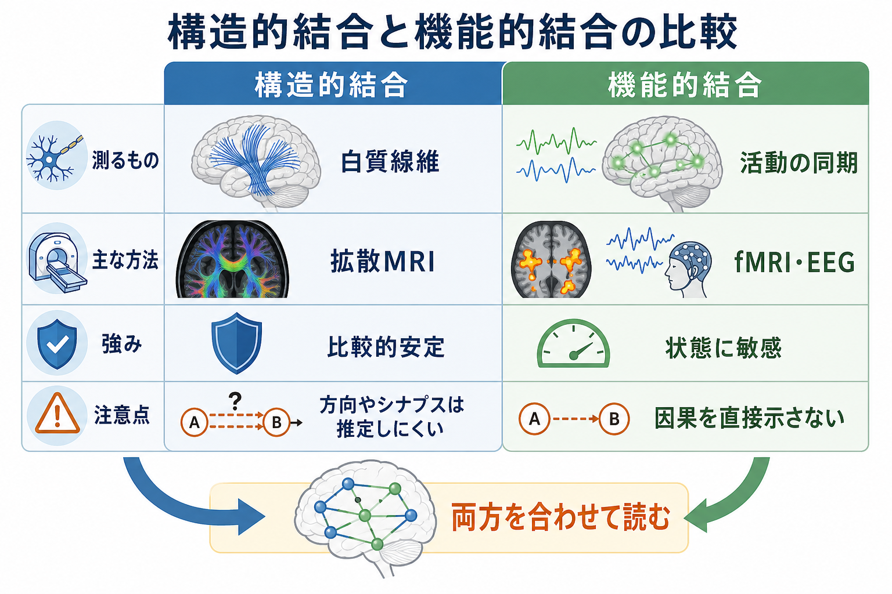
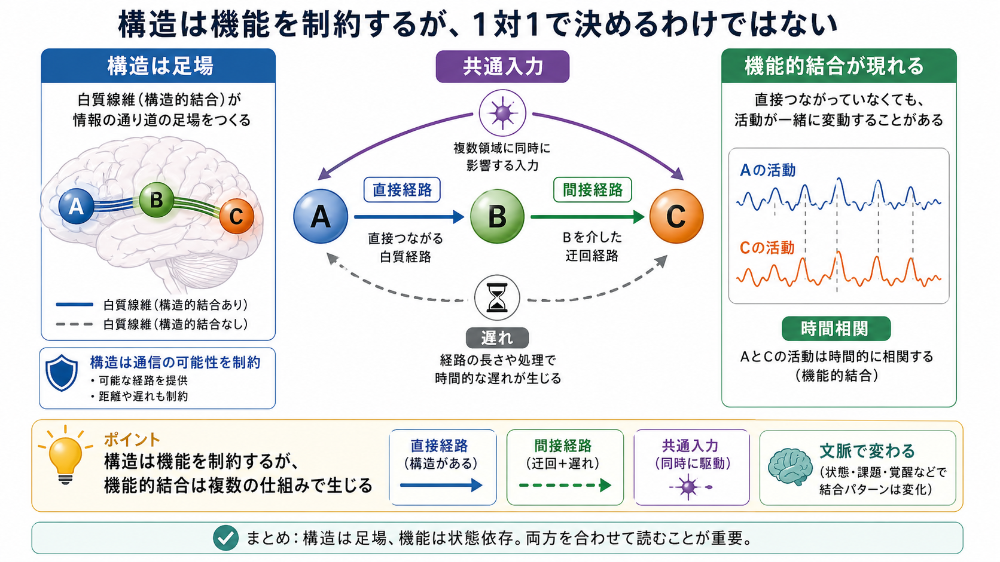

# 構造的結合と機能的結合は何が違うのか

## 要点

- **構造的結合**は、脳領域どうしを結ぶ白質線維、軸索束、解剖学的経路の「物理的なつながり」を指す。
- **機能的結合**は、2つ以上の脳領域の活動が時間的にどれくらい一緒に変動するかという「統計的なつながり」を指す。
- 構造的結合は機能的結合を制約するが、両者は1対1には対応しない。間接経路、共通入力、状態、課題、覚醒水準、神経調節などで機能的結合は変わる。
- 機能的結合は因果や直接配線をそのまま示す指標ではない。因果的な方向性を問う場合は、有効結合や介入研究、モデル化が必要になる。

## この記事で答える問い

このノートでは、「白質でつながっている」と「活動が同期している」は何が違うのかを整理する。特に、[[軸索はどのように情報を遠くへ伝えるのか]]、[[髄鞘はなぜ神経伝導を速くするのか]]、[[シナプスとは何か]]で扱うミクロな接続が、大規模な脳ネットワーク研究ではどのように読み替えられるのかに焦点を当てる。

## まず結論

構造的結合は「道路網」に近く、機能的結合は「同じ時間帯に交通量が一緒に増減しているか」に近い。道路がなければ交通は起こりにくいが、同じ交通パターンが見えるからといって、必ず2地点が直通道路で結ばれているとは限らない。途中の中継点、共通のイベント、信号制御、時間帯の違いが影響するからである。

脳でも同じように、白質線維は情報伝達の足場を作る。しかし、機能的結合として観測される相関は、直接の白質経路だけでなく、間接経路、共通入力、神経調節、課題状態、安静時の内的状態に影響される[1][5][7]。

## 背景

脳ネットワーク研究では、脳領域をノード、領域間の関係をエッジとして扱う。構造的結合、機能的結合、有効結合は、同じ「結合」という語を使うが、見ている対象が異なる[1][3]。

構造的結合は、解剖学的な配線に注目する。ヒトでは主に拡散MRIとトラクトグラフィによって、白質線維の走行を推定する。死後脳、動物実験、トレーサー研究では、より直接的に軸索投射を調べられる。大規模なヒト脳の構造ネットワーク研究は、コネクトーム研究の中心的テーマになっている[3][4]。

機能的結合は、神経活動の共変動に注目する。fMRIではBOLD信号の時系列相関、EEGやMEGでは振幅・位相・周波数帯域の関係などが使われる。安静時fMRI研究では、課題をしていない状態でも再現性のあるネットワークが観測されることが示された[2][6]。

## 基本概念

### 構造的結合

構造的結合とは、脳領域間に物理的な神経線維経路があること、またはその強さを指す。代表的には、白質線維束、軸索投射、解剖学的な接続密度、経路長、線維の整合性などが問題になる。

ただし、ヒトの拡散MRIで見えるのは水分子拡散から推定された線維方向であり、個々の[[シナプスとは何か|シナプス]]、興奮性・抑制性、信号の向き、単シナプス性か多シナプス性かを直接読むものではない[4]。したがって、構造的結合は「配線の候補と制約」を与える指標として読むのがよい。

### 機能的結合

機能的結合とは、離れた脳領域の活動時系列が統計的に関連していることを指す。典型的には相関係数で表される。ある2領域のBOLD信号が同じタイミングで上がったり下がったりすれば、機能的結合が高いと解釈される[1][2]。

重要なのは、機能的結合が「直接つながっている証拠」ではない点である。AとCが相関していても、AからB、BからCという間接経路かもしれない。あるいはDという第三の領域からAとCへ同時入力が来ているだけかもしれない。

### 有効結合との違い

有効結合は、ある領域の活動が別の領域の活動にどのような因果的影響を与えるかを問う概念である[1]。構造的結合が「道」、機能的結合が「一緒に変動する関係」だとすれば、有効結合は「どちらがどちらを動かしているのか」という方向性と因果的影響を扱う。

## 仕組み

構造的結合と機能的結合は無関係ではない。白質線維がなければ、2領域が直接情報をやり取りする可能性は低くなる。実際、構造的結合は安静時機能的結合をある程度予測できることが示されている[5]。

しかし、予測は完全ではない。理由は少なくとも4つある。

1. **間接経路**: AとCの間に直接の線維がなくても、A-B-Cのような中継経路で活動が連動する。
2. **共通入力**: AとCが同じ上位領域や神経調節系から入力を受けると、直接結合がなくても相関が生じる。
3. **状態依存性**: 安静、課題、睡眠、覚醒、注意、情動状態によって活動相関は変化する。
4. **測定の時間スケール**: fMRIのBOLD信号は神経活動そのものではなく、血流応答を介した遅い信号である。

## 図解

| 観点 | 構造的結合 | 機能的結合 |
|---|---|---|
| 何を見ているか | 白質線維、軸索投射、解剖学的経路 | 活動時系列の相関、同期、共変動 |
| 代表的な方法 | 拡散MRI、トラクトグラフィ、トレーサー研究 | fMRI、EEG、MEG、局所場電位 |
| 比較的強い点 | 物理的制約を示す。個人差や発達・加齢の足場を評価しやすい | 状態・課題・症状・学習による変化を捉えやすい |
| 注意点 | 方向性、シナプス、興奮/抑制、単シナプス性は直接示しにくい | 直接結合、因果、情報伝達方向をそのまま示さない |
| 読み方 | 「通信できる可能性のある経路」 | 「同時に変動している関係」 |

図解案: 3枚目を追加する場合は、「構造的結合・機能的結合・有効結合」を3列で比較し、測定法、答えられる問い、答えられない問いを並べる日本語インフォグラフィックにする。

## 臨床・研究との接続

構造的結合と機能的結合を組み合わせると、単独では見えにくい問いを扱える。たとえば発達や加齢では、白質の成熟や劣化が機能ネットワークの分化・統合にどう関わるかを検討できる。精神疾患研究では、あるネットワークの機能的結合変化が、構造的な経路変化、状態依存的な活動変化、薬理学的変化のどれに近いのかを分けて考える手がかりになる[7][8]。

ただし、臨床的な解釈では慎重さが必要である。機能的結合の差は、疾患特異的な原因ではなく、症状状態、薬剤、睡眠、頭部運動、解析手法、サンプル差を反映する可能性がある。個人の診断や治療方針を、単一の結合指標だけで決めることはできない。

## よくある誤解

### 誤解1: 機能的結合が高いなら直接つながっている

機能的結合は相関であり、直接の白質経路を意味しない。間接経路や共通入力でも高い相関は生じる[1][5]。

### 誤解2: 構造的結合があれば必ず機能的結合も高い

構造的結合は通信可能性を高めるが、活動が実際に同期するかは状態や文脈に依存する。道路があっても、いつも同じ交通量になるわけではない。

### 誤解3: 機能的結合は脳活動そのものを測っている

fMRIの機能的結合は、多くの場合BOLD信号の相関である。BOLDは神経活動に関係するが、血流応答、呼吸・心拍、頭部運動、前処理にも影響される。

### 誤解4: 構造的結合の推定は完全な配線図である

拡散MRIトラクトグラフィは強力な手法だが、交差線維、近接線維、皮質終端、方向性、シナプスの有無を完全には解けない。構造ネットワークもモデル化された推定である[4]。

## 関連ノート

- [[軸索はどのように情報を遠くへ伝えるのか]]
- [[髄鞘はなぜ神経伝導を速くするのか]]
- [[シナプスとは何か]]
- [[シナプス可塑性とは何か]]
- [[Hebb則とは何か]]
- [[MOC｜脳・神経科学]]
- [[MOC｜基礎神経科学]]

## MOC更新候補

- `content/00_MOC/MOC｜脳・神経科学.md` の「今後追加する代表テーマ」または神経回路・脳ネットワーク領域に、本記事へのリンクを追加する候補。
- 並列実行時の競合を避けるため、このジョブではMOC本体は更新しない。

## 理解チェック

1. 構造的結合と機能的結合は、それぞれ何を測っているか。
2. AとCの機能的結合が高いとき、AとCが直接白質線維でつながっていると断定できない理由は何か。
3. 拡散MRIで推定される構造的結合から、シナプスの向きや興奮/抑制を直接読めないのはなぜか。
4. 臨床・精神医学研究で、機能的結合の差を単独で診断指標として扱いにくい理由は何か。

## 未解決問題

- 個人ごとの構造的結合から、どこまで精密に機能的結合や認知機能を予測できるか。
- 構造的結合、機能的結合、有効結合を統合するモデルを、臨床的に解釈可能な形でどう作るか。
- fMRI、EEG/MEG、拡散MRIなど時間・空間スケールの異なるデータを、同じネットワーク理論の中でどう接続するか。

## 参考文献

[1] Friston, K. J. (1994). Functional and effective connectivity in neuroimaging: A synthesis. *Human Brain Mapping, 2*(1-2), 56-78. https://doi.org/10.1002/hbm.460020107

[2] Biswal, B., Yetkin, F. Z., Haughton, V. M., & Hyde, J. S. (1995). Functional connectivity in the motor cortex of resting human brain using echo-planar MRI. *Magnetic Resonance in Medicine, 34*(4), 537-541. https://doi.org/10.1002/mrm.1910340409

[3] Sporns, O., Tononi, G., & Kötter, R. (2005). The human connectome: A structural description of the human brain. *PLoS Computational Biology, 1*(4), e42. https://doi.org/10.1371/journal.pcbi.0010042

[4] Hagmann, P., Cammoun, L., Gigandet, X., Meuli, R., Honey, C. J., Wedeen, V. J., & Sporns, O. (2008). Mapping the structural core of human cerebral cortex. *PLoS Biology, 6*(7), e159. https://doi.org/10.1371/journal.pbio.0060159

[5] Honey, C. J., Sporns, O., Cammoun, L., Gigandet, X., Thiran, J. P., Meuli, R., & Hagmann, P. (2009). Predicting human resting-state functional connectivity from structural connectivity. *Proceedings of the National Academy of Sciences, 106*(6), 2035-2040. https://doi.org/10.1073/pnas.0811168106

[6] Damoiseaux, J. S., Rombouts, S. A. R. B., Barkhof, F., Scheltens, P., Stam, C. J., Smith, S. M., & Beckmann, C. F. (2006). Consistent resting-state networks across healthy subjects. *Proceedings of the National Academy of Sciences, 103*(37), 13848-13853. https://doi.org/10.1073/pnas.0601417103

[7] Park, H. J., & Friston, K. (2013). Structural and functional brain networks: From connections to cognition. *Science, 342*(6158), 1238411. https://doi.org/10.1126/science.1238411

[8] van den Heuvel, M. P., & Sporns, O. (2013). Network hubs in the human brain. *Trends in Cognitive Sciences, 17*(12), 683-696. https://doi.org/10.1016/j.tics.2013.09.012
