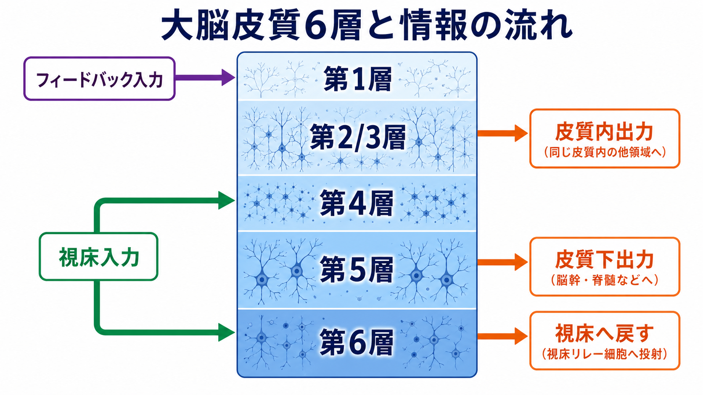
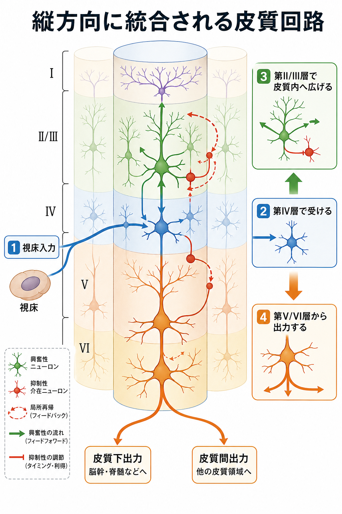
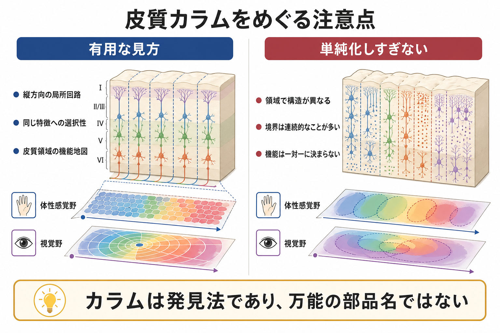

# 皮質カラムとは何か

## 要点

- 皮質カラムとは、大脳皮質の表面に対してほぼ垂直に伸び、複数の皮質層をまたいで入力・局所処理・出力を担う局所回路のまとまりとして考えられてきた概念である。
- 典型例として、体性感覚野のバレル、一次視覚野の方位選択性カラムや眼優位性カラムがよく挙げられる[1][3]。
- 皮質カラムは「皮質を理解するための有用な発見法」だが、すべての皮質領域に同じ形・同じ境界・同じ機能単位が存在するという意味ではない[5][6]。
- 現代的には、カラムを固定的な部品名としてではなく、層構造、局所回路、入力出力、発達、領域差をつなぐ作業仮説として扱うのがよい。

## この記事で答える問い

この記事では、皮質カラムを「大脳皮質に見られる縦方向の局所回路単位」として説明する。具体的には、なぜ縦方向が重要なのか、体性感覚野や視覚野ではどのように発見されたのか、皮質層との関係は何か、そして「カラムを万能の処理単位」とみなす理解がなぜ危ういのかを整理する。

## まず結論

皮質カラムは、[[ニューロンとは何か|ニューロン]]がランダムに散らばっているのではなく、皮質表面に垂直な方向にまとまりを作りながら情報を処理している、という見方である。大脳皮質は6層構造をもち、視床からの入力、皮質内の再帰的処理、他の皮質領域への出力、脳幹・脊髄などへの出力が、層ごとに異なる比重で配置される。カラム概念は、この層構造を横断する局所回路を一つのまとまりとして見るための枠組みである[2][7]。

ただし、カラムは単純な「同じ部品の反復」ではない。体性感覚野のバレルのように比較的はっきりした解剖学的単位もあれば、視覚野の方位選択性のように機能地図として連続的に分布するものもある[3][5]。そのため、皮質カラムは「ある皮質領域のどの特徴を、どの空間スケールで、どの測定法によって見ているのか」とセットで理解する必要がある。

## 背景

皮質カラムという考え方の出発点は、体性感覚野の研究にある。Mountcastleらは、ネコの体性感覚皮質で微小電極を垂直方向に進めると、同じ身体部位や同じ感覚様式に反応する細胞が深さ方向にまとまって現れることを示した[1]。この観察は、大脳皮質が単なる水平な地図ではなく、層をまたぐ縦方向の処理単位を持つという考えにつながった。

その後、一次視覚野ではHubelとWieselが、方位選択性、眼優位性、受容野配置などの機能的な秩序を明らかにした[3][4]。この流れの中で、皮質カラムは「局所的には似た特徴に反応し、横方向には特徴地図が変化する」という機能的組織化を説明する中心概念になった。

## 基本概念

### カラムは何を指すのか

狭い意味では、皮質カラムは皮質表面に垂直に伸びる細胞群・回路群を指す。幅は研究対象や定義によって異なり、ミニカラム、マクロカラム、バレル、方位カラムなど、複数のスケールで語られる。重要なのは、同じ「カラム」という語が、解剖学的まとまり、発達上の系譜、機能的選択性、局所回路モデルをまたいで使われる点である[5][6]。

広い意味では、カラムは大脳皮質を理解するための単位化の方法である。[[シナプスとは何か|シナプス]]、[[興奮性ニューロンと抑制性ニューロンは何が違うのか|興奮性ニューロンと抑制性ニューロン]]、[[介在ニューロンは神経回路で何をしているのか|介在ニューロン]]、[[樹状突起はどのように情報を受け取るのか|樹状突起]]、軸索投射を、皮質層と空間配置の中でまとめて見る枠組みだと言える。

### 6層構造との関係

新皮質の多くは、おおまかに第I層から第VI層までの層構造を持つ。第IV層は感覚皮質で視床入力を受ける比重が大きく、第II/III層は皮質内・皮質間の結合に関わり、第V層は皮質下への出力、第VI層は視床へのフィードバックに関わることが多い[7]。もちろん、これは典型的な説明であり、運動皮質や前頭前野などでは層の発達や入力出力の比重が異なる。

カラム概念の直感的な強みは、この層ごとの役割を「縦に束ねる」点にある。ある局所領域に入った入力が、第IV層で受け取られ、第II/III層で皮質内に広がり、第V/VI層から外へ出るという流れを考えると、カラムは層構造と回路機能を結びつける見取り図になる。

## 仕組み

### 入力、局所再帰、出力

感覚皮質を例にすると、視床からの入力は特定の皮質領域に入り、局所の[[活動電位はどのように発生するのか|発火]]とシナプス伝達を引き起こす。興奮性ニューロンは隣接する細胞を駆動し、抑制性介在ニューロンはタイミング、利得、空間的な広がりを調整する。こうした局所再帰の中で、入力は単に中継されるのではなく、特徴選択性や文脈依存的な応答として整えられる[7]。

この仕組みは、[[シナプス可塑性とは何か|シナプス可塑性]]や[[神経可塑性は発達と学習をどう支えるのか|神経可塑性]]とも関係する。経験によって入力の重み、抑制の強さ、皮質間結合の効率が変われば、同じカラム的回路でも応答の選択性や感度が変化しうる。

### 体性感覚野と視覚野の例

体性感覚野では、ヒゲや指などの身体部位に対応する地図があり、げっ歯類のバレル皮質ではヒゲごとの入力に対応する構造が比較的明瞭に見える。このため、体性感覚野はカラム概念を説明するうえで直感的な例になる[1]。

一次視覚野では、細胞は特定の線分方位、空間位置、左右眼入力などに選択的に反応する。HubelとWieselの研究は、視覚皮質の局所回路が、刺激特徴ごとの機能的秩序を持つことを示した[3][4]。ただし、視覚野の地図は連続的で重なり合うため、明確な壁で区切られた部屋のようなカラムを想像すると誤解しやすい。

### カラムとミニカラム

ミニカラムは、より小さな縦方向の細胞配列や発達上の単位として語られることがある。発達神経科学では、放射状グリアを足場にニューロンが移動し、皮質表面に垂直な配置を作ることが、カラム的な構造の背景として議論される[6]。一方で、成体で観察される機能的カラムと、発達上のミニカラムを同じものとして扱うことはできない。スケール、測定法、機能的意味を分けて考える必要がある。

## 図解

上の3つの図は、次の読み方を想定している。

1. 1枚目は、大脳皮質の6層構造と、視床入力、皮質内出力、皮質下出力の大まかな流れを見る。
2. 2枚目は、1本のカラムを例に、入力が層をまたいで統合され、興奮性・抑制性回路を通じて出力へ変換される流れを見る。
3. 3枚目は、カラム概念が有用である一方、皮質領域差や連続的な機能地図を無視してはいけないことを確認する。

## 臨床・研究との接続

皮質カラムは、発達、感覚地図、局所回路、皮質間結合、神経計測、計算モデルをつなぐ概念として使われる。たとえば、局所回路モデルでは、興奮性ニューロンと抑制性介在ニューロンの結合から、入力の増幅、抑制、正規化、再帰的処理を説明しようとする[7]。大規模な微小回路再構成研究では、細胞種、形態、シナプス接続、発火特性を統合し、皮質の局所回路をより詳細にモデル化する試みも進んでいる[8]。

臨床との接続では慎重さが必要である。発達障害、統合失調症、てんかんなどで皮質微細構造や局所回路の異常が議論されることはあるが、個人の症状を「カラムが壊れているから」と単純に説明することはできない。ここでの記述は教育・研究目的であり、個別の診断や治療方針を示すものではない。

## よくある誤解

### 誤解1：皮質カラムは皮質のどこにでも同じ形で存在する

皮質領域によって層構造、細胞密度、入力出力、発達的背景は異なる。一次感覚野で見えやすいカラム的組織を、連合野や運動関連領域へそのまま一般化するのは危険である[5][6]。

### 誤解2：カラムの境界は常に明瞭である

体性感覚野のバレルのように比較的見えやすい構造もあるが、多くの機能地図は連続的で、測定法や解析スケールによって境界が変わる。カラムはしばしば、硬い壁で区切られた構造ではなく、機能的なまとまりとして扱うべきである[5]。

### 誤解3：1本のカラムが1つの機能を完全に担当する

カラムは局所的な特徴選択性を説明するが、知覚や行動は多数のカラム、複数の皮質領域、視床、基底核、小脳、脳幹などを含むネットワーク活動から生じる。したがって、「このカラムがこの知覚を作る」と一対一で考えるのは単純化しすぎである。

### 誤解4：カラム概念はもう古くて不要である

批判はあるが、カラム概念は不要になったわけではない。むしろ、どのスケールで、どの領域で、どの測定法なら有効な単位化なのかを問うための基準として残っている[5][6]。

## 関連ノート

- [[ニューロンとは何か]]
- [[シナプスとは何か]]
- [[興奮性ニューロンと抑制性ニューロンは何が違うのか]]
- [[介在ニューロンは神経回路で何をしているのか]]
- [[樹状突起はどのように情報を受け取るのか]]
- [[シナプス可塑性とは何か]]
- [[神経可塑性は発達と学習をどう支えるのか]]
- [[活動電位はどのように発生するのか]]

## 理解チェック

1. 皮質カラムが「縦方向」の単位と呼ばれるのはなぜか。
2. 第IV層、第II/III層、第V/VI層は、典型的にどのような入力出力と関係するか。
3. 体性感覚野と視覚野では、カラム的組織の見え方にどのような違いがあるか。
4. 「皮質カラムは万能の部品名ではない」と言える理由は何か。
5. カラム概念を臨床や精神疾患の説明に使うとき、どのような注意が必要か。

## 関連ノート候補

- 大脳皮質の6層構造とは何か
- 一次視覚野とは何か
- 一次体性感覚野とは何か
- 眼優位性カラムとは何か
- 方位選択性とは何か
- バレル皮質とは何か
- 皮質ミニカラムとは何か
- カノニカル・マイクロサーキットとは何か

## MOC更新候補

- `content/00_MOC/MOC｜脳・神経科学.md` または `content/00_MOC/MOC｜基礎神経科学.md` に `[[皮質カラムとは何か]]` を追加する候補。
- 並列生成ジョブとの衝突を避けるため、今回はMOCファイル本体は更新しない。

## 未解決問題

- どの皮質領域で、どの空間スケールのカラム概念が有効なのかは、測定法と理論枠組みに依存する。
- 発達上の細胞系譜、解剖学的配列、機能的選択性、計算上の単位をどこまで同じ「カラム」として扱えるかには議論がある。
- ヒトの認知機能や精神疾患を、カラム単位の異常からどこまで説明できるかは未解決である。

## 参考文献

[1] Mountcastle, V. B. (1957). Modality and topographic properties of single neurons of cat's somatic sensory cortex. *Journal of Neurophysiology*, 20(4), 408-434. https://doi.org/10.1152/jn.1957.20.4.408

[2] Mountcastle, V. B. (1997). The columnar organization of the neocortex. *Brain*, 120(4), 701-722. https://doi.org/10.1093/brain/120.4.701

[3] Hubel, D. H., & Wiesel, T. N. (1962). Receptive fields, binocular interaction and functional architecture in the cat's visual cortex. *The Journal of Physiology*, 160(1), 106-154. https://doi.org/10.1113/jphysiol.1962.sp006837

[4] Hubel, D. H., & Wiesel, T. N. (1977). Functional architecture of macaque monkey visual cortex. *Proceedings of the Royal Society of London. Series B*, 198(1130), 1-59. https://doi.org/10.1098/rspb.1977.0085

[5] Horton, J. C., & Adams, D. L. (2005). The cortical column: a structure without a function. *Philosophical Transactions of the Royal Society B*, 360(1456), 837-862. https://doi.org/10.1098/rstb.2005.1623

[6] Rakic, P. (2008). Confusing cortical columns. *Proceedings of the National Academy of Sciences*, 105(34), 12099-12100. https://doi.org/10.1073/pnas.0807271105

[7] Douglas, R. J., & Martin, K. A. C. (2004). Neuronal circuits of the neocortex. *Annual Review of Neuroscience*, 27, 419-451. https://doi.org/10.1146/annurev.neuro.27.070203.144152

[8] Markram, H., Muller, E., Ramaswamy, S., Reimann, M. W., Abdellah, M., Sanchez, C. A., Ailamaki, A., Alonso-Nanclares, L., Antille, N., Arsever, S., Kahou, G. A. A., Berger, T. K., Bilgili, A., Buncic, N., Chalimourda, A., Chindemi, G., Courcol, J. D., Delalondre, F., Delattre, V., Druckmann, S., Dumusc, R., Dynes, J., Eilemann, S., Gal, E., Gevaert, M. E., Ghobril, J. P., Gidon, A., Graham, J. W., Gupta, A., Haenel, V., Hay, E., Heinis, T., Hernando, J. B., Hines, M., Kanari, L., Keller, D., Kenyon, J., Khazen, G., Kim, Y., King, J. G., Kisvarday, Z., Kumbhar, P., Lasserre, S., Le Be, J. V., Magalhaes, B. R. C., Merchan-Perez, A., Meystre, J., Morrice, B. R., Muller, J., Munoz-Cespedes, A., Muralidhar, S., Muthurasa, K., Nachbaur, D., Newton, T. H., Nolte, M., Ovcharenko, A., Palacios, J., Pastor, L., Perin, R., Ranjan, R., Riachi, I., Rodriguez, J. R., Riquelme, J. L., Rossert, C., Sfyrakis, K., Shi, Y., Shillcock, J. C., Silberberg, G., Silva, R., Tauheed, F., Telefont, M., Toledo-Rodriguez, M., Trankler, T., Van Geit, W., Diaz, J. V., Walker, R., Wang, Y., Zaninetta, S. M., DeFelipe, J., Hill, S. L., Segev, I., & Schurmann, F. (2015). Reconstruction and simulation of neocortical microcircuitry. *Cell*, 163(2), 456-492. https://doi.org/10.1016/j.cell.2015.09.029

## 更新ログ

- 2026-04-27: 初版作成。皮質カラムの定義、歴史、層構造、局所回路、代表例、限界、研究・臨床との接続を整理。
