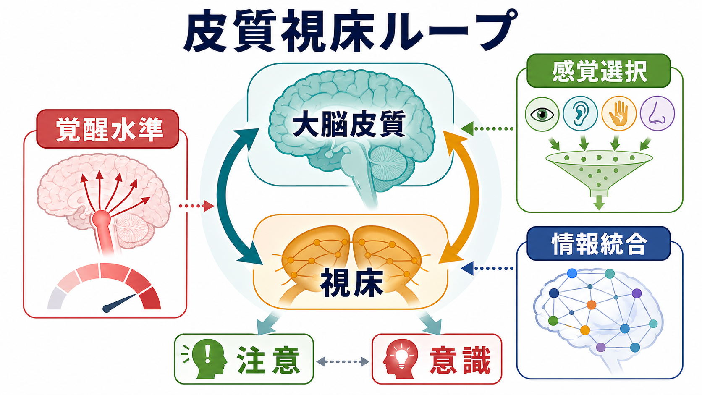
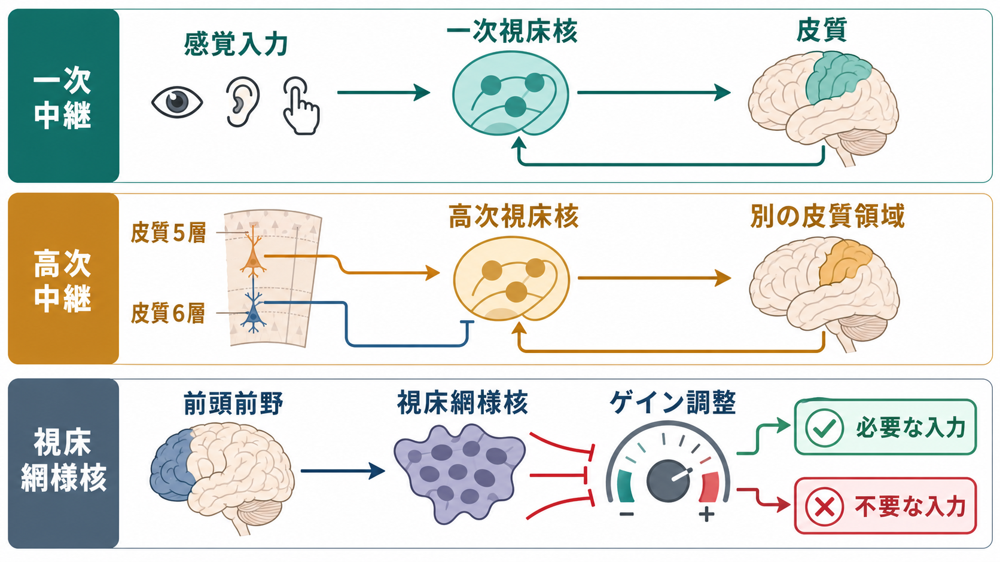
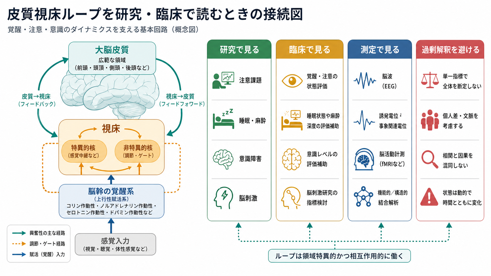

# 皮質視床ループは意識や注意にどう関わるのか

## 要点

- 皮質視床ループとは、[[大脳皮質の層構造は情報の流れをどう決めるのか|大脳皮質]]と[[視床は単なる中継核なのか|視床]]が双方向につながり、入力の通りやすさ、皮質領域間の連携、脳状態を調整する回路である。
- 視床は単なる感覚中継ではない。一次視床核は外界・身体からの情報を皮質へ届け、高次視床核は皮質5層からの入力を受け、別の皮質領域へ情報を橋渡しする[1]。
- 注意では、前頭前野や視床網様核、プルビナー、内側背側核などを含む皮質視床系が、課題に必要な感覚入力や皮質間結合を増幅する[2][3][4][5]。
- 意識では、視床と皮質深層、とくに中心外側核を含む正中・髄板内視床系が、覚醒水準や広域皮質相互作用と関係する。ただし、視床だけが「意識の座」だと考えるのは過剰である[6][7]。
- 臨床・研究では、睡眠、麻酔、意識障害、注意課題、脳刺激研究を読むときに、皮質視床ループを「状態調整と情報ルーティングの仕組み」として見ると理解しやすい。

## この記事で答える問い

1. 皮質視床ループとは何か。
2. 視床は意識や注意を「作る」のか、それとも調整するのか。
3. 覚醒水準、感覚選択、情報統合は、どのように分けて考えるとよいのか。
4. 研究・臨床で皮質視床ループを読むとき、どのような誤解を避けるべきか。

## まず結論

皮質視床ループは、意識や注意の内容そのものを単独で生成する装置ではない。より正確には、皮質で処理される情報が「どの状態で」「どの入力を優先し」「どの領域同士を結びつけるか」を調整する回路である。

意識を考えるときは、少なくとも二つを分ける必要がある。一つは、目覚めて反応できるかという覚醒水準である。もう一つは、何が経験されているかという意識内容である。皮質視床ループは前者に強く関わるが、後者も皮質内再帰処理、前頭頭頂ネットワーク、感覚皮質、内受容系などとの相互作用として理解する必要がある[6][7]。

注意を考えるときも、皮質が視床へ命令を出す一方向モデルでは足りない。前頭前野、視床網様核、感覚視床、プルビナー、内側背側核などが相互に働き、入力のゲインや皮質領域間の機能的結合を変える[2][3][4][5]。この意味で、視床は「通過点」ではなく、状況に応じてネットワークの結び方を変える調整ノードである。

## 背景

古典的には、視床は嗅覚を除く感覚情報を大脳皮質へ送る中継核として説明されてきた。この説明は間違いではない。網膜から外側膝状体を経て視覚皮質へ向かう経路や、体性感覚情報が視床を経て体性感覚皮質へ向かう経路は、感覚中継としての視床をよく示している。

しかし、皮質から視床へ向かう入力は非常に大きい。とくに皮質6層からのフィードバックや、皮質5層から高次視床核へ向かう入力は、視床が単に外部入力を皮質へ渡すだけではないことを示す。Sherman は、視床入力を「ドライバー」と「モジュレーター」に分け、さらに一次中継核と高次中継核を区別する枠組みを提案している[1]。

この枠組みでは、一次視床核は主に末梢・皮質下からのドライバー入力を受ける。一方、高次視床核は皮質5層からドライバー入力を受け、別の皮質領域へ送る。つまり、高次視床核は「皮質-視床-皮質」の迂回路を作り、[[フィードバック回路は脳内情報処理をどう調節するのか|フィードバック]]や[[リカレント回路はどのように記憶や持続活動を支えるのか|リカレント処理]]の一部として働く。

## 基本概念

### 皮質視床ループ

皮質視床ループとは、皮質から視床へ、視床から皮質へ戻る双方向結合の総称である。狭い意味では特定の視床核と対応する皮質領域のループを指すが、広い意味では、複数の皮質領域、視床核、視床網様核、脳幹覚醒系、基底核などを含む状態調整ネットワークとして扱われる。

### 一次中継と高次中継

一次中継では、外界や身体からの入力が視床を経て皮質へ届く。高次中継では、皮質5層から視床へ入力され、そこから別の皮質領域へ送られる[1]。この違いは、視床を「感覚の入口」としてだけでなく、「皮質間通信の中継・調整点」として理解するために重要である。

### 視床網様核

視床網様核は、視床の外側を覆うように位置する GABA 作動性の核である。皮質と視床の両方から入力を受け、視床核へ抑制性出力を返すため、入力のゲイン調整や不要入力の抑制に関わる。分割注意課題のマウス研究では、前頭前野が視床網様核サブネットワークを介して感覚視床のゲインを調整し、適切な感覚入力を選択することが示された[3]。

### プルビナーと内側背側核

プルビナーは視覚注意と皮質領域間の同期に関わる高次視床核として研究されている。サルの視空間注意課題では、プルビナーが注意配分に応じて視覚皮質領域間の活動同期を調整し、情報伝達を支えることが示された[4]。

内側背側核は前頭前野との結合が強く、認知制御や注意維持に関わる。マウス研究では、内側背側視床が前頭前野の結合を増幅し、注意制御を持続させる役割をもつことが示された[5]。

## 仕組み

### 1. 覚醒水準を支える

覚醒水準は、[[脳幹網様体は覚醒ネットワークで何をしているのか|上行性覚醒系]]、基底前脳、視床、広域皮質ネットワークの相互作用で保たれる。中心外側核などの正中・髄板内視床系は、皮質深層や前頭頭頂領域と結びつき、睡眠、麻酔、意識障害の研究で重要視される[6][7]。

Redinbaugh らのマカク研究では、中心外側視床と前頭頭頂皮質を同時記録し、睡眠・麻酔・覚醒状態の差に対して、視床ニューロンと皮質深層活動が敏感に変化することが示された。また、麻酔下で中心外側視床を特定条件で刺激すると、覚醒様の行動・神経処理が一時的に回復した[6]。これは視床が覚醒状態の調整に因果的に関わりうることを示すが、個別治療法を直接示すものではない。

### 2. 感覚選択を調整する

選択的注意では、脳はすべての入力を同じ強さで処理しない。課題に必要な入力を増幅し、不要な入力を弱める必要がある。皮質視床ループは、この「どの入力を通すか」という選択に関わる。

Wimmer らの分割注意課題では、前頭前野が視床網様核を介して感覚視床のゲインを制御し、視覚と聴覚のどちらを優先するかを調整するサブコルチカルな仕組みが示された[3]。これは、注意を皮質内の処理だけで説明するのではなく、視床を含むループとして考える必要があることを示している。

### 3. 皮質領域間の通信を整える

意識経験や注意制御には、離れた皮質領域が適切なタイミングで情報をやり取りすることが必要である。ここで重要になるのが、[[神経同期とは何か|神経同期]]や[[神経振動とは何か|神経振動]]である。

プルビナー研究では、注意の向きに応じて視覚皮質領域間の同期が変化し、視床が皮質間の情報伝達を調整することが示された[4]。また、Halassa と Kastner のレビューは、視床が情報を中継するだけでなく、課題に関連する機能的ネットワークをすばやく構成する役割をもつと整理している[2]。

### 4. 皮質の深層・浅層の流れを調整する

皮質視床ループを理解するには、皮質を均一な板として見ないことが重要である。皮質5層、6層、浅層は、フィードフォワード、フィードバック、視床への出力に異なる形で関わる。

意識状態の研究では、皮質深層と視床の相互作用、深層から浅層へのフィードバック、広域皮質間通信が注目される[6]。これは、注意と意識を同一視せず、入力選択、覚醒水準、内容の統合を分けて考えるための手がかりになる。

## 図解

図1は、皮質視床ループを覚醒水準、感覚選択、情報統合、注意、意識の接点としてまとめたものである。図2は、一次中継、高次中継、視床網様核によるゲイン調整を分けて示している。図3は、注意課題、睡眠・麻酔、意識障害、脳刺激、EEG・fMRI などの研究を読むときの見取り図である。

## 臨床・研究との接続

### 睡眠・麻酔

睡眠や麻酔では、意識内容が消えるだけでなく、皮質視床系のリズム、皮質間結合、前頭頭頂ネットワークの相互作用が変化する。プロポフォール麻酔中の EEG 研究では、意識消失に伴うスペクトル変化を、皮質視床相互作用や前頭-頭頂の後向き結合の変化としてモデル化する研究がある[7]。

ただし、麻酔研究で見える「意識消失」は、自然睡眠、昏睡、てんかん性意識変容、解離、注意低下と同じではない。皮質視床ループは共通する回路語彙を与えるが、状態ごとの違いを消してしまう概念ではない。

### 意識障害

意識障害研究では、中心視床や前頭頭頂ネットワーク、脳幹覚醒系が注目される。視床刺激研究は、覚醒水準や反応性を変えうる回路を探るうえで重要である[6]。しかし、研究知見を個別の診断・治療指示として読んではならない。臨床判断には、神経学的診察、画像、脳波、薬剤、代謝、全身状態、リハビリテーション評価などが必要である。

### 注意障害と認知制御

注意障害を考えるとき、前頭前野だけに原因を求めると単純化しすぎる。感覚視床、視床網様核、プルビナー、内側背側核、前頭頭頂ネットワークが、入力選択と皮質間通信を変えるためである[2][3][4][5]。

精神医学・神経心理学では、注意低下を「やる気がない」「集中力がない」という一語に縮約しがちである。しかし回路の水準では、覚醒水準、課題セットの維持、感覚ゲイン、妨害刺激の抑制、作業記憶、報酬・動機づけが分かれている。皮質視床ループは、この分解を助ける。

### 意識理論との関係

グローバルワークスペース理論や統合情報理論は、意識を広域情報共有や情報統合の観点から説明する。皮質視床ループは、これらの理論をそのまま証明するものではないが、広域ネットワークの状態調整、皮質間通信、再帰処理を支える実装候補として関連する。

## よくある誤解

### 誤解1: 視床が意識の座である

視床は覚醒水準や皮質相互作用に重要だが、視床だけで意識内容を説明できるわけではない。意識経験は、感覚皮質、前頭頭頂ネットワーク、内受容系、記憶、行動文脈などを含む広域相互作用として考える必要がある。

### 誤解2: 注意は皮質から視床への命令である

注意は一方向のトップダウン命令ではない。皮質から視床への入力、視床から皮質への入力、視床網様核の抑制、皮質間同期が相互に変化する。注意は「皮質が視床を操作する」だけでなく、「視床を含むループが課題に合うネットワーク状態を作る」過程である[2][3][4][5]。

### 誤解3: 同期が強ければ意識が高い

[[ガンマ振動は認知機能にどう関わるのか|ガンマ振動]]や同期は、情報伝達の時間窓を整える候補機構である。しかし、同期が見えたから意識がある、同期が弱いから意識がない、と単純には言えない。周波数帯、部位、課題、測定法、アーチファクトを区別する必要がある。

### 誤解4: 脳刺激で意識障害を直接治せる

中心視床刺激などの研究は重要だが、個別の治療効果を保証するものではない。意識障害は病因、損傷部位、時間経過、全身状態が多様であり、研究知見は臨床評価と倫理的判断の中で慎重に扱う必要がある。

## 関連ノート

- [[視床は単なる中継核なのか]]
- [[脳幹網様体は覚醒ネットワークで何をしているのか]]
- [[神経同期とは何か]]
- [[神経振動とは何か]]
- [[ガンマ振動は認知機能にどう関わるのか]]

今後の作成候補:

- 覚醒と意識内容は何が違うのか
- 注意とは何か
- 注意と意識は同じものなのか
- 選択的注意はどのように働くのか
- グローバルワークスペース理論とは何か
- 統合情報理論とは何か

## MOC更新候補

- `content/00_MOC/` 配下の脳・神経科学系 MOC に、神経回路・脳ネットワーク項目として追加する候補。
- 並列ジョブとの競合を避けるため、本記事では MOC 本体は更新しない。

## 理解チェック

1. 一次視床核と高次視床核の違いは何か。
2. 視床網様核は、注意においてどのような役割をもつか。
3. 覚醒水準と意識内容を分けると、皮質視床ループの役割はどう見えやすくなるか。
4. 「視床が意識を作る」という言い方には、どのような問題があるか。
5. 皮質視床ループ研究を臨床に結びつけるとき、どのような過剰解釈を避けるべきか。

## 未解決問題

- 視床核ごとの役割分担は、ヒトの自然な意識状態や複雑な注意課題でどこまで一般化できるのか。
- 覚醒水準、意識内容、報告可能性、注意を、実験的にどこまで分離できるのか。
- 皮質視床ループの異常が、精神疾患の症状単位や認知機能障害にどの程度特異的に関わるのか。
- 脳刺激、薬理、神経リハビリテーションを組み合わせた介入で、どの回路指標が予後や反応性を予測するのか。

## 参考文献

[1] Sherman, S. M. (2016). Thalamus plays a central role in ongoing cortical functioning. *Nature Neuroscience, 19*, 533-541. https://doi.org/10.1038/nn.4269

[2] Halassa, M. M., & Kastner, S. (2017). Thalamic functions in distributed cognitive control. *Nature Neuroscience, 20*, 1669-1679. https://doi.org/10.1038/s41593-017-0020-1

[3] Wimmer, R. D., Schmitt, L. I., Davidson, T. J., Nakajima, M., Deisseroth, K., & Halassa, M. M. (2015). Thalamic control of sensory selection in divided attention. *Nature, 526*, 705-709. https://doi.org/10.1038/nature15398

[4] Saalmann, Y. B., Pinsk, M. A., Wang, L., Li, X., & Kastner, S. (2012). The pulvinar regulates information transmission between cortical areas based on attention demands. *Science, 337*(6095), 753-756. https://doi.org/10.1126/science.1223082

[5] Schmitt, L. I., Wimmer, R. D., Nakajima, M., Happ, M., Mofakham, S., & Halassa, M. M. (2017). Thalamic amplification of cortical connectivity sustains attentional control. *Nature, 545*, 219-223. https://doi.org/10.1038/nature22073

[6] Redinbaugh, M. J., Phillips, J. M., Kambi, N. A., Mohanta, S., Andryk, S., Dooley, G. L., Afrasiabi, M., Raz, A., & Saalmann, Y. B. (2020). Thalamus modulates consciousness via layer-specific control of cortex. *Neuron, 106*(1), 66-75.e12. https://doi.org/10.1016/j.neuron.2020.01.005

[7] Boly, M., Moran, R., Murphy, M., Boveroux, P., Bruno, M. A., Noirhomme, Q., Ledoux, D., Bonhomme, V., Brichant, J. F., Tononi, G., Laureys, S., & Friston, K. (2012). Connectivity changes underlying spectral EEG changes during propofol-induced loss of consciousness. *Journal of Neuroscience, 32*(20), 7082-7090. https://doi.org/10.1523/JNEUROSCI.3769-11.2012
