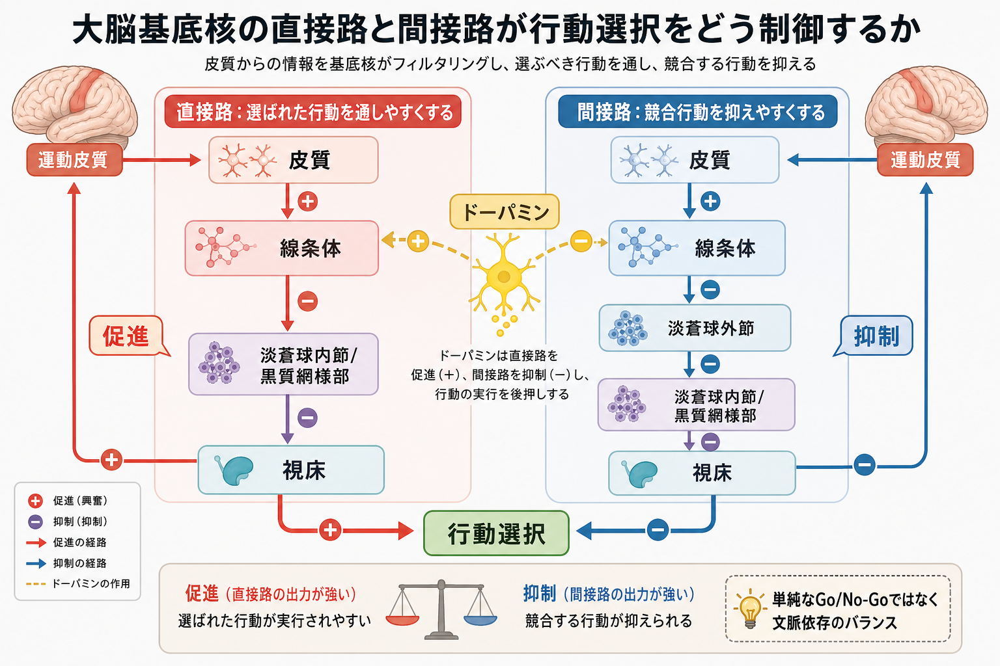
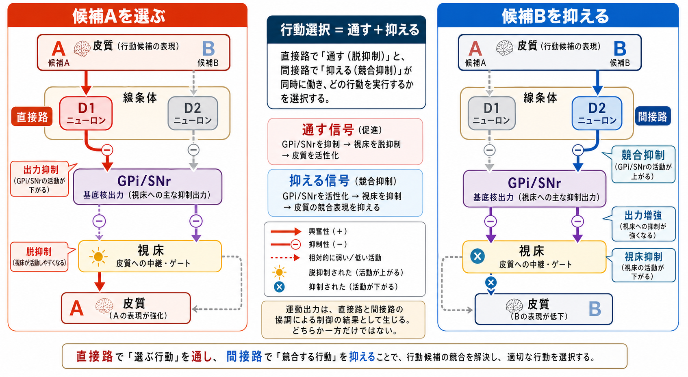
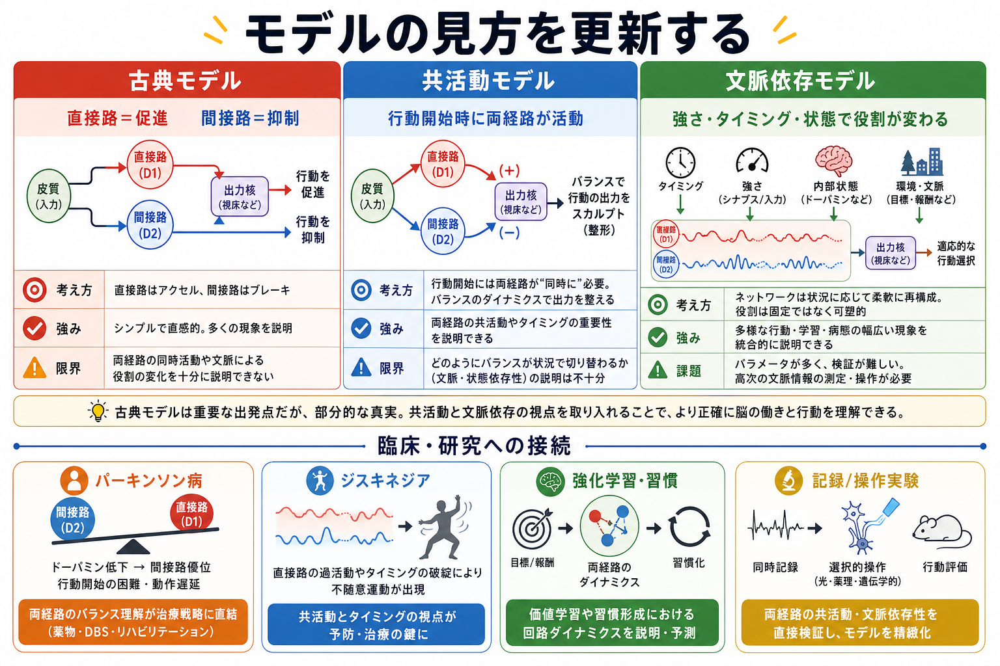

# 直接路と間接路は行動選択をどう制御するのか

## 要点

- 直接路と間接路は、[[大脳基底核ループとは何か|大脳基底核ループ]]の中で、行動候補を「通しやすくする」方向と「競合候補を抑えやすくする」方向を担う主要経路である。
- 古典モデルでは、直接路は淡蒼球内節・黒質網様部から視床への抑制を弱め、視床-皮質活動を通しやすくする。間接路は淡蒼球外節と視床下核を介して出力核の抑制性出力を強め、視床-皮質活動を抑えやすくする[1][2]。
- ただし、直接路だけが「Go」、間接路だけが「No-Go」として単独に働くわけではない。行動開始時には両経路が同時に活動しうるため、選択は促進と抑制の協調として見る必要がある[5][6]。
- [[ドパミンは報酬だけの物質なのか|ドパミン]]は、D1 系と D2 系の線条体投射ニューロンに異なる影響を与え、行動価値、運動の起こしやすさ、学習による重みづけを調整する[3]。
- 臨床・研究では、パーキンソン病、ジスキネジア、習慣形成、強化学習、反応抑制を理解する入口になるが、個別診断や治療指示として読むべきではない。

## この記事で答える問い

1. 直接路と間接路は、どの脳部位を結ぶ経路なのか。
2. なぜ直接路は行動促進、間接路は行動抑制と説明されるのか。
3. 行動選択は、単純な「Go/No-Go」ではなく、どのような協調制御として理解できるのか。
4. この考え方は、運動障害、ドパミン、習慣形成、研究モデルとどう接続するのか。

## まず結論

直接路と間接路は、行動候補の通りやすさを調整する2つの主要な経路である。直接路は、線条体から淡蒼球内節・黒質網様部へ向かい、基底核出力核の活動を抑えることで、視床への抑制をゆるめる。これにより、関連する皮質活動が相対的に通りやすくなる。間接路は、線条体から淡蒼球外節、視床下核、淡蒼球内節・黒質網様部へ進み、最終的に視床への抑制を強める方向に働く[1][2]。

この古典的な説明は、パーキンソン病などの運動症状を理解するうえで強力な入口である。しかし、現代的には「直接路が運動を作り、間接路が運動を止める」という二分法では不十分である。実際の行動選択では、選ぶ行動を通し、同時に競合する行動を抑え、必要なら全体に一時停止をかけ、ドパミンや皮質入力によって重みづけを更新する。つまり直接路と間接路は、対立するだけでなく、同じ選択過程の中で協調する経路として理解する方がよい[4][5][6]。

## 背景

大脳基底核は、線条体、淡蒼球、視床下核、黒質などからなる皮質下の核群であり、皮質から入力を受けて、視床を介して皮質へ戻る閉じた[[神経回路とは何か|神経回路]]を作る。このループは、運動の開始や抑制だけでなく、行動選択、習慣形成、報酬にもとづく学習、認知制御とも関係する[1][2][8]。

古典的な直接路・間接路モデルは、パーキンソン病やハンチントン病などの運動障害を説明する枠組みとして発展した。Albin らと DeLong は、低運動性・多動性の症状を、基底核出力核から視床への抑制が強すぎるか弱すぎるかという回路バランスから説明した[1][2]。このモデルでは、直接路の活動低下や間接路の過剰な影響は、視床-皮質活動を抑えすぎ、動作緩慢につながりやすいと考えられる。

一方で、基底核は単なる運動の門番ではない。Mink は、基底核の役割を「選ばれた運動プログラムを焦点化し、競合する運動プログラムを抑える」仕組みとして整理した[4]。この見方は、直接路と間接路を、筋肉への直接命令ではなく、複数の行動候補のうち何を通し、何を抑えるかを調整する回路として理解する助けになる。

## 基本概念

| 概念 | 主な経路 | 行動選択での見方 |
|---|---|---|
| 直接路 | 皮質 → 線条体D1系 → GPi/SNr → 視床 → 皮質 | 選ばれた行動候補に関係する視床-皮質活動を通しやすくする |
| 間接路 | 皮質 → 線条体D2系 → GPe → STN → GPi/SNr → 視床 → 皮質 | 競合する行動候補や不適切な反応を抑えやすくする |
| ハイパー直接路 | 皮質 → STN → GPi/SNr → 視床 → 皮質 | 広い抑制をすばやくかけ、保留・停止・切り替えに関わる |
| ドパミン調節 | 黒質緻密部 → 線条体 | 行動価値、運動の起こしやすさ、可塑性を調整する |

GPi/SNr は、淡蒼球内節と黒質網様部を指す。これらは基底核の主要な出力核で、通常は視床を抑制している。したがって、直接路が GPi/SNr を抑えると、視床への抑制がゆるむ。これは脱抑制と呼ばれる。間接路は、GPe と STN を介して GPi/SNr の出力を高め、視床への抑制を強める方向に働く[1][2][7]。

ドパミンはこの関係を調整する。線条体のD1受容体を多くもつ直接路ニューロンと、D2受容体を多くもつ間接路ニューロンは、分子、投射先、生理特性に違いをもつ。ドパミンが増減すると、これらの細胞群の反応性や可塑性が変わり、どの行動が選ばれやすいかも変化する[3]。

## 仕組み

### 選ばれた行動を通す

皮質が複数の行動候補を準備すると、線条体はそれらの候補に関係する皮質入力を受ける。直接路の線条体投射ニューロンが活動すると、GPi/SNr の抑制性出力が弱まり、視床を介した皮質活動が通りやすくなる。これは、選ばれた行動に対応する回路の利得を上げる仕組みとして理解できる[1][2]。

Kravitz らは、マウスの直接路・間接路ニューロンを光遺伝学的に操作し、直接路の活性化がパーキンソン病モデルの運動を増やし、間接路の活性化が運動を抑えることを示した[5]。この結果は、古典モデルの「直接路は運動を促進し、間接路は運動を抑制する」という中心的予測を、行動中の動物で直接検証した重要な研究である。

### 競合する行動を抑える

行動選択には、選ぶことだけでなく、選ばないことも必要である。歩き出す、手を伸ばす、発話する、視線を移すといった行動では、同時に起こりうる別の反応を抑えなければ、動作は混線する。間接路は、競合候補に関係する視床-皮質活動を抑えやすくすることで、選択を安定化させると考えられる[4]。

この意味で、間接路は「悪い経路」ではない。むしろ、不適切な行動や競合する運動プログラムを抑えることで、選ばれた行動を焦点化する。運動を滑らかにするには、促進だけでなく抑制も必要である。

### 同時に活動し、文脈で役割が変わる

古典モデルでは、直接路と間接路は反対方向に働く2本の経路として説明される。しかし、Cui らは、自由行動中のマウスで直接路・間接路ニューロンの活動を測定し、行動開始時に両経路が同時に活動することを報告した[6]。これは、「直接路がオンなら間接路はオフ」という単純な構図ではないことを示す。

現代的な見方では、直接路と間接路は、行動の種類、タイミング、皮質入力、ドパミン状態、学習履歴、線条体内の局所結合によって役割を変える。Calabresi らは、両経路が構造的にも機能的にも絡み合っており、シナプス可塑性の状態によって、同じ経路が促進にも抑制にも関与しうると論じている[7]。したがって、直接路と間接路は固定されたラベルではなく、行動文脈の中で解釈する必要がある。

### ハイパー直接路が一時停止をかける

直接路と間接路だけでなく、皮質から視床下核へ直接入るハイパー直接路も重要である。Nambu らは、この経路が線条体を経由せず、比較的速く基底核出力核へ影響することを示した[8]。行動候補が競合する場面では、まず広く抑制をかけ、その後に適切な候補を通すという制御が必要になる。この一時停止は、衝動的な反応を避け、選択を再調整するうえで有用である。

## 図解

図1は、直接路・間接路・ドパミンを、行動選択の全体像としてまとめた概念地図である。皮質が行動候補を出し、線条体が候補の重みづけを受け、GPi/SNr と視床を介して皮質活動の通りやすさが変わる。

図2は、最も重要なメカニズムを「候補Aを選ぶ」「候補Bを抑える」という形で示したものである。行動選択は、選択肢Aを通す信号と、競合する選択肢Bを抑える信号の組み合わせとして理解できる。

図3は、古典モデル、共活動モデル、文脈依存モデルの違いを整理する。古典モデルは教育的に有用だが、実際の回路を理解するには、同時活動、可塑性、ドパミン状態、行動文脈を含める必要がある。

## 臨床・研究との接続

パーキンソン病では、黒質緻密部のドパミンニューロンが失われ、線条体での調節が変化する。古典モデルでは、これにより視床-皮質活動が過度に抑えられ、動作緩慢や運動開始の困難が生じやすくなると説明される[1][2]。ただし、実際の病態には、発火パターン、同期、可塑性、薬物治療、深部脳刺激、非運動症状も関わる。したがって、この説明は教育・研究上の回路モデルであり、個別の診断や治療方針を導くものではない。

ジスキネジアやハンチントン病などの多動性症状では、競合行動の抑制や基底核出力のバランスが別の方向に崩れる可能性が考えられる。直接路・間接路モデルは、こうした低運動性と多動性の症状を同じ回路の異なるバランスとして比較する枠組みを与える[1][7]。

研究上は、直接路と間接路は、行動価値の学習、習慣形成、強化学習、反応抑制、認知制御とも接続する。特に、線条体の可塑性とドパミン信号は、経験にもとづいて「どの行動を通しやすくするか」を変える仕組みとして重要である。この点は [[神経可塑性は発達と学習をどう支えるのか]] や [[有効結合とは何か]] の観点からも読み替えられる。

## よくある誤解

### 誤解1: 直接路はアクセル、間接路はブレーキで完全に分かれる

アクセル/ブレーキの比喩は入口として便利だが、実際の行動選択を説明し尽くすわけではない。行動開始時に両経路が同時に活動することがあり、選択された行動の促進と競合行動の抑制が同じ時間窓で協調する[6]。

### 誤解2: 間接路は運動を邪魔するだけである

間接路による抑制は、行動を止めるためだけではない。競合する行動候補を抑えることで、選ばれた行動を安定させる。抑制が弱すぎると混線や衝動性が問題になり、強すぎると行動開始が困難になる。

### 誤解3: ドパミンが多いほど直接路が強くなり、常によい

ドパミンは、D1/D2受容体、線条体領域、課題、時間スケール、疾患状態によって意味が変わる。多ければよいという物質ではなく、過不足やタイミングのずれが運動・学習・衝動性に影響しうる[3]。

### 誤解4: 基底核だけで行動選択が決まる

行動選択は、皮質、視床、基底核、小脳、脳幹、身体状態、報酬、注意、情動を含む[[脳内ネットワークとは何か|脳内ネットワーク]]の相互作用で生じる。基底核は重要な調整点だが、単独の意思決定中枢ではない。

## 関連ノート

既存ノート:

- [[大脳基底核ループとは何か]]
- [[ドパミンは報酬だけの物質なのか]]
- [[神経回路とは何か]]
- [[脳内ネットワークとは何か]]
- [[神経可塑性は発達と学習をどう支えるのか]]
- [[有効結合とは何か]]
- [[神経同期とは何か]]
- [[サリエンスネットワークとは何か]]

関連ノート候補:

- 視床下核は行動停止にどう関わるのか
- パーキンソン病と基底核回路
- 習慣形成と線条体
- 強化学習と大脳基底核
- ジスキネジアと基底核可塑性

MOC更新候補:

- `content/00_MOC/MOC｜脳・神経科学.md`
- `content/00_MOC/MOC｜数理モデル・計算論.md`

並列ジョブとの競合を避けるため、このタスクでは MOC 本体は更新しない。

## 理解チェック

1. 直接路が「脱抑制」によって行動候補を通しやすくする、とはどういう意味か。
2. 間接路は、なぜ行動選択に必要な抑制として理解できるのか。
3. 直接路と間接路を単純な Go/No-Go とだけ考えると、どの研究知見を説明しにくいか。
4. ドパミンは、直接路・間接路の機能をどのように調整するか。
5. パーキンソン病の説明に直接路・間接路モデルを使うとき、どのような限界に注意すべきか。

## 参考文献

[1] Albin, R. L., Young, A. B., & Penney, J. B. (1989). The functional anatomy of basal ganglia disorders. *Trends in Neurosciences*, 12(10), 366-375. https://doi.org/10.1016/0166-2236(89)90074-X

[2] DeLong, M. R. (1990). Primate models of movement disorders of basal ganglia origin. *Trends in Neurosciences*, 13(7), 281-285. https://doi.org/10.1016/0166-2236(90)90110-V

[3] Gerfen, C. R., & Surmeier, D. J. (2011). Modulation of striatal projection systems by dopamine. *Annual Review of Neuroscience*, 34, 441-466. https://doi.org/10.1146/annurev-neuro-061010-113641

[4] Mink, J. W. (1996). The basal ganglia: Focused selection and inhibition of competing motor programs. *Progress in Neurobiology*, 50(4), 381-425. https://doi.org/10.1016/S0301-0082(96)00042-1

[5] Kravitz, A. V., Freeze, B. S., Parker, P. R. L., Kay, K., Thwin, M. T., Deisseroth, K., & Kreitzer, A. C. (2010). Regulation of parkinsonian motor behaviours by optogenetic control of basal ganglia circuitry. *Nature*, 466, 622-626. https://doi.org/10.1038/nature09159

[6] Cui, G., Jun, S. B., Jin, X., Pham, M. D., Vogel, S. S., Lovinger, D. M., & Costa, R. M. (2013). Concurrent activation of striatal direct and indirect pathways during action initiation. *Nature*, 494, 238-242. https://doi.org/10.1038/nature11846

[7] Calabresi, P., Picconi, B., Tozzi, A., Ghiglieri, V., & Di Filippo, M. (2014). Direct and indirect pathways of basal ganglia: A critical reappraisal. *Nature Neuroscience*, 17, 1022-1030. https://doi.org/10.1038/nn.3743

[8] Nambu, A., Tokuno, H., & Takada, M. (2002). Functional significance of the cortico-subthalamo-pallidal "hyperdirect" pathway. *Neuroscience Research*, 43(2), 111-117. https://doi.org/10.1016/S0168-0102(02)00027-5

## 未解決問題

- 直接路・間接路の同時活動が、個別の行動候補の選択と競合抑制にどの粒度で対応するのか。
- 動物実験で観察される線条体細胞種の活動を、ヒトの認知制御や精神症状にどこまで一般化できるのか。
- ドパミン、アセチルコリン、GABA、グルタミン酸の相互作用を、行動中の時間スケールでどう統合して記述するか。

## 更新ログ

- 2026-04-27: 初稿作成。直接路・間接路の古典モデル、同時活動、文脈依存性、臨床・研究との接続を整理し、画像3枚を追加。
