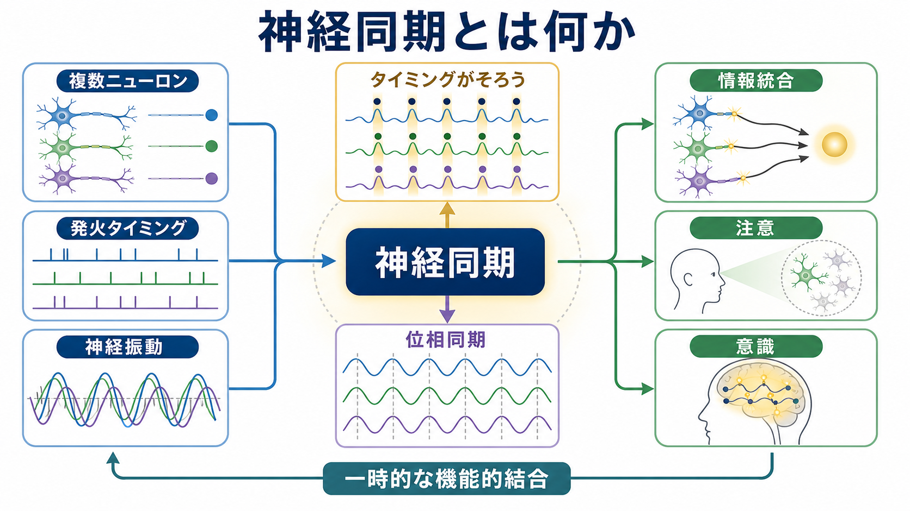
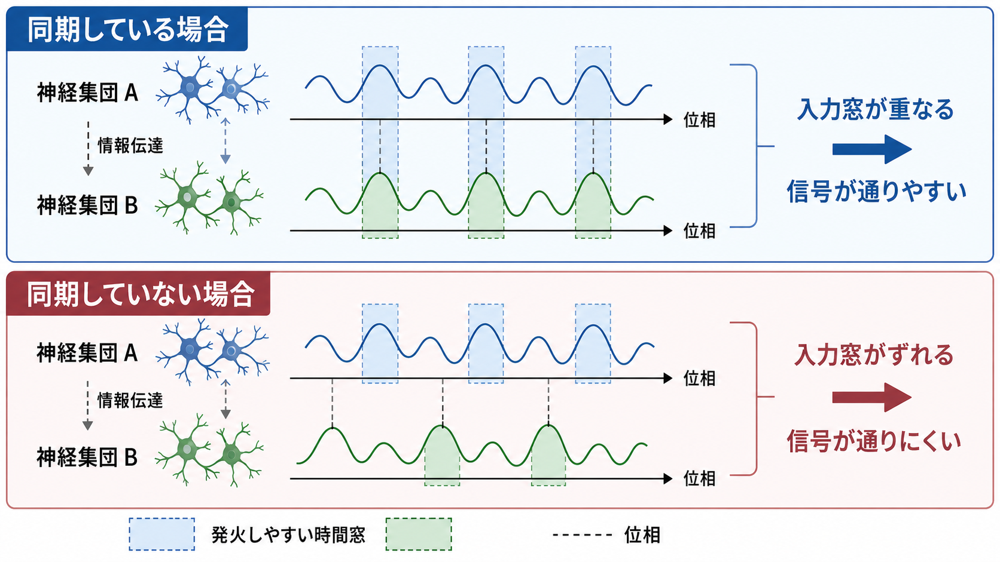
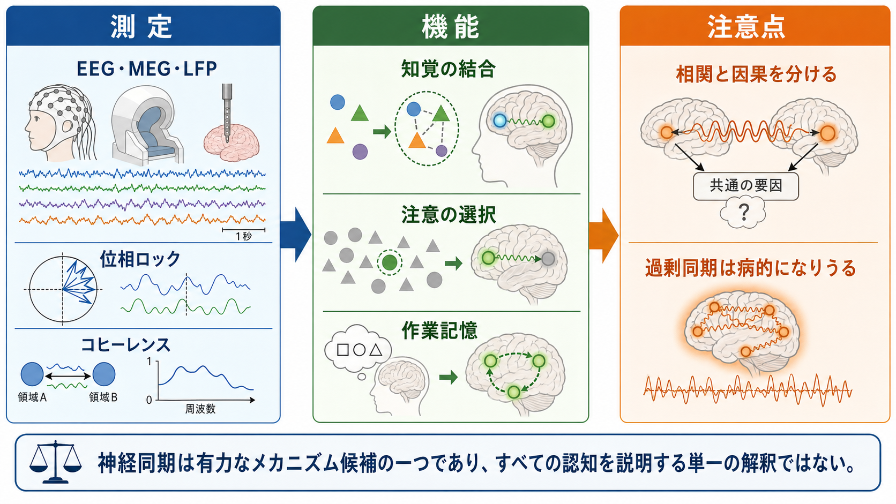

# 神経同期とは何か

## 要点

- 神経同期とは、複数の[[ニューロンとは何か|ニューロン]]、神経集団、脳領域が、発火や神経振動のタイミングを一定の関係に保って活動する現象である。
- 重要なのは「同時に強く活動すること」だけではない。振動の位相、スパイクのタイミング、入力を受け取りやすい時間窓がそろうことで、離れた集団の通信や情報統合が起こりやすくなる[1][2]。
- 神経同期は、知覚の結合、注意による選択、作業記憶、意識経験の統合などを説明する有力な候補機構だが、同期が見つかっただけで因果や意識そのものを証明したことにはならない[3][4]。

## この記事で答える問い

この記事では、「なぜ複数ニューロンがタイミングをそろえることが脳にとって意味をもつのか」を扱う。特に、[[MOC｜脳・神経科学]]の神経回路・脳ネットワーク項目として、[[活動電位はどのように発生するのか|活動電位]]、[[シナプスとは何か|シナプス]]、神経振動、注意、意識研究との接続を整理する。

## まず結論

神経同期は、脳の中で一時的な「機能的なまとまり」を作る仕組みとして理解できる。脳は部位ごとに専門化しているが、実際の知覚や行動では、色、形、位置、運動、記憶、目標などの情報をその場で結びつける必要がある。同期は、離れた神経集団が同じ時間構造を共有することで、「いま同じ計算に参加している」ことを示す候補信号になる[3]。

ただし、同期は万能の説明ではない。神経活動には発火率、発火タイミング、シナプス結合、神経修飾、脳状態など多くの要素がある。神経同期はその中の時間的な組織化であり、「同期しているから重要」ではなく、「どの周波数で、どの細胞集団が、どの課題条件で、どの行動指標と関係するか」を見る必要がある[1][4]。

## 背景

神経系では、単一ニューロンの発火だけでなく、集団活動のリズムが観察される。局所フィールド電位、EEG、MEG、ECoGなどでは、デルタ、シータ、アルファ、ベータ、ガンマと呼ばれる周波数帯の振動が見える。これらの振動は単なる背景ノイズではなく、神経集団の興奮性が時間的に上下することを反映し、入力が通りやすい瞬間と通りにくい瞬間を作る[1]。

同期が注目されてきた理由の一つは、脳が分散処理をしているからである。視覚だけを考えても、形、色、動き、空間位置は異なる神経集団で処理される。それらが一つの対象として経験されるためには、何らかの統合機構が必要になる。位相同期は、この分散した活動を一時的に結びつける候補として提案されてきた[3]。

## 基本概念

### 同期とは何がそろうことか

神経同期には複数の水準がある。第一に、スパイク同期がある。これは複数ニューロンの[[活動電位はなぜ全か無かの法則に従うのか|活動電位]]が短い時間幅に集中することである。第二に、位相同期がある。これは二つの振動信号の山と谷が、同じ位相差を保つことである。第三に、コヒーレンスがある。これは特定周波数で二つの信号がどれだけ一貫した関係をもつかを表す指標である[5][7]。

同期は「完全に同時」という意味だけではない。たとえば、ある領域が別の領域より少し遅れて同じ位相関係を保つ場合も、機能的には重要な同期になりうる。脳内の信号伝達には伝導遅延があるため、重要なのは絶対的な同時性ではなく、受け手が入力を処理しやすいタイミングに送り手の出力が到着することである[2]。

### 神経振動と位相

神経振動は、神経集団の興奮性が周期的に変動する現象である。位相とは、その周期の中でいまどの位置にいるかを表す。直感的には、波の山に近い時期は発火しやすく、谷に近い時期は発火しにくい、という時間窓が作られる。

この窓が複数の神経集団でそろうと、入力と出力が噛み合いやすくなる。反対に、位相がずれると、送り手が信号を出した瞬間に受け手が受け取りにくい状態にあるため、同じ解剖学的結合があっても情報伝達は弱くなりうる[2]。

## 仕組み

### 1. 発火タイミングをそろえる

ニューロンは、シナプス入力が一定時間内に集まると発火しやすい。したがって、複数の入力がばらばらに来る場合よりも、短い時間窓にまとまって到着する場合の方が、シナプス後ニューロンを動かしやすい。これは、発火率を大きく変えなくても、タイミングだけで信号の有効性が変わることを意味する。

この点で、神経同期は[[ニューロンは複数の入力をどのように統合するのか|入力統合]]と密接に関係する。同期した入力は、受け手の膜電位を同じ方向に押し上げやすく、同期していない入力は時間的に分散して効果が弱まりやすい。

### 2. 抑制性回路がリズムを作る

神経同期は、興奮性ニューロンだけで自然に生じるわけではない。多くの局所回路では、[[GABAは脳で何をしているのか|GABA]]作動性の[[介在ニューロンは神経回路で何をしているのか|介在ニューロン]]が発火の窓を周期的に開閉し、集団活動の位相を整える。とくにガンマ帯域の同期では、興奮性細胞と抑制性細胞の相互作用が重要な候補機構として研究されている[4]。

ただし、周波数帯ごとに役割が固定されているわけではない。シータ、アルファ、ベータ、ガンマなどは、脳部位、課題、発達段階、測定法によって意味が変わる。したがって「ガンマ = 意識」「アルファ = 休息」のような一対一対応は避ける必要がある。

### 3. Communication-through-coherence

Friesが提案した communication-through-coherence の考え方では、神経集団同士の通信は、単に結合があるかどうかではなく、互いの興奮性リズムがかみ合うかどうかに左右される[2]。送り手の出力が受け手の入力窓に届くと、信号は強く伝わる。位相がずれると、同じ入力でも受け手に届きにくくなる。

この枠組みは、脳が課題に応じて情報の流れを柔軟に切り替える仕組みを説明しやすい。解剖学的な配線は短時間で変えられないが、位相関係や同期の強さはミリ秒から秒のスケールで変わりうる。つまり、同期は固定配線の上に重なる動的なルーティング機構として働きうる。

## 図解

次の図は、神経同期を研究でどう測り、どの機能と関連づけ、どこに注意すべきかをまとめたものである。同期指標は有用だが、測定信号の混入、共通入力、体積伝導、解析窓の選び方によって解釈が変わるため、単独で「脳領域同士が直接通信した」と断定しない方がよい[5][7]。

## 臨床・研究との接続

### 情報統合

大規模な脳ネットワークでは、離れた領域が一時的に協調する必要がある。Varelaらは、位相同期を分散した神経活動を統合する候補機構として整理し、複数周波数帯にわたる動的リンクが認知のまとまりを支えうると論じた[3]。この考え方は、単一の「中枢」ではなく、分散した活動が時間的に結びつくことで機能単位を作るという見方につながる。

### 注意

注意研究では、行動上重要な刺激を表すニューロン群で、ガンマ帯域同期が増え、低周波同期が減ることが報告されている。FriesらのマカクV4研究は、選択的注意が発火率だけでなく振動同期を変えることを示し、注意が関連信号を増幅する時間的機構を示唆した[6]。これは[[アセチルコリンは注意や記憶にどう関わるのか|注意]]を「どの入力を強くするか」だけでなく、「どのタイミングで通すか」として見る視点を与える。

### 意識

意識との関係では、神経同期は「統合された経験」を説明する候補として議論されてきた。たとえば、知覚対象の特徴を一つの経験へ束ねる、広い脳領域を一時的な機能単位にする、トップダウンの予測や注意状態を感覚処理へ反映させる、といった役割が考えられる[3]。

しかし、意識研究では特に慎重さが必要である。同期は覚醒、注意、課題遂行、運動準備、報告行動などとも関係するため、同期の変化が意識経験そのものを反映しているのか、意識に伴う周辺過程を反映しているのかを分ける必要がある。したがって、神経同期は意識の「十分条件」ではなく、候補メカニズムの一つとして扱うのが妥当である。

### 臨床研究

神経同期の異常は、統合失調症、てんかん、自閉スペクトラム症、アルツハイマー病、パーキンソン病などで研究されてきた[8]。ここで重要なのは、同期が低すぎても高すぎても問題になりうる点である。たとえば、情報統合が弱い場合には必要な協調が成立しにくく、逆に過剰同期では発作活動や硬直したネットワーク状態が問題になる可能性がある。

ただし、これらは研究上の関連であり、個人の診断や治療方針を同期指標だけで決めるものではない。臨床的には、症状、病歴、行動評価、画像・生理指標、生活背景を総合して考える必要がある。

## よくある誤解

### 誤解1: 同期は発火率が上がることと同じである

発火率は「どれくらい発火したか」を表し、同期は「いつ発火したか」「位相関係が保たれているか」を表す。発火率が同じでも、タイミングがそろうとシナプス後細胞への影響は変わりうる。反対に、発火率が上がっても時間的にばらばらなら、同期とは言えない。

### 誤解2: 同期していれば必ず情報統合が起きている

同期は情報統合の候補指標だが、共通入力、体積伝導、測定参照、解析条件によって見かけ上の同期が出ることがある[7]。同期指標を解釈するには、課題条件、行動成績、遅延方向、周波数特異性、統計的対照を合わせて見る必要がある。

### 誤解3: ガンマ同期は意識の印である

ガンマ帯域同期は注意、知覚、作業記憶、運動、局所回路の抑制性リズムなど多くの現象と関係する[4][6]。したがって、ガンマ同期が見えたから意識がある、または意識の内容がわかる、とは言えない。意識研究では、報告、注意、課題難度、覚醒水準を分けて設計する必要がある。

### 誤解4: 同期は常によい

適切な同期は通信や統合を助けるが、過剰な同期や硬直した同期は柔軟な情報処理を妨げうる。脳にとって重要なのは、必要な集団が必要な時間だけ同期し、不要になれば同期を解くことである。

## 関連ノート

- 既存MOC: [[MOC｜脳・神経科学]], [[MOC｜基礎神経科学]]
- 関連既存ノート: [[ニューロンとは何か]], [[活動電位はどのように発生するのか]], [[シナプスとは何か]], [[ニューロンは複数の入力をどのように統合するのか]], [[GABAは脳で何をしているのか]], [[介在ニューロンは神経回路で何をしているのか]], [[アセチルコリンは注意や記憶にどう関わるのか]]
- 今後の作成候補: 神経振動とは何か、ガンマリズムとは何か、位相同期の測定、コヒーレンス解析、EEGとMEGの違い、意識の神経相関、機能的結合とは何か
- MOC更新候補: バッチ統合時に [[MOC｜脳・神経科学]] と [[MOC｜基礎神経科学]] の神経回路・脳ネットワーク項目へ本記事を追加する。

## 理解チェック

1. 神経同期は、発火率の増加と何が違うか。
2. 位相がそろうと、なぜ情報伝達が通りやすくなるのか。
3. communication-through-coherence は、解剖学的な結合だけでは説明できない何を説明しようとしているか。
4. 注意と神経同期の関係を、ガンマ帯域同期の例で説明できるか。
5. EEGやMEGのコヒーレンスを解釈するとき、なぜ体積伝導や共通入力に注意する必要があるか。

## 未解決問題

- 同期は、どの認知機能で因果的に必要で、どの機能では単なる相関指標にとどまるのか。
- 周波数帯ごとの役割は、脳部位や課題を超えてどこまで一般化できるのか。
- ヒトの非侵襲計測で観察される同期指標を、細胞レベルのスパイク同期やシナプス入力窓へどこまで対応づけられるのか。
- 意識経験そのものに関わる同期と、注意・報告・運動準備に関わる同期をどう分離するか。

## 参考文献

[1] Buzsaki, G., & Draguhn, A. (2004). Neuronal oscillations in cortical networks. *Science*, 304(5679), 1926-1929. https://doi.org/10.1126/science.1099745

[2] Fries, P. (2005). A mechanism for cognitive dynamics: Neuronal communication through neuronal coherence. *Trends in Cognitive Sciences*, 9(10), 474-480. https://doi.org/10.1016/j.tics.2005.08.011

[3] Varela, F., Lachaux, J.-P., Rodriguez, E., & Martinerie, J. (2001). The brainweb: Phase synchronization and large-scale integration. *Nature Reviews Neuroscience*, 2, 229-239. https://doi.org/10.1038/35067550

[4] Fries, P. (2009). Neuronal gamma-band synchronization as a fundamental process in cortical computation. *Annual Review of Neuroscience*, 32, 209-224. https://doi.org/10.1146/annurev.neuro.051508.135603

[5] Lachaux, J.-P., Rodriguez, E., Martinerie, J., & Varela, F. J. (1999). Measuring phase synchrony in brain signals. *Human Brain Mapping*, 8(4), 194-208. https://doi.org/10.1002/(SICI)1097-0193(1999)8:4%3C194::AID-HBM4%3E3.0.CO;2-C

[6] Fries, P., Reynolds, J. H., Rorie, A. E., & Desimone, R. (2001). Modulation of oscillatory neuronal synchronization by selective visual attention. *Science*, 291(5508), 1560-1563. https://doi.org/10.1126/science.1055465

[7] Nunez, P. L., Srinivasan, R., Westdorp, A. F., Wijesinghe, R. S., Tucker, D. M., Silberstein, R. B., & Cadusch, P. J. (1997). EEG coherency. I: Statistics, reference electrode, volume conduction, Laplacians, cortical imaging, and interpretation at multiple scales. *Electroencephalography and Clinical Neurophysiology*, 103(5), 499-515. https://doi.org/10.1016/S0013-4694(97)00066-7

[8] Uhlhaas, P. J., & Singer, W. (2006). Neural synchrony in brain disorders: Relevance for cognitive dysfunctions and pathophysiology. *Neuron*, 52(1), 155-168. https://doi.org/10.1016/j.neuron.2006.09.020

## 更新ログ

- 2026-04-27: 初版作成。神経同期の基礎概念、通信・注意・意識・臨床研究との接続、測定上の注意を整理し、図版3点を追加。
