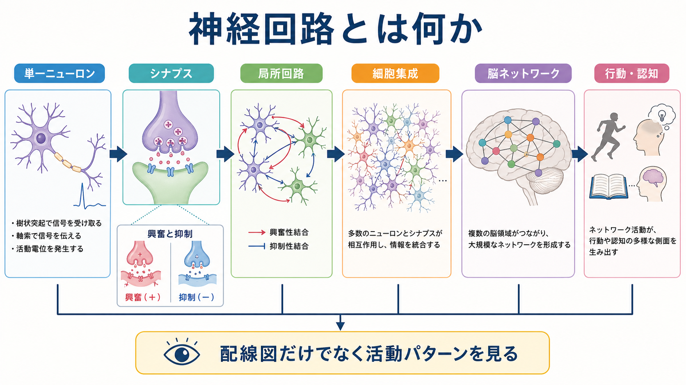
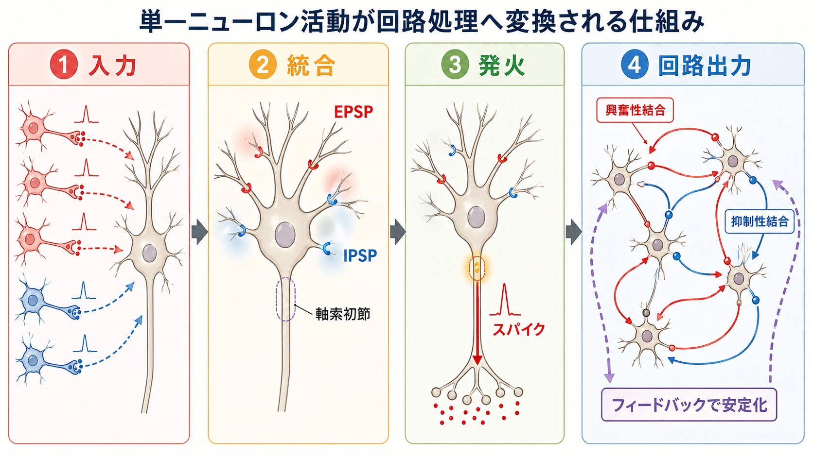
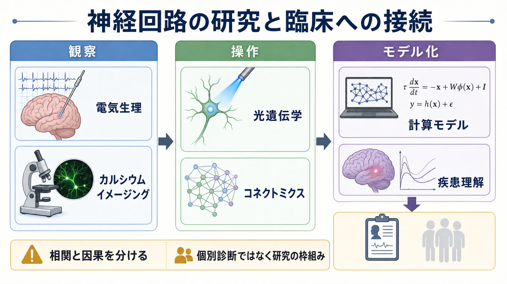

# 神経回路とは何か

## 要点

- 神経回路とは、[[ニューロンとは何か|ニューロン]]が[[シナプスとは何か|シナプス]]で結合し、入力を受け取り、統合し、出力する機能的なまとまりである。
- 回路を理解するには、単なる「配線図」だけでなく、発火タイミング、興奮性・抑制性バランス、シナプス強度、神経修飾、可塑性、脳状態を合わせて見る必要がある。[1][2]
- 単一ニューロンは受動的な中継器ではなく、樹状突起や軸索初節で入力を非線形に統合し、その出力が次のニューロン群の活動パターンを変える。[3]
- 多数のニューロンが相互作用すると、細胞集成、リズム、アトラクター、フィードフォワード/フィードバック処理のような、単一細胞だけからは見えにくい性質が現れる。[2][4]
- 臨床・精神医学との接続では、「回路異常」という言葉を個別診断の根拠として短絡せず、観察・操作・モデル化を通じて検証される研究仮説として扱う。

## この記事で答える問い

この記事では、基礎神経科学の入口として次の問いに答える。

1. 神経回路は、ニューロンやシナプスと何が違う概念なのか。
2. 単一ニューロンの活動は、どのように集団の情報処理へつながるのか。
3. 興奮性結合、抑制性結合、フィードフォワード、フィードバックは何をしているのか。
4. 神経回路を調べる研究法は、相関と因果をどう区別しようとしているのか。
5. 「回路の異常」という説明を、どの範囲まで慎重に読めばよいのか。

## まず結論

神経回路とは、複数のニューロンがシナプスで結合し、入力を変換して出力を作る機能的な単位である。1個のニューロンは、樹状突起で多くの入力を受け、[[ニューロンは複数の入力をどのように統合するのか|時間的・空間的に統合]]し、[[軸索小丘はなぜ発火の起点になるのか|軸索初節]]付近で発火するかどうかを決める。その出力スパイクは軸索を通って次の細胞へ届き、さらに次のニューロン群の発火確率やタイミングを変える。[1][3]

ただし、神経回路は「ニューロンを線で結んだ図」だけではない。同じ接続でも、シナプス強度、短期可塑性、[[シナプス可塑性とは何か|シナプス可塑性]]、抑制性介在ニューロン、神経修飾物質、睡眠・覚醒などの状態で働き方は変わる。したがって、回路とは「接続構造」と「活動ダイナミクス」と「変化する重み」を合わせた概念である。[2][4]

## 背景

神経科学では長く、ニューロンが神経系の構造的・機能的単位であるというニューロン説が土台になってきた。これは、神経系を連続した網ではなく、多数の細胞が接点を介して通信するシステムとして見る考え方である。[2]

一方で、知覚、記憶、運動、注意、情動のような現象は、1個のニューロンだけでは説明しにくい。Yuste は、単一ニューロン中心の見方から、多数ニューロンの活動状態やネットワークモデルを重視する見方への転換を整理している。[2] この転換は「ニューロンが重要でなくなった」という意味ではない。むしろ、単一ニューロンの性質を、回路の中でどう働くかに接続する必要があるという意味である。

Hebb が提案した細胞集成の考え方も、この橋渡しの古典的な入口である。経験によって一緒に活動しやすくなったニューロン群が、知覚や記憶の単位として働くという発想は、現代の[[Hebb則とは何か|Hebb則]]、細胞集成、リプレイ、集団符号化の議論につながっている。[4]

## 基本概念

### 回路は「構造」と「活動」の組み合わせである

神経回路を理解するとき、少なくとも二つの地図を区別する必要がある。

| 見方 | 問い | 代表的な観察 |
|---|---|---|
| 構造の地図 | どの細胞がどの細胞につながっているか | 軸索投射、シナプス位置、コネクトーム |
| 活動の地図 | いつ、どの細胞集団が、どの順序で活動するか | スパイク列、局所場電位、カルシウム活動、脳波・MEG・fMRI |

構造の地図だけでは、同じ回路がどの状態でどう動くかは分からない。反対に、活動の地図だけでは、どの接続が活動パターンを支えているかは分からない。現代の神経回路研究は、この二つを接続しようとしている。[7]

### 興奮性と抑制性

興奮性結合は、次のニューロンを発火しやすくする方向に働くことが多い。大脳皮質では、グルタミン酸を使う錐体細胞が代表的な興奮性ニューロンである。抑制性結合は、次のニューロンを発火しにくくしたり、発火のタイミングを狭めたりする方向に働くことが多く、GABA作動性介在ニューロンが代表例である。詳しくは [[興奮性ニューロンと抑制性ニューロンは何が違うのか]] と [[介在ニューロンは神経回路で何をしているのか]] に接続できる。

重要なのは、抑制が単なる「ブレーキ」ではないことである。抑制は過剰な活動を防ぐだけでなく、時間窓を整え、競合する表象を分け、リズムを作り、信号対雑音比を変える。興奮と抑制は別々に足し算される部品ではなく、回路全体の時間発展を一緒に作る。[5]

### フィードフォワードとフィードバック

フィードフォワード回路は、入力が上流から下流へ進む流れを強調する。感覚入力が低次領域から高次領域へ渡る場合などが典型例である。一方、フィードバック回路は、下流や高次領域から上流へ戻る影響を含む。予測、注意、文脈、行動目標などは、フィードバックを通じて初期処理の感度や解釈を変えうる。[6]

皮質回路では、局所的な再帰結合と長距離の階層的結合が組み合わさる。Douglas と Martin は、大脳新皮質の回路を、共通する局所構造をもつ「標準的マイクロサーキット」として理解できるかを検討した。[5] さらに Bastos らは、予測符号化の観点から、フィードフォワード信号とフィードバック信号の役割を皮質マイクロサーキットに対応づける枠組みを提案している。[6]

## 仕組み

### 1. 入力が樹状突起と細胞体へ届く

1個のニューロンには、数千からそれ以上のシナプス入力が入ることがある。入力は、[[樹状突起はどのように情報を受け取るのか|樹状突起]]や細胞体の場所によって影響が変わる。遠い樹状突起の入力は細胞体へ届くまでに減衰しやすいが、樹状突起には能動的なイオンチャネルや局所スパイクがあり、単純な受動ケーブル以上の計算を行う。[3]

### 2. EPSP と IPSP が統合される

興奮性入力は、典型的には[[シナプス後電位とは何か|EPSP]]を生み、膜電位を発火閾値へ近づける。抑制性入力は、IPSP やシャント抑制として、発火を起こしにくくしたり、興奮性入力が効く時間窓を狭めたりする。複数の EPSP と IPSP は、時間的加重と空間的加重によって統合される。

この段階ですでに、ニューロンは単なる足し算器ではない。樹状突起スパイク、NMDA受容体依存性の非線形性、抑制入力の位置、発火履歴などにより、同じ入力数でも出力は変わる。[3]

### 3. 軸索初節でスパイク出力に変換される

膜電位が閾値に達すると、[[活動電位はどのように発生するのか|活動電位]]が生じる。スパイクは全か無かの信号として軸索を伝わるが、情報は「スパイクがあるかないか」だけでなく、発火率、タイミング、同期、バースト、集団内の順序にも含まれうる。

### 4. 出力が次のニューロン群を変える

1個のニューロンのスパイクは、軸索終末を通じて複数の標的細胞に影響する。各標的細胞では、その入力が他の入力と統合される。これが繰り返されると、局所回路、細胞集成、脳領域間ネットワークが形成される。

Buzsáki は、細胞集成を単なる同時活動の集まりではなく、シナプス集団や読み出し側の細胞と結びついた「神経構文」として整理している。[4] つまり、回路内の活動は、孤立した点ではなく、どの細胞群がどの順序で活動し、どの読み出し先に影響するかという文脈で意味を持つ。

### 5. 活動履歴が回路を変える

回路は固定された配線ではない。反復活動、発達、学習、睡眠、損傷、薬理作用などにより、シナプス強度や結合配置は変わる。[[長期増強LTPとは何か|LTP]]、[[長期抑圧LTDとは何か|LTD]]、短期可塑性、恒常性可塑性、[[シナプス刈り込みはなぜ重要なのか|シナプス刈り込み]]は、回路が経験に応じて更新される仕組みとして読める。

## 図解

図1は、ニューロン、シナプス、局所回路、細胞集成、脳ネットワーク、行動・認知を階層として整理したものである。ここで大事なのは、下位階層が上位階層に単純に置き換わるのではなく、各階層が相互に制約し合う点である。

図2は、単一ニューロンの入力統合が回路出力へつながる流れを示している。EPSP と IPSP の統合、軸索初節での発火、興奮性・抑制性の再帰結合を一続きの処理として見ると、「1個のニューロン」と「集団活動」が切り離せないことが分かる。

図3は、神経回路を調べる方法の位置づけである。電気生理やカルシウムイメージングは活動の観察に強く、光遺伝学は特定細胞や投射の操作に強く、コネクトミクスは構造の地図化に強い。計算モデルは、観察された活動がどのような回路原理から生じうるかを検討する道具になる。[7][8]

## 臨床・研究との接続

神経回路という見方は、研究では「どの細胞が、どのタイミングで、どの接続を通じて行動に影響するのか」を問うための枠組みになる。たとえば、電気生理はスパイクや局所場電位を記録し、カルシウムイメージングは多数細胞の活動を可視化し、光遺伝学は細胞型や投射を選んで活動を操作する。Deisseroth は、光遺伝学がミリ秒スケールかつ細胞型特異的な操作を可能にし、回路研究に因果的な問いを持ち込んだと整理している。[8]

コネクトミクスは、電子顕微鏡や機械学習を用いて、シナプス解像度の構造地図を作る方向へ発展している。Helmstaedter は、シナプス解像度コネクトミクスが、回路の大規模な構造比較やスクリーニングへ進みつつあると整理している。[7] ただし、構造が分かっても活動が自動的に分かるわけではない。構造、活動、操作、モデルを合わせることで、はじめて「この回路がこの機能にどう関わるか」を検討できる。

臨床や精神医学では、うつ病、統合失調症、発達障害、てんかん、神経変性疾患、慢性痛などで「回路」という言葉が使われることがある。しかし、回路レベルの知見は、個別の診断や治療指示へそのまま変換できるものではない。教育・研究目的では、「どの回路仮説が、どの測定法と操作法で、どの程度検証されているか」を分けて読むことが重要である。

## よくある誤解

### 誤解1: 神経回路は配線図のことである

配線図は重要だが、それだけでは回路の働きは決まらない。同じ接続でも、発火状態、神経修飾、シナプス強度、抑制性入力、発達段階によって出力は変わる。回路は、構造と活動ダイナミクスを合わせた概念である。

### 誤解2: 1個のニューロンが1個の情報を表す

特定の刺激に強く反応するニューロンはあるが、多くの情報はニューロン集団の活動パターンとして表される。細胞集成や集団符号化を考えると、「どのニューロンが活動したか」だけでなく、「どの組み合わせが、どのタイミングで活動したか」が重要になる。[2][4]

### 誤解3: 抑制性ニューロンは活動を止めるだけである

抑制は活動を下げるだけでなく、タイミングを整え、入力選択性を高め、発振や同期を作り、過剰な興奮を防ぐ。したがって、抑制は情報処理の外側にあるブレーキではなく、回路計算の中核である。[5]

### 誤解4: 回路を操作して行動が変われば、すべてが分かったことになる

操作実験は因果関係を調べる強力な方法だが、解釈には注意がいる。刺激した細胞型の多様性、自然活動との違い、発達補償、下流回路への波及、行動課題の文脈を考える必要がある。観察、操作、構造、モデルを相互に照合することが求められる。

## 関連ノート

- [[MOC｜脳・神経科学]]
- [[ニューロンとは何か]]
- [[シナプスとは何か]]
- [[ニューロンは複数の入力をどのように統合するのか]]
- [[興奮性ニューロンと抑制性ニューロンは何が違うのか]]
- [[介在ニューロンは神経回路で何をしているのか]]
- [[シナプス可塑性とは何か]]
- [[Hebb則とは何か]]
- [[長期増強LTPとは何か]]
- [[長期抑圧LTDとは何か]]

関連ノート候補:

- フィードフォワード回路は何をしているのか
- フィードバック回路とは何か
- 細胞集成とは何か
- 神経同期とは何か
- コネクトミクスとは何か
- 光遺伝学とは何か
- カルシウムイメージングとは何か
- 予測符号化における皮質マイクロサーキット

MOC更新候補:

- `content/00_MOC/MOC｜脳・神経科学.md` の「神経回路」または「大規模脳ネットワーク」周辺に本記事を追加する。
- 並列生成ジョブとの衝突を避けるため、このタスクでは MOC 本体は更新していない。

## 理解チェック

1. 神経回路を「配線図」だけで説明すると、何が抜け落ちるか。
2. EPSP と IPSP は、単一ニューロンの発火と回路出力にどう関わるか。
3. 興奮性結合と抑制性結合は、なぜ両方とも情報処理に必要なのか。
4. フィードフォワードとフィードバックの違いを、感覚処理の例で説明できるか。
5. 光遺伝学やコネクトミクスの知見を、臨床的説明に使うときの注意点を述べられるか。

## 参考文献

[1] Purves, D., Augustine, G. J., Fitzpatrick, D., et al. (2001). *Neuroscience* (2nd ed.). Sinauer Associates; NCBI Bookshelf. https://www.ncbi.nlm.nih.gov/books/NBK10799/

[2] Yuste, R. (2015). From the neuron doctrine to neural networks. *Nature Reviews Neuroscience, 16*, 487-497. https://doi.org/10.1038/nrn3962

[3] London, M., & Häusser, M. (2005). Dendritic computation. *Annual Review of Neuroscience, 28*, 503-532. https://doi.org/10.1146/annurev.neuro.28.061604.135703

[4] Buzsáki, G. (2010). Neural syntax: cell assemblies, synapsembles, and readers. *Neuron, 68*(3), 362-385. https://doi.org/10.1016/j.neuron.2010.09.023

[5] Douglas, R. J., & Martin, K. A. C. (2004). Neuronal circuits of the neocortex. *Annual Review of Neuroscience, 27*, 419-451. https://doi.org/10.1146/annurev.neuro.27.070203.144152

[6] Bastos, A. M., Usrey, W. M., Adams, R. A., Mangun, G. R., Fries, P., & Friston, K. J. (2012). Canonical microcircuits for predictive coding. *Neuron, 76*(4), 695-711. https://doi.org/10.1016/j.neuron.2012.10.038

[7] Helmstaedter, M. (2026). Synaptic-resolution connectomics: towards large brains and connectomic screening. *Nature Reviews Neuroscience, 27*, 101-120. https://doi.org/10.1038/s41583-025-00998-z

[8] Deisseroth, K. (2011). Optogenetics. *Nature Methods, 8*, 26-29. https://doi.org/10.1038/nmeth.f.324

## 未解決問題

- 構造コネクトーム、自然活動、行動、主観的経験を、どの粒度で同じモデルに接続できるのか。
- 細胞型、樹状突起計算、シナプス可塑性、神経修飾を含む回路モデルを、どこまで実験的に同定できるのか。
- 精神疾患や神経疾患を「回路疾患」と呼ぶとき、どの測定レベルの異常をどの臨床単位に対応させるべきか。

## 更新ログ

- 2026-04-27: 初版作成。単一ニューロンから局所回路・細胞集成・脳ネットワークへの接続、図解、研究法、臨床上の注意、参考文献を整理。
