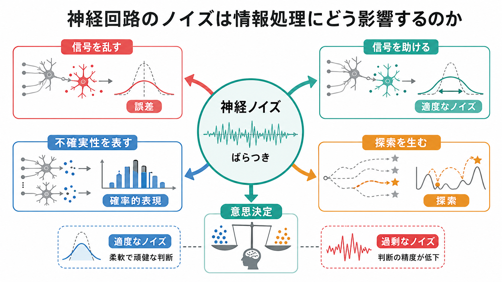
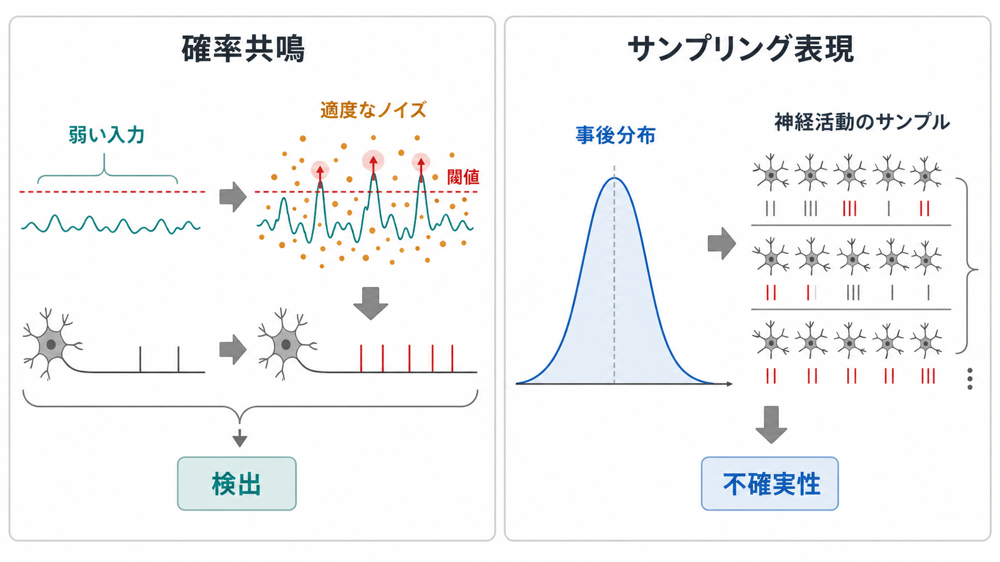
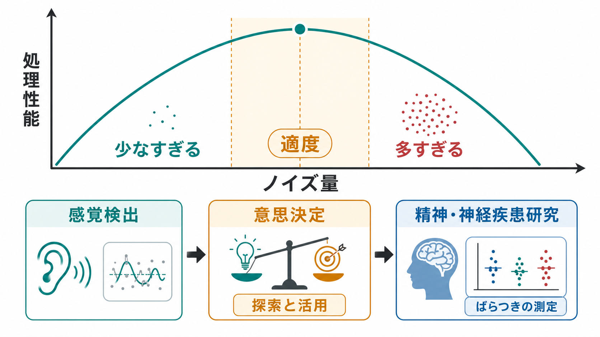

# 神経回路のノイズは情報処理にどう影響するのか

## 要点

- 神経活動の「ノイズ」は、同じ刺激や同じ課題でもスパイク時刻、発火率、膜電位、集団活動が試行ごとに揺らぐ現象として観察される。
- ノイズは感覚・運動・意思決定の精度を下げうるが、脳は平均化、冗長な集団符号、事前知識、[[フィードバック回路は脳内情報処理をどう調節するのか|フィードバック制御]]でその影響を抑えている[1]。
- 一方で、適度なノイズは弱い信号の検出、確率的な表現、探索、柔軟な意思決定に役立つ場合がある[2]。
- 重要なのは「ノイズをなくすこと」ではなく、課題・回路・時間スケールに応じて、ばらつきが情報を壊しているのか、情報を運んでいるのかを見分けることである。

## この記事で答える問い

1. 神経回路のノイズとは何か。
2. ノイズはどのように情報処理を悪化させるのか。
3. なぜノイズが、確率的表現・探索・意思決定に役立つことがあるのか。
4. 研究や臨床的理解では、神経活動のばらつきをどう扱えばよいのか。

## まず結論

神経回路のノイズは、単なる測定誤差でも、脳の失敗でもない。分子、イオンチャネル、シナプス、細胞、局所回路、全脳ネットワークの各階層で生じるばらつきが、感覚入力から行動出力までの不確実性を形づくる[1]。そのためノイズは、情報をぼかし、推定や行動を不安定にする。

しかし、神経系はもともと不確実な世界を扱っている。十分なノイズがあることで閾値下の信号が検出可能になる場合があり、神経集団のばらつきは「どの解釈がどれくらいありそうか」という確率分布の表現として読める場合もある[2][5][6]。意思決定では、ばらつきは悪い判断の原因であると同時に、まだ試していない選択肢を探索するためのゆらぎにもなる[7]。

## 背景

神経科学では長く、ニューロンの平均発火率や平均反応が主な対象だった。たとえば、ある刺激を何度も提示し、発火率の平均を取ると、刺激に対する「反応の大きさ」が得られる。だが実際のニューロンは、同じ刺激でも毎回同じようには発火しない。スパイク数、スパイク時刻、複数ニューロン間の相関、脳領域間の同期は揺らぐ。

このばらつきは、[[神経回路とは何か|神経回路]]の信頼性を考えるうえで避けられない。Faisal らの総説は、感覚受容、細胞内過程、シナプス伝達、神経ネットワーク、運動出力まで、ノイズが行動ループの各段階に存在することを整理している[1]。つまり、ノイズは特定の実験条件だけで現れる例外ではなく、神経系の基本条件である。

さらに、刺激が入ると神経活動の平均だけでなく「ばらつき」も変化する。Churchland らは、複数の皮質領域と記録法を横断して、刺激開始後に神経反応の trial-to-trial variability が低下する現象を報告した[3]。これは、入力が皮質状態を安定化し、回路のゆらぎを特定の情報処理状態へ押し込むことを示唆する。

## 基本概念

### ノイズとばらつきは同じではない

「ノイズ」は、信号に重なるランダムまたは予測しにくい揺らぎを指す。一方、「ばらつき」は観察された反応の変動であり、真のランダム性だけでなく、注意、覚醒度、課題方略、内部状態、未観測の入力にも由来する。したがって、実験で見える variability をすぐに「無意味なノイズ」と決めつけるのは危険である。

### 独立ノイズと相関ノイズ

単一ニューロンの揺らぎは、集団で平均すればある程度打ち消せる。しかし、複数ニューロンが同じ方向に揺らぐ相関ノイズは、単純な平均化では消えにくい。神経相関は集団符号の情報量と復号戦略に影響し、条件によって情報を増やすことも減らすこともある[4]。この点は、[[神経同期とは何か]]や[[脳内ネットワークとは何か]]を考えるときにも重要である。

### Fano factor と trial-to-trial variability

スパイク数のばらつきは、しばしば Fano factor で表される。

$$
F = \frac{\mathrm{Var}(N)}{\mathbb{E}[N]}
$$

ここで \(N\) は一定時間窓内のスパイク数である。ポアソン過程では \(F \approx 1\) になるが、実際の神経活動では刺激、注意、学習、脳状態によって値が変わる。刺激開始後に variability が下がるという観察は、平均発火率だけでは捉えられない回路状態の変化を示している[3]。

## 仕組み

### 1. ノイズは情報を制限する

感覚入力が弱い、受容器が不安定、シナプス伝達が確率的、スパイク発生が揺らぐ。このような場合、同じ外界状態でも神経活動が異なるため、下流回路は刺激を正確に推定しにくくなる[1]。とくに相関ノイズが課題に必要な情報軸と重なると、ニューロン数を増やしても誤差が残りやすい[4]。

この制限は、[[フィードフォワード回路はどのように情報を処理するのか|フィードフォワード処理]]では入力段階の不確実性として、[[リカレント回路はどのように記憶や持続活動を支えるのか|リカレント回路]]では状態遷移の揺らぎとして現れる。作業記憶や持続活動では、わずかな揺らぎが時間とともに蓄積し、記憶内容のドリフトにつながることがある。

### 2. 適度なノイズは弱い信号を助ける

非線形な閾値系では、弱すぎて単独では発火を起こせない入力が、適度なノイズと組み合わさることで閾値を越えることがある。これは確率共鳴、より広くは stochastic facilitation と呼ばれる[2]。重要なのは「ノイズが多いほどよい」ではない点である。少なすぎれば信号は閾値に届かず、多すぎれば信号は埋もれる。

### 3. ばらつきは確率分布を表す

脳が不確実な世界を推定しているなら、神経活動は単一の答えだけでなく、答えの不確実性も表す必要がある。確率的集団符号化の考え方では、ニューロン集団の活動パターンが刺激や状態に関する確率分布を表す[5]。この枠組みでは、ばらつきは単なる誤差ではなく「分布の幅」や「確信度」に関係する。

さらにサンプリング表現の考え方では、神経活動の時々刻々の変動が、事後分布からのサンプルのように振る舞う可能性がある。Orbán らは視覚野の神経 variability が、外界の統計構造と整合するサンプリングに基づく確率表現として解釈できることを示した[6]。この見方では、安定しすぎる活動はむしろ不確実性を表せない。

### 4. ノイズは探索を生む

意思決定では、すでに価値が高いとわかっている行動を選ぶ「活用」と、まだ不確かな行動を試す「探索」のバランスが必要である。行動選択が完全に決定論的だと、局所的に良い選択に固定され、新しい選択肢を試せない。適度な選択のゆらぎは、探索を可能にする。

Doya は、神経調節系を学習パラメータの調節として捉え、ノルアドレナリンが行動選択のランダム性に関わるという計算論的仮説を提案した[7]。この考え方は、[[大脳基底核ループとは何か]]や[[直接路と間接路は行動選択をどう制御するのか]]で扱う行動選択の回路理解とも接続できる。

## 図解

ノイズ量と処理性能の関係は、しばしば逆 U 字型に考えると理解しやすい。ノイズが少なすぎると、閾値下の信号が検出されず、探索も乏しい。適度なノイズでは、弱い入力の検出、確率的表現、探索が働きやすい。ノイズが多すぎると、信号対雑音比が下がり、判断や行動は不安定になる。

| ノイズの側面 | 情報処理への影響 | 代表的な読み方 |
|---|---|---|
| 独立したランダム揺らぎ | 平均化である程度低減できる | 冗長な集団符号で補償 |
| 相関した揺らぎ | 集団全体の情報量を制限しうる | 相関構造そのものを解析する |
| 適度な閾値周辺の揺らぎ | 弱い信号の検出を助ける | 確率共鳴・stochastic facilitation |
| 時間的な活動変動 | 不確実性や候補解を表しうる | サンプリング表現 |
| 行動選択のゆらぎ | 探索を可能にする | 探索と活用の調整 |

## 臨床・研究との接続

臨床や精神医学で「神経ノイズ」を語るときは、個別診断や治療指示に直結させず、研究上の構成概念として扱う必要がある。脳活動のばらつきは、覚醒度、注意、年齢、薬理作用、課題難度、測定法によって変わるため、単独の指標だけで疾患状態を断定することはできない。

それでも、ばらつきは有用な研究対象である。たとえば、[[E_Iバランスとは何か|興奮と抑制のバランス]]が変われば、ネットワークの安定性、同期、ゲイン、発火の不規則性が変化しうる。[[抑制性介在ニューロンにはどのような種類があるのか|抑制性介在ニューロン]]や[[ガンマ振動は認知機能にどう関わるのか|ガンマ振動]]の研究では、ノイズと同期の関係が認知機能や神経疾患モデルの理解に関わる。

また、測定上の「ばらつき」を除去すべき誤差としてだけ扱うと、脳状態の変化や確率的表現を見落とす。近年の集団記録や計算モデルでは、平均発火率だけでなく、共分散、ノイズ相関、低次元状態空間、試行間変動の時間変化が重視される[4][8]。

## よくある誤解

### 誤解1: ノイズは少ないほどよい

精密な伝達だけを考えるなら、ノイズは少ないほどよい。しかし神経回路は非線形で、閾値、飽和、リカレント結合、可塑性を含む。適度なノイズが信号検出や探索を助ける場合があるため、常にゼロを目標にするのは単純化しすぎである[2]。

### 誤解2: ばらつきはすべて測定誤差である

測定誤差は確かにある。しかし同じ個体・同じ刺激でも、神経活動のばらつきは回路状態や認知状態を反映しうる。刺激提示後に variability が下がる現象は、ばらつきそのものが神経処理の重要な変数であることを示している[3]。

### 誤解3: ノイズがあるなら脳は正確に計算できない

脳はノイズのあるハードウェアで、ノイズのある世界を推定している。確率的集団符号化やサンプリング表現の枠組みでは、ばらつきは推定の邪魔であるだけでなく、不確実性を表す計算資源にもなる[5][6]。

### 誤解4: ノイズは単一ニューロンだけの問題である

情報処理で重要なのは、多くの場合、集団活動の構造である。単一ニューロンが揺らいでも、集団で平均化できるなら影響は小さい。逆に、小さな相関でも大規模集団では復号に大きく影響しうる[4][8]。

## 関連ノート

- [[神経回路とは何か]]
- [[脳内ネットワークとは何か]]
- [[E_Iバランスとは何か]]
- [[神経同期とは何か]]
- [[リカレント回路はどのように記憶や持続活動を支えるのか]]
- [[フィードバック回路は脳内情報処理をどう調節するのか]]
- [[大脳基底核ループとは何か]]
- [[直接路と間接路は行動選択をどう制御するのか]]
- [[ガンマ振動は認知機能にどう関わるのか]]

### MOC更新候補

- `content/00_MOC/` 配下の脳・神経科学系 MOC に、本記事を「神経回路・脳ネットワーク」「計算論的神経科学」「意思決定」の接点として追加する候補。
- 並列ジョブとの衝突を避けるため、このタスクでは MOC 本体は更新しない。

## 理解チェック

1. 神経活動の trial-to-trial variability と「ノイズ」は、なぜ完全には同じ意味ではないのか。
2. 相関ノイズは、なぜ単純なニューロン数の増加では消えにくいのか。
3. 確率共鳴では、なぜ「ノイズが多いほどよい」とは言えないのか。
4. 神経活動のばらつきを、確率分布やサンプリングとして解釈する利点は何か。
5. 意思決定において、行動選択のゆらぎはどのように探索に役立つのか。

## 参考文献

[1] Faisal, A. A., Selen, L. P. J., & Wolpert, D. M. (2008). Noise in the nervous system. *Nature Reviews Neuroscience*, 9, 292-303. https://doi.org/10.1038/nrn2258

[2] McDonnell, M. D., & Ward, L. M. (2011). The benefits of noise in neural systems: bridging theory and experiment. *Nature Reviews Neuroscience*, 12, 415-425. https://doi.org/10.1038/nrn3061

[3] Churchland, M. M., Yu, B. M., Cunningham, J. P., et al. (2010). Stimulus onset quenches neural variability: a widespread cortical phenomenon. *Nature Neuroscience*, 13, 369-378. https://doi.org/10.1038/nn.2501

[4] Averbeck, B. B., Latham, P. E., & Pouget, A. (2006). Neural correlations, population coding and computation. *Nature Reviews Neuroscience*, 7, 358-366. https://doi.org/10.1038/nrn1888

[5] Ma, W. J., Beck, J. M., Latham, P. E., & Pouget, A. (2006). Bayesian inference with probabilistic population codes. *Nature Neuroscience*, 9, 1432-1438. https://doi.org/10.1038/nn1790

[6] Orban, G., Berkes, P., Fiser, J., & Lengyel, M. (2016). Neural variability and sampling-based probabilistic representations in the visual cortex. *Neuron*, 92(2), 530-543. https://doi.org/10.1016/j.neuron.2016.09.038

[7] Doya, K. (2002). Metalearning and neuromodulation. *Neural Networks*, 15(4-6), 495-506. https://doi.org/10.1016/S0893-6080(02)00044-8

[8] Panzeri, S., Moroni, M., Safaai, H., & Harvey, C. D. (2022). The structures and functions of correlations in neural population codes. *Nature Reviews Neuroscience*, 23, 551-567. https://doi.org/10.1038/s41583-022-00606-4

## 未解決問題

- 神経活動のどの種類のばらつきが、情報を制限するノイズで、どの種類が確率的表現の一部なのかを、実験データからどう分離するか。
- ヒトの非侵襲計測で観察される脳信号 variability を、細胞・回路レベルのノイズとどこまで対応づけられるか。
- 精神・神経疾患における「過剰なノイズ」や「硬すぎる安定性」を、診断名ではなく計算機構としてどう定式化するか。
- ノイズを調整する介入が有益な場合、その効果をどの課題、どの時間スケール、どの神経指標で評価すべきか。
