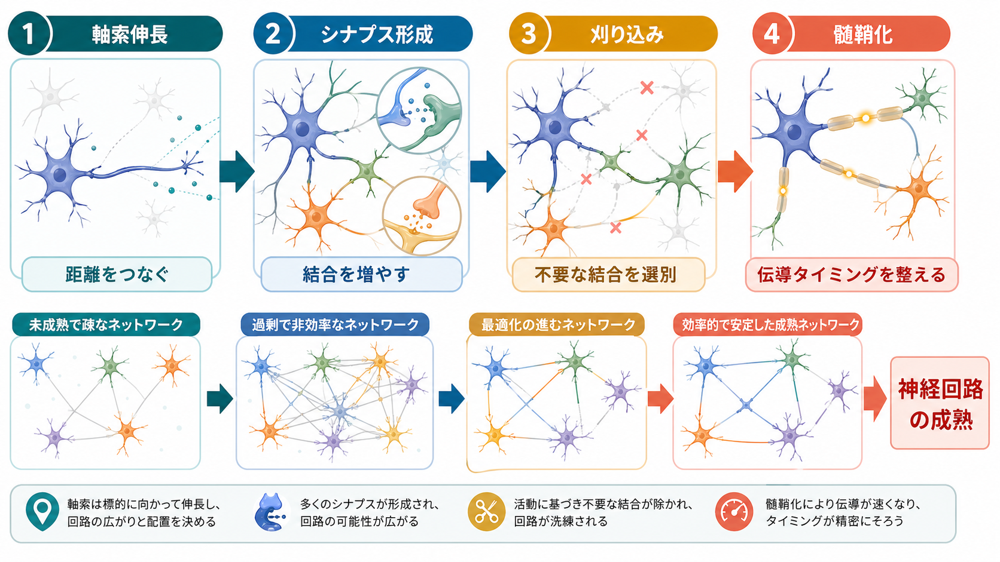
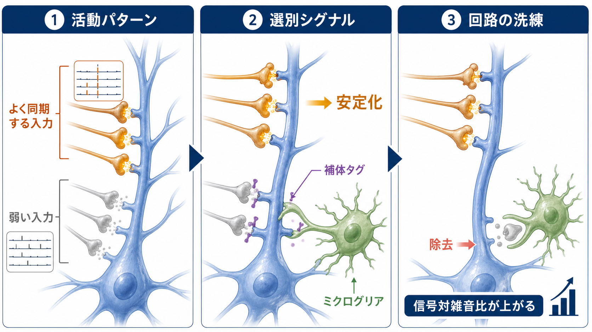
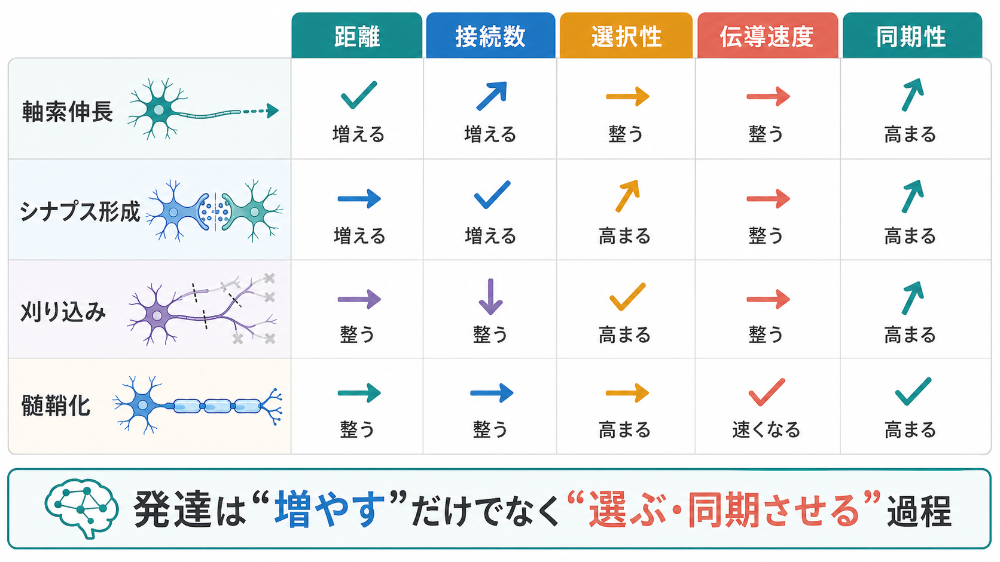

# 神経回路の発達はどのように進むのか

## 要点

- [[神経回路とは何か|神経回路]]の発達は、単に[[ニューロンとは何か|ニューロン]]が増えて線でつながる過程ではなく、軸索伸長、[[シナプスとは何か|シナプス]]形成、シナプス刈り込み、[[髄鞘はなぜ神経伝導を速くするのか|髄鞘化]]が時間差をもって重なる過程である[1]。
- 軸索伸長は、遠い領域を物理的につなぎ、脳内ネットワークの候補となる経路を作る。成長円錐は分子手がかりを読むが、濃度勾配だけで配線が完全に決まるわけではない[2][3]。
- シナプス形成は結合の候補を増やし、活動依存的な安定化と除去によって、情報処理に役立つ結合が相対的に残る[4]。
- シナプス刈り込みは、過剰な結合を減らすだけでなく、回路の選択性と信号対雑音比を高める再編成である。補体系や[[ミクログリアは脳の免疫細胞として何をしているのか|ミクログリア]]は、その一部に関わる[6][7]。
- 髄鞘化は伝導速度とタイミングを調整し、離れた領域が協調して活動する条件を整える。発達期だけでなく、経験や学習に応じた髄鞘の可塑性も議論されている[8]。

## この記事で答える問い

1. 軸索伸長、シナプス形成、刈り込み、髄鞘化は、それぞれ神経回路のどの側面を変えるのか。
2. なぜ発達中の脳は、最初から最小限で正確な配線を作らないのか。
3. 回路発達は、構造的結合、機能的結合、発達障害・精神疾患研究とどう接続するのか。

## まず結論

神経回路の発達は、「候補を作る」「候補を選ぶ」「伝わるタイミングを整える」という三つの原理で理解すると見通しがよい。軸索伸長は離れた細胞や領域をつなぐ候補経路を作り、シナプス形成は局所的な入力と出力の接点を増やす。そこから活動パターン、分子標識、グリア細胞、経験によって一部の結合が安定化し、一部は弱まり、除去される。最後に髄鞘化が伝導速度を調整し、複数領域が適切な時間窓で協調しやすくなる[1][4][8]。

したがって、発達は「増える」だけでも「減る」だけでもない。初期には冗長な候補を作ることで柔軟性を確保し、その後に活動依存的な選別とタイミング調整によって、より効率的で文脈に合ったネットワークへ近づく。これは[[構造的結合と機能的結合は何が違うのか|構造的結合]]と[[脳内ネットワークとは何か|脳内ネットワーク]]の関係を考えるうえでも重要である。

## 背景

発達中の神経系では、細胞分裂、移動、分化、軸索伸長、樹状突起形成、シナプス形成、刈り込み、髄鞘化が重なりながら進む。個々の過程は別々に説明できるが、実際の回路成熟では相互依存している。たとえば、軸索が標的領域へ届かなければシナプス形成は始まりにくく、シナプスが形成されても活動パターンに合わなければ安定化しにくい。さらに、長距離投射が機能的に協調するには、髄鞘化による伝導タイミングの調整が必要になる[1][8]。

ヒト大脳皮質では、シナプス密度や樹状突起スパインの発達が領域ごとに異なる時間経過を示す。前頭前野では、小児期に過剰なスパインが見られ、その後の再編成が青年期から若年成人期まで続く可能性がある[5]。この長い成熟期間は、学習や社会的経験に対する柔軟性を支える一方で、発達過程の乱れが行動や認知に影響しうる時間窓が長いことも意味する。

## 基本概念

### 軸索伸長

軸索伸長とは、ニューロンが[[軸索はどのように情報を遠くへ伝えるのか|軸索]]を伸ばし、標的細胞や標的領域へ近づく過程である。先端の成長円錐は、ネトリン、スリット、セマフォリン、エフリンなどの誘導分子、細胞外基質、周囲の細胞、既存の軸索束を読み取りながら進む[2]。

重要なのは、軸索誘導が一つの「住所ラベル」だけで決まるわけではない点である。分子勾配は強力な手がかりだが、実際の組織内では濃度勾配の検出には物理的限界があり、接触依存性の手がかり、中間標的、受容体発現の切り替え、活動依存的な洗練と組み合わさって配線が作られる[3]。詳しくは[[軸索誘導はどのように正しい接続を作るのか]]で扱う。

### シナプス形成

シナプス形成は、軸索終末と標的細胞の樹状突起・細胞体・軸索などの間に、情報伝達の接点が作られる過程である。シナプス前側ではアクティブゾーンやシナプス小胞放出装置が整い、シナプス後側では受容体、足場タンパク質、シナプス後肥厚が組織化される[4]。

ただし、シナプス形成は単なる接触ではない。接着分子、分泌因子、細胞種特異的な認識、局所活動、[[樹状突起はどのように情報を受け取るのか|樹状突起]]の成熟が関わる。発達中には多めのシナプスが作られ、その後の活動と経験により、安定化する結合と弱まる結合が分かれていく。

### シナプス刈り込み

シナプス刈り込みとは、発達中に過剰につくられたシナプスの一部が弱まり、除去される過程である。これは「不要なものを単純に捨てる」過程ではなく、回路の選択性を高める発達的な選別である。よく同期して活動する入力は安定化しやすく、標的細胞の活動と合わない入力は相対的に残りにくい[4]。

補体系とミクログリアの研究は、この選別が免疫系由来の分子とグリア細胞によっても支えられることを示してきた。たとえば発達中の視覚系では、C1q や C3 などの補体関連分子がシナプス除去に関わることが示されている[6]。ただし、刈り込みは補体系だけで説明できるものではなく、細胞種、領域、発達時期によって複数の経路が関わる[7]。

### 髄鞘化

髄鞘化とは、中枢神経系では[[オリゴデンドロサイトとシュワン細胞は何が違うのか|オリゴデンドロサイト]]が軸索を髄鞘で包み、伝導速度とエネルギー効率を高める過程である。髄鞘は単に信号を速くするだけでなく、離れた領域からの信号がどのタイミングで到達するかを変える。つまり、髄鞘化はネットワークの「時間設計」に関わる[8]。

髄鞘化は発達期に大きく進むが、経験や学習に応じた活動依存的髄鞘化も研究されている。これは[[シナプス可塑性とは何か|シナプス可塑性]]だけでなく、白質やグリア細胞も回路可塑性に関わることを示す。

## 仕組み

### 1. 軸索伸長が接続可能な空間を広げる

神経回路が成立するには、まず細胞同士が物理的に到達可能な範囲に入る必要がある。軸索伸長は、局所回路だけでなく、視床皮質投射、皮質間結合、海馬と前頭前野の結合のような長距離結合の土台を作る。ここで作られるのは完成した回路ではなく、後で選別される候補経路である[1][2]。

成長円錐は、複数の誘導因子を統合しながら、進む、曲がる、束になる、離れる、標的で止まるといった挙動を選ぶ。軸索誘導の誤りは、標的領域への到達失敗、交連線維の異常、地図形成の乱れとして現れうる。これは[[局所回路と長距離結合は何が違うのか|局所回路と長距離結合]]の発達的基盤でもある。

### 2. シナプス形成が回路の候補を増やす

軸索が標的付近へ到達すると、軸索終末と樹状突起スパインなどの間でシナプス形成が始まる。初期のシナプスは未成熟で、伝達効率、受容体構成、放出確率、形態が変化しやすい。これは回路に可塑的な探索余地を残すために重要である[4]。

発達中のシナプス形成は、精密さと柔軟性の両立を狙う過程と考えられる。最初から最小限の結合だけを作ると、個体差や経験差に適応しにくい。一方で、候補を作りすぎたままでは、信号の選択性が下がり、不要な同期やノイズが増えうる。そこで次の段階として、活動依存的な安定化と刈り込みが必要になる。

### 3. 刈り込みが選択性と効率を高める

シナプス刈り込みでは、すべての弱い結合が機械的に消えるわけではない。標的細胞との同期、入力の競合、発達時期、神経修飾、グリア細胞、補体関連分子などが重なり、残りやすい結合と除去されやすい結合が分かれる[6][7]。

この過程は、[[Hebb則とは何か|Hebb則]]、[[長期増強LTPとは何か|長期増強]]、[[長期抑圧LTDとは何か|長期抑圧]]と同じく、活動パターンが結合の運命に影響するという発想と関係する。ただし、発達期の刈り込みは単なる学習則ではなく、遺伝的プログラム、細胞接着、免疫関連分子、経験が重なる多層の過程である。

刈り込みの結果、ネットワークは過剰で非効率な結合から、より選択的で安定した結合パターンへ変わる。これはシナプス数の減少だけでなく、情報処理に必要な経路が相対的に強調されることを意味する。詳しくは[[シナプス刈り込みはなぜ重要なのか]]を参照。

### 4. 髄鞘化が伝導タイミングを整える

神経回路は、どの細胞がどの細胞につながるかだけでなく、信号がいつ届くかにも左右される。長い軸索では伝導遅延が生じるため、髄鞘化によって伝導速度が変わると、複数入力の到達タイミングや同期性が変化する[8]。

これは[[神経同期とは何か|神経同期]]や[[神経振動とは何か|神経振動]]の発達的基盤にも関わる。髄鞘化により、離れた領域が同じ時間窓で情報をやり取りしやすくなる一方、髄鞘の形成や維持が乱れると、伝導遅延、同期の乱れ、ネットワーク効率の低下が起こりうる。

## 図解

| 発達過程 | 主な働き | ネットワークへの影響 | 関連する見方 |
|---|---|---|---|
| 軸索伸長 | 標的領域へ到達する | 接続可能な距離と経路を広げる | 構造的結合、長距離結合 |
| シナプス形成 | 結合候補を作る | 入力の多様性と冗長性を増やす | シナプス特異性、可塑性 |
| 刈り込み | 結合を選別する | 選択性と信号対雑音比を高める | 活動依存性、補体系、ミクログリア |
| 髄鞘化 | 伝導速度を調整する | 同期性と効率を高める | 白質、時間遅延、ネットワーク協調 |

## 臨床・研究との接続

神経回路発達の研究は、神経発達症、統合失調症、気分症、てんかん、発達期の感覚・運動障害などを理解するための基礎になる。ただし、個別の疾患を「刈り込み過剰」「髄鞘化不足」など一つの機構だけで説明するのは危険である。多くの臨床的状態では、遺伝要因、環境要因、発達時期、細胞種、脳領域、経験、炎症、代謝が重なっている。

研究上は、次の三つのレベルを区別すると整理しやすい。

1. 細胞・分子レベル: 軸索誘導分子、接着分子、受容体、補体系、グリア細胞、髄鞘形成。
2. 回路レベル: 局所回路、長距離結合、興奮性・抑制性バランス、同期性、発火タイミング。
3. 行動・臨床レベル: 感覚処理、学習、実行機能、社会認知、症状、発達的な脆弱性。

この区別は、MRI、拡散MRI、EEG/MEG、fMRI、動物モデル、細胞実験の結果を無理に一つの説明へ押し込めないために重要である。たとえば、白質指標の変化は髄鞘だけでなく、軸索密度、線維配向、水分量、炎症などの影響も受けうる。したがって、臨床研究では複数の測定と縦断的デザインが必要になる。

## よくある誤解

### 誤解1: 発達とはニューロンが増えることだけである

発達期には神経発生も重要だが、回路成熟の中心には、既に分化したニューロン同士の接続形成と再編成がある。軸索、樹状突起、シナプス、グリア、髄鞘が変化しなければ、ネットワークとしての機能は成熟しない。

### 誤解2: シナプスは多いほどよい

シナプス数が多いほど情報処理が優れているとは限らない。過剰な結合は柔軟性を支える一方で、信号の選択性を下げることがある。成熟した回路には、必要な結合が適切な強さと配置で残ることが重要である[5]。

### 誤解3: 刈り込みは脳が劣化する過程である

発達期の刈り込みは、病的な喪失ではなく、過剰な候補から機能的な結合を選ぶ過程である。ただし、どの程度の刈り込みが適切かは、領域、年齢、細胞種、経験に依存する。

### 誤解4: 髄鞘化は単に速度を上げるだけである

髄鞘化は速度を上げるだけでなく、信号到達のタイミングを調整する。ネットワークでは、速いことよりも、適切なタイミングで届くことが重要な場合がある[8]。

## 関連ノート

- [[神経回路とは何か]]
- [[脳内ネットワークとは何か]]
- [[構造的結合と機能的結合は何が違うのか]]
- [[局所回路と長距離結合は何が違うのか]]
- [[軸索誘導はどのように正しい接続を作るのか]]
- [[シナプスとは何か]]
- [[シナプス可塑性とは何か]]
- [[シナプス刈り込みはなぜ重要なのか]]
- [[髄鞘はなぜ神経伝導を速くするのか]]
- [[グリア細胞は単なる支持細胞なのか]]
- [[E_Iバランスとは何か]]

## MOC更新候補

- `content/00_MOC/` 配下の脳・神経科学系 MOC に、本記事 `[[神経回路の発達はどのように進むのか]]` を追加する候補。
- `神経回路・脳ネットワーク` 領域では、発達的基盤を扱う入口ノートとして `[[神経回路とは何か]]`、`[[構造的結合と機能的結合は何が違うのか]]`、`[[局所回路と長距離結合は何が違うのか]]` の近くに配置する候補。

## 理解チェック

1. 軸索伸長とシナプス形成は、どちらも「つながる」過程だが、何が違うか。
2. シナプス刈り込みが、単なるシナプス数の減少ではなく「選別」といえる理由は何か。
3. 髄鞘化が、長距離ネットワークの同期性に影響しうるのはなぜか。
4. 神経発達症や精神疾患を、単一の発達過程だけで説明しにくい理由は何か。

## 参考文献

[1] Tau, G. Z., & Peterson, B. S. (2010). Normal development of brain circuits. *Neuropsychopharmacology*, 35, 147-168. https://doi.org/10.1038/npp.2009.115

[2] Stoeckli, E. T. (2018). Understanding axon guidance: are we nearly there yet? *Development*, 145(10), dev151415. https://doi.org/10.1242/dev.151415

[3] Goodhill, G. J. (2016). Can molecular gradients wire the brain? *Trends in Neurosciences*, 39(4), 202-211. https://doi.org/10.1016/j.tins.2016.01.009

[4] Waites, C. L., Craig, A. M., & Garner, C. C. (2005). Mechanisms of vertebrate synaptogenesis. *Annual Review of Neuroscience*, 28, 251-274. https://doi.org/10.1146/annurev.neuro.27.070203.144336

[5] Petanjek, Z., Judaš, M., Šimić, G., Rašin, M. R., Uylings, H. B. M., Rakic, P., & Kostović, I. (2011). Extraordinary neoteny of synaptic spines in the human prefrontal cortex. *Proceedings of the National Academy of Sciences*, 108(32), 13281-13286. https://doi.org/10.1073/pnas.1105108108

[6] Stevens, B., Allen, N. J., Vazquez, L. E., Howell, G. R., Christopherson, K. S., Nouri, N., Micheva, K. D., Mehalow, A. K., Huberman, A. D., Stafford, B., Sher, A., Litke, A. M., Lambris, J. D., Smith, S. J., John, S. W. M., & Barres, B. A. (2007). The classical complement cascade mediates CNS synapse elimination. *Cell*, 131(6), 1164-1178. https://doi.org/10.1016/j.cell.2007.10.036

[7] Soteros, B. M., & Sia, G. M. (2022). Complement and microglia dependent synapse elimination in brain development. *WIREs Mechanisms of Disease*, 14(3), e1545. https://doi.org/10.1002/wsbm.1545

[8] Fields, R. D. (2015). A new mechanism of nervous system plasticity: activity-dependent myelination. *Nature Reviews Neuroscience*, 16, 756-767. https://doi.org/10.1038/nrn4023

## 未解決問題

- ヒトで観察される白質発達や機能的結合の変化を、細胞レベルの髄鞘化・軸索変化・シナプス変化へどこまで分解できるか。
- 補体系・ミクログリアによる刈り込みが、脳領域や発達段階ごとにどれほど一般化できるか。
- 発達期の経験、睡眠、ストレス、炎症、栄養、社会環境が、軸索伸長・刈り込み・髄鞘化へどのように相互作用するか。
- 神経回路発達の個人差を、疾患リスクだけでなく適応的多様性としてどう扱うか。
