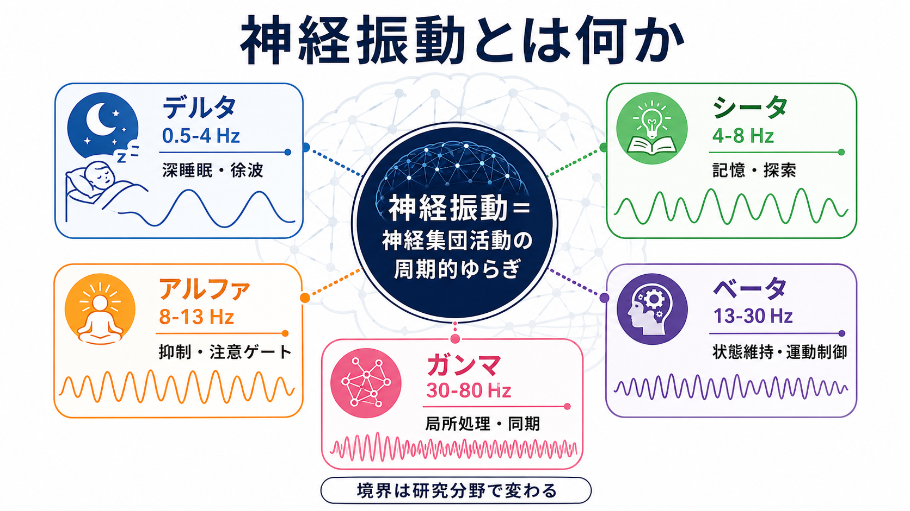
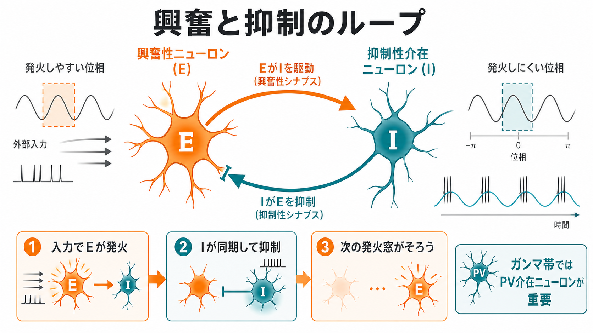
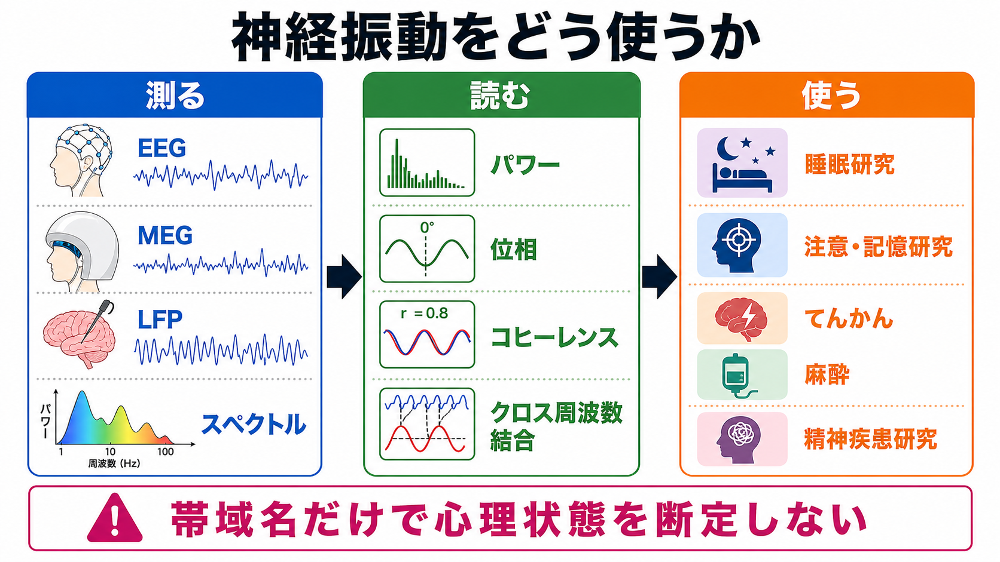

# 神経振動とは何か

## 要点

- 神経振動とは、単一ニューロンの発火ではなく、多数の[[ニューロンとは何か|ニューロン]]や[[シナプスとは何か|シナプス]]入力が時間的にまとまって変動するリズムである。
- EEG、MEG、ECoG、LFP などで観察されるデルタ、シータ、アルファ、ベータ、ガンマ帯域は便利な分類だが、境界は分野・測定法・解析法によって変わる[1]。
- 振動は「脳が揺れているだけ」ではなく、入力選択、発火タイミング、[[神経同期とは何か|神経同期]]、可塑性、広域ネットワーク間の通信窓を調整する候補メカニズムとして扱われる[2][3]。
- ただし「アルファが高いからリラックス」「ガンマが高いから認知が高い」のような一対一対応は危険である。帯域名は、部位・課題・状態・解析窓とセットで読む必要がある。

## この記事で答える問い

この記事では、神経振動を「脳波の周波数帯の名前」としてだけでなく、[[脳内ネットワークとは何か|脳内ネットワーク]]が時間をそろえて情報を扱う仕組みとして読む。中心となる問いは次の3つである。

1. デルタ・シータ・アルファ・ベータ・ガンマ帯域は何を表しているのか。
2. それぞれの帯域は神経回路機能とどのように関係するのか。
3. 研究・臨床で神経振動を読むとき、どこに注意すべきか。

## まず結論

神経振動は、脳活動の「周波数ラベル」ではなく、神経集団が発火しやすい時間窓と発火しにくい時間窓を周期的に作る現象として理解するとよい。低周波リズムは広い領域や長い時間スケールをまとめ、高周波リズムはより局所的で速い処理を反映しやすい。ただし、この対応は絶対ではなく、同じ周波数帯でも睡眠、注意、運動、記憶、病態、薬理状態によって意味が変わる[2][7]。

## 背景

脳波研究では、頭皮上 EEG や MEG で観察される周期的活動を、周波数帯ごとに分類してきた。代表的には、デルタ、シータ、アルファ、ベータ、ガンマである。IFCN 関連の整理では、固定帯域の境界は完全には統一されておらず、デルタ 0.5-4 Hz、シータ 4-8 Hz、アルファ 8-13 Hz、ベータ 14-30 Hz、ガンマ 30-80 Hz 前後のような分類が用いられる[1]。

この分類は便利だが、神経振動の本質は「名前」よりも「時間構造」にある。ニューロンは常に独立に発火しているわけではなく、興奮性入力、抑制性入力、膜特性、シナプス結合、視床皮質回路、海馬回路などの相互作用によって、特定の時間窓で活動しやすくなる。Buzsáki と Draguhn は、こうした振動が入力選択、細胞集団の一時的な結合、シナプス可塑性を支える候補であると整理した[2]。

## 基本概念

### 周波数、位相、パワー

神経振動を読むときは、少なくとも3つの量を区別する。

| 指標 | 何を見るか | 読み方の注意 |
|---|---|---|
| 周波数 | 1秒あたり何回周期が回るか | 帯域境界は固定的ではない |
| パワー | その帯域の振幅・強さ | 強いほど機能が高いとは限らない |
| 位相 | 周期のどの時点にいるか | 発火しやすい時間窓の推定に関わる |
| コヒーレンス | 2信号の位相・周波数関係 | 相関であり、単独では因果方向を示さない |

### 主な周波数帯

| 帯域 | 典型的範囲 | 関連しやすい状態・機能 | 注意点 |
|---|---:|---|---|
| デルタ | 約0.5-4 Hz | 徐波睡眠、皮質・視床皮質の遅い状態変化 | 覚醒時の局所デルタは病態・課題・発達で意味が変わる |
| シータ | 約4-8 Hz | 海馬、記憶、探索、ナビゲーション、認知制御 | げっ歯類海馬では6-12 Hz程度、ヒトではより低い帯域も扱われる |
| アルファ | 約8-13 Hz | 感覚入力の抑制、注意ゲート、安静時後頭部リズム | 「休止」だけでなく、課題非関連領域の機能的抑制として読む |
| ベータ | 約13/14-30 Hz | 運動制御、現在の感覚運動状態の維持、トップダウン制御 | 状態維持・予測・運動停止など文脈依存性が高い |
| ガンマ | 約30-80/100 Hz | 局所回路処理、感覚特徴統合、注意、作業記憶 | 筋活動や微小眼球運動などのアーチファクトに注意する |

## 仕組み

神経振動の代表的な発生原理は、興奮と抑制のタイミング制御である。興奮性ニューロンが抑制性介在ニューロンを駆動し、抑制性介在ニューロンが一定の遅れで興奮性ニューロン群を抑えると、発火しやすい窓と発火しにくい窓が周期的に生まれる。とくにガンマ帯域では、GABA作動性の高速発火性介在ニューロン、なかでも PV 介在ニューロンが重要な役割を持つ[6]。

この仕組みは、単に活動量を上下させるのではなく、入力が届くタイミングをそろえる。Fries の communication-through-coherence 仮説では、送り手と受け手の神経集団が同じ位相関係で振動すると、出力窓と入力窓が重なり、情報が通りやすくなると考える[3]。この見方では、[[神経同期とは何か|同期]]は「同時に活動している」ことではなく、「通信に有利な時間窓を共有している」ことに近い。

さらに、異なる周波数帯が入れ子状に結合することもある。たとえばシータ位相がガンマ振幅を調整するシータ・ガンマ結合は、複数項目を順序づけて保持する作業記憶や海馬の系列表現を説明する候補として研究されている[8]。低周波が広域・長時間スケールの文脈を作り、高周波が局所・短時間スケールの処理を担う、という階層的な読み方である。

## 図解

神経振動を研究で使うときは、測定、解析、解釈を分けて考える。EEG や MEG は頭皮・頭外から広域活動を測るため非侵襲的だが、空間分解能やアーチファクトの制約がある。LFP や ECoG は局所活動に近づけるが、侵襲性や対象集団の偏りがある。

## 臨床・研究との接続

睡眠研究では、デルタ帯域や徐波活動が睡眠段階、記憶固定、皮質興奮性の変化と関係する。注意研究では、アルファ帯域が課題非関連領域の抑制や入力ゲートと関連し、ガンマ帯域が課題関連入力の局所処理と関連することが多い[4]。運動研究では、ベータ帯域が現在の感覚運動状態の維持や変化への抵抗と関係するという見方が提案されている[5]。

臨床・病態研究では、てんかん、麻酔、睡眠障害、パーキンソン病、統合失調症、認知症などで神経振動の変化が研究されている。ただし、神経振動は単独で診断や治療方針を決める指標ではない。教育・研究目的では、症状、行動課題、薬物、睡眠、年齢、測定条件、解析法を合わせて読む必要がある。

## よくある誤解

### 誤解1: 周波数帯には固定の心理意味がある

デルタは睡眠、アルファはリラックス、ベータは集中、ガンマは高次認知、という単純な対応は不十分である。同じアルファでも、後頭部安静時リズム、空間注意、作業記憶中の抑制では解釈が変わる[4]。

### 誤解2: パワーが高いほど機能が高い

パワーの増加は、処理の増加を示す場合もあれば、抑制、同期しすぎ、課題非関連活動、アーチファクトを示す場合もある。位相、部位、課題、行動成績との関係を同時に見る必要がある。

### 誤解3: 同期は常に良い

同期は情報統合を助けることがあるが、過剰な同期は柔軟性を下げたり、病的活動と関係したりする。同期は「多すぎても少なすぎても問題になりうる」時間調整の仕組みとして読む方がよい。

## 関連ノート

- [[神経同期とは何か]]
- [[脳内ネットワークとは何か]]
- [[シータリズムは記憶とナビゲーションをどう支えるのか]]
- [[ガンマ振動は認知機能にどう関わるのか]]
- [[抑制性介在ニューロンにはどのような種類があるのか]]
- [[興奮性ニューロンと抑制性ニューロンは何が違うのか]]
- [[GABAは脳で何をしているのか]]
- [[シナプス可塑性とは何か]]

MOC更新候補: [[MOC｜脳・神経科学]], [[MOC｜基礎神経科学]]

## 理解チェック

1. 神経振動を「周波数帯の名前」だけで読むと、どのような誤解が起きるか。
2. パワー、位相、コヒーレンスはそれぞれ何を表すか。
3. アルファ帯域が「休止」ではなく「抑制ゲート」と解釈されるのはどのような場面か。
4. communication-through-coherence 仮説では、なぜ位相関係が通信効率に関わると考えるのか。
5. 臨床研究で神経振動を読むとき、個別診断に直結させてはいけない理由は何か。

## 参考文献

[1] Babiloni, C., Barry, R. J., Başar, E., et al. (2020). International Federation of Clinical Neurophysiology (IFCN) - EEG research workgroup: Recommendations on frequency and topographic analysis of resting state EEG rhythms. Part 1: Applications in clinical research studies. *Clinical Neurophysiology*, 131(1), 285-307. https://doi.org/10.1016/j.clinph.2019.06.234

[2] Buzsáki, G., & Draguhn, A. (2004). Neuronal oscillations in cortical networks. *Science*, 304(5679), 1926-1929. https://doi.org/10.1126/science.1099745

[3] Fries, P. (2005). A mechanism for cognitive dynamics: neuronal communication through neuronal coherence. *Trends in Cognitive Sciences*, 9(10), 474-480. https://doi.org/10.1016/j.tics.2005.08.011

[4] Jensen, O., & Mazaheri, A. (2010). Shaping functional architecture by oscillatory alpha activity: gating by inhibition. *Frontiers in Human Neuroscience*, 4, 186. https://doi.org/10.3389/fnhum.2010.00186

[5] Engel, A. K., & Fries, P. (2010). Beta-band oscillations: signalling the status quo? *Current Opinion in Neurobiology*, 20(2), 156-165. https://doi.org/10.1016/j.conb.2010.02.015

[6] Bartos, M., Vida, I., & Jonas, P. (2007). Synaptic mechanisms of synchronized gamma oscillations in inhibitory interneuron networks. *Nature Reviews Neuroscience*, 8, 45-56. https://doi.org/10.1038/nrn2044

[7] Steriade, M. (2006). Grouping of brain rhythms in corticothalamic systems. *Neuroscience*, 137(4), 1087-1106. https://doi.org/10.1016/j.neuroscience.2005.10.029

[8] Lisman, J. E., & Jensen, O. (2013). The theta-gamma neural code. *Neuron*, 77(6), 1002-1016. https://doi.org/10.1016/j.neuron.2013.03.007

## 未解決問題

- 周波数帯の境界を、固定値ではなく個人・部位・状態ごとにどう推定するべきか。
- 神経振動の相関的変化と、因果的な回路メカニズムをどう切り分けるか。
- EEG/MEG の広域信号と、単一細胞・局所回路レベルの振動をどう接続するか。
- 神経振動指標を、診断ラベルではなく病態メカニズムの研究指標としてどう安全に使うか。
