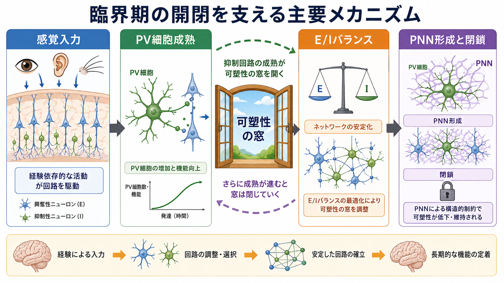
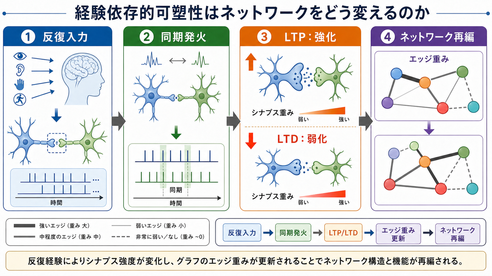
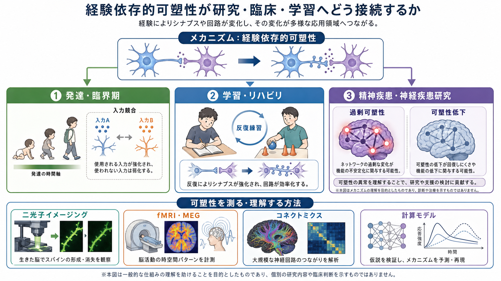

# 経験依存的可塑性はネットワークをどう変えるのか

## 要点

- 経験依存的可塑性とは、感覚入力、運動練習、学習、環境変化に応じて、[[神経回路とは何か|神経回路]]の結合強度、シナプス数、発火タイミング、[[E_Iバランスとは何か|E/Iバランス]]が変わることである。
- ミクロには LTP/LTD、スパイン形成・除去、抑制回路の成熟、恒常性可塑性が働く。マクロには、モジュール性、ハブ性、[[構造的結合と機能的結合は何が違うのか|構造的結合と機能的結合]]、課題中のネットワーク再構成として観察される。
- 可塑性は「強くする」だけではない。使われる結合を安定化し、使われない結合を弱め、過剰な興奮を抑え、ネットワーク全体の安定性と柔軟性を同時に調整する。
- 臨界期では入力競合による大きな再編が起こりやすいが、成人脳でも学習や訓練に伴う局所的・分散的な変化は続く。
- 医療・臨床に関わる読み方では、可塑性を個別の診断や治療指示として短絡せず、研究で示された集団レベルの機序として扱う必要がある。

## この記事で答える問い

このノートでは、次の問いに答える。

1. 経験依存的可塑性は、シナプスやスパインをどのように変えるのか。
2. 局所回路の変化は、なぜネットワーク全体の構造や機能へ波及するのか。
3. 臨界期、成人学習、リハビリ、精神・神経疾患研究では、可塑性をどう読むべきか。
4. 「脳は経験で変わる」という表現を、どこまで慎重に理解すべきか。

## まず結論

経験依存的可塑性は、入力に反応して単一の「配線図」を書き換える現象ではない。より正確には、経験によって生じる発火パターンが、シナプス重み、スパインの安定性、抑制回路、恒常性調整を通じて、ネットワークのエッジ重みとノード間の協調関係を更新する過程である。

その結果、同じ脳領域でも「どの入力に応答しやすいか」「どの細胞集団が同時に活動するか」「どの経路が効率よく使われるか」が変わる。ネットワーク科学の言葉で言えば、経験は結合の重み、モジュール構造、ハブ依存性、機能的結合を変化させる。ただし、観察される fMRI や行動指標は、シナプス変化そのものではなく、複数階層の変化が集約された間接的な指標である。

## 背景

神経系は、発生時に一度完成して終わる装置ではない。古典的な視覚皮質研究では、片眼遮蔽のような入力差が皮質の応答性を大きく変えることが示され、経験が皮質回路の構成を決めるという考え方の出発点になった[1]。その後の研究は、可塑性が発達期だけでなく成人脳にも残り、学習、記憶、技能獲得、環境適応に関わることを示してきた[2][5]。

一方で、可塑性は万能な「脳の再生力」ではない。可塑性が高すぎればノイズや不要な入力まで取り込みやすくなり、低すぎれば新しい学習や回復が難しくなる。したがって、経験依存的可塑性を理解するには、強化、弱化、安定化、競合、恒常性をひとまとまりのネットワーク調整として見る必要がある[3][4]。

## 基本概念

### 経験依存的可塑性

経験依存的可塑性とは、外界からの入力、身体運動、社会的相互作用、反復練習、睡眠、ストレスなどに応じて、神経回路の応答特性が変化することである。ここでいう「経験」は、意識的な学習だけでなく、感覚刺激の偏り、発達環境、身体使用の頻度、報酬や失敗の履歴も含む。

### シナプス重み

[[シナプスとは何か|シナプス]]は、ニューロン間で信号が渡る接点である。ある入力が次のニューロンを発火させやすくなると、その接続の重みが大きくなったと表現できる。LTP は長期的な強化、LTD は長期的な弱化の代表的な形式であり、記憶や学習を支える候補機構として広く研究されてきた[2]。

### 構造的可塑性

可塑性は、受容体や伝達効率だけでなく、樹状突起スパインの形成、拡大、縮小、消失としても現れる。生体内イメージング研究では、経験や学習に応じてスパインが形成・安定化し、既存のスパインも入れ替わることが示されている[3][5]。

### ネットワーク再編

ネットワーク再編とは、ノード間の結合重みや活動相関が変わり、局所的な処理単位、長距離結合、[[ハブ領域とは何か|ハブ領域]]、[[スモールワールドネットワークとは何か|スモールワールド性]]の使われ方が変化することである。構造的結合がすぐに大きく変わらなくても、機能的結合は課題、注意、学習段階、睡眠などによって変わりうる。

## 仕組み

### 1. 入力が発火パターンを偏らせる

経験は、まず特定の感覚入力や運動出力を反復させる。たとえば、ある音を聞き分ける訓練、指の運動練習、空間記憶課題では、関連するニューロン群が繰り返し活動する。この反復活動が、どの細胞同士が同時に発火しやすいかを変える。

Hebb則の直観はここにある。近いタイミングで活動するニューロン間の結合は強まりやすく、同期しない入力や予測に合わない入力は弱まりやすい。この原理は単純化された表現だが、ネットワーク内のエッジ重みが経験で更新されるという考え方の基礎になる[2]。

### 2. LTP/LTD がシナプス重みを変える

興奮性シナプスでは、NMDA受容体、カルシウム流入、AMPA受容体の数や機能変化が、LTP/LTD の代表的な分子・細胞機構として扱われる。強い同期入力はシナプスを強化し、別のタイミングや条件では弱化を引き起こす[2]。

ただし、LTP/LTD は「記憶そのもの」ではない。記憶や技能は、単一シナプスの変化ではなく、分散した細胞集団、局所回路、長距離ネットワーク、行動方略の変化として表れる。LTP/LTD は、その階層的過程の重要な部品である。

### 3. スパイン形成・除去が構造を変える

長く使われる回路では、スパインが安定化しやすい。逆に、使われない入力や競合に敗れた入力では、スパインや接続が弱化・消失しやすい。成人マウス皮質の長期イメージングでは、スパインの生成と消失が継続的に起こり、経験に応じてその割合が変化することが示された[3]。

運動学習では、新しく形成されたスパインが選択的に安定化し、長期記憶の保持に関わる可能性が示されている[5]。これは、経験が「一時的な活動パターン」から「残りやすい構造変化」へ移行する一例である。

### 4. 抑制回路と臨界期が可塑性の窓を調整する

発達期の可塑性は、興奮性入力だけでは説明できない。抑制性介在ニューロン、とくにパルブアルブミン陽性細胞の成熟、E/Iバランス、ペリニューロナルネットの形成などが、臨界期の開閉に関わる[4]。つまり、可塑性は「開いているほどよい」ものではなく、発達段階に応じて開き、安定化のために閉じる。

臨界期の研究は、教育やリハビリの比喩としてよく使われる。しかし、臨界期は機能、脳領域、種、測定法によって異なる。成人にも可塑性は残るが、発達期と同じ規模・速度・制約で起こるとは限らない。

### 5. 恒常性可塑性が暴走を防ぐ

もし強く使われた結合だけが無制限に強くなれば、ネットワークは発作的・不安定になりやすい。そこで、神経回路には全体の発火率を一定範囲に保つ恒常性可塑性が働く。シナプススケーリングや内因性興奮性の調整は、学習による変化を許しつつ、ネットワークの安定性を守る[7]。

この点は重要である。経験依存的可塑性は、単なる「強化」ではなく、強化と弱化、選択と刈り込み、柔軟性と安定性のバランスである。

## 図解

図1は、経験入力、臨界期、E/Iバランス、安定化の関係を概念的に整理したものである。経験によって活動する回路が選ばれ、使われる結合は強まり、使われない結合は弱まりやすい。ただし、その変化は抑制回路や構造的制約によって調整される。

図2は、反復入力から同期発火、LTP/LTD、ネットワーク再編へ進む流れを示す。シナプス重みの変化は、ネットワーク科学ではエッジ重みの更新として読み替えられる。

図3は、可塑性研究が発達、学習、リハビリ、精神・神経疾患研究に接続することを示す。ただし、この図は機序理解のための概念図であり、個別の診断や治療方針を示すものではない。

## 臨床・研究との接続

### 学習と技能獲得

成人ヒトでも、訓練に伴う脳構造・機能の変化は観察される。たとえば、ジャグリング訓練後に灰白質変化が報告され、経験がヒト脳の形態指標にも反映されうることが示された[6]。ただし、MRIで見える変化はシナプス変化を直接測っているわけではなく、血流、樹状突起、グリア、血管、測定条件などを含む複合的指標である。

### リハビリテーション

リハビリでは、反復練習、課題特異性、フィードバック、動機づけ、休息が重要になる。これは、単に「脳を鍛える」というより、残存回路と代償回路をどのように使い、どの経路を安定化させるかというネットワーク再編の問題として理解できる。

### 精神・神経疾患研究

精神疾患や神経疾患では、可塑性の低下、過剰な可塑性、E/Iバランスの偏り、ネットワーク統合の変化が仮説として研究されることがある。しかし、それらは多くの場合、集団レベルの研究仮説であり、個人の症状を単一の「可塑性異常」で説明できるわけではない。

### ネットワーク科学

学習に伴う脳ネットワーク変化を調べる研究では、機能的結合、モジュール性、ハブ性、柔軟性などが使われる。技能が熟達すると、広範囲な制御ネットワークへの依存が下がり、関連する感覚運動系がより自律的に働く可能性が示されている[8]。これは、学習がネットワーク全体の負荷配分を変えるという見方を支える。

## よくある誤解

### 誤解1: 可塑性は常によい

可塑性は変化しやすさであり、常によいとは限らない。不要な恐怖学習、慢性疼痛、依存、過剰な習慣形成も、広い意味では経験による回路変化として理解できる。重要なのは、どの回路が、どの方向に、どの時間スケールで変わるかである。

### 誤解2: 経験で脳の配線が自由に作り直される

経験は回路を変えるが、既存の解剖学的制約、発達段階、遺伝的制約、血管・グリア環境、課題条件に制限される。ネットワークは白紙から作られるのではなく、既存構造の上で重みと活動パターンを更新する。

### 誤解3: LTP が起これば学習が成立する

LTP は学習に関わる重要な機構だが、学習は LTP だけでは説明できない。LTD、抑制、恒常性調整、睡眠、報酬、注意、身体運動、情動などが相互作用する。

### 誤解4: fMRIの機能的結合はシナプス結合を示す

機能的結合は、信号の相関や同期を示す指標であり、直接的なシナプス結合ではない。構造的結合、間接経路、共通入力、課題状態、解析方法の影響を受ける。詳しくは [[構造的結合と機能的結合は何が違うのか]] とあわせて読むとよい。

## 関連ノート

- [[神経回路とは何か]]
- [[脳内ネットワークとは何か]]
- [[構造的結合と機能的結合は何が違うのか]]
- [[E_Iバランスとは何か]]
- [[スモールワールドネットワークとは何か]]
- [[ハブ領域とは何か]]
- [[海馬回路は記憶をどう形成するのか]]
- [[Hebb則とは何か]]
- [[長期増強LTPとは何か]]
- [[長期抑圧LTDとは何か]]

関連ノート候補:

- シナプス刈り込みはなぜ重要なのか
- 臨界期とは何か
- 恒常性可塑性とは何か
- スパイン可塑性とは何か
- リハビリテーションにおける神経可塑性

MOC更新候補:

- `content/00_MOC/MOC・脳・神経科学.md` または神経回路・脳ネットワーク関連MOCに、本記事を「可塑性」「学習」「ネットワーク再編」の接続ノートとして追加する。
- 並列生成ジョブとの競合を避けるため、このタスクではMOC本体を更新しない。

## 理解チェック

1. 経験依存的可塑性を「シナプスが強くなること」だけで説明すると、何が抜け落ちるか。
2. LTP/LTD とネットワーク科学の「エッジ重み」は、どのように対応づけられるか。
3. 臨界期の可塑性と成人学習の可塑性は、どの点で似ていて、どの点で異なるか。
4. 機能的結合をシナプス結合そのものと読んではいけない理由は何か。
5. 恒常性可塑性は、学習による変化とどのように共存するか。

## 参考文献

[1] Wiesel, T. N., & Hubel, D. H. (1963). Single-cell responses in striate cortex of kittens deprived of vision in one eye. *Journal of Neurophysiology, 26*(6), 1003-1017. https://doi.org/10.1152/jn.1963.26.6.1003

[2] Malenka, R. C., & Bear, M. F. (2004). LTP and LTD: An embarrassment of riches. *Neuron, 44*(1), 5-21. https://doi.org/10.1016/j.neuron.2004.09.012

[3] Holtmaat, A., & Svoboda, K. (2009). Experience-dependent structural synaptic plasticity in the mammalian brain. *Nature Reviews Neuroscience, 10*, 647-658. https://doi.org/10.1038/nrn2699

[4] Hensch, T. K. (2005). Critical period plasticity in local cortical circuits. *Nature Reviews Neuroscience, 6*, 877-888. https://doi.org/10.1038/nrn1787

[5] Xu, T., Yu, X., Perlik, A. J., Tobin, W. F., Zweig, J. A., Tennant, K., Jones, T., & Zuo, Y. (2009). Rapid formation and selective stabilization of synapses for enduring motor memories. *Nature, 462*, 915-919. https://doi.org/10.1038/nature08389

[6] Draganski, B., Gaser, C., Busch, V., Schuierer, G., Bogdahn, U., & May, A. (2004). Neuroplasticity: Changes in grey matter induced by training. *Nature, 427*, 311-312. https://doi.org/10.1038/427311a

[7] Turrigiano, G. (2012). Homeostatic synaptic plasticity: Local and global mechanisms for stabilizing neuronal function. *Cold Spring Harbor Perspectives in Biology, 4*(1), a005736. https://doi.org/10.1101/cshperspect.a005736

[8] Bassett, D. S., Yang, M., Wymbs, N. F., & Grafton, S. T. (2015). Learning-induced autonomy of sensorimotor systems. *Nature Neuroscience, 18*, 744-751. https://doi.org/10.1038/nn.3993

## 未解決問題

- シナプス単位の可塑性、細胞集団活動、ヒトの機能的結合を、同じモデル内でどこまで接続できるか。
- 成人学習で観察される構造MRI変化が、どの細胞・分子過程をどの程度反映しているか。
- 精神・神経疾患における「可塑性異常」を、症状、発達、薬理、環境要因からどう切り分けるか。
- 可塑性を高める介入と、ネットワークを安定化させる介入を、どの条件で使い分けるべきか。

## 更新ログ

- 2026-04-27: 初稿作成。経験依存的可塑性を、シナプス重み、構造的可塑性、臨界期、恒常性可塑性、ネットワーク再編の観点から整理し、画像3枚と参考文献を追加。
