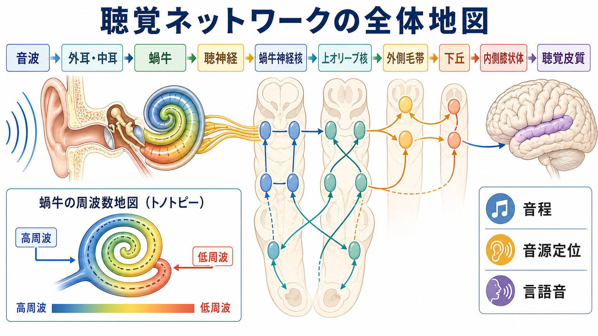
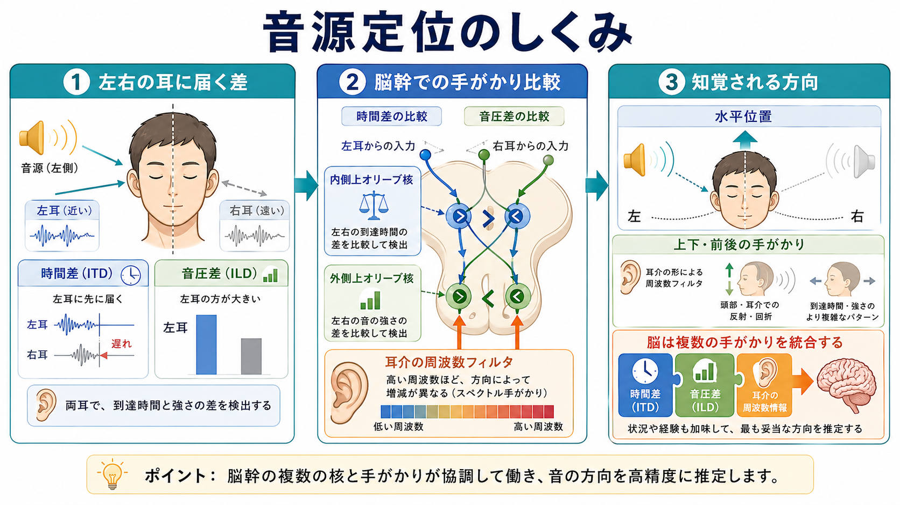
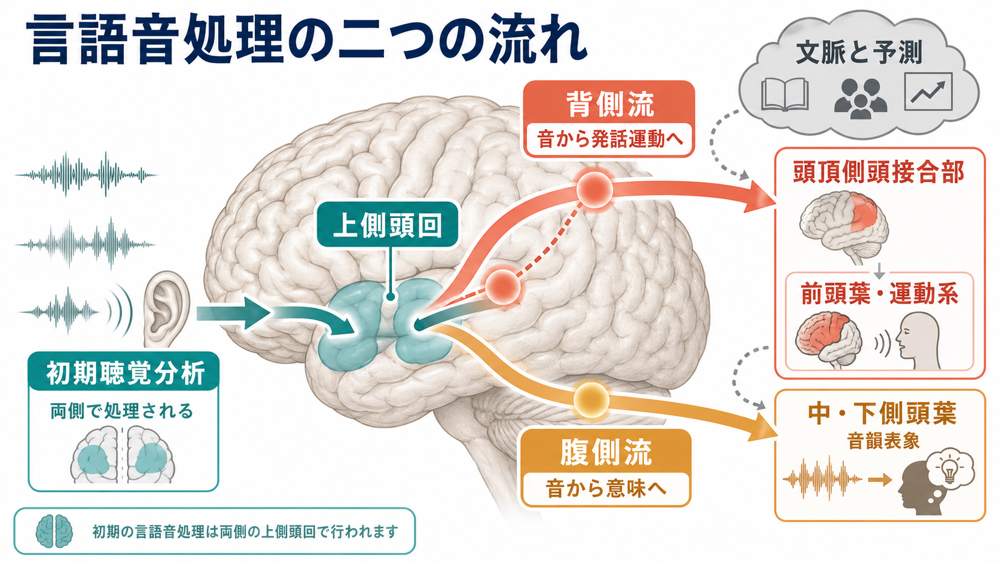

# 聴覚ネットワークは音情報をどう処理するのか

## 要点

- 聴覚は、空気の振動を蝸牛で神経信号へ変換し、脳幹、下丘、内側膝状体、聴覚皮質へ送る多段階の[[フィードフォワード回路はどのように情報を処理するのか|フィードフォワード回路]]で始まる。
- 音程は、蝸牛基底膜の場所ごとの周波数選択性、すなわちトノトピーと、低周波での神経発火タイミングの情報を組み合わせて表現される[1][2]。
- 音源定位は片耳だけで決まるのではなく、左右の到達時間差、音圧差、耳介による周波数フィルタを、上オリーブ核を含む脳幹回路と皮質ネットワークが統合して推定する[3]。
- 言語音処理は「音を聞く」だけではなく、上側頭回・上側頭溝を中心とする初期分析、音から意味へ向かう腹側流、音から発話運動へ向かう背側流を含む[7][8]。
- 聴覚ネットワークは一方向の中継路ではない。皮質から下丘・視床・脳幹へのトップダウン信号が、注意、文脈、予測、聞き取りにくい環境での選択を調節する[4][6]。

## この記事で答える問い

1. 蝸牛から聴覚皮質まで、音情報はどの順序で処理されるのか。
2. 音程、音の大きさ、音源定位は、どの神経回路で分解・統合されるのか。
3. 言語音処理は、単なる聴覚処理とどこで重なり、どこから認知・運動系へ広がるのか。
4. 難聴、耳鳴り、聴覚過敏、失語、幻聴研究を読むとき、どの水準を区別すべきか。

## まず結論

聴覚ネットワークは、音を「波形のまま」脳へ送っているのではない。蝸牛は音を周波数成分へ分解し、聴神経は周波数、強度、タイミングを発火パターンとして運ぶ。脳幹では左右の耳から来た情報が早い段階で比較され、音源定位の手がかりが抽出される。下丘は多くの脳幹入力を集め、内側膝状体を経て聴覚皮質へ伝える。聴覚皮質では、音の周波数地図を保ちながら、音韻、声、環境音、音空間、発話運動との対応が階層的に処理される[4][5][7][8]。

## 背景

視覚は網膜上の二次元像から始まるが、聴覚は時間的に変化する圧力波から始まる。音は一瞬で消えるため、聴覚系はミリ秒単位のタイミングを扱いながら、周波数、強度、時間変化、左右差を同時に符号化する必要がある。

この性質のため、聴覚ネットワークは[[視床は単なる中継核なのか|視床]]や皮質だけでは完結しない。蝸牛神経核、上オリーブ核、外側毛帯、下丘といった脳幹・中脳の核が、皮質に届く前からかなり高度な処理を行う。したがって、聴覚を理解するには「末梢で周波数分解し、脳幹で両耳差を計算し、皮質で意味や行動へ接続する」という多層構造として見るのがよい。

## 基本概念

### トノトピー

トノトピーとは、周波数が神経組織上の場所として整然と表現される性質である。蝸牛では基底部が高周波、頂部が低周波に反応しやすく、この地図は聴神経、下丘、内側膝状体、一次聴覚皮質まで保たれる[1][2][5]。

ただし、音程の知覚は「反応した場所」だけで決まるわけではない。低周波では神経発火が音波の周期に同期し、時間パターンも周波数情報を支える。高周波では一対一の位相同期が難しくなるため、場所符号が相対的に重要になる[2]。

### 両耳差

左右の耳に届く音には、わずかな到達時間差と音圧差がある。低周波の水平定位では時間差、高周波では頭部による音の遮蔽から生じる音圧差が重要になる。これらは上オリーブ複合体を中心とする脳幹回路で比較される[3]。

### 聴覚皮質の階層

一次聴覚皮質は側頭葉上面のヘシュル回付近に位置し、周波数地図を持つ。周辺のベルト・パラベルト領域では、より複雑な音、声、音韻、音空間、聴覚対象が処理される。これは[[大脳皮質の層構造は情報の流れをどう決めるのか|皮質層]]を通る局所処理だけでなく、側頭葉、頭頂葉、前頭葉を結ぶ[[脳内ネットワークとは何か|脳内ネットワーク]]として理解する必要がある[6][8]。

## 仕組み

### 1. 蝸牛で音を周波数へ分解する

外耳と中耳は音波を集め、鼓膜と耳小骨を介して内耳へ伝える。蝸牛内では基底膜が周波数ごとに異なる場所で最大振動し、コルチ器の有毛細胞が機械的変位を電気信号へ変換する。これにより、音の物理的振動は聴神経が運べる活動電位パターンへ変換される[1]。

この段階で重要なのは、末梢処理が受動的な録音ではないことである。蝸牛は音を周波数成分に分け、強度や時間変化に応じて聴神経線維の発火率とタイミングを変える。ここで作られた表現が、後続の[[神経回路とは何か|神経回路]]の入力形式を決める。

### 2. 脳幹で左右の情報を比較する

聴神経は蝸牛神経核へ入り、複数の並列経路へ分かれる。上オリーブ核では、左右の蝸牛神経核からの入力が比較される。内側上オリーブ核は主に時間差、外側上オリーブ核は主に音圧差に関わると整理される[3]。

この比較は、地図上の一点を機械的に読み出す処理ではない。実際の環境では反響、頭部運動、複数音源、背景雑音があるため、脳は複数の手がかりを統合し、最も妥当な音源位置を推定する。ここには[[フィードバック回路は脳内情報処理をどう調節するのか|フィードバック回路]]や注意の影響も入る。

### 3. 下丘と内側膝状体で統合し、皮質へ送る

下丘は聴覚脳幹からの多くの入力が集まる中脳の重要な中継・統合部位である。音の位置、周波数、強度、リズム、驚愕反応や定位反応に関わり、内側膝状体へ強い出力を送る[4]。内側膝状体は、皮質へ向かう上行性聴覚情報にとって実質的に必須の視床中継である[5]。

この段階を単なるリレーと見なすと、聴覚処理を狭く理解してしまう。下丘や内側膝状体は、皮質からの下行性入力も受け、注意や課題要求によって感度や選択性を変えうる。聴覚は、下から上へ流れる感覚入力と、上から下へ働く予測・注意が合流する系である。

### 4. 聴覚皮質で音を対象・空間・言語へ変換する

一次聴覚皮質は音の基本特徴を保ちながら、周辺領域と連携して複雑な音を扱う。聴覚皮質には、音の同一性や意味を処理する「what」系と、音の位置や行動への接続を処理する「where/how」系を区別する考え方がある[8]。

言語音では、上側頭回・上側頭溝が音響信号を音韻表象へ変換する。腹側流は音声を語彙・意味処理へ結び、背側流は音声を発話運動や音韻作業記憶へ結びつける。初期の言語音処理は両側性を持つ一方、発話運動との対応づけは左半球優位になりやすい[7]。

## 図解

| 図 | 何を示すか | 読み方 |
|---|---|---|
| 聴覚ネットワーク全体の経路 | 音波から蝸牛、脳幹、下丘、内側膝状体、聴覚皮質までの上行経路 | 聴覚は皮質に届く前から周波数分解と両耳差処理を受ける |
| 音源定位の神経回路 | ITD、ILD、耳介フィルタを統合する定位処理 | 「左右差」だけでなく、周波数特性と文脈も使う |
| 言語音処理の二つの流れ | 腹側流と背側流による音声理解・発話運動接続 | 言語音処理は聴覚、意味、運動の境界領域である |

## 臨床・研究との接続

難聴を考えるときは、外耳・中耳、蝸牛、有毛細胞、聴神経、中枢聴覚路のどこに問題があるかを分ける必要がある。末梢で入力が弱くなる場合と、中枢で時間処理・両耳統合・言語音弁別が障害される場合では、同じ「聞こえにくい」でも機序が異なる。

耳鳴りや聴覚過敏では、末梢入力の変化に加え、中枢聴覚路の可塑性、抑制性制御、注意・情動ネットワークとの相互作用が問題になることがある。これは[[E_Iバランスとは何か|E/Iバランス]]や[[神経同期とは何か|神経同期]]の観点からも読める。

失語や純粋語聾の研究では、音は聞こえているのに言語音として理解しにくい状態が問題になる。ここでは、一次聴覚処理、音韻表象、語彙意味処理、発話運動との対応づけを分けて考えることが重要である[7]。

研究方法としては、聴覚脳幹反応、脳波・MEG、fMRI、皮質電気刺激、損傷研究、計算モデルが相補的に使われる。ただし、fMRIで見える皮質活動だけを聴覚処理の全体像と見なすと、ミリ秒精度の脳幹処理や聴神経のタイミング符号を見落としやすい。

## よくある誤解

### 誤解1: 聴覚は耳から皮質へ一直線に届くだけである

実際には、蝸牛神経核、上オリーブ核、外側毛帯、下丘、内側膝状体を通る多段階の並列経路であり、各段階で特徴抽出と統合が進む。

### 誤解2: 音程は蝸牛の場所だけで決まる

場所符号は重要だが、低周波では発火タイミングも周波数情報を支える。音程知覚は末梢の周波数地図と中枢の時間処理の組み合わせで成り立つ[2]。

### 誤解3: 音源定位は左右の音量差だけで決まる

音圧差は高周波で重要だが、低周波では時間差が重要であり、上下・前後方向には耳介による周波数フィルタも関わる[3]。

### 誤解4: 言語音は左側頭葉だけで処理される

初期の音声分析は両側性を持つ。左半球優位が目立つのは、音韻、発話運動、系列処理、言語課題の要求が強くなる場面である[7]。

## 関連ノート

- [[神経回路とは何か]]
- [[脳内ネットワークとは何か]]
- [[フィードフォワード回路はどのように情報を処理するのか]]
- [[フィードバック回路は脳内情報処理をどう調節するのか]]
- [[視床は単なる中継核なのか]]
- [[大脳皮質の層構造は情報の流れをどう決めるのか]]
- [[E_Iバランスとは何か]]
- [[神経同期とは何か]]

MOC更新候補: `content/00_MOC/MOC｜基礎神経科学.md`、`content/00_MOC/MOC｜脳・神経科学.md`

## 理解チェック

1. 蝸牛のトノトピーでは、高周波と低周波はそれぞれどの部位で表現されやすいか。
2. ITDとILDは、どのような音源定位の手がかりか。
3. 下丘と内側膝状体を「単なる中継」と見なすと、何を見落とすか。
4. 言語音処理における腹側流と背側流は、それぞれ何を結びつけるか。
5. 皮質活動だけで聴覚処理を説明すると、どの時間スケールの処理を見落としやすいか。

## 参考文献

[1] Casale, J., Kandle, P. F., Murray, I. V., & Murr, N. I. (2023). *Physiology, Cochlear Function*. StatPearls / NCBI Bookshelf. https://www.ncbi.nlm.nih.gov/sites/books/NBK531483/

[2] Purves, D., Augustine, G. J., Fitzpatrick, D., et al. (2001). *Tuning and Timing in the Auditory Nerve*. Neuroscience, 2nd edition. NCBI Bookshelf. https://www.ncbi.nlm.nih.gov/books/NBK11105/

[3] Purves, D., Augustine, G. J., Fitzpatrick, D., et al. (2001). *Integrating Information from the Two Ears*. Neuroscience, 2nd edition. NCBI Bookshelf. https://www.ncbi.nlm.nih.gov/books/NBK10820/

[4] Driscoll, M. E., & Tadi, P. (2023). *Neuroanatomy, Inferior Colliculus*. StatPearls / NCBI Bookshelf. https://www.ncbi.nlm.nih.gov/books/NBK554468/

[5] Purves, D., Augustine, G. J., Fitzpatrick, D., et al. (2001). *The Auditory Thalamus*. Neuroscience, 2nd edition. NCBI Bookshelf. https://www.ncbi.nlm.nih.gov/books/NBK10906/

[6] Mangold, S. A., & Das, J. M. (2023). *Neuroanatomy, Cortical Primary Auditory Area*. StatPearls / NCBI Bookshelf. https://www.ncbi.nlm.nih.gov/books/NBK554521/

[7] Hickok, G., & Poeppel, D. (2007). The cortical organization of speech processing. *Nature Reviews Neuroscience, 8*, 393-402. https://doi.org/10.1038/nrn2113

[8] Rauschecker, J. P., & Scott, S. K. (2009). Maps and streams in the auditory cortex: nonhuman primates illuminate human speech processing. *Nature Neuroscience, 12*, 718-724. https://doi.org/10.1038/nn.2331

## 未解決問題

- 音韻、音楽、環境音、声識別を支える皮質地図が、個人差や学習でどの程度変化するのか。
- 雑音下での聞き取りにおいて、トップダウン予測がどの段階の聴覚路をどれだけ調節するのか。
- 耳鳴りや聴覚過敏で観察される中枢可塑性が、症状の原因なのか、補償反応なのか。
- 言語音の腹側流・背側流モデルを、発達、第二言語学習、失語リハビリテーションへどう接続できるか。
