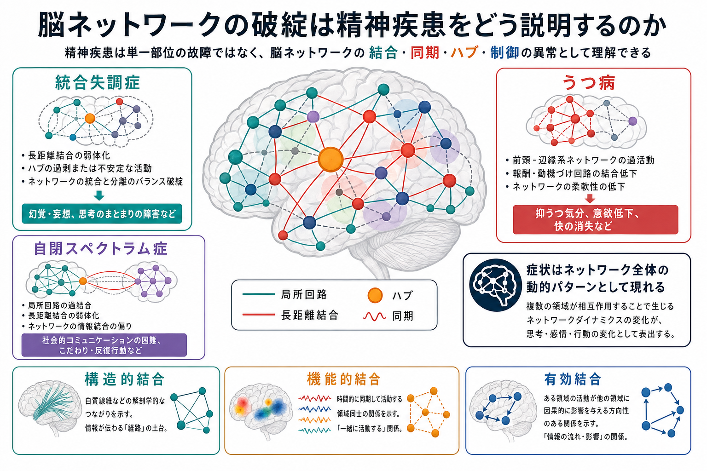
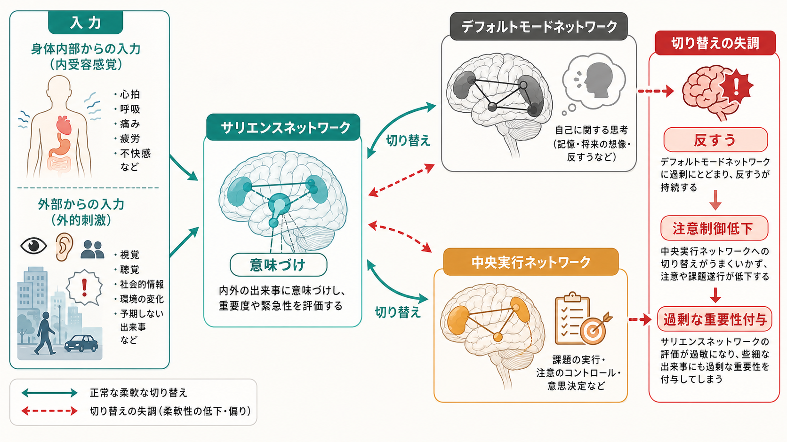
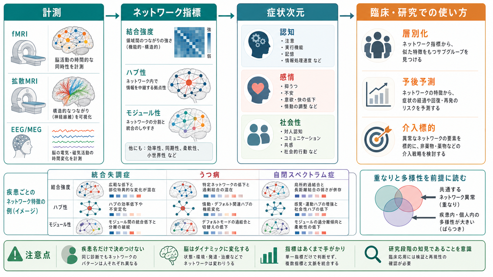

# 脳ネットワークの破綻は精神疾患をどう説明するのか

## 要点

- 精神疾患を「特定の脳部位が壊れた状態」とだけ見ると、症状の多様性や併存、発達・環境との相互作用を説明しにくい。
- [[脳内ネットワークとは何か|脳ネットワーク]]の視点では、症状を「領域間の結合、同期、切り替え、ハブの負荷、モジュール間の協調が変化した状態」として読む。
- 統合失調症では広範な dysconnectivity、うつ病ではデフォルトモード・前頭頭頂制御・サリエンス関連ネットワークの不均衡、自閉スペクトラム症では発達に伴う過結合・低結合の混在が重要な論点になる。
- ただしネットワーク異常は診断名と一対一対応しない。個人差、発達段階、薬物、睡眠、頭部運動、解析手法の影響を含めて慎重に解釈する必要がある。

## この記事で答える問い

この記事では、次の問いに答える。

1. なぜ精神疾患を「脳ネットワークの破綻」として考えるのか。
2. 構造的結合、機能的結合、有効結合は、精神疾患理解でどう使い分けるのか。
3. 統合失調症・うつ病・自閉スペクトラム症では、どのようなネットワーク異常が議論されているのか。
4. ネットワーク研究を臨床に接続するとき、何を言い過ぎてはいけないのか。

## まず結論

脳ネットワークの破綻とは、脳のどこか一箇所が単独で故障することではない。むしろ、複数の領域がどのタイミングで結びつき、どの情報を強め、どの情報を抑え、どの課題状態へ切り替えるかという「相互作用の秩序」が崩れることである。コネクトーム研究は、精神疾患を分散した神経システムの相互作用異常として扱う枠組みを与えた[1]。

この見方は、診断名を脳画像で直接置き換えるものではない。むしろ、症状を「注意」「自己関連思考」「感情制御」「社会認知」「知覚の意味づけ」などの次元に分け、それぞれを支える回路・ネットワークの変化として調べるための研究言語である。NIMH の RDoC も、遺伝子や分子だけでなく、回路、行動、自己報告をまたいで精神機能を記述する枠組みを採用している[7]。

## 背景

古典的な局在論は、失語や運動麻痺のように、比較的限局した損傷と症状が対応する場合に強い説明力を持つ。しかし、精神疾患の症状はしばしば、知覚、感情、意欲、自己感、社会性、実行機能が絡み合って現れる。たとえば、幻聴は聴覚野だけ、抑うつ気分は扁桃体だけ、社会的困難は顔領域だけで説明できるわけではない。

そこで重要になるのが、[[コネクトームとは何か|コネクトーム]]、すなわち脳内の領域どうしがどのように結びつくかを全体として捉える発想である。Fornito らは、脳疾患をネットワークのトポロジー、ハブ、モジュール、結合パターンの変化として考えることで、単一病変モデルでは扱いにくい分散性・多様性・補償過程を説明しやすくなると整理している[1]。

## 基本概念

### 結合には少なくとも三つの意味がある

精神疾患のネットワーク研究で「結合」というとき、少なくとも三つの層を区別する必要がある。

| 概念 | 何を見るか | 代表的な測定 | 精神疾患研究での意味 |
|---|---|---|---|
| [[構造的結合と機能的結合は何が違うのか|構造的結合]] | 白質線維などの物理的連絡 | 拡散 MRI、解剖学的トラクトグラフィ | 情報が通りうる経路の制約 |
| [[構造的結合と機能的結合は何が違うのか|機能的結合]] | 活動時系列の相関・同期 | 安静時 fMRI、EEG、MEG | 同じ状態で一緒に変動する領域群 |
| [[有効結合とは何か|有効結合]] | ある領域が別の領域へ及ぼす方向性のある影響 | DCM、Granger 因果、摂動研究 | 症状を生む因果的経路の仮説 |

この区別は重要である。機能的結合が高いからといって、直接の解剖学的線維が強いとは限らない。また、有効結合の変化を示すには、単なる相関ではなく、モデル化や摂動、課題操作が必要になる。

### ネットワーク指標は「症状への翻訳語」になる

[[ハブ領域とは何か|ハブ]]、[[リッチクラブ構造とは何か|リッチクラブ構造]]、[[モジュール性とは何か|モジュール性]]、[[ネットワーク効率とは何か|ネットワーク効率]]は、脳ネットワークの性質を要約する指標である。精神疾患の文脈では、これらは次のように読める。

- ハブの異常: 多数の領域を束ねる中継点が過負荷または低機能になり、広範な症状が同時に出やすくなる。
- モジュール性の異常: 感覚、自己関連思考、認知制御、情動処理の境界が硬すぎる、または混ざりすぎる。
- 効率の異常: 情報が遠回りし、柔軟な認知制御や文脈更新が遅れる。
- [[神経同期とは何か|同期]]の異常: 必要なタイミングで領域が足並みをそろえられず、知覚や行動選択の安定性が下がる。

## 仕組み

### 三重ネットワークモデル

Menon の三重ネットワークモデルは、精神病理を説明する代表的な大規模ネットワーク仮説である。このモデルでは、[[サリエンスネットワークとは何か|サリエンスネットワーク]]、[[デフォルトモードネットワークとは何か|デフォルトモードネットワーク]]、[[中央実行ネットワークとは何か|中央実行ネットワーク]]の三者が中心になる[2]。

サリエンスネットワークは、身体内部や外界の出来事のうち「今、意味があるもの」を検出し、内的思考を支えるデフォルトモードネットワークと、課題遂行を支える中央実行ネットワークの切り替えを助ける。ここがうまく働かないと、内的思考から抜け出せない、外界刺激に過剰な意味を与える、必要な課題制御へ移れない、といった症状次元が生じやすくなる[2]。

### 統合失調症: dysconnectivity と自己・知覚・意味づけ

統合失調症では、Friston が「disconnection hypothesis」として、前頭葉・側頭葉などの相互作用異常が症状を説明しうると提案した[3]。この仮説の核心は、脳領域が完全に切断されるという意味ではなく、機能的統合の仕方が不安定または不適切になるという点にある。

近年の安静時機能的結合メタ解析でも、統合失調症ではデフォルトモードネットワーク、自己関連ネットワーク、聴覚ネットワーク、体性感覚運動ネットワークなど複数ネットワークに低結合がみられると報告されている[4]。これは、幻聴、自己感の揺らぎ、思考のまとまりにくさ、認知制御の低下を、それぞれ独立した部位の異常ではなく、分散したネットワーク間の協調不全として読む根拠になる。

ただし、統合失調症の dysconnectivity は「全員に同じ結合低下がある」という意味ではない。病期、薬物、症状優位性、発達歴、解析方法によって結果は変わる。したがって、個人診断に直接使うよりも、症状次元やサブタイプを探る研究仮説として扱うのが妥当である。

### うつ病: 内向きの思考と制御ネットワークの不均衡

うつ病では、反すう、自己批判、注意の狭まり、感情制御の困難が中心になることが多い。大規模な安静時機能的結合メタ解析では、うつ病において前頭頭頂制御ネットワーク内の低結合、デフォルトモードネットワーク内の高結合、制御ネットワークと内的思考ネットワークの不均衡が報告されている[5]。

この結果は、うつ病を「気分だけの問題」と見るのではなく、内的・自己関連思考から外界志向の注意や課題制御へ移る柔軟性が低下した状態として理解する手がかりになる。[[前頭頭頂ネットワークは認知制御をどう支えるのか|前頭頭頂ネットワーク]]の低結合は、感情を文脈化し、行動計画を更新し、注意を切り替える力の低下と関係しうる。

### 自閉スペクトラム症: 発達するネットワークの多様な軌道

自閉スペクトラム症では、古くから「長距離低結合」と「局所過結合」という仮説が議論されてきた。しかし現在では、単純な一方向の結論ではなく、年齢、課題、感覚・社会認知領域、測定法によって過結合と低結合が混在するという見方が強い。EEG/MEG のシステマティックレビューも、ASD で非定型な機能的・有効結合が報告される一方、局所過結合・長距離低結合という単純図式には方法論的ばらつきがあると整理している[6]。

この視点では、ASD の社会性、感覚過敏、反復行動、予測の柔軟性を、発達中のネットワークがどのように専門化し、どの領域どうしが過度に同期または分離するかという問題として扱う。重要なのは、ASD を「結合が強すぎる疾患」または「弱すぎる疾患」と一括しないことである。

## 図解

三つの疾患例を比べると、ネットワーク視点の利点は「同じ診断名の中の多様性」と「診断名をまたぐ共通性」を同時に扱える点にある。

| 疾患・状態 | よく議論されるネットワーク | 症状とのつながりの読み方 | 注意点 |
|---|---|---|---|
| 統合失調症 | デフォルトモード、聴覚、自己関連、前頭側頭ネットワーク | 知覚・自己感・思考統合の協調不全 | 病期と薬物の影響が大きい |
| うつ病 | デフォルトモード、前頭頭頂制御、サリエンス | 反すう、内向き注意、感情制御困難 | うつ病内の異質性が大きい |
| 自閉スペクトラム症 | 感覚、社会認知、デフォルトモード、サリエンス | 感覚処理、社会性、予測・切り替えの発達軌道 | 年齢と課題で結論が変わりやすい |

## 臨床・研究との接続

ネットワーク研究は、臨床を三つの方向で支える可能性がある。

第一に、診断名より細かい症状次元を扱える。たとえば「反すう」「注意制御」「社会認知」「知覚の過剰な意味づけ」は、複数の診断にまたがって現れる。RDoC の回路単位も、こうした診断横断的な研究を後押ししている[7]。

第二に、層別化の手がかりになる。精神疾患は同じ診断名でも神経生物学的に均質ではない。結合パターン、ネットワーク効率、ハブ性、動的結合の指標を組み合わせることで、治療反応性や経過の異なる下位群を探索できる可能性がある[8]。

第三に、介入標的を考えやすくなる。心理療法、薬物療法、ニューロモジュレーション、認知訓練は、それぞれ別の経路からネットワーク状態を変えるかもしれない。ただし、現時点では「この結合を見れば個人の診断や治療方針が決まる」とは言えない。教育・研究目的の理解に留め、個別の診断や治療判断は専門家の評価に基づく必要がある。

## よくある誤解

### 誤解1: ネットワーク異常があれば診断できる

現時点で、脳ネットワーク指標だけで統合失調症、うつ病、ASD を確定診断することはできない。群平均では差があっても、個人レベルでは重なりが大きい。

### 誤解2: 結合が高いほど良い

結合が高いことは常に良いわけではない。必要なときに結合し、不要なときに分離できる柔軟性が重要である。過剰な同期は反すうや過覚醒、低すぎる同期は統合不全や制御困難につながりうる。

### 誤解3: 精神疾患は脳だけで説明できる

ネットワーク異常は重要だが、発達、学習、ストレス、社会環境、身体状態、睡眠、薬物、文化的文脈と切り離せない。脳ネットワークは原因のすべてではなく、複数要因が症状として現れる一つの実装レベルである。

## 関連ノート

- [[脳内ネットワークとは何か]]
- [[コネクトームとは何か]]
- [[構造的結合と機能的結合は何が違うのか]]
- [[有効結合とは何か]]
- [[サリエンスネットワークとは何か]]
- [[デフォルトモードネットワークとは何か]]
- [[中央実行ネットワークとは何か]]
- [[前頭頭頂ネットワークは認知制御をどう支えるのか]]
- [[ハブ領域とは何か]]
- [[神経同期とは何か]]

## MOC更新候補

- `content/00_MOC/` 配下の脳・神経科学系 MOC に、本記事を「神経回路・脳ネットワーク」と「精神疾患のネットワーク理解」をつなぐ記事として追加する候補。
- 並列ジョブとの競合を避けるため、本記事では MOC ファイル自体は更新しない。

## 理解チェック

1. 精神疾患を単一部位の異常ではなくネットワーク異常として見る利点は何か。
2. 構造的結合、機能的結合、有効結合はそれぞれ何を意味するか。
3. サリエンスネットワークの切り替え機能が失調すると、どのような症状次元と関係しうるか。
4. 統合失調症、うつ病、ASD のネットワーク異常を診断名と一対一対応させてはいけない理由は何か。

## 未解決問題

- ネットワーク異常は原因なのか、結果なのか、補償過程なのか。
- 群平均で見える異常を、個人の予後予測や治療選択にどこまで使えるのか。
- 発達段階ごとのネットワーク変化を、診断横断的な症状次元とどう結びつけるか。
- 安静時 fMRI、課題 fMRI、EEG/MEG、拡散 MRI、行動データをどう統合するか。

## 参考文献

[1] Fornito, A., Zalesky, A., & Breakspear, M. (2015). The connectomics of brain disorders. *Nature Reviews Neuroscience*, 16, 159-172. https://doi.org/10.1038/nrn3901

[2] Menon, V. (2011). Large-scale brain networks and psychopathology: A unifying triple network model. *Trends in Cognitive Sciences*, 15(10), 483-506. https://doi.org/10.1016/j.tics.2011.08.003

[3] Friston, K. J. (1998). The disconnection hypothesis. *Schizophrenia Research*, 30(2), 115-125. https://doi.org/10.1016/S0920-9964(97)00140-0

[4] Li, S., Hu, N., Zhang, W., Tao, B., Dai, J., Gong, Y., Tan, Y., Cai, D., & Lui, S. (2019). Dysconnectivity of multiple brain networks in schizophrenia: A meta-analysis of resting-state functional connectivity. *Frontiers in Psychiatry*, 10, 482. https://doi.org/10.3389/fpsyt.2019.00482

[5] Kaiser, R. H., Andrews-Hanna, J. R., Wager, T. D., & Pizzagalli, D. A. (2015). Large-scale network dysfunction in major depressive disorder: A meta-analysis of resting-state functional connectivity. *JAMA Psychiatry*, 72(6), 603-611. https://doi.org/10.1001/jamapsychiatry.2015.0071

[6] O'Reilly, C., Lewis, J. D., & Elsabbagh, M. (2017). Is functional brain connectivity atypical in autism? A systematic review of EEG and MEG studies. *PLOS ONE*, 12(5), e0175870. https://doi.org/10.1371/journal.pone.0175870

[7] National Institute of Mental Health. (n.d.). RDoC Unit of Analysis: Circuits. https://www.nimh.nih.gov/research/research-funded-by-nimh/rdoc/units/circuits

[8] Fornito, A., Bullmore, E. T., & Zalesky, A. (2017). Opportunities and challenges for psychiatry in the connectomic era. *Biological Psychiatry: Cognitive Neuroscience and Neuroimaging*, 2(1), 9-19. https://doi.org/10.1016/j.bpsc.2016.08.003
