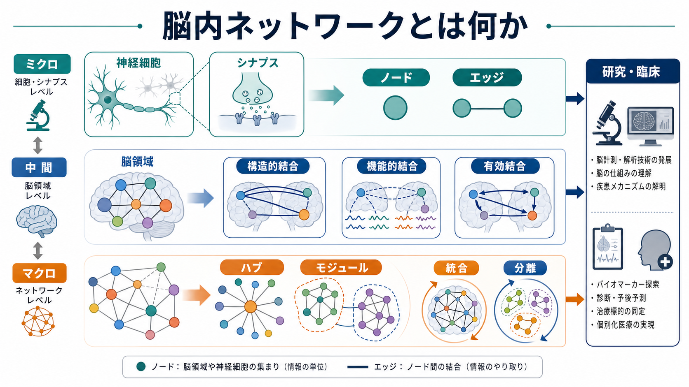
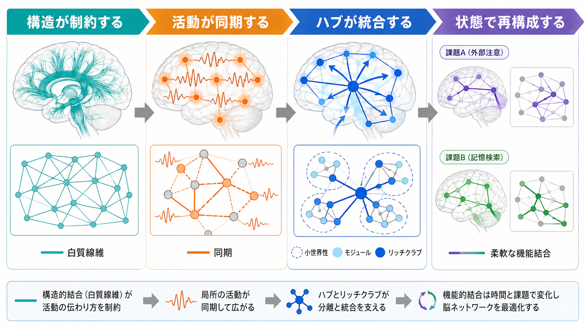
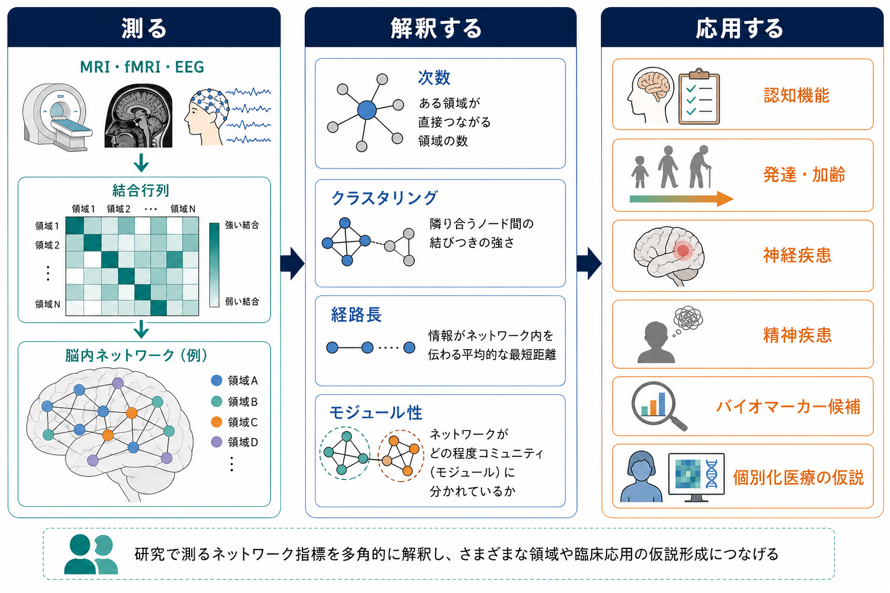

# 脳内ネットワークとは何か

## 要点

- 脳内ネットワークとは、[[ニューロンとは何か|神経細胞]]、[[シナプスとは何か|シナプス]]、神経集団、脳領域などを「ノード」、それらの関係を「エッジ」として捉える見方である。[1][2]
- 結合には、白質線維やシナプス接続を指す構造的結合、活動の統計的な連動を指す機能的結合、方向性や因果的影響を推定する有効結合がある。[1][3]
- 脳は単なる配線図ではなく、構造に制約されながら、課題、休息、発達、学習、疾患状態に応じて機能的な結合パターンを変える動的システムである。[4][6]
- グラフ理論では、ハブ、モジュール、小世界性、経路長、クラスタリング、リッチクラブなどの指標を使って、脳の「分離」と「統合」を定量化する。[1][7]
- 臨床・精神医学では、ネットワーク異常をバイオマーカー候補として研究する流れがあるが、個別診断や治療指示として直ちに使える段階とは限らない。[1][8]

## この記事で答える問い

1. 脳内ネットワークとは、何を「点」と「線」として見ているのか。
2. 構造的結合、機能的結合、有効結合はどう違うのか。
3. ハブ、モジュール、小世界性、リッチクラブは何を意味するのか。
4. 脳内ネットワーク研究は、認知機能や臨床研究にどう接続するのか。

## まず結論

脳内ネットワークとは、脳を「部品の集合」ではなく「相互作用する要素のシステム」として理解するための枠組みである。神経細胞、局所回路、皮質領域、皮質下構造などをノードとし、それらの解剖学的接続、活動の同期、情報の影響関係をエッジとして表す。[1][2]

この見方の利点は、局所の機能だけでなく、脳全体の協調を扱える点にある。たとえば視覚、注意、記憶、意思決定、情動は、単一の「場所」だけで完結しない。複数の領域が、状況に応じて結合の強さや役割を変えながら働く。[2][5]

ただし、ネットワーク表現は脳そのものではない。ノードの切り方、計測法、統計処理、閾値設定によってネットワークは変わる。したがって、脳内ネットワークは「脳を理解するための強力なモデル」だが、「脳の完全なコピー」ではない。[1][3]

## 背景

古典的な神経科学では、特定の機能を特定の脳領域に対応させる局在論が重要な役割を果たしてきた。一方で、認知や行動は複数領域の協調から生じるため、局在だけでは説明しにくい現象が多い。ネットワーク神経科学は、この問題に対して、領域間の接続様式と活動パターンを定量化する。[2]

「コネクトーム」という言葉は、神経系の構造的接続を体系的に記述する構想として広まった。Spornsらは、ヒト脳の接続行列を神経科学と神経心理学の基盤資源として位置づけた。[3] その後、拡散MRI、fMRI、EEG、MEG、多電極記録、計算モデルの発展により、脳を複雑ネットワークとして扱う研究が急速に拡大した。[1][2]

## 基本概念

### ノード

ノードとは、ネットワークを構成する要素である。スケールによって、1個のニューロン、細胞集団、皮質カラム、脳領域、機能ネットワーク全体などがノードになりうる。[2]

ここで注意すべきなのは、ノードは研究者が解析のために定義する単位だという点である。脳領域を細かく分ければノード数は増え、粗く分ければ少なくなる。ノードの切り方が変われば、ハブやモジュールの推定も変わりうる。

### エッジ

エッジとは、ノード間の関係である。シナプス接続、白質線維、活動相関、情報流、モデル上の因果的影響などがエッジとして扱われる。[1][6]

エッジには、あり・なしだけで表す二値エッジと、強さを持つ重み付きエッジがある。さらに、AからBへの方向を持つ有向エッジと、方向を区別しない無向エッジがある。脳内ネットワーク研究では、何をエッジとみなすかが結果の解釈を大きく左右する。

### 構造的結合

構造的結合は、解剖学的な接続を指す。マクロスケールでは白質線維束、ミクロスケールでは軸索、樹状突起、シナプス接続が対応する。ヒト研究では、拡散MRIに基づいて脳領域間の白質経路を推定することが多い。[1][3]

構造的結合は、活動がどこへ伝わりやすいかを制約する。しかし、構造が同じなら機能も常に同じ、という意味ではない。同じ構造ネットワークでも、注意、睡眠、課題、学習、薬理状態によって、実際の機能的結合は変わる。[6]

### 機能的結合

機能的結合は、2つのノードの活動が統計的にどれくらい連動するかを表す。代表例は、fMRIのBOLD信号、EEG、MEGなどで測った時系列間の相関である。安静時fMRI研究では、特定の課題をしていない状態でも、運動野などの領域間に低周波の同期が見られることが示された。[4]

機能的結合は「直接つながっている」ことを必ずしも意味しない。第三の領域を介した共変動、共通入力、ノイズ、血管性要因、前処理の影響も含まれうる。そのため、機能的結合は便利だが、解釈には慎重さが必要である。

### 有効結合

有効結合は、あるノードの活動が別のノードへ方向性をもって影響する、という関係を推定する概念である。構造的結合が「配線」、機能的結合が「一緒に変動していること」だとすれば、有効結合は「どちらがどちらへ影響しているか」に近い。

ただし、有効結合は直接観察されるものではなく、モデルに依存して推定される。したがって、手法の仮定、時間分解能、観測ノイズ、隠れた変数を含めて読む必要がある。

## 仕組み

### 分離と統合

脳内ネットワークの基本課題は、分離と統合の両立である。分離とは、視覚、聴覚、運動、記憶、情動などの専門化した処理が局所的・モジュール的に行われることを指す。統合とは、それらの情報が必要に応じて結びつき、全体として一貫した行動や認知を支えることを指す。[1][2]

モジュール性が高いネットワークは局所処理に向き、長距離結合やハブを持つネットワークは離れた領域の統合に向く。脳は、配線コストを抑えつつ、情報伝達の効率を保つようなネットワーク構造を持つと考えられている。[1]

### 小世界性

小世界性とは、局所的にはまとまりが強く、全体としては少ないステップで遠くのノードに到達できる性質である。脳内ネットワークでは、高いクラスタリングと短い経路長の組み合わせとして議論される。[1]

この性質は、脳が局所処理と全体統合を両立するうえで有利だと考えられる。ただし、小世界性は解析条件に敏感であり、それだけで脳機能を説明できるわけではない。

### ハブとリッチクラブ

ハブとは、多くの接続を持つ、または多くの経路が通過する中心的ノードである。脳では、ハブ領域が複数のモジュールをつなぎ、全体の情報統合を支えると考えられている。[1][7]

リッチクラブとは、ハブ同士が互いに密に結合している中核構造である。van den HeuvelとSpornsは、ヒトの構造的コネクトームに高中心性領域からなるリッチクラブ組織を示し、全脳的な統合やネットワーク脆弱性との関係を議論した。[7]

### 構造から機能へ

白質線維やシナプス結合は、神経活動が伝わる可能な経路を作る。しかし、実際の機能的結合は、単に最短経路で信号が流れるだけではない。拡散、ブロードキャスト、ランダムウォーク、同期、振動、局所回路のゲイン調整など、複数の通信様式が考えられる。[6]

そのため、構造的結合と機能的結合の関係は「一対一対応」ではなく、「構造が可能性の空間を制約し、その中で機能状態が切り替わる」と理解する方がよい。

## 図解

図1は、脳内ネットワークをノード、エッジ、結合タイプ、ハブ、モジュール、研究・臨床応用の関係としてまとめた概念地図である。

図2は、構造的結合が活動の伝播を制約し、機能的結合が課題や状態に応じて変化し、ハブとモジュールが分離と統合のバランスを作る、という仕組みを示している。

図3は、ネットワーク計測から認知・発達・疾患研究への接続を示す。MRI、fMRI、EEGなどから結合行列を作り、次数、クラスタリング、経路長、モジュール性などを計算し、それを認知機能や臨床仮説と対応づける。

## 臨床・研究との接続

### 認知機能

認知機能は、単一領域ではなく複数ネットワークの相互作用から生じる。安静時機能結合の研究では、視覚、体性感覚運動、注意、制御、デフォルトモードなどの大規模ネットワークが繰り返し同定されてきた。[5]

たとえば、課題中には前頭頭頂系の制御ネットワークが働き、内的思考や自己関連処理ではデフォルトモードネットワークが関与し、重要な刺激や身体内外の変化にはサリエンスネットワークが関わる、という整理がある。[5][8]

### 発達・学習・可塑性

脳内ネットワークは発達と経験によって変化する。[[シナプス可塑性とは何か|シナプス可塑性]]、[[Hebb則とは何か|Hebb型学習]]、髄鞘化、シナプス刈り込み、学習経験は、局所回路から大規模ネットワークまで影響しうる。

ただし、fMRIや拡散MRIで見えるマクロなネットワーク変化を、シナプス単位の変化へ直ちに還元することはできない。ミクロな[[活動電位はどのように発生するのか|活動電位]]や[[化学シナプスと電気シナプスは何が違うのか|シナプス伝達]]と、マクロな脳領域間ネットワークは、異なるスケールの説明である。

### 神経疾患・精神疾患

脳内ネットワーク研究は、認知症、てんかん、脳卒中、統合失調症、うつ病、不安症、自閉スペクトラム症などで、結合パターンやネットワーク指標の変化を調べるために使われている。[1][8]

Menonのトリプルネットワークモデルは、デフォルトモードネットワーク、サリエンスネットワーク、中央実行ネットワークの相互作用から精神病理を捉える枠組みを提示した。[8] ただし、これは研究仮説を整理するモデルであり、個人の症状を単純に一つのネットワーク異常へ対応させる診断法ではない。

### バイオマーカー候補

ネットワーク指標は、疾患分類、予後予測、治療反応、個人差の理解に役立つ可能性がある。しかし、測定条件、サンプルサイズ、再現性、施設差、解析パイプライン、年齢や薬剤などの交絡因子を慎重に扱う必要がある。

したがって、臨床的には「ネットワーク指標で診断できる」と断定するより、「ネットワーク指標は病態理解やバイオマーカー探索の候補である」と表現するのが適切である。

## よくある誤解

### 誤解1: 脳内ネットワークは実際の配線そのものである

ネットワーク図は、脳を理解するための抽象化である。ノードの定義、計測法、前処理、統計モデルによって形が変わるため、図をそのまま実体として読んではいけない。[1]

### 誤解2: 機能的結合は直接の神経線維を意味する

機能的結合は活動の統計的連動であり、直接の白質線維やシナプス接続を意味するとは限らない。共通入力や間接経路でも相関は生じる。[4][6]

### 誤解3: ハブは常に良いものである

ハブは統合に有利だが、損傷や病的活動の拡散に対して脆弱な点にもなりうる。リッチクラブのような中核構造は、効率性と脆弱性の両方を持つ可能性がある。[7]

### 誤解4: ネットワーク指標だけで心や症状を説明できる

ネットワーク指標は有用な要約だが、行動、発達歴、環境、課題設計、細胞・分子機構、主観的経験を置き換えるものではない。臨床や心理の説明では、複数レベルの情報を組み合わせる必要がある。[2][8]

## 関連ノート

- [[ニューロンとは何か]]
- [[シナプスとは何か]]
- [[シナプス可塑性とは何か]]
- [[Hebb則とは何か]]
- [[活動電位はどのように発生するのか]]
- [[化学シナプスと電気シナプスは何が違うのか]]
- [[髄鞘はなぜ神経伝導を速くするのか]]

関連ノート候補:

- コネクトームとは何か
- 機能的結合とは何か
- 構造的結合とは何か
- デフォルトモードネットワークとは何か
- サリエンスネットワークとは何か
- グラフ理論で脳をどう読むか

MOC更新候補: `content/00_MOC/MOC｜脳・神経科学.md` の「神経回路・脳ネットワーク」系の項目に、本記事を基礎入口ノートとして追加する。

## 理解チェック

1. 脳内ネットワークにおけるノードとエッジを、自分の言葉で説明できるか。
2. 構造的結合、機能的結合、有効結合の違いを説明できるか。
3. 小世界性、ハブ、モジュール、リッチクラブがそれぞれ何を表すか説明できるか。
4. 機能的結合が直接の解剖学的接続を意味しない理由を説明できるか。
5. ネットワーク指標を臨床バイオマーカーとして使うときの注意点を挙げられるか。

## 参考文献

[1] Bullmore, E., & Sporns, O. (2009). Complex brain networks: Graph theoretical analysis of structural and functional systems. *Nature Reviews Neuroscience*, 10, 186-198. https://doi.org/10.1038/nrn2575

[2] Bassett, D. S., & Sporns, O. (2017). Network neuroscience. *Nature Neuroscience*, 20, 353-364. https://doi.org/10.1038/nn.4502

[3] Sporns, O., Tononi, G., & Kötter, R. (2005). The human connectome: A structural description of the human brain. *PLOS Computational Biology*, 1(4), e42. https://doi.org/10.1371/journal.pcbi.0010042

[4] Biswal, B., Yetkin, F. Z., Haughton, V. M., & Hyde, J. S. (1995). Functional connectivity in the motor cortex of resting human brain using echo-planar MRI. *Magnetic Resonance in Medicine*, 34(4), 537-541. https://doi.org/10.1002/mrm.1910340409

[5] Yeo, B. T. T., Krienen, F. M., Sepulcre, J., et al. (2011). The organization of the human cerebral cortex estimated by intrinsic functional connectivity. *Journal of Neurophysiology*, 106(3), 1125-1165. https://doi.org/10.1152/jn.00338.2011

[6] Avena-Koenigsberger, A., Misic, B., & Sporns, O. (2018). Communication dynamics in complex brain networks. *Nature Reviews Neuroscience*, 19, 17-33. https://doi.org/10.1038/nrn.2017.149

[7] van den Heuvel, M. P., & Sporns, O. (2011). Rich-club organization of the human connectome. *The Journal of Neuroscience*, 31(44), 15775-15786. https://doi.org/10.1523/JNEUROSCI.3539-11.2011

[8] Menon, V. (2011). Large-scale brain networks and psychopathology: A unifying triple network model. *Trends in Cognitive Sciences*, 15(10), 483-506. https://doi.org/10.1016/j.tics.2011.08.003

## 未解決問題

- 構造的結合から機能的結合がどの程度予測できるのか。
- 安静時ネットワークと課題中ネットワークを、同じ理論でどこまで説明できるのか。
- 個人差、発達、加齢、疾患、薬剤、学習経験がネットワーク指標に与える影響をどう分離するか。
- ネットワーク指標を、臨床で再現性の高いバイオマーカーへ発展させるには何が必要か。
- ミクロなシナプス可塑性と、マクロな脳領域間ネットワークをどう橋渡しするか。

## 更新ログ

- 2026-04-27: 初稿作成。脳内ネットワークの基本概念、構造的・機能的・有効結合、グラフ理論指標、臨床・研究との接続、図解、参考文献を整理。
