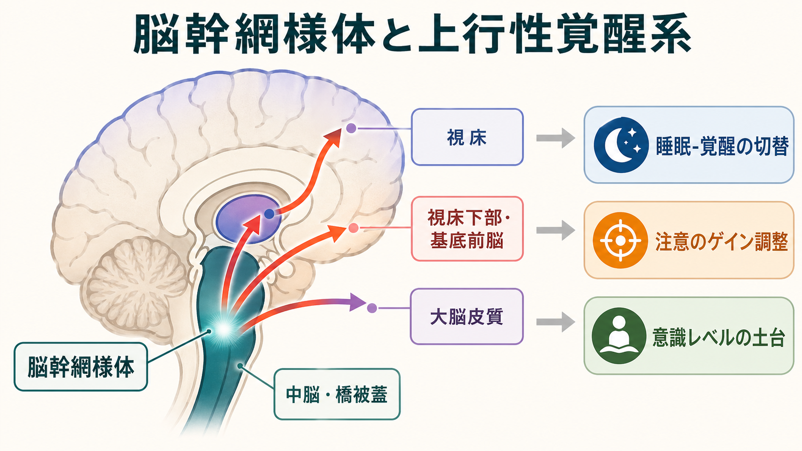
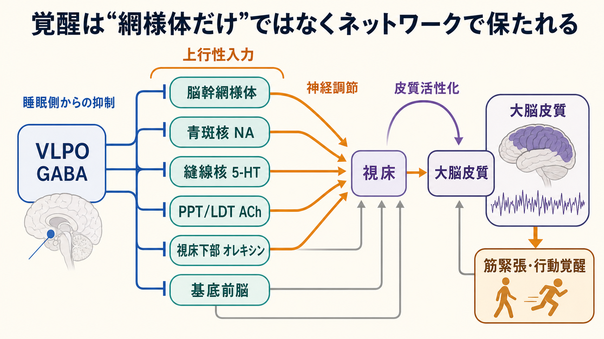
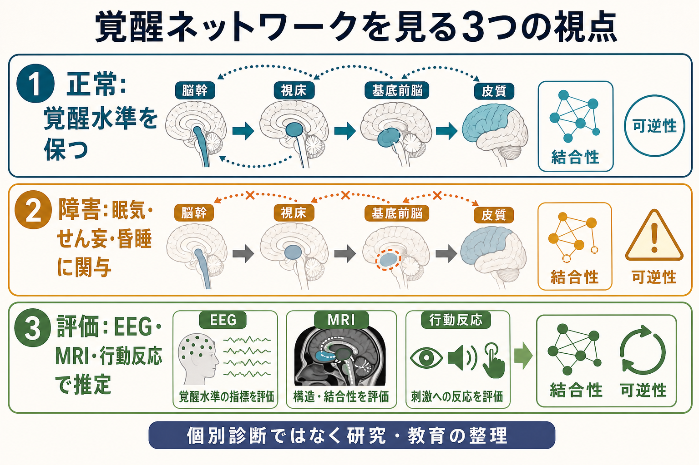

# 脳幹網様体は覚醒ネットワークで何をしているのか

## 要点

- 脳幹網様体は「意識のスイッチ」そのものではなく、視床、視床下部、基底前脳、大脳皮質へ広がる上行性覚醒系の重要な入口である。
- 古典的には、脳幹網様体を刺激すると同期した徐波的EEGが低振幅・高速活動へ変化することから、皮質覚醒を支える系として位置づけられた [1]。
- 現代的には、網様体だけでなく、青斑核ノルアドレナリン系、縫線核セロトニン系、PPT/LDTコリン作動系、視床下部オレキシン系、基底前脳などが並列・相互作用的に覚醒を支えると考える [2][3][5]。
- 覚醒は「目が覚めているか」だけでなく、注意のゲイン、感覚応答性、運動準備、意識レベルの背景条件をまとめて調整する多次元の状態である [5][6]。

## この記事で答える問い

1. 脳幹網様体は、上行性覚醒系の中で何をしているのか。
2. 睡眠覚醒、注意、意識レベルは同じ仕組みで説明できるのか。
3. 「網様体賦活系」は、現代の神経科学ではどのように言い換えられるのか。

## まず結論

脳幹網様体は、覚醒ネットワークの「単独の司令塔」ではなく、脳幹から前脳へ向かう覚醒性入力を束ね、感覚入力・内的状態・神経調節信号を皮質の活動様式に反映させる中継・調整領域である。網様体の働きは、[[神経回路とは何か|神経回路]]の局所機構というより、[[脳内ネットワークとは何か|脳内ネットワーク]]全体の状態を変える調節機構として理解するとよい。

## 背景

脳幹網様体が覚醒研究の中心に入ったのは、Moruzzi と Magoun が1949年に報告した実験が大きい。彼らは、脳幹網様体の刺激によって、睡眠時・安静時にみられる同期的なEEG活動が低振幅・高速活動へ変わることを示した [1]。この発見は、皮質の活動状態が大脳皮質の内部だけで決まるのではなく、脳幹からの上行性入力によって大きく変化するという見方を強めた。

ただし、古典的な「上行性網様体賦活系」という言葉は、現代の知見から見ると少し粗い。現在は、脳幹網様体の周囲にある複数の神経核、視床、視床下部、基底前脳、皮質を含む「上行性覚醒系」として整理されることが多い [2][3][5]。つまり、網様体は重要だが、網様体だけで覚醒、注意、意識を説明するのは不十分である。

## 基本概念

### 脳幹網様体

脳幹網様体は、中脳、橋、延髄に広がる比較的びまん性の神経細胞群である。名称から一枚の網のような構造を想像しやすいが、実際には運動、姿勢、疼痛調節、自律機能、覚醒などに関わる複数の細胞群が含まれる。覚醒との関係で特に重要なのは、中脳・橋被蓋周辺から前脳へ向かう上行性の経路である [2]。

### 上行性覚醒系

上行性覚醒系は、脳幹と視床下部・基底前脳から大脳皮質へ向かう複数の覚醒促進経路の総称である。代表的な構成要素には、青斑核のノルアドレナリン、縫線核のセロトニン、結節乳頭核のヒスタミン、PPT/LDTのアセチルコリン、視床下部のオレキシン、基底前脳のコリン作動性・GABA作動性・グルタミン酸作動性ニューロンがある [3][5]。

### 覚醒、注意、意識レベル

覚醒は、単に起きている状態ではない。睡眠から覚醒へ移る状態制御、刺激へ反応しやすくなる感覚ゲイン、課題に合わせて情報処理を強める注意、意識障害で問題になる全般的な反応性の土台を含む。注意ネットワークでいえば、[[サリエンスネットワークとは何か|サリエンスネットワーク]]や[[中央実行ネットワークとは何か|中央実行ネットワーク]]が何を選ぶかを決める前に、脳全体が反応可能な状態にあるかを支える層だと考えられる。

## 仕組み

### 1. 皮質活動のモードを切り替える

覚醒時の皮質は、睡眠時よりも外界入力へ反応しやすく、EEGでは相対的に低振幅・高速の活動が増える。脳幹網様体と関連する覚醒系は、視床や基底前脳を介して皮質ニューロンの膜電位、発火しやすさ、同期の程度を変える [1][3]。これは[[神経同期とは何か|神経同期]]を単純に増やすというより、過度に同期した徐波的状態から、情報処理に向いた活動状態へ移す働きである。

### 2. 神経調節物質で「ゲイン」を変える

青斑核ノルアドレナリン系は、覚醒と注意を結びつける代表例である。Aston-Jones と Cohen の適応ゲイン理論では、LC-NE系は課題関連情報への反応を強め、課題への関与が下がると探索的な状態へ移る調節器として説明される [6]。この観点では、脳幹網様体を含む覚醒系は情報の内容を表象するというより、どの入力が皮質で強く処理されるかを変える。

### 3. 睡眠側との相互抑制で状態を安定させる

睡眠覚醒は、覚醒系が単に強くなったり弱くなったりするだけではない。視床下部の睡眠促進領域、特に視索前野のGABA作動性ニューロンは覚醒促進系を抑制し、覚醒促進系は睡眠促進系を抑制する。この相互抑制は、睡眠と覚醒の急な切り替えを可能にする「スイッチ」に近い構造として説明される [4][5]。オレキシン系は、このスイッチを安定化し、覚醒が不安定に崩れるのを防ぐ役割をもつ [4][5]。

### 4. 意識レベルの必要条件を支える

意識内容を作る皮質ネットワークと、意識レベルを支える覚醒系は分けて考える必要がある。脳幹被蓋や網様体周辺の損傷は、皮質が構造的に残っていても昏睡を生じうる [7]。一方で、意識障害からの回復には、脳幹・視床・皮質の連絡、広域ネットワークの再統合、行動反応の回復が関わる [8]。したがって、脳幹網様体は意識の内容そのものではなく、内容が立ち上がるための背景条件を支える。

## 図解

### 全体像

脳幹網様体は、脳幹から前脳へ上る覚醒性入力の一部として、視床、視床下部、基底前脳、皮質へ影響を与える。重要なのは、一本の線形経路ではなく、複数の神経核が冗長に働くネットワークとして理解することである。

### メカニズム

睡眠覚醒の切り替えでは、覚醒促進系と睡眠促進系の相互抑制が中心になる。脳幹網様体はその覚醒側に位置するが、オレキシン、基底前脳、視床、皮質との連携なしには安定した覚醒状態を説明できない。

### 臨床・研究への接続

## 臨床・研究との接続

脳幹網様体と上行性覚醒系は、眠気、睡眠障害、せん妄、昏睡、意識障害の研究で重要な位置を占める。ただし、この記事は教育・研究目的の整理であり、個別の診断や治療方針を示すものではない。

臨床的には、脳幹被蓋の病変が意識レベル低下と結びつくこと、また重度脳損傷後の意識回復に脳幹、視床、前脳ネットワークの保存性が関わることが重要である [7][8]。研究面では、EEG、MRI、拡散MRI、機能的結合、行動反応を組み合わせ、覚醒レベルと意識内容を分けて評価する方向へ進んでいる [8]。

注意研究との接点も大きい。たとえばLC-NE系は、課題に関連する刺激への反応を高めることで、注意の効率を調整する [6]。このため、覚醒系は「眠らないための装置」ではなく、[[フィードバック回路は脳内情報処理をどう調節するのか|フィードバック回路]]や大規模ネットワークが働く前提条件を整えるシステムとして捉えられる。

## よくある誤解

### 誤解1: 脳幹網様体が意識を作っている

脳幹網様体は意識レベルに強く関わるが、意識内容を単独で作るわけではない。意識内容には皮質・視床・大規模ネットワークの統合が関わる。網様体は、これらのネットワークが機能するための覚醒状態を支える。

### 誤解2: 覚醒系は一本の経路である

古典的な「上行性網様体賦活系」という言葉は一本の経路を連想させるが、現代的には複数の神経核と神経伝達物質が並列に働くネットワークである [2][3][5]。

### 誤解3: 覚醒が高いほど認知機能はよい

覚醒は低すぎても高すぎても認知に不利になりうる。LC-NE系の理論では、適度な相動性活動は課題遂行を助けるが、過度な持続的活動は現在の課題からの離脱や探索状態と関係する [6]。したがって、覚醒は「量」だけでなく「状態の質」として考える必要がある。

## 関連ノート

- [[神経回路とは何か]]
- [[脳内ネットワークとは何か]]
- [[神経同期とは何か]]
- [[サリエンスネットワークとは何か]]
- [[中央実行ネットワークとは何か]]
- [[フィードバック回路は脳内情報処理をどう調節するのか]]

## MOC更新候補

- `content/00_MOC/` 配下の脳・神経科学系MOCに、本記事を「神経回路・脳ネットワーク」または「睡眠覚醒・意識レベル」の項目として追加する。
- 将来「睡眠・覚醒」「意識障害」「神経調節系」のMOCを作る場合、本記事を基礎ノートとして配置する。

## 理解チェック

1. 脳幹網様体を「意識の単独中枢」と呼ぶと、何が抜け落ちるか。
2. 覚醒系が皮質活動を変えるとき、視床・基底前脳・神経調節物質はどのように関わるか。
3. 睡眠覚醒の切り替えを、覚醒促進系と睡眠促進系の相互抑制として説明すると何がわかりやすくなるか。
4. 注意のゲイン調整と意識レベルの維持は、どこが共通し、どこが異なるか。

## 未解決問題

- ヒトで、脳幹内の小さな神経核群を非侵襲的に高精度で分けて測る方法はまだ発展途上である。
- 覚醒レベル、注意、意識内容を行動指標だけで完全に分離することは難しい。
- 動物実験で明らかになった神経核ごとの因果的役割を、ヒトの臨床症状や回復過程へどのように対応づけるかには慎重さが必要である。
- せん妄、過眠、意識障害などの臨床状態では、覚醒系だけでなく炎症、代謝、薬物、皮質ネットワーク障害が重なりうる。

## 参考文献

[1] Moruzzi, G., & Magoun, H. W. (1949). Brain stem reticular formation and activation of the EEG. *Electroencephalography and Clinical Neurophysiology*, 1(1-4), 455-473. https://doi.org/10.1016/0013-4694(49)90219-9

[2] Fuller, P. M., Sherman, D., Pedersen, N. P., Saper, C. B., & Lu, J. (2011). Reassessment of the structural basis of the ascending arousal system. *The Journal of Comparative Neurology*, 519(18), 3817-3839. https://doi.org/10.1002/cne.22781

[3] Brown, R. E., Basheer, R., McKenna, J. T., Strecker, R. E., & McCarley, R. W. (2012). Control of sleep and wakefulness. *Physiological Reviews*, 92(3), 1087-1187. https://doi.org/10.1152/physrev.00032.2011

[4] Saper, C. B., Fuller, P. M., Pedersen, N. P., Lu, J., & Scammell, T. E. (2010). Sleep state switching. *Neuron*, 68(6), 1023-1042. https://doi.org/10.1016/j.neuron.2010.11.032

[5] Scammell, T. E., Arrigoni, E., & Lipton, J. O. (2017). Neural circuitry of wakefulness and sleep. *Neuron*, 93(4), 747-765. https://doi.org/10.1016/j.neuron.2017.01.014

[6] Aston-Jones, G., & Cohen, J. D. (2005). An integrative theory of locus coeruleus-norepinephrine function: Adaptive gain and optimal performance. *Annual Review of Neuroscience*, 28, 403-450. https://doi.org/10.1146/annurev.neuro.28.061604.135709

[7] Parvizi, J., & Damasio, A. R. (2003). Neuroanatomical correlates of brainstem coma. *Brain*, 126(7), 1524-1536. https://doi.org/10.1093/brain/awg166

[8] Edlow, B. L., Claassen, J., Schiff, N. D., & Greer, D. M. (2021). Recovery from disorders of consciousness: Mechanisms, prognosis and emerging therapies. *Nature Reviews Neurology*, 17, 135-156. https://doi.org/10.1038/s41582-020-00428-x
