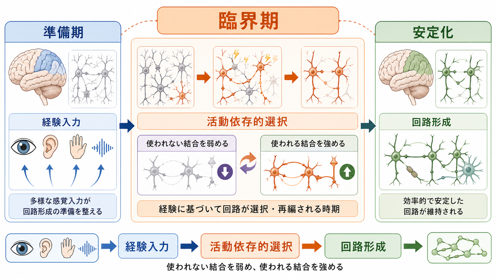
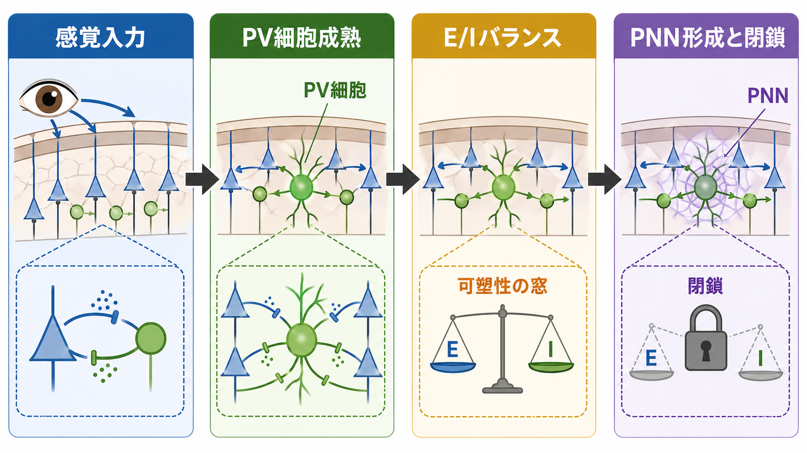
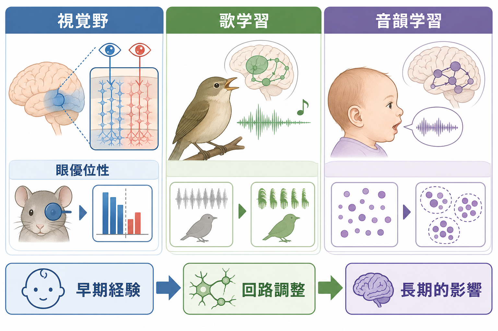

# 臨界期は神経回路形成にどのような意味を持つのか

## 要点

- 臨界期とは、発達中の[[神経回路とは何か|神経回路]]が経験入力によって特に大きく再編される時期である。
- 意味は「この時期を逃すと何も学べない」という単純な話ではなく、経験を使って入力の統計構造に合う回路を選び、過剰な結合を削り、よく使う経路を安定化することにある。
- 代表例は、視覚野の眼優位性、音声・言語の音韻学習、鳥類や哺乳類でみられる感覚運動学習である。
- 開始と終了には、抑制性回路、とくにPV細胞を含む[[抑制性介在ニューロンにはどのような種類があるのか|抑制性介在ニューロン]]、[[E_Iバランスとは何か|E/Iバランス]]、ペリニューロナルネットなどが関わる。

## この記事で答える問い

この記事では、次の問いに答える。

1. 臨界期は、神経回路形成のどの段階で何をしているのか。
2. なぜ発達期の経験は、成熟後の同じ経験より強い影響を持つのか。
3. 視覚野・音声学習・言語学習の例から、臨界期をどう理解すればよいのか。
4. 臨界期を臨床や教育に接続するとき、どこまでを研究知見として扱い、どこからを未解決問題として残すべきか。

## まず結論

臨界期は、発達中の神経回路が「経験に開かれている」だけでなく、「経験に基づいて選別される」時期である。発達初期の脳は、多くの候補結合を作り、入力を受けながら、よく同期して活動する経路を強め、使われにくい経路を弱める。この過程によって、外界の規則性に合った効率的な回路が形成される[1][2]。

一方で、臨界期は永続的な可塑性とは違う。過度に開いたままでは、いったん獲得した機能が不安定になり続ける。したがって発達には、可塑性を高める仕組みと、回路を固定しすぎない範囲で安定化する仕組みの両方が必要である[1][6]。この「可塑性と安定性の切り替え」こそが、臨界期の中心的な意味である。

## 背景

臨界期研究の古典的入口は、視覚野の眼優位性である。Hubel と Wiesel は、発達期の片眼遮蔽が大脳皮質視覚野の反応性を大きく変えることを示し、経験が皮質回路の機能的組織化に深く関わることを明らかにした[3]。この発見は、神経回路を遺伝的プログラムだけでなく、発達期の経験との相互作用として見る視点を強めた。

その後の研究では、臨界期は視覚だけに限定されないことが分かった。聴覚、体性感覚、鳥の歌学習、ヒト乳幼児の音韻学習などでも、早期経験が後の識別能力や行動に大きな影響を与える[7][8]。ただし、領域ごとに時期、可塑性の強さ、可逆性、学習対象は異なる。したがって「臨界期」という一語で全機能を同じように扱うのではなく、どの回路、どの機能、どの経験に関する臨界期なのかを区別する必要がある。

## 基本概念

### 臨界期と感受性期

狭い意味の臨界期は、ある経験が特定の発達窓内でしか正常な機能形成に十分な効果を持たない時期を指す。広い意味の感受性期は、経験の効果が特に大きいが、その後も一定の学習や回復が残る時期を指す。現代の神経科学では、多くの現象は厳密な「開く/閉じる」より、可塑性の高さが時間とともに変化する連続的な窓として理解される[2][7]。

### 回路候補の過剰生成と選別

発達中の脳では、初めから完成形の回路だけが作られるわけではない。軸索投射、樹状突起、シナプス結合、局所回路は、ある程度の余裕をもって形成される。その後、感覚入力や行動経験に応じて、活動が協調する結合は強まり、使われにくい結合は弱まる。この活動依存的な選別が、臨界期の主要な役割である[1][2]。

### 可塑性と安定性のトレードオフ

可塑性が高いことは学習に有利だが、常に高ければよいわけではない。高すぎる可塑性は、獲得済みの機能を不安定にし、ノイズや一時的な入力にも回路が過剰に影響されるリスクを高める。臨界期の終了は、学習能力の喪失というより、環境に合わせて形成した回路を安定して運用する段階への移行である[6]。

## 仕組み

### 1. 抑制性回路の成熟が可塑性の窓を開く

臨界期の開始には、GABA作動性の抑制性回路、とくにPV細胞の成熟が重要である。抑制は単なる活動低下ではなく、発火タイミングをそろえ、入力の競合を明瞭にし、シナプス変化が起こる条件を整える。視覚野研究では、抑制性回路の成熟が眼優位性可塑性の開始に関わることが示されている[1][2]。

### 2. E/Iバランスが入力の競合を形にする

経験入力が回路を再編するには、興奮性入力と抑制性入力の比率や時間構造が適切な範囲にある必要がある。[[E_Iバランスとは何か|E/Iバランス]]は、単純に興奮と抑制が同量であるという意味ではない。どの層、どの細胞型、どの時間スケールで、入力選択・同期・競合を支えるかが重要である[1][6]。

### 3. シナプス可塑性が「使われる結合」と「使われにくい結合」を分ける

臨界期には、入力の相関構造に応じてシナプス強度が変わりやすい。たとえば片眼遮蔽では、遮蔽眼からの入力が相対的に弱まり、開眼している眼からの入力が皮質反応をより強く支配するようになる[3][4]。これは、経験が単に刺激を増やすのではなく、競合する入力間の重みを変えることを示している。

### 4. ペリニューロナルネットが可塑性を制限し、回路を安定化する

臨界期の終了には、細胞外マトリックス構造であるペリニューロナルネットが関わる。Pizzorusso らは、成体視覚野でこの構造を酵素的に分解すると眼優位性可塑性が再び高まることを示した[5]。これは、成熟後の低可塑性が単に「発達が終わったから」ではなく、能動的に維持される安定化機構によって支えられていることを示す。

## 図解

上の図を文章に直すと、臨界期は次の流れとして理解できる。

| 段階 | 主な出来事 | 回路形成上の意味 |
|---|---|---|
| 準備期 | 軸索投射、局所回路、抑制性回路が形成される | 経験を受け取る候補構造を作る |
| 臨界期 | 入力間の競合、シナプス強度変化、活動依存的選択が起こる | 環境の統計構造に合う回路を選ぶ |
| 安定化 | PNN、ミエリン化、抑制性回路の成熟などが進む | 形成された機能を維持する |

重要なのは、臨界期を「経験が必要な時期」とだけ見るのではなく、「経験が回路の重みを決める時期」と見ることである。この見方をすると、早期経験、感覚遮断、リハビリテーション、教育環境の議論を、同じ原理の上で慎重に比較できる。

## 代表例

### 視覚野の眼優位性

視覚野では、左右の眼からの入力が皮質ニューロンの反応性をめぐって競合する。発達期に片眼を遮蔽すると、遮蔽眼の入力に対する皮質応答が弱まり、開眼側の入力が優位になる[3][4]。この現象は、臨界期研究の最もよく整理されたモデルであり、経験依存的な回路選別を理解する基盤になっている[2]。

### 鳥の歌学習と感覚運動学習

鳥の歌学習では、若い時期に聞いた手本歌と、自分の発声を比較しながら運動出力を調整する。これは、感覚入力だけでなく、感覚と運動の対応関係が発達期に強く形成される例である。鳥の歌学習とヒト音声学習には違いも多いが、早期経験が後の発声・識別能力を方向づける点で共通する論点を持つ[7]。

### ヒトの音韻学習

乳幼児は、初期には多様な音韻対立を識別できるが、成長とともに母語で重要な音の区別に特化していく。これは能力が単純に失われるというより、環境内で頻繁に使われる音韻カテゴリーに神経処理が最適化される過程である[8]。したがって音韻学習の臨界期・感受性期は、外界への適応と可塑性低下が同時に進む例として理解できる。

## 臨床・研究との接続

臨界期研究は、弱視、聴覚補償、言語発達、発達障害、リハビリテーション研究に接続する。ただし、基礎研究で示された可塑性操作を、そのまま個別の治療指示へ翻訳することはできない。医療・教育への応用では、対象年齢、介入時期、機能領域、測定指標、個人差を分けて考える必要がある。

臨床的に重要なのは、「早いほど常に良い」と単純化しないことである。早期介入が有利な領域はあるが、成熟後にも残る可塑性や、訓練・環境調整による改善可能性も存在する。臨界期の研究は、発達期の経験が重要であることを示すと同時に、成熟後の可塑性を再び高める条件を探る研究にもつながっている[5][6]。

## よくある誤解

### 誤解1: 臨界期を過ぎると学習できない

多くの場合、正確には「学習効率や回路再編のしやすさが低下する」である。成人でも学習や可塑性は残る。ただし、発達期と同じ速度・同じ形式・同じ到達点になるとは限らない[2][8]。

### 誤解2: 臨界期はすべての機能で同じ時期に来る

視覚、聴覚、言語、運動、社会認知では、関連する回路と経験が違う。そのため、感受性が高い時期も、可塑性が閉じる仕組みも同一ではない[7]。

### 誤解3: 経験が多いほどよい

臨界期に必要なのは、量だけでなく、タイミング、質、安定性、予測可能性である。過剰刺激や不安定な入力が望ましいとは限らない。神経回路形成では、入力の統計構造が回路にどのような規則性を与えるかが問題になる。

### 誤解4: 臨界期は遺伝か環境かの議論である

臨界期は、遺伝的に準備された発達プログラムと、環境からの活動入力が相互作用する現象である。遺伝は窓の時期や機構を準備し、経験はその窓の中で具体的な結合重みを調整する。

## 関連ノート

- [[神経回路とは何か]]
- [[E_Iバランスとは何か]]
- [[抑制性介在ニューロンにはどのような種類があるのか]]
- [[興奮性ニューロンと抑制性ニューロンは回路内でどう協調するのか]]
- [[大脳皮質の層構造は情報の流れをどう決めるのか]]

MOC更新候補:

- `content/00_MOC/` 配下の神経科学・神経回路関連MOCが統合更新される場合、本記事を「発達期可塑性」「神経回路形成」「視覚野可塑性」の項目に追加する。

今後の作成候補:

- 視覚野の眼優位性とは何か
- ペリニューロナルネットとは何か
- 発達期可塑性と成人可塑性は何が違うのか
- 音韻学習の感受性期とは何か

## 理解チェック

1. 臨界期は、単に「学習できる時期」ではなく、神経回路形成のどの過程を指すか。
2. 抑制性回路の成熟は、なぜ可塑性の開始にも終了にも関わりうるのか。
3. 視覚野の片眼遮蔽研究は、経験依存的な回路形成について何を示したか。
4. 臨界期の知見を教育や臨床に応用するとき、どのような過剰一般化を避けるべきか。

## 未解決問題

- ヒトで観察される学習の感受性期を、細胞・回路レベルの臨界期機構へどこまで対応づけられるか。
- 成人期に可塑性を高める操作が、機能回復と不安定化のどちらをどの条件で生むか。
- 発達障害や精神疾患で議論されるE/Iバランスや臨界期の変化を、個別診断や治療選択に使える水準まで測定できるか。
- 早期経験の「質」を、神経回路形成の観点からどのように定量化できるか。

## 参考文献

[1] Hensch, T. K. (2005). Critical period plasticity in local cortical circuits. *Nature Reviews Neuroscience*, 6, 877-888. https://doi.org/10.1038/nrn1787

[2] Levelt, C. N., & Hubener, M. (2012). Critical-period plasticity in the visual cortex. *Annual Review of Neuroscience*, 35, 309-330. https://doi.org/10.1146/annurev-neuro-061010-113813

[3] Wiesel, T. N., & Hubel, D. H. (1963). Single-cell responses in striate cortex of kittens deprived of vision in one eye. *Journal of Neurophysiology*, 26(6), 1003-1017. https://doi.org/10.1152/jn.1963.26.6.1003

[4] Gordon, J. A., & Stryker, M. P. (1996). Experience-dependent plasticity of binocular responses in the primary visual cortex of the mouse. *Journal of Neuroscience*, 16(10), 3274-3286. https://doi.org/10.1523/JNEUROSCI.16-10-03274.1996

[5] Pizzorusso, T., Medini, P., Berardi, N., Chierzi, S., Fawcett, J. W., & Maffei, L. (2002). Reactivation of ocular dominance plasticity in the adult visual cortex. *Science*, 298(5596), 1248-1251. https://doi.org/10.1126/science.1072699

[6] Takesian, A. E., & Hensch, T. K. (2013). Balancing plasticity/stability across brain development. *Progress in Brain Research*, 207, 3-34. https://doi.org/10.1016/B978-0-444-63327-9.00001-1

[7] Knudsen, E. I. (2004). Sensitive periods in the development of the brain and behavior. *Journal of Cognitive Neuroscience*, 16(8), 1412-1425. https://doi.org/10.1162/0898929042304796

[8] Kuhl, P. K. (2010). Brain mechanisms in early language acquisition. *Neuron*, 67(5), 713-727. https://doi.org/10.1016/j.neuron.2010.08.038
