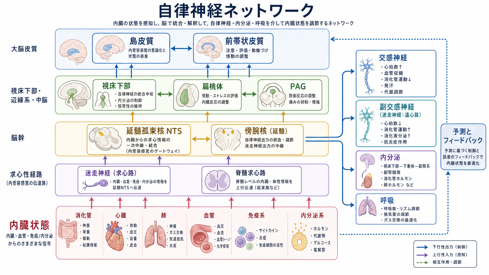
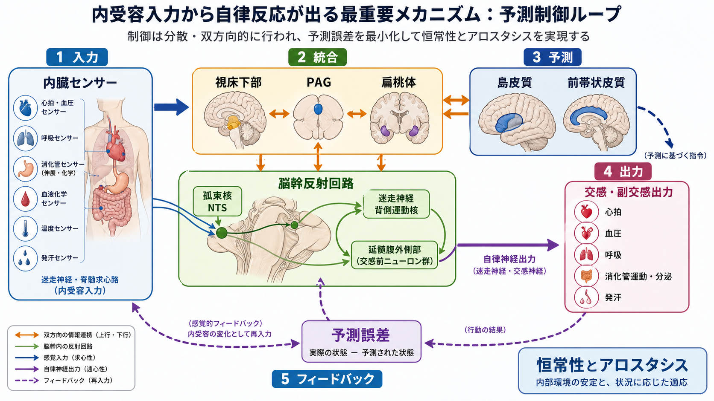
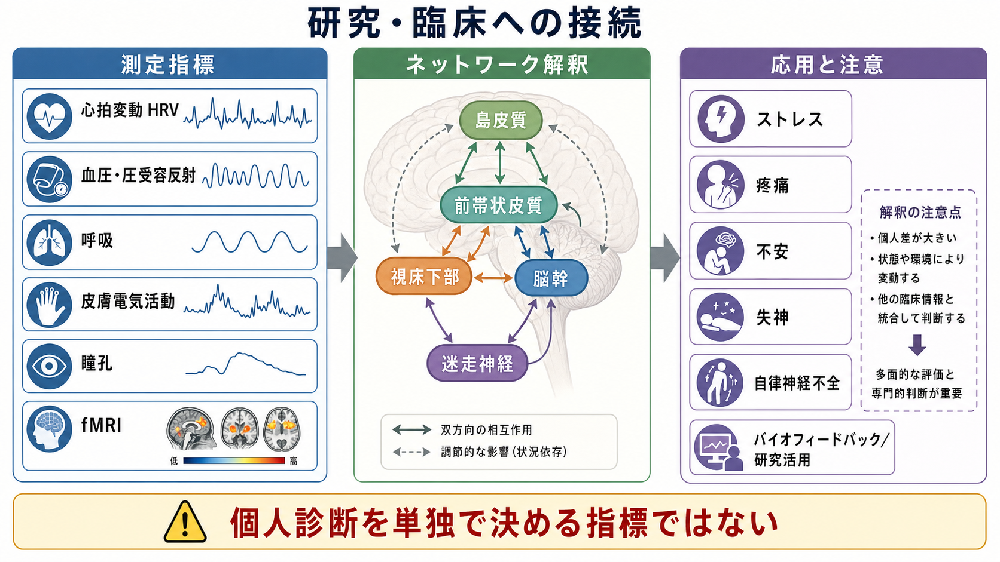

# 自律神経ネットワークは内臓状態をどう制御するのか

## 要点

- 自律神経は「交感神経と副交感神経の末梢反射」だけではなく、脳幹、視床下部、扁桃体、PAG、島皮質、前帯状皮質などを含む分散ネットワークとして制御される[1]。
- 内臓・血管・免疫・内分泌の状態は、迷走神経求心路や脊髄求心路を通じて脳幹へ入り、島皮質などで内受容感覚として再表象される[2][3]。
- 視床下部は、体温、摂食、浸透圧、睡眠覚醒、内分泌、自律神経出力を結び、内臓状態を行動状態へ接続する中継点である[6]。
- 自律反応は単なる反射ではなく、予測、文脈、情動、行動準備によって調整される。近年は、身体からの入力と脳からの予測が相互に制約し合う仕組みとして説明される[5][8]。

## この記事で答える問い

1. 自律神経ネットワークとは何か。
2. 内受容感覚はどの経路で脳へ届くのか。
3. 脳幹・視床下部・島皮質・前帯状皮質は、それぞれ何をしているのか。
4. 研究や臨床で、心拍変動や fMRI をどのように解釈すればよいのか。

## まず結論

自律神経ネットワークは、内臓状態を「測ってから反射的に戻す装置」ではない。脳幹は心拍、血圧、呼吸、消化管などの速い反射を担い、視床下部は内分泌・代謝・体温・行動状態を統合し、島皮質や前帯状皮質は身体状態の表象、気づき、行動選択、情動的価値づけと結びつく[1][3][4]。したがって、内臓状態の制御は、末梢からのフィードバックと中枢からの予測・行動準備が合わさった分散的な制御である。

## 背景

自律神経は、心拍、血圧、呼吸、消化管運動、発汗、瞳孔、体温、代謝、内分泌などを調整する。古典的には、交感神経は「闘争・逃走」、副交感神経は「休息・消化」と説明される。しかし実際には、臓器ごとに交感・副交感の役割は異なり、状況によって同時に協調する。たとえば運動時には心拍と血圧が上がる一方で、呼吸、筋血流、発汗、体温調整も同時に組み替えられる。

このような多臓器の協調を説明するために、central autonomic network（CAN）という考え方が使われる。CAN は、島皮質、前帯状皮質、扁桃体、視床下部、PAG、傍腕核、孤束核、延髄腹外側部などが、内臓入力と自律神経出力を結びつける機能的ネットワークとして整理した概念である[1]。これは、[[脳内ネットワークとは何か|脳内ネットワーク]]を「皮質だけの接続」としてではなく、脳幹・視床下部・身体を含めて考える入口になる。

## 基本概念

### 内受容感覚

内受容感覚とは、身体内部の生理状態を表す感覚である。心拍、呼吸、胃腸の張り、体温、痛み、息苦しさ、疲労、血糖、炎症関連信号などが含まれる。Craig は、内受容を「身体の生理的状態を表す感覚」として整理し、主観的な身体感覚や情動の基盤として位置づけた[2]。

内受容入力は、主に二つの上行経路で脳へ届く。第一に、迷走神経求心路は、心肺、消化管、免疫・炎症関連の情報を延髄の孤束核へ伝える。第二に、脊髄求心路は、痛み、温度、血管、筋・内臓由来の情報を脊髄から上行させ、脳幹、視床、島皮質などへつなぐ[2][5]。

### 恒常性とアロスタシス

恒常性は、体温や血圧などを一定範囲に保つ仕組みである。一方、アロスタシスは、将来の需要に合わせて身体状態を先回りして変える仕組みである。たとえば、走り出す前から心拍や血圧が上がるのは、誤差が起きてから戻すだけでなく、行動に備えて状態を変えているからである[8]。

この区別は、[[神経回路とは何か|神経回路]]を単なる入力出力の線としてではなく、予測、フィードバック、行動を含む閉ループとして見る助けになる。

## 仕組み

### 1. 脳幹は速い反射と入力ゲートを担う

孤束核（NTS）は、迷走神経求心路から多くの内臓情報を受け取る。そこから、迷走神経背側運動核、疑核、延髄腹外側部、傍腕核、視床下部などへ信号が送られる。これにより、圧受容反射、化学受容反射、呼吸調整、消化管反射などが、意識的な判断を待たずに調整される[1][5]。

ただし脳幹反射は孤立していない。視床下部、扁桃体、PAG、前頭前野・島皮質からの下行入力によって、同じ内臓入力でも状況に応じて反応が変わる。たとえば痛み、恐怖、運動、食事、睡眠では、望ましい心拍・血圧・呼吸の状態が異なる。

### 2. 視床下部は内臓制御を行動状態に接続する

視床下部は、自律神経、内分泌、代謝、摂食、体温、睡眠覚醒、生殖、ストレス応答を結びつける中枢である[6]。とくに室傍核、外側視床下部、弓状核、視索前野などは、臓器状態やホルモン信号を受けながら、自律神経出力や下垂体ホルモン分泌を調整する。

ストレス応答では、視床下部・脳幹・辺縁系が HPA 軸と自律神経を協調させる。身体的ストレスでは脳幹・視床下部に直接近い経路が強く働き、心理的ストレスでは扁桃体、海馬、内側前頭前野などが多シナプス性に視床下部・脳幹へ影響する[7]。このため「ストレス反応」は心理だけでも身体だけでもなく、両者をつなぐ調整過程である。

### 3. 島皮質は身体状態を主観的経験へつなぐ

島皮質は、内受容感覚、痛み、味覚、情動、自己感覚、意思決定に関わる領域として研究されてきた。Craig は、後部島皮質から前部島皮質へ向かう再表象の流れを想定し、前部島皮質が身体状態の気づきや主観的感情に関わると論じた[3]。

この説明は単純な「島皮質 = 内臓感覚中枢」という意味ではない。島皮質は、身体内部の信号を、課題、記憶、注意、情動的価値、行動準備と結びつける。したがって、[[サリエンスネットワークとは何か|サリエンスネットワーク]]における前部島皮質は、身体の変化を「いま反応すべき重要な変化」として検出する役割を持つと考えられる。

### 4. 前帯状皮質は努力・行動選択・自律反応を結ぶ

前帯状皮質は、葛藤、努力、痛み、情動、行動選択、心拍・血圧などの自律反応と関係する。神経画像研究や病変研究は、帯状皮質が主観的な情動だけでなく、身体反応を伴う行動制御にも関わることを示している[4]。

重要なのは、前帯状皮質や島皮質が「自律神経を直接命令する単独中枢」ではない点である。これらは、脳幹・視床下部・扁桃体・末梢臓器と閉ループを作り、行動と身体状態の対応を調整するノードとして理解する方がよい。

## 図解

図1は、内臓状態から脳幹・視床下部・島皮質へ上行し、交感神経・副交感神経・内分泌・呼吸へ下行する全体像である。図2は、内受容入力、脳幹反射、視床下部・PAG・扁桃体、島皮質・前帯状皮質が、予測誤差を減らすように閉ループを作る様子を示している。図3は、研究・臨床で使われる測定指標と、その解釈上の注意をまとめた。

## 臨床・研究との接続

研究では、心拍変動（HRV）、血圧、圧受容反射感度、呼吸、皮膚電気活動、瞳孔径、ホルモン、炎症指標、fMRI などを組み合わせて、自律神経ネットワークを推定する。ヒト神経画像研究は、島皮質、前帯状皮質、扁桃体、視床下部、脳幹の活動が、自律反応や情動・認知課題と結びつくことを示してきた[4][5]。

臨床的には、ストレス関連症状、不安、疼痛、失神、自律神経不全、機能性身体症状、パニック、慢性疲労、消化管症状などを考えるときに、内受容と自律神経制御の観点が役立つ。ただし、HRV や fMRI のような指標は、個人の診断を単独で決めるものではない。薬物、睡眠、年齢、姿勢、呼吸、運動、測定条件、併存疾患の影響を受けるため、研究知見と臨床判断を混同しないことが重要である。

## よくある誤解

### 誤解1: 交感神経は悪く、副交感神経はよい

交感神経は、危険や運動だけでなく、立位時の血圧維持、体温調整、注意の準備にも必要である。副交感神経も、状況によっては過度の徐脈や失神と関係する。重要なのは、どちらか一方を増やすことではなく、文脈に合った可変性と協調である。

### 誤解2: 自律神経は意識から完全に独立している

多くの自律反射は意識を待たずに働く。しかし、注意、予測、不安、痛み、呼吸法、運動準備、社会的状況は自律反応を変える。島皮質や前帯状皮質を含むネットワークは、身体の状態と主観的経験・行動選択を結びつける[3][4]。

### 誤解3: 内受容感覚は身体から脳への一方向入力である

内受容感覚は、身体からの信号だけで決まるわけではない。脳は身体状態を予測し、その予測に沿って自律神経出力を変え、戻ってきた信号との差を使って状態を更新する[8]。このため、同じ心拍でも、運動中、発表前、不安時、休息中では主観的意味が変わる。

## 関連ノート

- [[サリエンスネットワークとは何か]]
- [[脳内ネットワークとは何か]]
- [[神経回路とは何か]]
- [[アセチルコリンは注意や記憶にどう関わるのか]]
- [[ノルアドレナリンは覚醒とストレスにどう関わるのか]]

MOC 更新候補:

- `content/00_MOC/` 配下の脳・神経科学系 MOC に、本記事を「自律神経・内受容・脳幹-視床下部-島皮質ネットワーク」の項目として追加する。

今後の作成候補:

- 島皮質とは何か
- 内受容感覚とは何か
- 視床下部とは何か
- 迷走神経とは何か
- 圧受容反射とは何か

## 理解チェック

1. 自律神経ネットワークを、末梢の交感・副交感だけで説明すると何が抜け落ちるか。
2. 孤束核、視床下部、島皮質の役割を一文ずつで説明できるか。
3. 恒常性とアロスタシスの違いを、自律神経反応の例で説明できるか。
4. HRV や fMRI を個人診断の単独指標として使いにくい理由を説明できるか。

## 参考文献

[1] Benarroch, E. E. (1993). The central autonomic network: Functional organization, dysfunction, and perspective. *Mayo Clinic Proceedings*, 68(10), 988-1001. https://doi.org/10.1016/S0025-6196(12)62272-1

[2] Craig, A. D. (2002). How do you feel? Interoception: the sense of the physiological condition of the body. *Nature Reviews Neuroscience*, 3, 655-666. https://doi.org/10.1038/nrn894

[3] Craig, A. D. (2009). How do you feel -- now? The anterior insula and human awareness. *Nature Reviews Neuroscience*, 10, 59-70. https://doi.org/10.1038/nrn2555

[4] Critchley, H. D. (2005). Neural mechanisms of autonomic, affective, and cognitive integration. *Journal of Comparative Neurology*, 493(1), 154-166. https://doi.org/10.1002/cne.20749

[5] Critchley, H. D., & Harrison, N. A. (2013). Visceral influences on brain and behavior. *Neuron*, 77(4), 624-638. https://doi.org/10.1016/j.neuron.2013.02.008

[6] Saper, C. B., & Lowell, B. B. (2014). The hypothalamus. *Current Biology*, 24(23), R1111-R1116. https://doi.org/10.1016/j.cub.2014.10.023

[7] Ulrich-Lai, Y. M., & Herman, J. P. (2009). Neural regulation of endocrine and autonomic stress responses. *Nature Reviews Neuroscience*, 10, 397-409. https://doi.org/10.1038/nrn2647

[8] Barrett, L. F., & Simmons, W. K. (2015). Interoceptive predictions in the brain. *Nature Reviews Neuroscience*, 16, 419-429. https://doi.org/10.1038/nrn3950

## 未解決問題

- ヒト fMRI で観察される島皮質・前帯状皮質・視床下部・脳幹活動を、交感神経、迷走神経、内分泌、呼吸のどの成分にどこまで分解できるのか。
- 内受容予測の異常が、不安、疼痛、機能性身体症状、ストレス関連障害にどの程度共通し、どの程度疾患特異的なのか。
- バイオフィードバック、呼吸訓練、運動、睡眠改善、心理療法が、自律神経ネットワークのどの階層をどの時間スケールで変えるのか。
