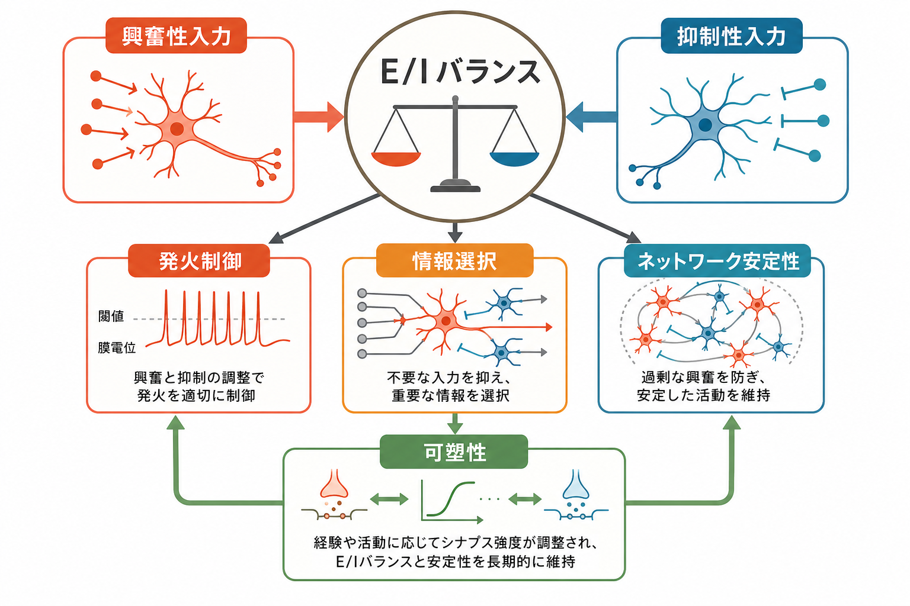
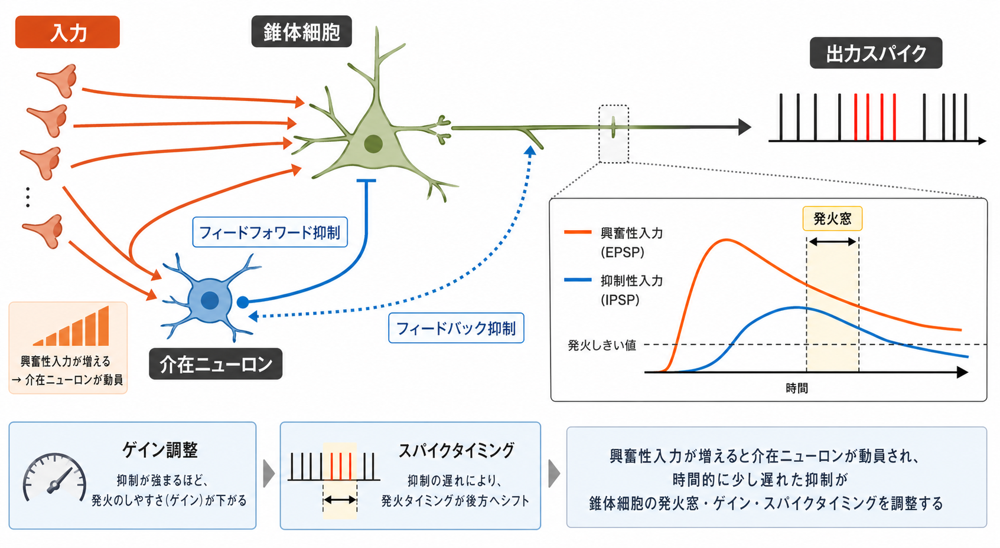
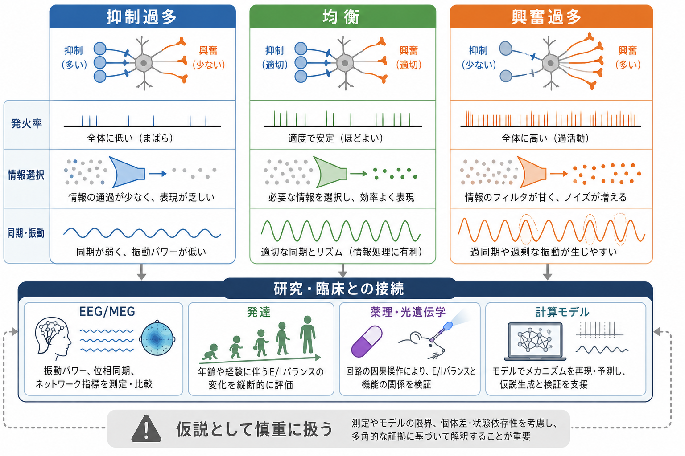

# 興奮性ニューロンと抑制性ニューロンは回路内でどう協調するのか

## 要点

- 興奮性ニューロンは活動を広げ、抑制性ニューロンは活動を止めるだけではない。両者は、発火するかどうか、いつ発火するか、どの入力を通すかを共同で決める。
- E/Iバランスは単純な「興奮と抑制が同じ量」という意味ではなく、時間、空間、細胞種、課題状態に応じた動的な釣り合いである。
- 抑制性介在ニューロンは、フィードフォワード抑制、フィードバック抑制、側方抑制、同期・振動の調整を通じて、[[神経回路とは何か|神経回路]]の出力を整える。
- E/Iバランスの破綻は発達障害・統合失調症・てんかんなどと関連づけて研究されるが、個別診断や治療選択へ直接短絡できる指標ではない。

## この記事で答える問い

この記事では、[[興奮性ニューロンと抑制性ニューロンは何が違うのか|興奮性ニューロンと抑制性ニューロン]]が、局所回路の中でどのように協調して発火、情報選択、ネットワーク安定性を支えるのかを整理する。中心になる問いは、次の3つである。

1. 興奮と抑制は、発火の「量」だけでなく「タイミング」をどう決めるのか。
2. 抑制はなぜ情報処理を弱めるだけでなく、むしろ選択性を高めるのか。
3. E/Iバランスは、発達・可塑性・精神疾患研究でどこまで使える概念なのか。

## まず結論

興奮性入力はニューロンの膜電位を発火しやすい方向へ動かし、抑制性入力は発火しにくい方向、または入力抵抗を下げて興奮の効き方を弱める方向へ働く。だが実際の回路では、興奮が先に入り、その興奮によって[[介在ニューロンは神経回路で何をしているのか|介在ニューロン]]が動員され、少し遅れて抑制が入る。この遅れと強さの組み合わせが、発火窓、ゲイン、スパイクタイミングを決める[1][2]。

したがって、E/Iバランスは「興奮を抑制で打ち消す仕組み」ではない。むしろ、強い入力には強い抑制を組み合わせ、弱い入力には弱い抑制を組み合わせることで、回路を過活動にも沈黙にも偏らせず、必要な信号を読み出しやすい範囲に保つ仕組みである[3][4]。

## 背景

大脳皮質の主要な出力細胞である錐体細胞の多くは興奮性で、主にグルタミン酸を使って次のニューロンを活動しやすくする。一方、皮質ニューロンの少数を占める抑制性介在ニューロンは、主にGABAを使って局所回路の発火を調整する。詳しくは[[グルタミン酸は脳で何をしているのか]]、[[GABAは脳で何をしているのか]]を参照するとよい。

重要なのは、抑制性ニューロンが単なるブレーキではない点である。抑制は、過剰な発火を防ぐだけでなく、入力の競合を作り、時間窓を狭め、同期を調整し、回路のダイナミックレンジを広げる[1]。このため、同じ興奮性入力でも、どの抑制性介在ニューロンが、どの部位に、どのタイミングで作用するかによって、出力は大きく変わる。

## 基本概念

### 興奮と抑制

興奮性シナプス入力は、一般に[[EPSPとIPSPはどのように発火を調節するのか|EPSP]]として膜電位を脱分極方向へ動かす。抑制性シナプス入力は、一般にIPSPとして過分極方向へ動かすか、膜コンダクタンスを増やして興奮性入力の効き方を弱める。発火が実際に起きるかどうかは、これらの入力が樹状突起、細胞体、軸索小丘でどう統合されるかに依存する。これは[[ニューロンは複数の入力をどのように統合するのか]]、[[活動電位はどのように発生するのか]]とつながる。

### E/Iバランス

E/Iバランスとは、興奮性シナプス電流と抑制性シナプス電流の関係が、回路の安定した情報処理に適した範囲に保たれることを指す。ここでいう「バランス」は、興奮と抑制が常に同時・同量という意味ではない。感覚入力、注意、睡眠覚醒、発達段階、薬理状態に応じて、バランス点は変化する。

皮質 in vivo 記録では、持続的なネットワーク活動が興奮と抑制の動的な釣り合いから生じることが示されている[2]。また視覚皮質では、個々の錐体細胞が受ける興奮量が異なっても、抑制がそれに見合うように調整され、E/I比が細胞間でそろえられることが報告されている[3]。

## 仕組み

### 1. フィードフォワード抑制

入力線維が錐体細胞を興奮させると同時に、抑制性介在ニューロンも興奮させる場合がある。すると、錐体細胞には興奮性入力の直後に抑制性入力が届く。この仕組みをフィードフォワード抑制という。結果として、錐体細胞が発火できる時間窓は狭くなり、入力のタイミング差がより鋭く読まれる[1]。

### 2. フィードバック抑制

錐体細胞が発火した後、その活動が抑制性介在ニューロンを動員し、同じ錐体細胞群または近傍の細胞群へ抑制を返すことがある。これをフィードバック抑制という。過剰な再帰的興奮を抑え、発火が連鎖的に広がりすぎることを防ぐ。局所回路では、このフィードバックが発火率を一定範囲に保つ安定化機構として働く。

### 3. ゲイン調整

抑制は、入力に対する出力の傾きを変える。たとえば同じ感覚入力が入っても、抑制が強い状態ではニューロンは発火しにくくなり、抑制が弱い状態では小さな入力にも反応しやすくなる。これは音量つまみのような単純な増減ではなく、入力の範囲、背景活動、抑制の時間遅れによって変わるゲイン調整である[1]。

### 4. 情報選択とノイズ抑制

抑制は情報を消すだけではない。不要な入力、弱い競合入力、時間的にずれた入力を抑えることで、相対的に重要な入力を目立たせる。側方抑制はその典型で、近接する表象の競合を通じてコントラストを高める。

### 5. ネットワーク安定性

興奮性結合だけが強くなると、回路は発火の暴走に向かいやすい。反対に抑制が過剰になると、活動は沈黙しやすい。理論研究では、疎な結合をもつ大規模な興奮性・抑制性ネットワークが、平均的には釣り合いながら、個々のニューロンでは不規則なスパイクを示す「バランス状態」を作れることが示された[8]。これは、皮質活動が安定していながら柔軟に変化できる理由を考える基礎になっている。

## 図解

E/Iバランスの理解では、状態を1点の数値として見るより、少なくとも3つの軸で見るとよい。

| 観点 | 何を見るか | 破綻したときの典型例 |
|---|---|---|
| 時間 | 興奮と抑制の遅れ、発火窓、同期 | タイミング選択の低下、過同期 |
| 空間 | どの樹状突起・細胞体・軸索初節に抑制が入るか | 入力選択性や出力制御の乱れ |
| 可塑性 | 経験や活動に応じて抑制強度が変わるか | 過活動、沈黙、学習後の不安定化 |

抑制性シナプスにも可塑性があり、経験依存的に興奮と抑制の関係を整える可能性がある。計算モデルでは、抑制性可塑性が感覚経路や記憶ネットワークでE/Iバランスを保ち、疎な発火と非同期不規則状態を支えることが示されている[4]。また、恒常性可塑性は、Hebb型可塑性だけでは不安定になりやすい活動を、長い時間スケールで一定範囲に戻す仕組みとして位置づけられる[5][6]。

## 臨床・研究との接続

E/Iバランスは、自閉スペクトラム症、統合失調症、てんかん、発達期の感覚過敏、認知機能障害などを説明する仮説枠組みとして使われることがある。たとえば前頭前野で相対的な興奮を光遺伝学的に高めると、マウスで情報処理や社会行動に影響が出ることが報告され、E/Iバランス仮説を因果的に検証する研究例となった[7]。

ただし、臨床で「E/Iバランスが崩れている」と言うときには注意が必要である。E/Iバランスは細胞内電流、局所回路、神経振動、脳画像指標、行動指標のどれを見ているかで意味が変わる。EEG/MEGのガンマ帯域、MRSによるGABA・グルタミン酸推定、薬理学的操作、計算モデルは、それぞれ異なるレベルの手がかりを与えるが、単独で個別診断や治療方針を決めるものではない。

## よくある誤解

### 誤解1: 抑制性ニューロンは活動を止めるだけである

抑制は発火を下げるだけでなく、発火のタイミングをそろえたり、不要な入力を落としたり、同期・振動を調整したりする。したがって、抑制は情報処理を弱める機構ではなく、情報処理の形式を整える機構である[1]。

### 誤解2: E/Iバランスは常に1対1である

E/Iバランスは比率の概念として語られることが多いが、実際には時間窓、細胞種、シナプス位置、発達段階に依存する。ある課題では一時的な興奮優位が必要であり、別の課題では強い抑制による選択性が必要になる。

### 誤解3: 興奮過多なら必ず症状が出る

動物実験やモデル研究では、興奮を相対的に高める操作が行動や振動に影響することがある[7]。しかし、精神疾患の症状は遺伝、発達、環境、学習、脳領域間ネットワークなどの多因子で生じる。E/Iバランスは有用な研究仮説だが、症状を単一原因へ還元する説明ではない。

## 関連ノート

- [[興奮性ニューロンと抑制性ニューロンは何が違うのか]]
- [[介在ニューロンは神経回路で何をしているのか]]
- [[EPSPとIPSPはどのように発火を調節するのか]]
- [[ニューロンは複数の入力をどのように統合するのか]]
- [[グルタミン酸は脳で何をしているのか]]
- [[GABAは脳で何をしているのか]]
- [[神経回路とは何か]]
- [[活動電位はどのように発生するのか]]
- 側方抑制はなぜコントラストを強調するのか（今後の作成候補）

### MOC更新候補

- `content/00_MOC/` 配下の脳・神経科学系MOC
- 神経回路・脳ネットワーク関連の索引
- E/Iバランス、介在ニューロン、シナプス後電位に関する既存ノート群

## 理解チェック

1. フィードフォワード抑制は、なぜ発火窓を狭めるのか。
2. 抑制が「情報を消す」のではなく「情報を選ぶ」と言えるのはなぜか。
3. E/Iバランスを臨床仮説として使うとき、どのような短絡を避けるべきか。
4. 恒常性可塑性と抑制性可塑性は、回路安定性にどのように関わるか。

## 参考文献

[1] Isaacson, J. S., & Scanziani, M. (2011). How inhibition shapes cortical activity. *Neuron*, 72(2), 231-243. https://doi.org/10.1016/j.neuron.2011.09.027

[2] Haider, B., Duque, A., Hasenstaub, A. R., & McCormick, D. A. (2006). Neocortical network activity in vivo is generated through a dynamic balance of excitation and inhibition. *Journal of Neuroscience*, 26(17), 4535-4545. https://doi.org/10.1523/JNEUROSCI.5297-05.2006

[3] Xue, M., Atallah, B. V., & Scanziani, M. (2014). Equalizing excitation-inhibition ratios across visual cortical neurons. *Nature*, 511, 596-600. https://doi.org/10.1038/nature13321

[4] Vogels, T. P., Sprekeler, H., Zenke, F., Clopath, C., & Gerstner, W. (2011). Inhibitory plasticity balances excitation and inhibition in sensory pathways and memory networks. *Science*, 334(6062), 1569-1573. https://doi.org/10.1126/science.1211095

[5] Turrigiano, G. G., & Nelson, S. B. (2004). Homeostatic plasticity in the developing nervous system. *Nature Reviews Neuroscience*, 5, 97-107. https://doi.org/10.1038/nrn1327

[6] Froemke, R. C. (2015). Plasticity of cortical excitatory-inhibitory balance. *Annual Review of Neuroscience*, 38, 195-219. https://doi.org/10.1146/annurev-neuro-071714-034002

[7] Yizhar, O., Fenno, L. E., Prigge, M., Schneider, F., Davidson, T. J., O'Shea, D. J., Sohal, V. S., Goshen, I., Finkelstein, J., Paz, J. T., Stehfest, K., Fudim, R., Ramakrishnan, C., Huguenard, J. R., Hegemann, P., & Deisseroth, K. (2011). Neocortical excitation/inhibition balance in information processing and social dysfunction. *Nature*, 477, 171-178. https://doi.org/10.1038/nature10360

[8] van Vreeswijk, C., & Sompolinsky, H. (1996). Chaos in neuronal networks with balanced excitatory and inhibitory activity. *Science*, 274(5293), 1724-1726. https://doi.org/10.1126/science.274.5293.1724

## 未解決問題

- E/Iバランスを、細胞内電流、局所回路、神経振動、行動指標の間でどう対応づけるか。
- PV細胞、SST細胞、VIP細胞など、介在ニューロンのサブタイプごとの役割をどの粒度で記事群に展開するか。
- 精神疾患研究で使われるE/Iバランス仮説を、過度な単純化を避けながら臨床教育にどう翻訳するか。
