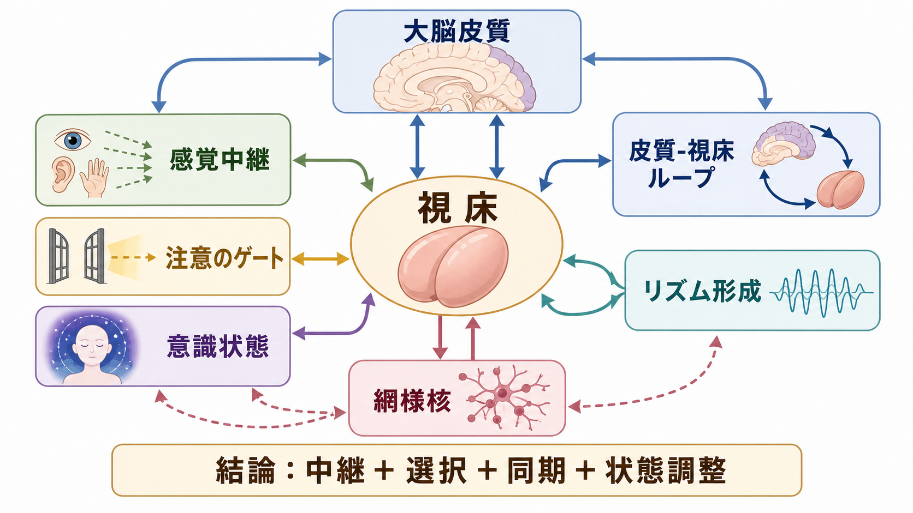
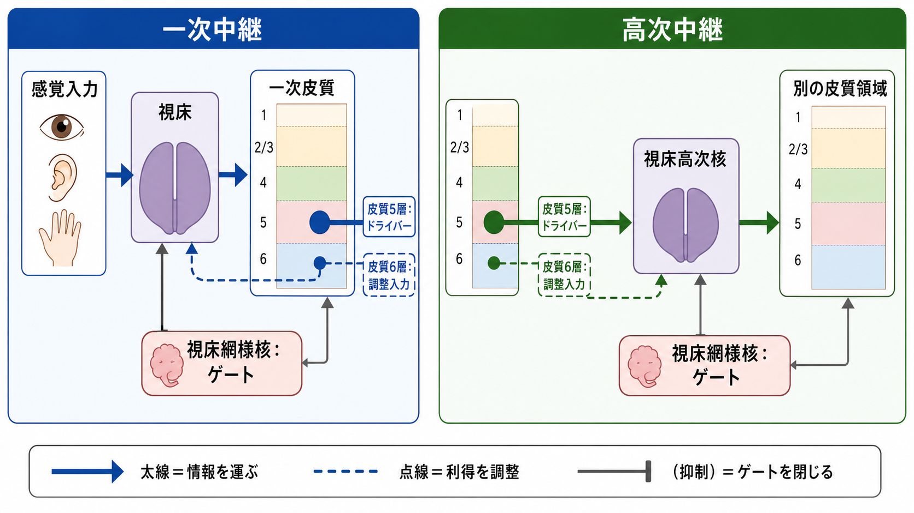
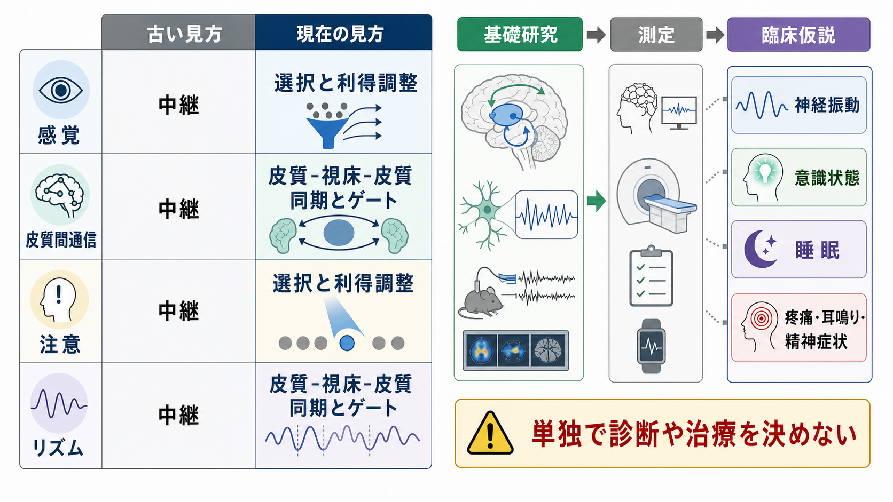

# 視床は単なる中継核なのか

## 要点

- 視床は、網膜や体性感覚などの入力を[[大脳皮質の層構造は情報の流れをどう決めるのか|大脳皮質]]へ送る「中継核」として重要だが、それだけでは説明が足りない。
- 現在の視床研究では、視床は皮質からの入力も受け、[[脳内ネットワークとは何か|脳内ネットワーク]]の情報の流れ、注意の選択、皮質間通信、[[神経振動とは何か|神経振動]]、意識状態を調整する回路ハブとして扱われる[1][3][4]。
- とくに高次視床核は、皮質5層から強い入力を受け、別の皮質領域へ送る「皮質-視床-皮質」経路をつくる[1][2]。
- 視床網様核やプルビナーなどは、入力の利得調整、同期、注意による情報選択に関わる[4][5][6]。
- ただし、視床活動だけで意識、注意、精神症状、治療方針を単独で説明できるわけではない。教育・研究目的の回路仮説として読む必要がある。

## この記事で答える問い

1. なぜ視床は「中継核」と呼ばれてきたのか。
2. その見方はどこまで正しく、どこから不十分なのか。
3. 皮質-視床ループは、注意・意識・リズム形成にどう関わるのか。
4. 研究や臨床を読むとき、どのような過剰解釈を避けるべきか。

## まず結論

視床は「単なる中継核」ではない。より正確には、視床は中継を含むが、中継の仕方そのものを皮質、視床網様核、神経修飾系、行動文脈によって変える構造である。一次感覚入力を皮質へ送る役割は確かにあるが、高次視床核では、皮質から来た情報を別の皮質領域へ送る経路が目立つ[1][2]。このため視床は、外界から皮質への入口であるだけでなく、皮質間通信を選択・増幅・同期させる結節点として理解した方がよい。

## 背景

古典的には、視床は「嗅覚を除く感覚情報を大脳皮質へ送る中継所」と説明されることが多い。この説明は入門としては有用である。たとえば外側膝状体は網膜から入力を受け、視覚皮質へ送る。腹側後核は体性感覚情報を受け、体性感覚皮質へ送る。この意味で、視床は感覚情報が皮質へ入る重要な通路である。

しかし、視床ニューロンがしていることは、入力をそのままコピーしているだけではない。視床細胞は発火モード、同期、抑制性入力、皮質からのフィードバックによって、どの入力を強く通すかを変える[3][5]。さらに高次視床核では、皮質から来た信号を別の皮質領域へ送る経路があり、これは皮質-皮質直接結合と並ぶもう一つの通信路として機能しうる[1][2]。

## 基本概念

### 一次中継と高次中継

Sherman は、視床への入力を「ドライバー」と「モジュレーター」に分ける見方を提案している[1]。ドライバー入力は、伝えるべき主要な情報を運ぶ入力である。モジュレーター入力は、その情報がどれほど通りやすいか、どの状態で処理されるかを調整する入力である。

この区別を使うと、視床核は大まかに次のように整理できる。

| 種類 | 主な入力 | 役割のイメージ | 例 |
|---|---|---|---|
| 一次中継 | 感覚器・末梢・皮質下からのドライバー入力 | 外界や身体からの情報を皮質へ送る | 外側膝状体、腹側後核など |
| 高次中継 | 皮質5層からのドライバー入力 | ある皮質領域の出力を、視床を介して別の皮質領域へ送る | プルビナー、内側背側核など |

一次中継は「視床=感覚中継」という説明に近い。一方、高次中継は「視床=皮質間通信の一部」という見方を必要とする。マウスの研究では、一次体性感覚皮質から高次体性感覚皮質への情報伝達に、皮質-視床-皮質経路が実際に高次皮質活動を駆動しうることが示された[2]。

### 視床網様核

視床網様核は、視床の外側を覆うように位置するGABA作動性の構造で、視床核へ抑制性入力を返す。重要なのは、視床網様核が「視床を止めるブレーキ」だけではないことである。皮質からのトップダウン入力と組み合わさると、特定の感覚チャネルを抑えたり、通したりするゲートとして働く可能性がある[5]。

### プルビナー

プルビナーは霊長類で大きく発達した高次視床核で、視覚皮質の複数領域と結合する。注意課題中のサルで、プルビナーは皮質領域間の同期と情報伝達を注意要求に応じて調整することが報告されている[6]。これは「視床が皮質へ送る」だけでなく、「視床が皮質同士の通信条件を整える」ことを示す例である。

## 仕組み

### 1. 中継はコピーではなく、利得調整を含む

視床中継は、入力信号の単純な転送ではない。皮質6層からのフィードバック、視床網様核からの抑制、神経修飾系の状態によって、同じ感覚入力でも皮質へ届く強さやタイミングが変わる[1][3]。したがって「中継」という言葉は、受動的なケーブルではなく、文脈依存的なゲートとして理解した方がよい。

### 2. 高次視床核は皮質間通信を支える

皮質領域同士は直接結合しているが、それと並行して視床を介する経路も存在する。高次視床核は皮質5層から強いドライバー入力を受け、別の皮質領域へ投射する[1]。この経路は、皮質階層の情報伝達、運動指令のコピー、予測信号、注意文脈の共有に関わる可能性がある。

ここで重要なのは、視床を「皮質の下にある入口」とだけ見ないことである。むしろ視床は、皮質ネットワークの中に埋め込まれた再帰的な通信ノードであり、[[リカレント回路はどのように記憶や持続活動を支えるのか|リカレント回路]]の一部として働く。

### 3. 注意は皮質だけで完結しない

注意は、前頭前野や頭頂葉などの皮質領域だけで説明されがちである。しかし、分割注意課題を用いた研究では、前頭前野から視床網様核への経路が視床の感覚利得を調整し、課題に必要な感覚入力を選択することが示された[5]。また、プルビナーは注意対象に応じて視覚皮質領域間の同期を調整する[6]。

この見方では、注意は「皮質が視床に命令する」だけでも、「視床が皮質を支配する」だけでもない。皮質と視床が相互に結合し、どの情報が現在の行動に必要かを回路全体で調整する過程である。

### 4. リズム形成と状態制御

睡眠・覚醒に伴う脳波リズムは、皮質だけで作られるわけではない。視床皮質細胞と視床網様核細胞の相互作用は、睡眠紡錘波、デルタ波、覚醒時のトニック発火などに関わる[7]。つまり視床は、情報の内容だけでなく、情報が流れる時間構造も調整する。

この点は[[神経同期とは何か|神経同期]]や[[ガンマ振動は認知機能にどう関わるのか|ガンマ振動]]の理解ともつながる。視床-皮質ループが発火のタイミングをそろえることで、皮質領域間の通信が通りやすくなったり、逆に不要な入力が抑えられたりする。

## 図解

図1は、視床を感覚中継、注意のゲート、皮質-視床ループ、意識状態、リズム形成を結ぶ概念地図として示したものである。図2は、一次中継と高次中継を対比している。図3は、古い見方と現在の見方の違い、および基礎研究・測定・臨床仮説への接続をまとめている。

## 臨床・研究との接続

### 意識状態

意識状態の研究では、視床と前頭・頭頂皮質の相互作用が重視される。マカクを用いた研究では、中心外側視床と前頭頭頂皮質の深層活動が覚醒、睡眠、麻酔状態で変化し、中心外側視床への特定周波数刺激が麻酔下の覚醒様反応を引き起こした[8]。これは、視床が意識の「場所」だという意味ではない。むしろ、意識状態を支える広域皮質-視床相互作用の一部として視床が重要である、という意味で読むべきである。

### 睡眠と脳波

睡眠紡錘波やデルタ活動は、視床-皮質系の代表的なリズムである[7]。このため、睡眠研究で視床は感覚遮断の門番としてだけでなく、睡眠段階を特徴づける時間構造を生み出す回路として扱われる。

### 注意・認知制御

注意課題では、視床網様核やプルビナーが入力の選択、皮質間同期、機能的結合の切り替えに関わる[4][5][6]。この観点は、[[サリエンスネットワークとは何か|サリエンスネットワーク]]のような大規模ネットワーク概念とも接続できる。どの刺激が重要かを決めるだけでなく、その情報がどの皮質領域間で通りやすくなるかを調整する点が重要である。

### 臨床応用を読むときの注意

視床-皮質ループの異常は、意識障害、睡眠障害、疼痛、耳鳴り、精神症状などの研究文脈で議論されることがある。しかし、個別の症状を「視床の異常」と単純に同定することはできない。症状、行動評価、画像、脳波・MEG、薬理、発達歴、心理社会的要因を合わせて考える必要がある。本記事の内容は教育・研究目的であり、個別診断や治療指示ではない。

## よくある誤解

### 誤解1: 視床は感覚情報をそのまま皮質へ渡す

視床は感覚情報の通路だが、その通路は固定されたケーブルではない。皮質からのフィードバックや視床網様核の抑制によって、同じ入力でも通りやすさが変わる[1][5]。

### 誤解2: 高次認知は皮質だけで説明できる

皮質は高次認知に中心的だが、視床は皮質領域間の同期、利得調整、タスク関連ネットワークの構成に関わる[4][6]。高次認知を読むときは、皮質だけでなく皮質-視床ループも含めた回路として見る必要がある。

### 誤解3: 視床が意識を作っている

視床は意識状態に関わるが、単独の発生源ではない。意識状態は、視床、皮質深層、皮質間フィードバック、脳幹覚醒系などを含む広域相互作用として扱う方が妥当である[8]。

### 誤解4: 神経振動が変われば原因がわかる

神経振動は重要な観察窓だが、振動の変化は原因、結果、補償、測定条件の影響をすべて含みうる。視床-皮質リズムも、周波数名だけで機能を決めつけず、課題、状態、領域、解析手法とセットで読む必要がある[7]。

## 関連ノート

- [[神経回路とは何か]]
- [[脳内ネットワークとは何か]]
- [[神経振動とは何か]]
- [[神経同期とは何か]]
- [[ガンマ振動は認知機能にどう関わるのか]]
- [[シータリズムは記憶とナビゲーションをどう支えるのか]]
- [[リカレント回路はどのように記憶や持続活動を支えるのか]]
- [[サリエンスネットワークとは何か]]
- [[大脳皮質の層構造は情報の流れをどう決めるのか]]

MOC更新候補: `content/00_MOC/` 配下の脳・神経科学系MOC、神経回路・脳ネットワーク系MOCに本記事へのリンクを追加する。

## 理解チェック

1. 視床を「中継核」と呼ぶ説明は、どの範囲では正しいか。
2. 一次中継と高次中継では、主なドライバー入力の出どころがどう違うか。
3. 視床網様核は、注意においてどのようなゲート機能を持ちうるか。
4. プルビナーが皮質領域間の同期を調整するという知見は、注意の理解をどう変えるか。
5. 視床-皮質リズムを臨床症状に結びつけるとき、どのような過剰解釈を避けるべきか。

## 参考文献

[1] Sherman, S. M. (2016). Thalamus plays a central role in ongoing cortical functioning. *Nature Neuroscience*, 19, 533-541. https://doi.org/10.1038/nn.4269

[2] Theyel, B. B., Llano, D. A., & Sherman, S. M. (2010). The corticothalamocortical circuit drives higher-order cortex in the mouse. *Nature Neuroscience*, 13, 84-88. https://doi.org/10.1038/nn.2449

[3] Saalmann, Y. B., & Kastner, S. (2011). Cognitive and perceptual functions of the visual thalamus. *Neuron*, 71(2), 209-223. https://doi.org/10.1016/j.neuron.2011.06.027

[4] Halassa, M. M., & Kastner, S. (2017). Thalamic functions in distributed cognitive control. *Nature Neuroscience*, 20, 1669-1679. https://doi.org/10.1038/s41593-017-0020-1

[5] Wimmer, R. D., Schmitt, L. I., Davidson, T. J., Nakajima, M., Deisseroth, K., & Halassa, M. M. (2015). Thalamic control of sensory selection in divided attention. *Nature*, 526, 705-709. https://doi.org/10.1038/nature15398

[6] Saalmann, Y. B., Pinsk, M. A., Wang, L., Li, X., & Kastner, S. (2012). The pulvinar regulates information transmission between cortical areas based on attention demands. *Science*, 337(6095), 753-756. https://doi.org/10.1126/science.1223082

[7] McCormick, D. A., & Bal, T. (1997). Sleep and arousal: thalamocortical mechanisms. *Annual Review of Neuroscience*, 20, 185-215. https://doi.org/10.1146/annurev.neuro.20.1.185

[8] Redinbaugh, M. J., Phillips, J. M., Kambi, N. A., Mohanta, S., Andryk, S., Dooley, G. L., Afrasiabi, M., Raz, A., & Saalmann, Y. B. (2020). Thalamus modulates consciousness via layer-specific control of cortex. *Neuron*, 106(1), 66-75.e12. https://doi.org/10.1016/j.neuron.2020.01.005

## 未解決問題

- 高次視床核が、皮質-皮質直接結合とどのように役割分担しているのか。
- 注意、作業記憶、意識状態で、視床核ごとの機能差をどこまで一般化できるのか。
- ヒトの非侵襲計測で、視床-皮質ループの因果的役割をどの程度推定できるのか。
- 視床-皮質リズムの変化を、症状理解や治療標的にどう慎重に結びつけるべきか。
