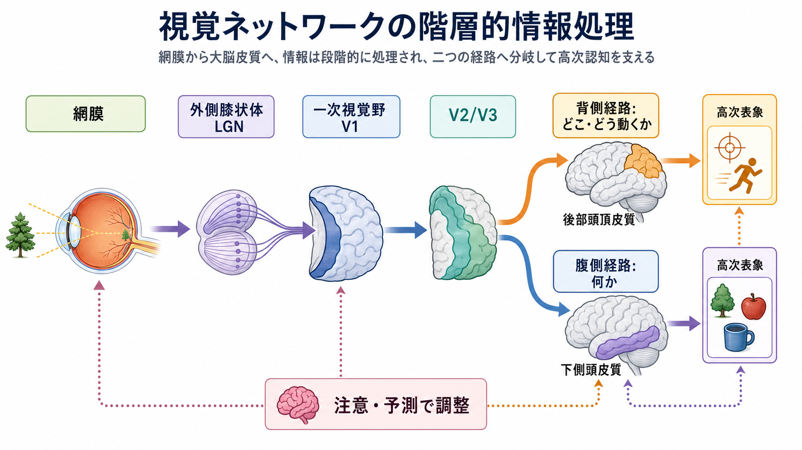
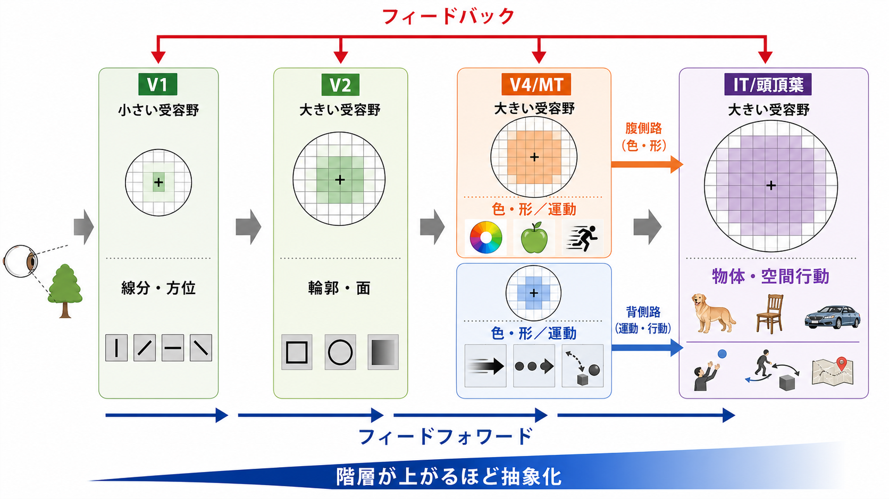
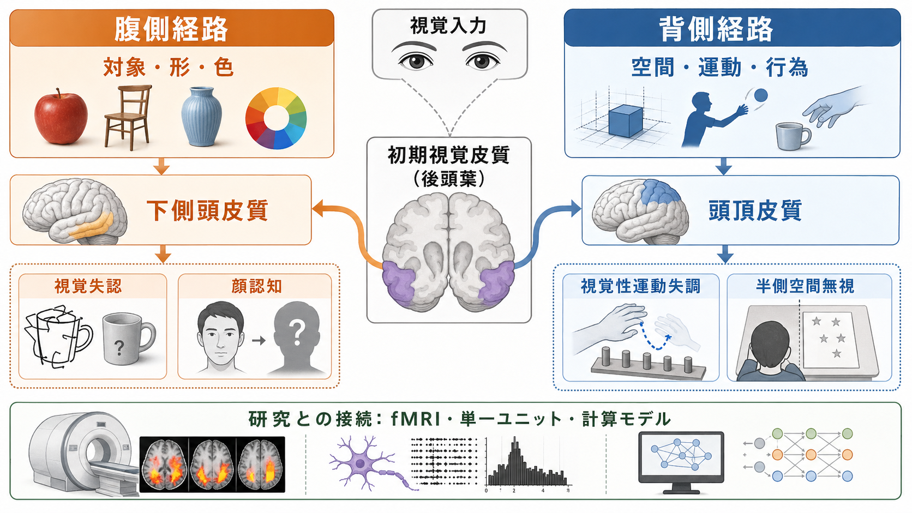

# 視覚ネットワークはどのように階層的に情報処理するのか

## 要点

- 視覚情報は、網膜から外側膝状体、一次視覚野 V1、V2/V3、V4・MT、下側頭皮質・頭頂皮質へと進むにつれて、局所的な明暗や方位から、形、色、運動、物体、空間行動へと抽象化される。
- 「階層」とは単なる直列の中継ではなく、下位領域から上位領域への[[フィードフォワード回路はどのように情報を処理するのか|フィードフォワード]]、上位領域から下位領域への[[フィードバック回路は脳内情報処理をどう調節するのか|フィードバック]]、同じ階層内の側方結合が重なった構造である[1][2]。
- 腹側経路は主に「何か」、すなわち対象、形、色、物体同一性の処理に関わり、背側経路は主に空間、運動、視覚誘導性行為に関わる[3][4]。
- ただし腹側経路と背側経路は完全に独立した配線ではない。物体をつかむ、顔を見る、空間内で行動するなどの日常的な視覚では、両経路と注意・予測が相互作用する。

## この記事で答える問い

1. 一次視覚野 V1 は、視覚情報をどのような単位に分解しているのか。
2. 階層が上がると、受容野や表象はどのように変わるのか。
3. 腹側経路と背側経路は、何を分担しているのか。
4. 階層処理モデルは、研究や臨床的観察をどう理解する助けになるのか。

## まず結論

視覚ネットワークの階層処理は、「画像をそのまま脳内に写す過程」ではない。網膜上の光の分布は、早い段階で局所的なコントラスト、方位、空間周波数、運動方向などに分解される。V1 のニューロンが線分の向きや位置に選択的に反応することは、古典的な受容野研究から示されてきた[1]。その後、V2/V3、V4、MT、下側頭皮質、頭頂皮質へ進むにつれ、局所特徴はより大きな受容野の中で統合され、物体・場面・空間行動に使える表象へ変換される[2][5]。

この処理は大きく二つの流れに分かれる。腹側経路は後頭葉から側頭葉へ向かい、対象の形、色、同一性、カテゴリ認識を支える。背側経路は後頭葉から頭頂葉へ向かい、空間位置、運動、眼球運動、到達・把持などの行為制御に関わる[3][4]。しかし、これは「腹側だけが物体」「背側だけが空間」という単純な二分法ではない。背側経路にも複数のサブ経路があり、視覚誘導性行為、空間ワーキングメモリ、ナビゲーションなどに分かれて働くと考えられている[6]。

## 背景

視覚系が階層的だと考えられる理由は、少なくとも三つある。第一に、神経解剖学的に、網膜、視床、V1、複数の外線条皮質、高次連合野の間に順序だった結合がある。Felleman と Van Essen は、サル大脳皮質の多数の領域間結合を整理し、視覚皮質を含む広い皮質ネットワークが階層的かつ再帰的に構成されていることを示した[2]。

第二に、ニューロンの応答性が段階的に変わる。初期段階では、刺激の位置や方位に厳密な反応が多い。高次段階では、刺激の位置や大きさが多少変わっても同じ対象として扱えるような、より不変な表象が増える。腹側視覚経路、とくに下側頭皮質の活動は、迅速な物体認識を支える強力な表象を形成するとされる[5]。

第三に、損傷研究や神経心理学的観察が、処理の分担を示唆する。後頭側頭領域の障害では対象認識や顔認知に問題が出やすく、後頭頭頂領域の障害では空間注意、運動視、視覚誘導性行為に問題が出やすい。ただし、ここでの説明は教育・研究目的の整理であり、個別症状の診断や治療指示ではない。

## 基本概念

### 受容野

受容野とは、あるニューロンの活動を変化させる感覚空間の範囲である。視覚系では、網膜上のどの位置の光刺激に反応するかを指すことが多い。初期視覚野の受容野は比較的小さく、位置や方位に鋭敏である。高次視覚野へ進むほど、受容野は大きくなり、複数の特徴を組み合わせた刺激に反応しやすくなる[1][5]。

### 階層

階層とは、下位領域が局所的・単純な特徴を扱い、上位領域がより大きな範囲・複雑な組み合わせを扱う傾向を指す。ただし、実際の[[神経回路とは何か|神経回路]]は一方向の階段ではない。下位から上位へのフィードフォワード信号に加えて、上位から下位へ戻るフィードバック信号、同じ階層内で特徴を競合・統合する側方結合がある。局所的なコントラスト強調には、[[側方抑制はなぜコントラストを強調するのか|側方抑制]]のような仕組みも関わる。

### 腹側経路と背側経路

腹側経路は、後頭葉から側頭葉へ向かう流れで、「何を見ているのか」を扱う経路として整理されてきた。背側経路は、後頭葉から頭頂葉へ向かう流れで、「どこにあるか」または「どう行為に使うか」を扱う経路として整理されてきた[3][4]。現在では、背側経路は一枚岩ではなく、眼球運動・空間ワーキングメモリ・行為制御・ナビゲーションに関わる複数のサブ経路として理解される[6]。

## 仕組み

### 1. 網膜と視床で入力が整理される

視覚処理は網膜から始まる。網膜は光を電気信号に変えるだけでなく、中心-周辺型の受容野によって明暗差や局所コントラストを強調する。これは後の皮質処理に入る前の重要な前処理である。網膜からの信号は外側膝状体を経て V1 に届く。

### 2. V1 で局所特徴が抽出される

V1 では、線分の向き、位置、両眼視差、空間周波数などに選択的なニューロンが見られる。Hubel と Wiesel の研究は、一次視覚野のニューロンが単なる明暗点ではなく、特定の方位をもつ線分やエッジに強く反応することを示した[1]。この段階は、物体そのものを認識するというより、物体認識に必要な部品を作る段階に近い。

### 3. 階層が上がるほど受容野は広がり、特徴は複雑になる

V2/V3 では輪郭、境界、面、奥行き、より複雑なパターンが扱われる。V4 は色や形、MT は運動に関わる領域としてよく知られる。さらに腹側経路の下側頭皮質では、形や特徴の組み合わせが物体カテゴリや個体識別に使いやすい表象へ変換される[5]。背側経路では、運動、空間位置、身体との関係、行為可能性に関わる情報が強くなる[4][6]。

### 4. フィードフォワードだけではなく再帰処理が働く

視覚入力が提示されると、活動は短時間で多くの視覚領域へ広がる。しかし、知覚は最初のフィードフォワード sweep だけで完結しない。領域内の水平結合や、高次領域から低次領域へのフィードバックによって、注意、文脈、予測、課題要求に応じた調整が生じる[7]。たとえば、同じ線分でも、背景、期待、注意の向け方によって見え方や神経応答は変わりうる。

### 5. ヒト視覚皮質は複数の視野地図をもつ

ヒトの視覚皮質には、V1 だけでなく、V2、V3、hV4、MT+、頭頂葉内側溝周辺など、多数の視野地図がある。視野地図とは、網膜上で近い位置が皮質上でも近い位置に表現される構造である。fMRI を用いた研究により、ヒト皮質で複数の視野地図が同定され、階層処理と並列処理を理解する基盤になっている[8]。

## 図解

| 図 | 見るポイント |
|---|---|
| 図1 | 網膜、外側膝状体、V1、V2/V3 から、腹側経路と背側経路へ分岐する全体像。注意・予測が下位処理を調整する点も重要。 |
| 図2 | V1 から高次領域へ進むほど、受容野が大きくなり、線分から輪郭、色・形、運動、物体・空間行動へ抽象化される流れ。 |
| 図3 | 腹側経路と背側経路の分担、および視覚失認、顔認知、視覚性運動失調、半側空間無視などの研究・臨床的観察との接続。 |

## 臨床・研究との接続

腹側経路と背側経路の区別は、神経心理学や脳画像研究で有用な整理軸になる。腹側経路の障害は、見えているのに対象を同定しにくい視覚失認、顔認知の障害、色や形の処理困難と関連して議論されることが多い。背側経路の障害は、空間注意の偏り、運動視の障害、視覚情報を行為に変換する困難と関連して議論される[4][6]。

研究面では、単一ユニット記録、fMRI、心理物理学、計算モデルが組み合わされる。下側頭皮質の集団活動が物体認識を支えること、ヒト視覚皮質に複数の視野地図があること、再帰処理が注意や意識的知覚に関わることは、それぞれ異なる方法から支持されている[5][7][8]。一方で、視覚認識を完全に説明するアルゴリズムはまだ未解決であり、深層学習モデルとの比較も有用だが、脳の可塑性、注意、発達、身体行為を単純に置き換えるものではない。

## よくある誤解

### 誤解1: V1 は単なる中継所である

V1 は中継所ではなく、方位、空間周波数、視差などの特徴を抽出する能動的な処理段階である。網膜や外側膝状体からの入力を、その後の皮質処理が使いやすい形に変換する。

### 誤解2: 腹側経路は「物体」、背側経路は「空間」だけを扱う

この二分法は入門として有用だが、現在の理解としては粗い。背側経路は「どこ」だけでなく「どう行為に使うか」に関わり、さらに複数のサブ経路に分かれる[4][6]。腹側経路も、注意や行為文脈から独立して物体だけを処理しているわけではない。

### 誤解3: 階層処理は一方向に進むだけである

実際の視覚ネットワークは、フィードフォワード、フィードバック、側方結合が重なった再帰的なシステムである。速い初期処理は重要だが、注意深い知覚、文脈依存的な認識、意識的な報告には再帰処理が関わる[7]。

## 関連ノート

- [[神経回路とは何か]]
- [[脳内ネットワークとは何か]]
- [[フィードフォワード回路はどのように情報を処理するのか]]
- [[フィードバック回路は脳内情報処理をどう調節するのか]]
- [[側方抑制はなぜコントラストを強調するのか]]

今後の作成候補:

- 視覚ネットワークはどのように情報を処理するのか
- 視覚認知はどのように対象を認識するのか
- 顔認知はなぜ特別なのか
- 失認とは何か
- 盲視とは何か

MOC 更新候補:

- `content/00_MOC/` 配下の脳・神経科学、神経回路、感覚処理に関する MOC
- 並列ジョブ完了後に、本記事を神経回路・脳ネットワーク、感覚処理、認知神経科学の入口として追加する

## 理解チェック

1. V1 のニューロンが、単なる明暗点ではなく方位やエッジに反応することは、視覚階層処理のどの部分を支えているか。
2. 階層が上がるほど、受容野と表象はどのように変化するか。
3. 腹側経路と背側経路の区別を、「何」と「どこ・どう行為するか」という言葉で説明できるか。
4. フィードバック処理がなければ説明しにくい視覚現象には、どのようなものがあるか。
5. 腹側・背側の二分法を使うとき、どのような単純化に注意すべきか。

## 参考文献

[1] Hubel, D. H., & Wiesel, T. N. (1962). Receptive fields, binocular interaction and functional architecture in the cat's visual cortex. *The Journal of Physiology*, 160(1), 106-154. https://doi.org/10.1113/jphysiol.1962.sp006837

[2] Felleman, D. J., & Van Essen, D. C. (1991). Distributed hierarchical processing in the primate cerebral cortex. *Cerebral Cortex*, 1(1), 1-47. https://doi.org/10.1093/cercor/1.1.1-a

[3] Mishkin, M., Ungerleider, L. G., & Macko, K. A. (1983). Object vision and spatial vision: two cortical pathways. *Trends in Neurosciences*, 6, 414-417. https://doi.org/10.1016/0166-2236(83)90190-X

[4] Goodale, M. A., & Milner, A. D. (1992). Separate visual pathways for perception and action. *Trends in Neurosciences*, 15(1), 20-25. https://doi.org/10.1016/0166-2236(92)90344-8

[5] DiCarlo, J. J., Zoccolan, D., & Rust, N. C. (2012). How does the brain solve visual object recognition? *Neuron*, 73(3), 415-434. https://doi.org/10.1016/j.neuron.2012.01.010

[6] Kravitz, D. J., Saleem, K. S., Baker, C. I., & Mishkin, M. (2011). A new neural framework for visuospatial processing. *Nature Reviews Neuroscience*, 12, 217-230. https://doi.org/10.1038/nrn3008

[7] Lamme, V. A. F., & Roelfsema, P. R. (2000). The distinct modes of vision offered by feedforward and recurrent processing. *Trends in Neurosciences*, 23(11), 571-579. https://doi.org/10.1016/S0166-2236(00)01657-X

[8] Wandell, B. A., Dumoulin, S. O., & Brewer, A. A. (2007). Visual field maps in human cortex. *Neuron*, 56(2), 366-383. https://doi.org/10.1016/j.neuron.2007.10.012

## 未解決問題

- 腹側経路と背側経路の相互作用を、課題・注意・身体行為ごとにどこまで分解できるか。
- 深層ニューラルネットワークの階層表現は、どの範囲で生物学的視覚ネットワークの説明になるか。
- 予測、注意、意識的知覚を支えるフィードバック処理を、どの時間スケール・皮質層・周波数帯で測るのが最も妥当か。
