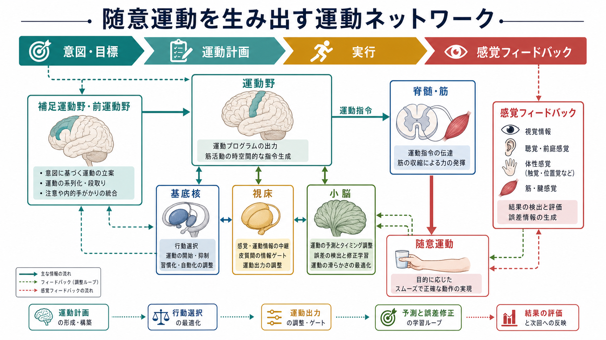
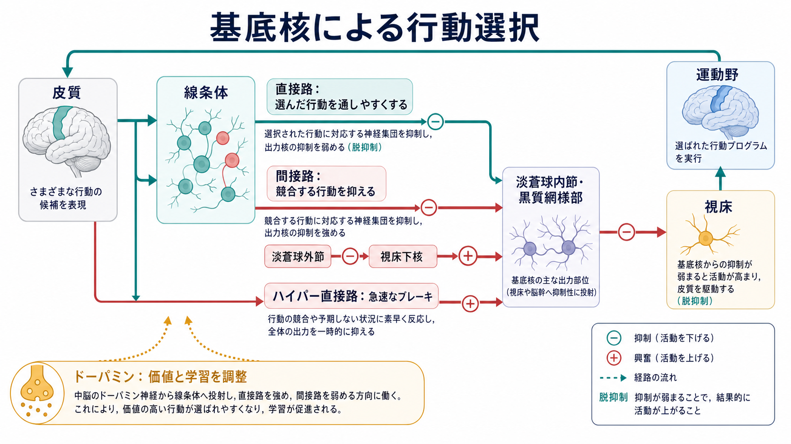

---
title: "運動ネットワークは随意運動をどう生み出すのか"
description: "運動野・補足運動野・基底核・小脳が協調して、随意運動を計画・選択・実行・修正する仕組みを整理する。"
aliases:
  - "運動ネットワークは随意運動をどう生み出すのか"
tags:
  - neuroscience
  - basic-neuroscience
  - motor-control
  - brain-networks
  - obsidian
created: "2026-04-27"
updated: "2026-04-27"
draft: true
publish: false
status: draft
enableToc: true
---

# 運動ネットワークは随意運動をどう生み出すのか

## 要点

- 随意運動は、単一の「運動中枢」から出る命令ではなく、皮質、基底核、小脳、視床、脊髄、感覚フィードバックが作る分散的な[[脳内ネットワークとは何か|脳内ネットワーク]]の働きで生じる。
- 補足運動野・前運動野は、意図、文脈、手順、行為系列を運動計画へ変換する。一次運動野は、その計画を筋活動へ近づける皮質脊髄出力とオンライン制御に深く関わる[1][2]。
- 基底核は、運動を直接「作る」というより、候補となる行動の通りやすさを調整し、選ばれた行動を促通し、競合行動を抑えるゲートとして働く[3][7]。
- 小脳は、運動指令の遠心性コピーと感覚フィードバックを照合し、予測誤差を用いてタイミング、力、協調、運動学習を調整する[4][5]。
- したがって随意運動は、「計画する」「選ぶ」「出力する」「予測する」「誤差で直す」という複数の計算が重なった過程である。

## この記事で答える問い

1. 運動野・補足運動野・基底核・小脳は、それぞれ随意運動のどの部分を担うのか。
2. 「運動指令」は、どのように行動選択、感覚予測、フィードバック制御と結びつくのか。
3. パーキンソン病、失調、ジストニアなどの臨床像は、運動ネットワークの理解とどう接続できるのか。

## まず結論

随意運動は、意図から筋収縮までを一直線に流す単純な命令系ではない。より正確には、皮質が目的と運動プログラムを構成し、基底核が行動候補の選択と抑制を調整し、小脳が予測と誤差修正を行い、一次運動野と脊髄が筋活動へ変換し、感覚フィードバックが次の制御を更新する循環過程である[1][5][6]。

このため、同じ「手を伸ばす」という動作でも、何に手を伸ばすのか、急ぐのか、重いものを持つのか、失敗したらどう修正するのかによって、関与する回路の重みは変わる。運動ネットワークは、固定された配線図というより、課題と文脈に応じて有効な結合が変化する[[有効結合とは何か|有効結合]]のシステムとして理解するとよい。

## 背景

古典的には、運動系は「一次運動野から脊髄へ命令が下り、筋が動く」という皮質脊髄路中心の図式で説明されてきた。この図式は重要だが、それだけでは、運動の開始、系列化、選択、抑制、誤差修正、習慣化、運動学習を十分に説明できない。

たとえば、コップを取る動作では、視覚的な目標、手の現在位置、コップの重さの予測、把持の形、姿勢調整、競合する行動の抑制、失敗時の修正が同時に必要になる。一次運動野は随意運動に重要だが、その活動は単一の運動変数だけを表すのではなく、方向、力、姿勢、感覚フィードバック、課題目標など複数の情報と結びつく[2]。

この見方は、運動系を個別部位の足し算ではなく、[[神経回路とは何か|神経回路]]とネットワークの協調として捉える立場に近い。基底核と小脳も、皮質から独立した補助装置ではなく、視床や皮質を介した閉ループ、さらに相互接続をもつ大規模ネットワークの一部である[6][7]。

## 基本概念

### 随意運動

随意運動とは、目標や意図に基づいて開始・調整される運動である。ただし「意識している運動」だけを意味しない。多くの随意運動は、開始時には意図的でも、実行中には自動化された姿勢調整、反射、予測制御、感覚フィードバック制御に支えられる。

### 運動計画

運動計画は、「どの身体部位を、どの順序で、どのタイミングと力で動かすか」を決める過程である。補足運動野と前運動野は、行為系列、内的に開始される運動、外的手がかりに基づく運動、認知的文脈と行為の接続に関与する[1]。

### 行動選択

行動選択とは、複数の行動候補から現在の文脈に合うものを通し、競合するものを抑える過程である。基底核の古典的モデルでは、直接路、間接路、ハイパー直接路が、運動出力の促通、競合行動の抑制、急速なブレーキを担う枠組みとして説明される[3][7]。

### 内部モデル

内部モデルとは、身体や環境の変化を脳内で予測する仕組みである。小脳は、運動指令の遠心性コピーから「この指令なら次にどの感覚結果が生じるか」を予測し、実際の感覚フィードバックとの差を使って制御を更新する[4][5]。

## 仕組み

### 1. 皮質は目標を運動計画へ変換する

運動の出発点は、単なる筋収縮ではなく、目標である。目標は、前頭葉、頭頂葉、感覚野、記憶、報酬価値などの情報と結びつき、補足運動野・前運動野で行為系列や運動プログラムへ変換される。補足運動野と前補足運動野は、行為の内的生成、系列の準備、ルールと行為の接続に関わるとされる[1]。

一次運動野は、計画された行為を皮質脊髄路を通じて脊髄運動系へ伝える主要な出力源である。ただし、一次運動野を「筋肉のスイッチ」と見るのは単純すぎる。霊長類研究では、個々の運動野ニューロンは広い方向選好を持ち、集団活動として運動方向を表現できることが示された[8]。一方で、その活動は方向だけでなく、姿勢、力、感覚入力、課題文脈にも関わるため、一次運動野は多変量のセンサリモータ制御領域として理解する必要がある[2]。

### 2. 基底核は行動候補をゲートする

基底核は、候補行動の中から文脈に合うものを通しやすくし、不要な行動を出にくくする。Mink の古典的仮説では、基底核は運動そのものを生成するのではなく、望ましい運動プログラムを焦点化し、競合する運動プログラムを抑制する装置として位置づけられる[3]。

直接路は基底核出力核から視床への抑制を弱め、結果として皮質活動を通しやすくする。間接路は競合行動に対応する出力を抑えやすくする。ハイパー直接路は、皮質から視床下核を介して基底核出力を急速に高め、進行中または準備中の行動を一時的に止めるブレーキとして考えられる[7]。

ただし、「直接路はアクセル、間接路はブレーキ」という説明は便利だが、現代的には不十分である。実際の運動開始では両経路が同時に活動し、強さ、タイミング、文脈、学習履歴に応じて基底核出力を整形すると考える方がよい[7]。ドーパミンは、行動価値や予測誤差に応じてこの選択過程と学習を調整する[7][5]。

### 3. 小脳は予測して、ずれを使って直す

小脳は、随意運動をなめらかにし、タイミングと協調を調整し、誤差から学習する。重要なのは、小脳が単に「動いた後の誤差」を受け取るだけでなく、運動指令の遠心性コピーを用いて、次に生じる感覚結果を先回りして予測する点である[4]。

感覚フィードバックは遅れる。したがって、速い運動を安定に制御するには、現在の身体状態を完全に待つのではなく、「いま身体はこうなっているはずだ」という推定が必要になる。小脳の内部モデルは、この推定を支え、実際の感覚フィードバックとのずれを次回の運動に反映する[4][5]。

この考え方は、運動学習にもつながる。たとえばプリズム適応や力場適応では、最初は手先がずれるが、反復により予測が更新され、誤差が減る。小脳損傷では、このような誤差ベースの適応が障害されやすい[5]。

### 4. 視床は単なる中継ではなく、ループのゲートである

視床は、皮質、基底核、小脳のループをつなぐ重要な節点である。基底核と小脳は、視床を介して運動野・前運動野へ影響を返す。したがって視床は、単純なリレーというより、皮質に戻る情報のタイミング、強さ、経路を調整するネットワーク上のゲートとして働く。

近年の解剖学的研究は、小脳、基底核、皮質が互いに分離したモジュールではなく、複数の閉ループと相互連絡をもつネットワークであることを示している[6][7]。このため、運動障害を理解するときも「どの部位が壊れたか」だけでなく、「どのループの調整が崩れたか」を考える必要がある。

## 図解

この記事の図は、次の 3 つの水準を分けて読むと理解しやすい。

| 図 | 主題 | 読み方 |
|---|---|---|
| 図1 | 運動ネットワーク全体 | 意図、計画、行動選択、実行、感覚フィードバックが閉じたループを作る。 |
| 図2 | 基底核の行動選択 | 直接路・間接路・ハイパー直接路は、単純なオン/オフではなく、候補行動の通りやすさを整える。 |
| 図3 | 小脳の予測と誤差修正 | 運動指令、遠心性コピー、感覚予測、実際のフィードバックの差が運動学習を進める。 |

## 臨床・研究との接続

パーキンソン病では、黒質ドーパミン神経の変性により、基底核-視床-皮質ループのゲート調整が変化し、動作緩慢、振戦、筋強剛、運動開始困難などが生じる。これは教育的な一般説明であり、個別の診断や治療指示ではない。重要なのは、症状を単に「筋力低下」と見るのではなく、行動選択、運動開始、抑制、リズム形成のネットワーク異常として見る点である[3][7]。

小脳障害では、筋力そのものよりも、タイミング、協調、予測、誤差修正が崩れやすい。測定過大、運動分解、意図振戦、失調歩行などは、小脳が運動の誤差を予測的に減らす仕組みと関係する[4][5]。

ジストニアやチック、強迫的な運動習慣なども、単一部位の異常というより、皮質-基底核-小脳ネットワークの選択、抑制、学習、タイミングの異常として研究されている[6][7]。また、脳卒中後リハビリテーションやブレイン・マシン・インターフェースでは、運動野の集団活動、感覚フィードバック、可塑性をどう利用するかが中心課題になる[2][8]。

## よくある誤解

### 誤解1: 運動野がすべての運動を直接命令している

一次運動野は重要な出力源だが、随意運動の全過程を単独で担うわけではない。運動の選択、系列化、予測、誤差修正、感覚統合には、補足運動野、前運動野、基底核、小脳、視床、頭頂葉、脊髄が関与する[1][2][6]。

### 誤解2: 基底核は運動を作る場所である

基底核は運動を直接生成するというより、候補行動の選択と抑制を調整する。選ばれた行動が皮質運動系を通って実行されやすくなるよう、視床を介して皮質活動の通りやすさを変える[3][7]。

### 誤解3: 小脳はバランスだけの器官である

小脳は姿勢とバランスに重要だが、それだけではない。予測、誤差修正、タイミング、運動学習、認知機能との関連も研究されている[4][6][7]。

### 誤解4: 感覚フィードバックは運動後の確認にすぎない

感覚フィードバックは、結果の確認だけでなく、進行中の制御と次回の運動学習に使われる。速い運動では、遅れたフィードバックを補うために予測制御が必要であり、小脳や一次運動野を含むネットワークがこの制御に関わる[2][4]。

## 関連ノート

- [[神経回路とは何か]]
- [[脳内ネットワークとは何か]]
- [[有効結合とは何か]]
- [[神経同期とは何か]]

### 関連ノート候補

- 運動野とは何か
- 基底核とは何か
- 小脳とは何か
- 視床とは何か
- 運動学習とは何か
- 内部モデルとは何か

### MOC更新候補

- `content/00_MOC/` 配下の脳・神経科学系 MOC に、本記事を「運動制御」「神経回路・脳ネットワーク」関連として追加する候補。
- 並列ジョブとの衝突を避けるため、本記事作成時点では MOC 本体は更新しない。

## 理解チェック

1. 一次運動野を「筋肉のスイッチ」とだけ考えると、どのような運動制御の側面を見落とすか。
2. 基底核の直接路・間接路・ハイパー直接路は、行動選択をどのように支えるか。
3. 小脳の内部モデルは、なぜ速い随意運動に必要なのか。
4. パーキンソン病や小脳失調を、単一部位の故障ではなくネットワークの調整異常として見る利点は何か。

## 未解決問題

- 皮質、基底核、小脳の各ループが、自然な日常動作の中でどのタイミングで主導権を持つのかは、まだ完全には分かっていない。
- 直接路・間接路という古典モデルは有用だが、実際の基底核活動はより文脈依存的で、細胞種、時間スケール、学習段階によって役割が変わる。
- 小脳と基底核の直接・間接の相互作用が、運動障害、認知、精神症状にどう関わるかは、今後の重要な研究課題である[6][7]。

## 参考文献

[1] Nachev, P., Kennard, C., & Husain, M. (2008). Functional role of the supplementary and pre-supplementary motor areas. *Nature Reviews Neuroscience*, 9, 856-869. https://doi.org/10.1038/nrn2478

[2] Scott, S. H. (2008). Inconvenient truths about neural processing in primary motor cortex. *The Journal of Physiology*, 586(5), 1217-1224. https://doi.org/10.1113/jphysiol.2007.146068

[3] Mink, J. W. (1996). The basal ganglia: focused selection and inhibition of competing motor programs. *Progress in Neurobiology*, 50(4), 381-425. https://doi.org/10.1016/S0301-0082(96)00042-1

[4] Wolpert, D. M., Miall, R. C., & Kawato, M. (1998). Internal models in the cerebellum. *Trends in Cognitive Sciences*, 2(9), 338-347. https://doi.org/10.1016/S1364-6613(98)01221-2

[5] Shadmehr, R., & Krakauer, J. W. (2008). A computational neuroanatomy for motor control. *Experimental Brain Research*, 185, 359-381. https://doi.org/10.1007/s00221-008-1280-5

[6] Bostan, A. C., Dum, R. P., & Strick, P. L. (2013). Cerebellar networks with the cerebral cortex and basal ganglia. *Trends in Cognitive Sciences*, 17(5), 241-254. https://doi.org/10.1016/j.tics.2013.03.003

[7] Milardi, D., Quartarone, A., Bramanti, A., Anastasi, G., Bertino, S., Basile, G. A., Buonasera, P., Pilone, G., Celeste, G., Rizzo, G., Bruschetta, D., & Cacciola, A. (2019). The cortico-basal ganglia-cerebellar network: past, present and future perspectives. *Frontiers in Systems Neuroscience*, 13, 61. https://doi.org/10.3389/fnsys.2019.00061

[8] Georgopoulos, A. P., Schwartz, A. B., & Kettner, R. E. (1986). Neuronal population coding of movement direction. *Science*, 233(4771), 1416-1419. https://doi.org/10.1126/science.3749885

