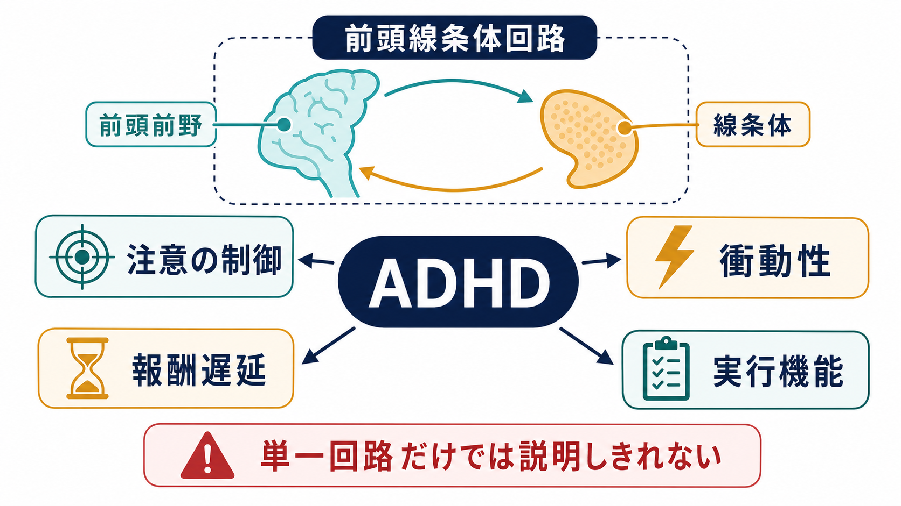
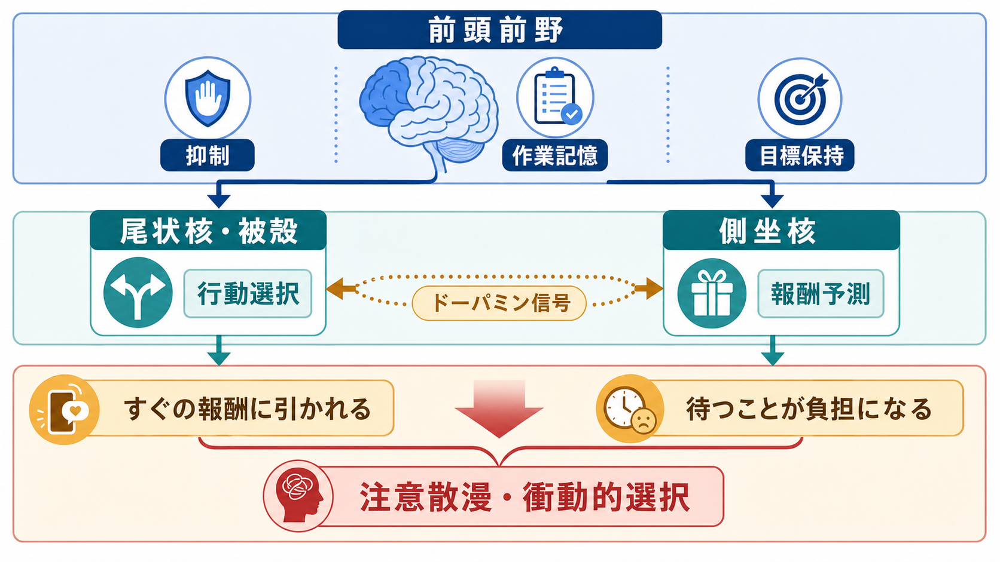
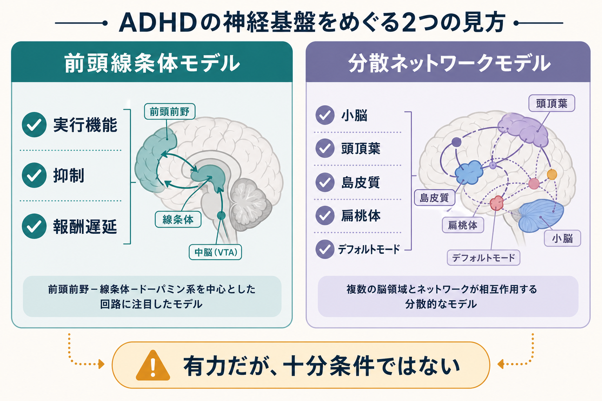

# ADHDは前頭線条体回路の障害として説明できるのか

## 要点

- ADHDは、不注意、多動性、衝動性が複数の生活場面で機能障害をもたらす神経発達症として診断される。脳画像だけで診断するものではない [1]。
- 前頭前野と線条体を結ぶ前頭線条体回路は、目標保持、反応抑制、行動選択、報酬予測に関わるため、ADHDの説明モデルとして有力である [2][3]。
- ただし、ADHDを「前頭線条体回路の障害」だけに還元すると不十分である。近年の研究は、前頭頭頂ネットワーク、注意ネットワーク、デフォルトモードネットワーク、小脳、辺縁系を含む分散ネットワークの問題として捉える方向にある [3][4]。
- 報酬遅延や「待つことの負担」は、線条体・側坐核・前頭前野だけでなく、情動系や課題文脈にも依存する [5][6]。
- 臨床的には、回路モデルは理解を助けるが、個別診断や治療方針は症状、発達歴、併存症、環境、生活機能を含めて評価する必要がある [1]。

## この記事で答える問い

この記事の問いは、「ADHDは前頭線条体回路の障害として説明できるのか」である。ここでいう「説明できる」とは、ADHDのすべてを単一原因に還元することではなく、注意、衝動性、報酬遅延という主要な現象を、脳ネットワークの働きとしてどこまで見通せるかを意味する。

## まず結論

ADHDは、前頭線条体回路の機能変化としてかなりの部分を説明できる。特に、前頭前野による目標維持・抑制制御と、線条体による行動選択・報酬予測の結合は、不注意、衝動的選択、遅延報酬の苦手さを理解するうえで中心的である [2][3]。

しかし、前頭線条体回路は「必要な視点」ではあっても「十分な説明」ではない。fMRIメタ解析は、ADHD関連の機能差が前頭線条体系だけでなく、前頭頭頂、腹側注意、デフォルトモード、視覚・感覚運動ネットワークにも及ぶことを示している [3]。さらに、2024年の大規模メガ解析では、前頭皮質と複数の皮質下領域の結合がADHD症状と関連する一方、所見は発達段階や症状次元に依存することが示された [4]。

したがって、もっとも妥当な言い方は、「ADHDは前頭線条体回路の障害として説明できる部分が大きいが、分散した発達性ネットワークの変調として理解するほうが正確である」となる。

## 背景

ADHDの神経科学モデルは、当初、反応抑制や実行機能の問題を中心に発展した。これは、前頭前野、とくに外側前頭前野、前部帯状皮質、下前頭回などが、課題目標の保持、不要な反応の抑制、注意の切り替えに関わるためである。

一方で、ADHDでは「わかっているのに待てない」「長期的には損だと知っていても、すぐ得られる報酬を選びやすい」といった報酬遅延の問題も目立つ。この側面は、線条体、側坐核、ドーパミン信号、報酬予測誤差と関係する。ここで [[報酬系の異常はうつ病をどう説明するのか]] と同じく、報酬系は単に快感を生む装置ではなく、行動の優先順位づけと学習を支えるシステムとして理解する必要がある。

## 基本概念

### 前頭線条体回路

前頭線条体回路とは、前頭前野と線条体を中心に、視床、淡蒼球、黒質などを介して再び皮質へ戻るループである。大まかには、前頭前野が「今の目標」や「ルール」を保ち、線条体が「どの行動を選ぶか」「どの選択に報酬価値があるか」を調整する。

ADHDで問題になるのは、単に前頭前野が弱い、線条体が弱いという局在論ではない。前頭前野と線条体の相互作用が、時間、課題、報酬の近さ、発達段階によって不安定になりやすい、というネットワーク論として見るほうがよい。

### 実行機能

実行機能とは、作業記憶、抑制、柔軟な切り替え、計画、誤反応のモニタリングなどの総称である。ADHDではこれらの平均的な成績低下が報告されるが、すべての人に同じ実行機能障害があるわけではない。実行機能障害はADHDの一部を説明する重要な経路だが、必要条件でも十分条件でもない [5]。

### 報酬遅延と delay aversion

報酬遅延とは、今すぐ得られる小さな報酬より、後で得られる大きな報酬を待つ状況で生じる認知・情動・動機づけの問題である。delay aversion は、遅延そのものが嫌悪的に感じられ、待ち時間を短くする選択が強まる傾向を指す。ADHDでは、小さくても即時の報酬を選びやすい傾向がメタ解析で示されている [6]。

## 仕組み

ADHDを前頭線条体回路から見ると、少なくとも三つの過程が重要になる。

第一に、前頭前野による目標保持の弱さである。課題を始めた時点では「何をするか」が分かっていても、時間が経つにつれて目標表象が弱まり、外部刺激や内的思考に注意が引かれやすくなる。このとき、デフォルトモードネットワークの活動を課題関連ネットワークが十分に抑えられない、という説明も成り立つ [3]。

第二に、線条体による行動選択の偏りである。尾状核や被殻は、行動の選択、反応の開始・停止、習慣化に関わる。大規模構造MRI研究では、ADHD群で側坐核、尾状核、被殻、扁桃体、海馬などの体積差が小さい効果量で報告され、とくに小児期で目立つことが示された [7]。これは「特定部位が壊れている」という意味ではなく、発達軌道の集団差として読むべき所見である。

第三に、報酬価値の時間割引である。後の大きな報酬より、今の小さな報酬に引かれる傾向は、側坐核やドーパミン系だけでなく、前頭前野による将来価値の保持、扁桃体を含む情動反応、課題環境の退屈さにも左右される [5][6]。この意味で、[[ドパミン仮説は統合失調症をどこまで説明できるのか]] と同様、ドーパミンは強力な説明変数だが、単独原因として扱うと粗すぎる。

## 図解

上の図では、前頭前野を「目標を保つ・抑制する」側、線条体を「行動を選ぶ・報酬価値を更新する」側として整理した。ADHDの症状は、この二つの部位のどちらか片方の故障ではなく、両者の結合とタイミングの問題として現れやすい。

三枚目の図は、前頭線条体モデルと分散ネットワークモデルを比較している。前頭線条体モデルは、実行機能と報酬遅延を説明しやすい。一方、分散ネットワークモデルは、注意の揺らぎ、感覚運動の落ち着かなさ、情動調整、発達差、個人差を含めやすい。

## 臨床・研究との接続

臨床では、ADHDは脳画像で診断されるものではない。診断では、年齢に比して不注意、多動性、衝動性が持続し、複数の場面で機能障害を生じ、他の要因ではよりよく説明できないことを確認する [1]。したがって、「前頭線条体回路の異常があるからADHDである」と個人に断定する使い方は不適切である。

研究では、前頭線条体回路は有用な仮説空間を与える。たとえば、薬物療法への反応差を、線条体-視床系、帯状弁蓋系、デフォルトモード系の結合から検討する研究がある [8]。ただし、こうした知見は集団レベルの関連であり、現時点では個人ごとの治療選択を脳画像だけで決める段階にはない。

この点は、[[精神疾患は脳の病気なのか]] という問いともつながる。ADHDには脳ネットワークの発達的特徴が関与するが、その表れ方は学校、家庭、睡眠、併存症、課題要求、支援環境によって変わる。神経科学モデルは、本人の困難を「努力不足」から切り離して理解する助けになる一方、環境調整や学習支援の重要性を消すものではない。

## よくある誤解

### 誤解1: ADHDは前頭前野が弱いだけである

前頭前野は重要だが、それだけでは報酬遅延、情動調整、感覚運動の落ち着かなさ、注意の揺らぎを十分に説明できない。線条体、視床、小脳、頭頂葉、島皮質、デフォルトモードネットワークを含む広い系として見る必要がある [3][4]。

### 誤解2: ドーパミンが少ないからADHDである

ドーパミンは報酬学習、動機づけ、行動選択に関わるため重要である。しかし、ADHDを「ドーパミン不足」とだけ言うと、発達、課題文脈、他の神経伝達、ネットワーク結合、環境要因を見落とす。

### 誤解3: 脳画像でADHDかどうか判定できる

研究では集団差が示されるが、効果量は小さいものも多く、個人診断にそのまま使えるわけではない [4][7]。診断は臨床情報に基づく。

### 誤解4: 前頭線条体回路モデルは古いので不要である

不要ではない。むしろ、実行機能、抑制、行動選択、報酬遅延を結びつける強い枠組みである。ただし、それを中核モデルとして使いながら、分散ネットワーク、発達、環境との相互作用に広げる必要がある。

## 関連ノート

- [[報酬系の異常はうつ病をどう説明するのか]]
- [[ドパミン仮説は統合失調症をどこまで説明できるのか]]
- [[精神疾患は脳の病気なのか]]

## MOC更新候補

- `content/00_MOC/` 配下の脳・神経科学、精神医学、神経発達症に関するMOCがある場合、本記事を「神経科学と精神疾患」または「ADHD・神経発達症」の項目に追加する。
- 並列記事生成との競合を避けるため、本ジョブではMOC本体は更新しない。

## 理解チェック

1. ADHDを前頭線条体回路だけで説明すると、どの症状は説明しやすく、どの側面が残りやすいか。
2. 報酬遅延の問題は、なぜ単なる「我慢の弱さ」ではなく、報酬価値と時間の計算として理解できるのか。
3. 集団レベルの脳画像所見を、個人診断にそのまま使えない理由は何か。
4. 前頭線条体モデルと分散ネットワークモデルは、対立する説明なのか、それとも階層の違う説明なのか。

## 未解決問題

- ADHDの異質性を、前頭線条体、注意ネットワーク、デフォルトモード、情動系のどの組み合わせとして分類できるのか。
- 発達に伴って、線条体や前頭前野の構造・機能差はどのように変化し、症状の持続や寛解とどう対応するのか。
- 脳結合、行動課題、日常生活データを組み合わせて、個別支援に有用な予測指標を作れるのか。
- 報酬遅延の苦手さは、薬物療法、行動療法、環境調整、デジタル介入によってどの程度変化するのか。

## 参考文献

[1] Wolraich, M. L., Hagan, J. F., Allan, C., et al. (2019). Clinical Practice Guideline for the Diagnosis, Evaluation, and Treatment of Attention-Deficit/Hyperactivity Disorder in Children and Adolescents. *Pediatrics, 144*(4), e20192528. https://doi.org/10.1542/peds.2019-2528

[2] Castellanos, F. X., & Proal, E. (2012). Large-scale brain systems in ADHD: Beyond the prefrontal-striatal model. *Trends in Cognitive Sciences, 16*(1), 17-26. https://doi.org/10.1016/j.tics.2011.11.007

[3] Cortese, S., Kelly, C., Chabernaud, C., et al. (2012). Toward systems neuroscience of ADHD: A meta-analysis of 55 fMRI studies. *American Journal of Psychiatry, 169*(10), 1038-1055. https://doi.org/10.1176/appi.ajp.2012.11101521

[4] Norman, L. J., Sudre, G., Price, J., & Shaw, P. (2024). Subcortico-cortical dysconnectivity in ADHD: A voxel-wise mega-analysis across multiple cohorts. *American Journal of Psychiatry, 181*(6), 553-562. https://doi.org/10.1176/appi.ajp.20230026

[5] Sonuga-Barke, E. J. S., Sergeant, J. A., Nigg, J., & Willcutt, E. (2008). Executive dysfunction and delay aversion in attention deficit hyperactivity disorder: Nosologic and diagnostic implications. *Child and Adolescent Psychiatric Clinics of North America, 17*(2), 367-384. https://doi.org/10.1016/j.chc.2007.11.008

[6] Marx, I., Hacker, T., Yu, X., Cortese, S., & Sonuga-Barke, E. J. S. (2021). ADHD and the choice of small immediate over larger delayed rewards: A comparative meta-analysis of performance on simple choice-delay and temporal discounting paradigms. *Journal of Attention Disorders, 25*(2), 171-187. https://doi.org/10.1177/1087054718772138

[7] Hoogman, M., Bralten, J., Hibar, D. P., et al. (2017). Subcortical brain volume differences of participants with ADHD across the lifespan: An ENIGMA collaboration. *The Lancet Psychiatry, 4*(4), 310-319. https://doi.org/10.1016/S2215-0366(17)30049-4

[8] Norman, L. J., Sudre, G., Bouyssi-Kobar, M., Sharp, W., & Shaw, P. (2021). A longitudinal study of resting-state connectivity and response to psychostimulant treatment in ADHD. *American Journal of Psychiatry, 178*(8), 744-751. https://doi.org/10.1176/appi.ajp.2021.20091342
