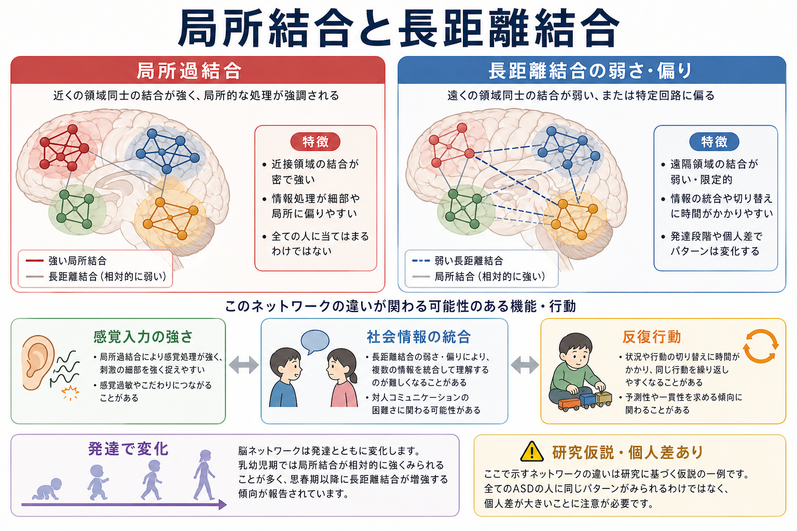
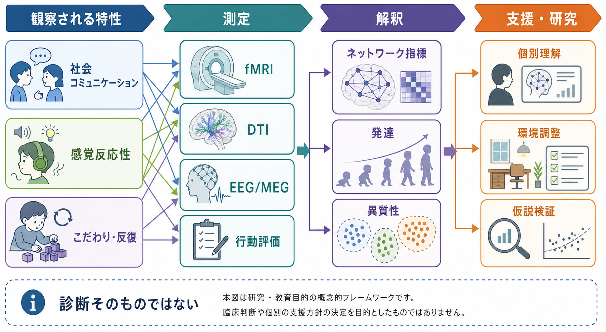

# ASDは脳ネットワークの違いとして理解できるのか

## 要点

- ASD（自閉スペクトラム症）は、社会コミュニケーションの違い、感覚反応性、限定的・反復的行動が早期から現れる発達特性として定義されるが、それを単一の脳部位の異常だけで説明するのは難しい[1]。
- 「近い領域どうしの局所結合が強く、遠い領域どうしの長距離結合が弱い」という説明は、ASDの情報処理を考える入口として有用だが、現在は過結合と低結合が混在し、年齢・課題・解析方法・個人差で変わるモデルとして理解するほうが安全である[2][3][4][5]。
- 社会認知、感覚過敏、反復行動は、それぞれ別々の症状ではなく、[[脳内ネットワークとは何か|脳内ネットワーク]]の統合、[[サリエンスネットワークとは何か|サリエンスネットワーク]]、視床皮質結合、皮質線条体回路などの偏りとして部分的に接続して考えられる[6][7][8]。

## この記事で答える問い

ASDは「脳ネットワークの違い」として理解できるのか。答えは、**かなりの部分は理解できるが、診断や個人の生活上の困難を脳画像だけで読み切れるわけではない**、である。ネットワークという見方は、社会認知・感覚過敏・反復行動を同じ地図の上に置く道具になる。一方で、ASDは異質性が大きく、同じ診断名でも結合パターンはそろわない[5]。

## まず結論

ASDの脳ネットワーク研究で重要なのは、「過結合か低結合か」を一つに決めることではない。むしろ、どの発達段階で、どのネットワークが、どの課題や状態で、どの程度ほかのネットワークと同期・分離しているかを見ることである。[[機能的結合解析とは何か|機能的結合解析]]では、安静時や課題中の BOLD 信号の同期から領域間の関係を推定するが、これは神経回路の配線そのものではなく、状態依存的な統計的関係である。

## 背景

ASDの古典的なネットワーク仮説では、近距離の局所処理が相対的に強く、遠隔領域間の統合が弱いと考えられてきた。これは、細部への注意、感覚刺激への強い反応、文脈統合の難しさを一つの枠組みにまとめやすい[2]。しかし、大規模データ共有プロジェクト ABIDE では、ASD群に低結合だけでなく過結合も検出され、特に皮質間・半球間の低結合が目立つ一方、領域や指標によって結果は異なった[4]。静止時 fMRI レビューも、過結合・低結合・混合パターンの報告が併存し、年齢、性別、頭部運動、前処理、解析手法が解釈に影響することを強調している[3]。

## 基本概念

**局所結合**は、近い領域や同じ機能モジュール内の結びつきである。感覚皮質内の同期や、近接した皮質領域の処理のまとまりを考えるときに重要になる。[[局所回路と長距離結合は何が違うのか|局所回路と長距離結合]]の観点では、局所処理が強いことは必ずしも悪いことではなく、細部検出や特定の情報処理の強みにつながることもある。

**長距離結合**は、前頭前野、側頭葉、頭頂葉、島皮質、線条体、視床など、離れた領域の情報を統合する結びつきである。社会的文脈、言語、身体感覚、注意、予測を組み合わせるには、[[構造的結合と機能的結合は何が違うのか|構造的結合と機能的結合]]の両方の観点が必要になる。

**ネットワークの異質性**は、ASD理解の中心にある。Hahamyらは、ASD成人では典型的な結合テンプレートからのずれが個人ごとに大きく、そのずれが症状指標と関連することを示した[5]。つまり、ASDを「平均的な過結合」や「平均的な低結合」としてだけ読むと、個人差を見落とす。

## 仕組み

社会認知の困難は、顔・声・視線・文脈・身体状態を統合する長距離ネットワークの調整問題として考えられる。たとえば[[デフォルトモードネットワークとは何か|デフォルトモードネットワーク]]、サリエンスネットワーク、前頭頭頂系の切り替えがうまく噛み合わないと、相手の意図、場面の暗黙の意味、自己と他者の視点を同時に扱う負荷が高くなる。

感覚過敏は、単に感覚皮質が「強い」だけではなく、刺激の重要度づけ、注意の切り替え、視床皮質結合の調整と関係する。Greenらは、サリエンスネットワークの結合が感覚過反応性の脳活動・行動指標と関連することを報告した[6]。また、感覚刺激中の視床皮質結合の調節低下も示されており、入力を状況に応じて弱める・慣れる・切り替える過程が関係する可能性がある[7]。

反復行動やこだわりは、皮質線条体回路のバランスとして理解しやすい。線条体は報酬、習慣、行動選択、運動系列に関わるため、前頭前野や運動系との結合の偏りは、切り替えにくさ、予測可能性への志向、同じ行動の反復と接続しうる。Abbottらは、ASD児・青年の反復行動が、皮質線条体機能的結合の不均衡と関連することを示した[8]。

## 図解

この図のポイントは、局所過結合と長距離結合の弱さ・偏りを「固定した診断特徴」ではなく、社会情報の統合、感覚入力の強さ、反復行動に関係しうる研究仮説として読むことである。

脳画像、DTI、EEG/MEG、行動評価は、互いに置き換え可能なものではない。脳ネットワーク指標は、個別理解や環境調整の仮説を豊かにするが、それ単独で診断や支援方針を決めるものではない。

## 臨床・研究との接続

臨床的には、ネットワーク研究は「本人の困難を脳に還元する」ためではなく、環境と課題の負荷を見積もる補助線として役立つ。たとえば、聴覚・触覚刺激が強すぎる場面で、サリエンスネットワークや視床皮質結合の調整負荷が高くなると考えれば、刺激量、予測可能性、休憩、選択肢の提示を設計しやすい。

研究的には、ASDを一つの平均群として扱うだけでは限界がある。大規模データ、発達縦断、個人内変動、感覚・社会・反復行動のサブタイプを組み合わせる必要がある。[[動的機能的結合とは何か|動的機能的結合]]や[[グラフ理論は脳ネットワーク解析にどう使われるのか|グラフ理論]]の指標は、固定した結合強度だけでなく、状態遷移、モジュール性、ハブ性、ネットワーク効率を調べる入口になる。

## よくある誤解

**誤解1: ASDは長距離結合が弱いだけで説明できる。**  
実際には、低結合と過結合の両方が報告される。結果は年齢、課題、測定、解析手法、個人差に依存する[3][4][5]。

**誤解2: 脳画像を見ればASDかどうか分かる。**  
現時点では、脳画像指標は研究上の集団差や仮説検証に有用だが、個別診断を単独で置き換えるものではない[1][3]。

**誤解3: ネットワーク差は欠陥だけを意味する。**  
局所処理の強さや特定の注意様式は、困難にも強みにもなりうる。問題は、本人の特性と環境要求がどのように噛み合うかである。

## 関連ノート

- [[脳内ネットワークとは何か]]
- [[局所回路と長距離結合は何が違うのか]]
- [[機能的結合解析とは何か]]
- [[構造的結合と機能的結合は何が違うのか]]
- [[サリエンスネットワークとは何か]]
- [[デフォルトモードネットワークとは何か]]
- [[グラフ理論は脳ネットワーク解析にどう使われるのか]]
- [[脳ネットワークの破綻は精神疾患をどう説明するのか]]

MOC更新候補: `content/00_MOC/` 配下の脳ネットワーク系・精神疾患系 MOC に、バッチ統合時に追加する。

## 理解チェック

1. ASDのネットワーク仮説で、「局所過結合・長距離低結合」という説明が有用な点と限界は何か。
2. 感覚過敏を、感覚皮質だけでなくサリエンスネットワークや視床皮質結合から考える利点は何か。
3. 反復行動を皮質線条体回路の不均衡として見ると、どのような研究仮説が立てられるか。

## 参考文献

[1] Lord, C., Elsabbagh, M., Baird, G., & Veenstra-Vanderweele, J. (2018). Autism spectrum disorder. *The Lancet, 392*(10146), 508-520. https://doi.org/10.1016/S0140-6736(18)31129-2

[2] Minshew, N. J., & Williams, D. L. (2007). The new neurobiology of autism: cortex, connectivity, and neuronal organization. *Archives of Neurology, 64*(7), 945-950. https://doi.org/10.1001/archneur.64.7.945

[3] Hull, J. V., Dokovna, L. B., Jacokes, Z. J., Torgerson, C. M., Irimia, A., & Van Horn, J. D. (2017). Resting-state functional connectivity in autism spectrum disorders: a review. *Frontiers in Psychiatry, 7*, 205. https://doi.org/10.3389/fpsyt.2016.00205

[4] Di Martino, A., Yan, C. G., Li, Q., et al. (2014). The autism brain imaging data exchange: towards a large-scale evaluation of the intrinsic brain architecture in autism. *Molecular Psychiatry, 19*, 659-667. https://doi.org/10.1038/mp.2013.78

[5] Hahamy, A., Behrmann, M., & Malach, R. (2015). The idiosyncratic brain: distortion of spontaneous connectivity patterns in autism spectrum disorder. *Nature Neuroscience, 18*(2), 302-309. https://doi.org/10.1038/nn.3919

[6] Green, S. A., Hernandez, L., Bookheimer, S. Y., & Dapretto, M. (2016). Salience network connectivity in autism is related to brain and behavioral markers of sensory overresponsivity. *Journal of the American Academy of Child & Adolescent Psychiatry, 55*(7), 618-626.e1. https://doi.org/10.1016/j.jaac.2016.04.013

[7] Green, S. A., Hernandez, L., Bookheimer, S. Y., & Dapretto, M. (2017). Reduced modulation of thalamocortical connectivity during exposure to sensory stimuli in ASD. *Autism Research, 10*(5), 801-809. https://doi.org/10.1002/aur.1726

[8] Abbott, A. E., Linke, A. C., Nair, A., et al. (2018). Repetitive behaviors in autism are linked to imbalance of corticostriatal connectivity: a functional connectivity MRI study. *Social Cognitive and Affective Neuroscience, 13*(1), 32-42. https://doi.org/10.1093/scan/nsx129

## 未解決問題

- どの年齢段階で、局所結合と長距離結合の関係がどのように変化するのか。
- 感覚過敏、社会認知、反復行動を同じネットワークモデルでどこまで説明できるのか。
- 集団平均ではなく、個人内の状態変動や環境負荷を反映するネットワーク指標をどう臨床研究に接続するのか。
